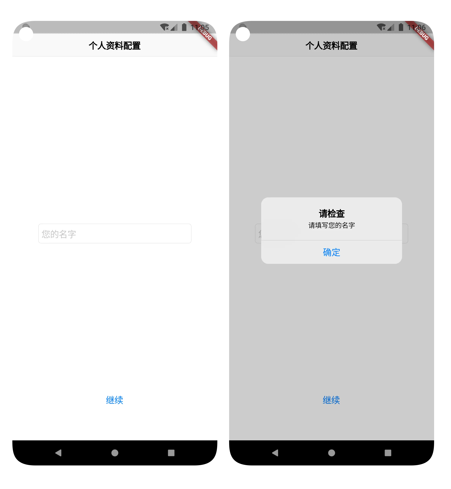
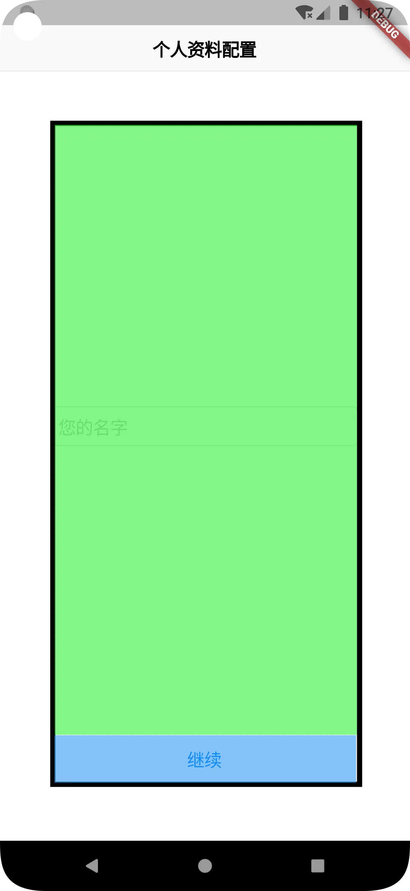
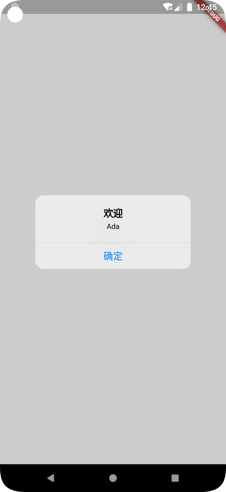

# 实战项目二：持久化数据（一）

原文链接：https://juejin.cn/book/7178741001677176836/section/7181703572399063099

设计好页面导航之后，我们就可以开始逐步实现每个页面了。我将用两讲的篇幅实现个人资料设置页以及持久化数据存储能力。

具体来说，当程序启动后，若检测到尚未配置用户信息，则应跳转到个人资料设置页。判断的依据便是用户名是否存在，而“存在”的标准则是获取到的值既不是 null，也不是空字符串（“”）。这部分的数据存储将使用首选项（Shared Preferences）来实现。这是本讲的内容。

接着，对于日记的存储，其数据量将随着使用频率的增加日益增多，且用户还可能以不同的条件进行查询。显然，使用数据库则更加合适。在这个过程中，我还会介绍 json 格式以及如何将 json 格式的字符串与数据库相结合使用的方法。

最后，Flutter 最常用的数据库包并不适用于 PC 等电脑设备，我还会介绍兼容多平台设备的解决方案。这都是下一讲的内容。

总的来说，内容不少，干货特别多（所以我把它们拆成了两讲）。大家务必打起十二分的精神，跟好我的思路，最后将收获颇丰。

## 个人资料页面 UI

设置个人资料页（app_configuration.dart）其实非常简单，为了节省时间，我这里仅要求用户填写名字。然后再添加一个“继续”按钮，用来确认，并跳转到下一步。具体流程如下图所示：



如上图所示，当用户没有填写名字直接点击继续按钮时，将弹出提示框，提示用户名字是必填项。此外，熟悉 iOS 输入风格的朋友知道，当用户点击空白处，弹出的键盘应该自动收起。如果用户填写了名字，再点击继续时，程序会保存用户的名字到首选项，然后跳转到主页面。

以上便是整个交互过程了，让我们逐个“击破”它们。

## 控件的选择与摆放

首先，让我们先把所需要的控件都摆放好。输入框用 CupertinoTextField，继续按钮用CupertinoButton。顶部的导航栏则是 CupertinoNavigationBar。

`💡 提示：为什么我会想到使用这些控件呢？这里面其实有一个规律：普通的输入框是 TextField，按钮是 Button，Flutter 官方提供的 iOS 风格控件通常只需在其前面加上 Cupertino 前缀即可。`

相应代码如下：

```dart
// 资料填写区域
Widget _buildInputForm() {
return CupertinoTextField(
placeholder: "您的名字",
keyboardType: TextInputType.name,
)；
}
// 底部确认按钮
Widget _buildConfirmButton() {
return CupertinoButton(
child: const Text("继续"),
onPressed: () {
// 保存资料到首选项，并跳转到主页
});
}
@override
Widget build(BuildContext context) {
return CupertinoPageScaffold(
navigationBar: const CupertinoNavigationBar(
middle: Text("个人资料配置"),
),
child: SafeArea(
child: Container(
margin: const EdgeInsets.all(50),
child: Column(
children: [
Expanded(
child: Center(
child: _buildInputForm(),
)),
_buildConfirmButton()
],
),
),
),
);
}

```

要充分理解这段代码，先从 build() 方法开始。

CupertinoPageScaffold 对应 Scaffold，为我们提供了构建 iOS 风格页面的脚手架。

navigationBar 是顶部的导航栏，通常使用 CupertinoNavigationBar 对象赋值。除了 middle 属性外，还提供 leading、automaticallyImplyLeading、backgroundColor 等属性，表示是否自动生成左侧控件（默认是返回操作）、背景颜色等，这里就不再一一赘述了，大家可以通过按键盘上的 Ctrl+鼠标左键点击 CupertinoNavigationBar 查看源码，就能一目了然了。

至于脚手架中的子组件 child，我首先使用了 SafeArea。它的作用是使页面的内容部分顶部处于导航栏的下面。如果没有 SafeArea，大家可以试着直接放一个 Text 组件进去，页面不会有任何显示。但实际上是顶部的导航栏挡住了 Text 组件。

在 SafeArea 组件中，我使用了 Column 子组件，将输入框和按钮包含在其中。Expanded 的作用是使其子组件充满屏幕的剩余空间。下图直观地显示了 Column 内部组件的关系：



图中黑色边框表示的区域就是整个 Column 组件了。绿色部分表示 Expanded 组件，蓝色部分表示 _buildConfirmButton() 方法返回的组件，即 CupertinoButton。

为了增强代码的可读性和易维护性，我把上述两部分的组件分别使用 _buildInputForm() 和 _buildConfirmButton() 方法进行了封装。

好了，页面 UI 布局到此已经可以基本宣告结束了。接着，我们要实现的功能就是如何获取用户输入的文字了。

## 文本输入框的内容取值和赋值

虽然我们只想获取输入框的文字，但不妨把眼光再放得长远些：即然能取值，可否赋值呢？答案是肯定的。

有人可能会问：什么时候需要给输入框赋值呢？想象一下，在使用手机通讯录的时候，我们不仅可以新建联系人，还可以编辑联系人。在编辑联系人的时候，已经存储的信息会默认显示到相应的输入框中，便于修改。这便是给输入框赋值的价值体现之一。

无论是 TextField 还是 CupertinoTextField，都包含很多属性。在不知道如何获取输入内容的时候，不妨先看看源码中的注释。很快便发现了 controller 似乎很有用，关于它的注释和代码是这样的：

>

/// The [controller] can also control the selection and composing region (and to /// observe changes to the text, selection, and composing region).

...

/// If null, this widget will create its own [TextEditingController]. final TextEditingController? controller;

意思就是 controller 可以监视文本、选择以及编辑区域的改变以及控制它们。该属性需要 TextEditingController 对象进行赋值。

于是，回到 app_configuration.dart，创建一个 TextEditingController 对象，然后赋值给 controller 属性。我们就这样试试看，会发生什么，代码如下：

```dart
final TextEditingController _nameInputController = TextEditingController();
// 资料填写区域
Widget _buildInputForm() {
return CupertinoTextField(
placeholder: "您的名字",
keyboardType: TextInputType.name,
controller: _nameInputController,
);
}

```

执行热加载，发现界面并没有什么变化。别急，继续深入研究一下 TextEditingController，会发现可以获取它的 text 变量，关于 text 的解释也可以在 TextEditingController 的源码中找到：

>

/// This constructor treats a null [text] argument as if it were the empty /// string.

...

/// The current string the user is editing. String get text => value.text; /// Setting this will notify all the listeners of this [TextEditingController] /// that they need to update (it calls [notifyListeners]). For this reason, /// this value should only be set between frames, e.g. in response to user /// actions, not during the build, layout, or paint phases. /// /// This property can be set from a listener added to this /// [TextEditingController]; however, one should not also set [selection] /// in a separate statement. To change both the [text] and the [selection] /// change the controller's [value]. set text(String newText) { value = value.copyWith( text: newText, selection: const TextSelection.collapsed(offset: -1), composing: TextRange.empty, ); }

大概意思是 text 表示用户正在编辑的文本字符串，开发者既可以通过它获取，也可以赋值给它，使输入框中的内容发生变化。

好了，到这里，相信大家已经有豁然开朗之感。

回顾整个思考过程，其实我们唯一借助的参考资料便是代码本身。实际上，不只是 Flutter。可靠、成熟的代码一般都会有很完善的注释，非常详尽地阐述了它们的使用方法。作为调用者，这些注释就是第一手材料，比传统的图书、网上搜来的方法更靠谱。

有了思路，接下来就是实现了。

获取用户输入内容的逻辑在用户点击继续按钮后发生，所以，回到按钮的实现，并完善后续的代码：

```dart
// 底部确认按钮
Widget _buildConfirmButton() {
return CupertinoButton(
child: const Text("继续"),
onPressed: () {
// 保存资料到首选项，并跳转到主页
_saveToSharedPref();
});
}
void _saveToSharedPref() async {
var name = _nameInputController.text;
// 空字符串判断
if (name == "") {
showCupertinoDialog(
context: context,
builder: (context) {
return CupertinoAlertDialog(
title: const Text("请检查"),
content: const Text("请填写您的名字"),
actions: [
CupertinoDialogAction(
child: const Text("确定"),
onPressed: () {
Navigator.of(context).pop();
},
),
],
);
},
);
} else {
// 保存资料到首选项
// 跳转到主页
router.navigateTo(context, Routes.indexPage, clearStack: true);
}
}

```

_saveToSharedPref() 方法封装了保存用户名字到首选项、页面跳转以及用户输入为空时的判断。此处当用户输入为空字符串（“”）时，弹出对话框提示用户检查必填项。用到的方法是内置的 showCupertinoDialog()，该方法用起来十分容易，大家自行阅读代码进行了解，我就不再展开讲了。

完成编码后，执行热加载。尝试在输入框中输入一些文字或不输入，然后点击下面的继续按钮。如无意外，观察页面的变化，应该是符合预期的。

别急！还有一个细节需要实现：点击空白处收起软键盘。

- 说到“点击”，大家会想到什么？手势！手势包含了点击、双击、拖拽等等；

- 说到“空白处”，就是能产生互动外的所有区域；

- 说到“收起软键盘”，不妨先倒过来想：软键盘出现的时机是什么？是输入框获得了焦点！那么，如果我们把焦点放在非输入框区域，是不是就可以收起键盘了呢？

多说无益，不妨试试。我在整个 CupertinoPageScaffold 组件外，再套一个手势处理组件 GestureDetector，并为 onTap 属性赋值，该属性就是点击时的处理，代码如下：

```scss
@override
Widget build(BuildContext context) {
return GestureDetector(
onTap: () {
FocusScope.of(context).requestFocus(FocusNode());
},
child: CupertinoPageScaffold(
...
),
);
}

```

好了，再试试看。当我们点击输入框，再点击空白处时，是不是软键盘乖乖地收起来了？

搞定了所有页面交互，我们终于来到了首选项 IO 的实现部分。

## 首选项 IO

说到首选项，其实是大部分程序都必不可少的能力。典型的使用场景除了像本例这样保存用户名字外，还有保存程序设置的值。比如是否保存密码、是否自动登录、是否允许流量下载等等，可以说是应用得非常广泛了。

无论使用场景如何，其本质就是由一个或多个 key - value 这样的键值对构成的。比如本例中的用户名，若用户输入的是 Ada，程序中定义的键是 username，保存后的键值关系就是 username - Ada。

作为开发者，可以通过键存值和取值，这种存和取的过程，就是首选项 IO 的过程了。

然而，Flutter 框架自身其实并没有提供首选项 IO 的能力，需要集成包来实现。包的名称是 shared_preferences，我们可以在 Package 网站上搜索找到它：[https://pub.flutter-io.cn/packages/shared_preferences。](https://pub.flutter-io.cn/packages/shared_preferences%E3%80%82)

通过阅读网站上的文档，可以发现首选项不仅可以用于手机客户端，还可以用于电脑端和 Web 端，为构建跨平台应用程序提供了充足的支持。

下面，来到 pubspec.yaml，集成它吧！

```yaml
dependencies:
flutter:
sdk: flutter

...
# 首选项存储
shared_preferences: ^2.0.15

```

`💡 提示：大家在集成的时候，不要照抄版本号。随着时间的推移，可能会有更新的版本发布，请大家参考 Package 网站中的版本进行集成。`

关于 shared_preferences 库的用法，其实网站上已经有非常详细的示例了。我把我的实现放在这里，主要是使用了单例模式，供大家参考使用：

```dart
import 'package:shared_preferences/shared_preferences.dart';
class SharedPrefUtil {
SharedPrefUtil._privateConstructor();
static  final SharedPrefUtil _instance = SharedPrefUtil._privateConstructor();
static SharedPrefUtil get instance {
return _instance;
}
/// 保存用户名
saveUsername(String username) async {
SharedPreferences prefs = await SharedPreferences.getInstance();
await prefs.setString("username", username);
}
/// 读取保存的用户名
readUsername() async {
SharedPreferences prefs = await SharedPreferences.getInstance();
String? name = prefs.getString("username");
return name;
}
}

```

这段代码自成一个文件，位于工程中 lib\util\shared_pref_util.dart。util 意为工具，在这个目录下的源码文件都将作为工具类使用。

完成编码后，回到 app_configuration.dart，继续完善 _saveToSharedPref() 方法：

```dart
void _saveToSharedPref() async {
var name = _nameInputController.text;
// 空字符串判断
if (name == "") {
showCupertinoDialog(
context: context,
builder: (context) {
return CupertinoAlertDialog(
title: const Text("请检查"),
content: const Text("请填写您的名字"),
actions: [
CupertinoDialogAction(
child: const Text("确定"),
onPressed: () {
Navigator.of(context).pop();
},
),
],
);
},
);
} else {
// 保存资料到首选项
SharedPrefUtil.instance.saveUsername(name);
// 跳转到主页
router.navigateTo(context, Routes.indexPage, clearStack: true);
}
}

```

结束了吗？还没有。

回想一下，资料配置页面是如何跳出来的？是在主页面做了判断后才跳转的！而判断的依据还是首选项中的用户名字数据。所以我们还需要回到 main.dart，在 _jumpToAppConfig() 方法中获取保存数据，再根据获取到的结果进行跳转或显示欢迎使用对话框。



代码如下：

```dart
_jumpToAppConfig() async {
username = await SharedPrefUtil.instance.readUsername();
if (username == null || username == "") {
router.navigateTo(context, Routes.appConfigurationPage, clearStack: true);
} else {
showCupertinoDialog(
context: context,
builder: (context) {
return CupertinoAlertDialog(
title: const Text("欢迎使用"),
content: Text(username!),
actions: [
CupertinoDialogAction(
child: const Text("确定"),
onPressed: () {
Navigator.of(context).pop();
},
),
],
);
},
);
}
}

```

好了，整个编码到此就结束了。

如果你编写的代码无法实现本讲所述的功能，末尾的附录可能会帮到你。

## 总结

🎉 恭喜，您完成了本次课程的学习！

📌 以下是本次课程的重点内容总结：

本讲介绍了资料配置页面的 UI 交互和功能实现。

在 UI 交互部分，重点在如何与输入框交互，进行取值和赋值。此外，还有一两个经验类的小技巧：SafeArea 的使用，以及使用 Expanded 组件对屏幕未使用的区域进行填充。

功能方面主要介绍了如何集成和使用 shared_preferences 包进行首选项存取。

大家在学习的时候，切勿完全照搬。一定要领会其中的方法，学习解决问题的思路。

➡️ 在下次课程中，我们会继续《日记》程序的开发，具体内容是：

- 本地持久化的实现，本地数据库（SQLite）的设计、实现与封装。

## 附录1：main.dart 完整代码：

```dart
import 'package:diary/router/routes.dart';
import 'package:diary/ui/index/index.dart';
import 'package:diary/util/shared_pref_util.dart';
import 'package:fluro/fluro.dart';
import 'package:flutter/cupertino.dart';
final router = FluroRouter();
void main() {
// 配置路由
Routes.configureRoutes(router);
runApp(const MyApp());
}
class MyApp extends StatelessWidget {
const MyApp({Key? key}) : super(key: key);
@override
Widget build(BuildContext context) {
return CupertinoApp(onGenerateRoute: router.generator, home: const Diary());
}
}
class Diary extends StatefulWidget {
const Diary({Key? key}) : super(key: key);
@override
State<Diary> createState() => _DiaryState();
}
class _DiaryState extends State<Diary> {
String? username;
@override
void initState() {
super.initState();
WidgetsBinding.instance.addPostFrameCallback((_) {
// 未进行资料配置，跳转到相应页面进行
_jumpToAppConfig();
});
}
_jumpToAppConfig() async {
username = await SharedPrefUtil.instance.readUsername();
if (username == null || username == "") {
router.navigateTo(context, Routes.appConfigurationPage, clearStack: true);
} else {
showCupertinoDialog(
context: context,
builder: (context) {
return CupertinoAlertDialog(
title: const Text("欢迎"),
content: Text(username!),
actions: [
CupertinoDialogAction(
child: const Text("确定"),
onPressed: () {
Navigator.of(context).pop();
},
),
],
);
},
);
}
}
@override
Widget build(BuildContext context) {
return  const IndexPage();
}
}

```

## 附录2：app_configuration.dart 完整代码：

```dart
import 'package:diary/util/shared_pref_util.dart';
import 'package:flutter/cupertino.dart';
import '../../main.dart';
import '../../router/routes.dart';
class AppConfigurationPage extends StatefulWidget {
const AppConfigurationPage({Key? key}) : super(key: key);
@override
State<AppConfigurationPage> createState() => _AppConfigurationPageState();
}
class _AppConfigurationPageState extends State<AppConfigurationPage> {
final TextEditingController _nameInputController = TextEditingController();
// 资料填写区域
Widget _buildInputForm() {
return CupertinoTextField(
placeholder: "您的名字",
keyboardType: TextInputType.name,
controller: _nameInputController,
);
}
// 底部确认按钮
Widget _buildConfirmButton() {
return CupertinoButton(
child: const Text("继续"),
onPressed: () {
// 保存资料到首选项，并跳转到主页
_saveToSharedPref();
});
}
void _saveToSharedPref() async {
var name = _nameInputController.text;
// 空字符串判断
if (name == "") {
showCupertinoDialog(
context: context,
builder: (context) {
return CupertinoAlertDialog(
title: const Text("请检查"),
content: const Text("请填写您的名字"),
actions: [
CupertinoDialogAction(
child: const Text("确定"),
onPressed: () {
Navigator.of(context).pop();
},
),
],
);
},
);
} else {
// 保存资料到首选项
SharedPrefUtil.instance.saveUsername(name);
// 跳转到主页
router.navigateTo(context, Routes.indexPage, clearStack: true);
}
}
@override
Widget build(BuildContext context) {
return GestureDetector(
onTap: () {
FocusScope.of(context).requestFocus(FocusNode());
},
child: CupertinoPageScaffold(
navigationBar: const CupertinoNavigationBar(
middle: Text("个人资料配置"),
),
child: SafeArea(
child: Container(
margin: const EdgeInsets.all(50),
child: Column(
children: [
Expanded(
child: Center(
child: _buildInputForm(),
)),
_buildConfirmButton()
],
),
),
),
),
);
}
}

```
