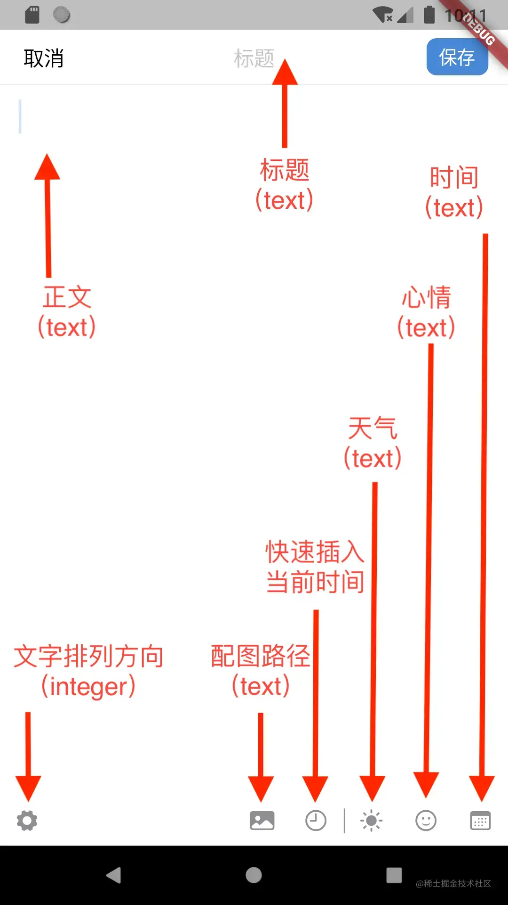
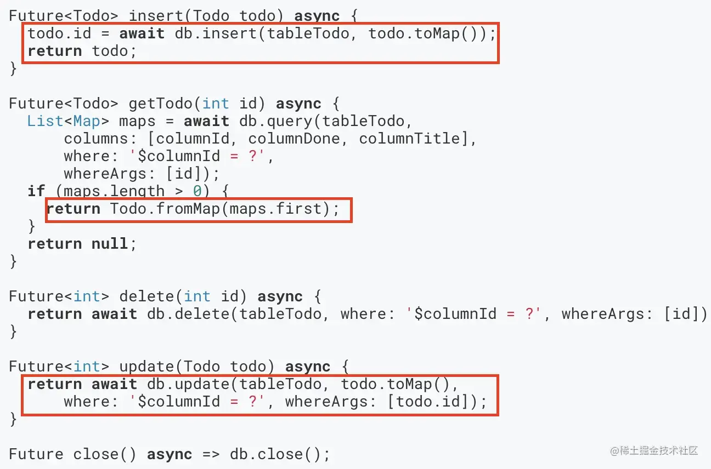
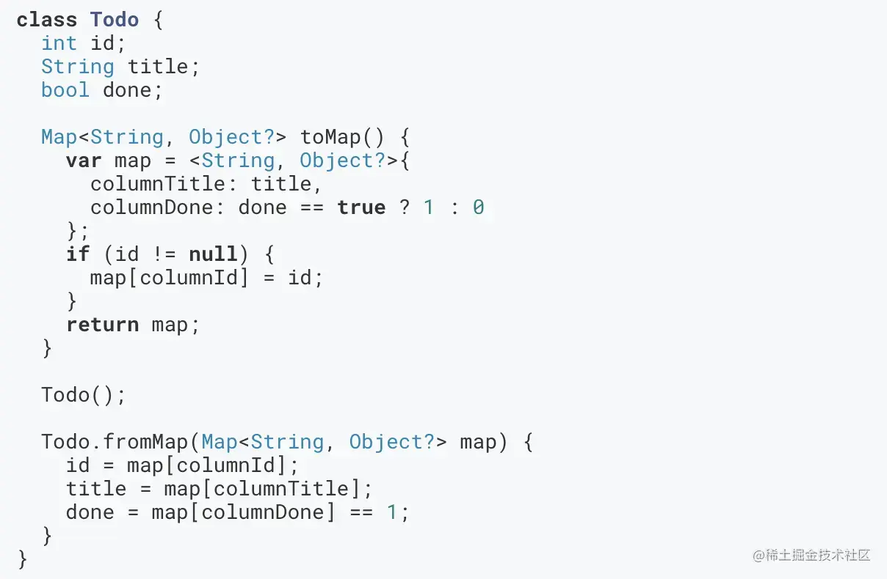

# 实战项目二：持久化数据（二）

原文链接：https://juejin.cn/book/7178741001677176836/section/7180609141101035552

在前一讲中，我们一起实现了个人资料设置页。具体来说，包含 UI 交互以及数据持久化的方式之一：首选项。它通常用来保存用户对于应用程序的设置值。而对于本案例中的日记存储，则应使用数据库的方式。这也是本讲的主题。

不过，有些朋友可能会问：为什么存储日记不能用首选项呢？或者，不能直接保存成文件呢？这些都是数据持久化的方式啊。

## 为何必须要使用数据库？

首先来了解一下 Flutter 中应用最为广泛的本地数据库引擎：SQLite。从名称上看，它是一个轻量级的数据库引擎，属于关系型数据库。

如果你对数据库完全陌生，不妨将其看作是 Excel 文档。数据库中包含 0 个或多张数据表。一个完整的数据库，相当于一个 Excel 文档。一个完整的 Excel 文档中有不同的 Sheet 页，这些 Sheet 页就相当于数据库中的数据表。

继续探索这些 Sheet 页，有 A、B、C、……列，1、2、3、……行。对应到数据表，也有列，只不过数据表中的列名可以自定义。而行号则相当于数据表中的 ID 列，通常是自增长的，唯一的数字，用于唯一标识，并为日后的查找提供速度和准确度上的加成。

比如：查找 ID 为 3 的一组数据，那么只要检索 ID 列，找到值为 3 的那一行，然后把整行数据“拎”出来就完事了。不用担心会不会后面还有值为 3 的行，因为自增长，后面的数字只能比 3 大。 当然，Excel 是一款非常强大的数据处理软件，它的功能不只限于存储和查找数据。数据库引擎也一样，我们看下面这张图：


仔细观察页面中的时间，会发现这些日记是按照时间倒序排列的（排序能力）。

再看这张图：


该页面上方日历部分，需要在有日记数据的那一天做标记（蓝色的小圆点）；下方的列表显示所选当天的日记列表。它们需要检索当月所有天以及某一天的日记（指定范围搜索能力）。

除了排序、指定范围搜索外，数据库引擎其实还提供了查找/模糊查找、批量事务等能力。 说到这，相信大家心里已经有答案了。首选项可没办法按照这样的行、列结构存储数据。

再说文件，如果我们要在一堆文件中，查找包含“Party”主题的日记，会发生什么呢？首先程序会通过循环打开每个日记文件，然后进行字符串匹配，再之后关闭文件操作，最后返回符合结果的文件路径集合。文件量少还好说，一旦来它个一万或者一千条，等待的时间足以劝退用户，而数据库在查找方面的耗时极少。

`💡 提示：有证据表明，即使是轻量级的 SQLite，在上千万行数据中进行查找，最快仅需 1ms；插入百万行数据仅需 40s。以上测试结果参考：https://blog.csdn.net/chc_office/article/details/125427006`

好了，有了对数据库的充分了解，下面我们就要开始规划数据库的设计了。

具体来说，为了支撑每一条日记都能完整保存，该有哪些列，每一列的数据类型又该是什么。

## 设计数据库

无论是做客户端还是服务端，数据库的设计都要尽可能地考虑完善，同时兼顾速度、空间占用等。 对于本例而言，我们可以通过写日记页面提供的功能确定单条日记包含哪些数据，如下图所示：



图中把数据和相应的类型都做了标注，相信大家一目了然。除了快速插入当前时间不涉及存储外，其它 7 个内容均需自成一列进行存储。

SQLite支持 null（空）、text（文本）、integer（数字）、real（浮点数）和 blob（二进制对象）类型。

标题和正文不用多说，按照文字原样保存即可。

对于时间，我们一般使用从 UTC 时区的 1970 年 1 月 1 日 0 时 0 分 0 秒至今的毫秒值。这样做是为了规避不同国家时差问题带来的显示误差。总之，存储时间的原则就是存储更为“通用”的值，特别是对于航旅类的 App 要格外注意这一点。 当然，在程序中传递毫秒值显然会让编码和调试工作变得难以理解，更好的方法其实是使用 Dart 中的 DateTime 类对象。好消息是： DateTime 对象可以与毫秒值相互转换。如此一来，便可在数据库操作层面使用毫秒值，在其它的地方都使用 DateTime 对象了。

对于文字排列和方向，SQLite 并不支持布尔类型，因此使用 0 和 1 进行平替。本例使用 0 表示 false，1 表示 true。

对于配图路径，要注意它本身保存的只是“路径”，并不是图片本身的内容。当我们拍照后，图片会自动保存到 App 的沙盒存储区。默认情况下，其它程序没有权限访问它们。之所以这样做，是因为如果要保存图片内容，则要用到 blob 类型，而 blob 在处理 100kb 以上的数据量时性能略有下降，所以平时用到的不多。

对于心情和天气，它们有各自的名字和图标，所以我在程序中使用了 Map 数据结构来表示它们。比如天气“晴”，数据上则是：`{"name":"晴","path":"assets/image/weather01.svg"}`。而 Dart 中的 Map，可以与 json 格式字符串进行双向转换，因此便能以 text 的形式存取数据库了。

到此，数据库的设计就可以宣告完成了。

哎？好像有什么地方被忽略了，DateTime 与毫秒值转换、Map 对象与 json 字符串转换该写在哪儿呢？

别着急，我们先来看看如何在 Flutter 中进行数据库操作吧。

## 集成 Sqlflite

经过一番调研（通过前几讲的学习，大家应该会在 Package 网站找支持包了，我这里就不再赘述选包的过程了），我们选定 sqlflite 作为 SQLite 本地数据库的支持包，包主页：[pub.flutter-io.cn/packages/sq…](https://pub.flutter-io.cn/packages/sqflite) 。

在该页面中，官方详细说明了集成的方法，并给出了详细的代码示例，我们只需要照抄然后修改即可，基本没有什么难度。 特别要注意的是在执行增、改、查操作时，示例代码是这样的：



这里，Todo 表示一组数据的对象，它长这样：



看到了吗？这个 Todo 类成员虽然有 bool，但在 toMap() 和 fromMap() 方法中做了转换，即 0 表示 false，1 表示 true。如此一来，Todo 其实起了两个至关重要的作用：

1. 定义了 Todo 数据结构本身；

2. 在数据库层面和除此之外的层面之间充当了“兼容层” 。

我们从这段官方的示例代码中，能获取什么启示呢？可否也实现一个 Diary 类，完成上述两件事呢？

## 编码 & 实现

我们把 Todo 那段代码原封不动地复制、粘贴，然后修改。此外，再加上数据表列明定义类 DBColumns，便于在其它地方使用列名。 相应代码如下：

```dart
class DBColumns {
    static const String tableName = 'diary';
    static const String columnId = '_id';
    static const String columnTitle = 'title';
    static const String columnImage = 'image';
    static const String columnContent = 'content';
    static const String columnTextRightToLeft = 'textRightToLeft';
    static const String columnWeather = 'weather';
    static const String columnEmotion = 'emotion';
    static const String columnDate = 'date';
}
class DatabaseUtil {
    DatabaseUtil._privateConstructor();
    static final DatabaseUtil _instance = DatabaseUtil._privateConstructor();
    static DatabaseUtil get instance {
        return _instance;
    }
    var db;
    /// 打开数据库
    Future openDb() async {
        if (db == null || !db.isOpen) {
            db = await openDatabase('diary.db', version: 1,
                onCreate: (Database db, int version) async {
                    await db.execute('''
                        create table ${DBColumns.tableName} (
                            ${DBColumns.columnId} integer primary key autoincrement,
                            ${DBColumns.columnTitle} text,
                            ${DBColumns.columnImage} text,
                            ${DBColumns.columnContent} text,
                            ${DBColumns.columnTextRightToLeft} integer,
                            ${DBColumns.columnWeather} text,
                            ${DBColumns.columnEmotion} text,
                            ${DBColumns.columnDate} text)
                        ''');
                });
            }
        }
        /// 关闭数据库
        Future closeDb() async {
            if (db.isOpen) {
                await db.close();
            }
        }
        /// 插入一条数据
        Future<Diary> insert(Diary diary) async {
            diary.id = await db.insert(DBColumns.tableName, diary.toMap());
            return diary;
        }
        /// 更新一条数据
        Future<Diary> update(Diary diary) async {
            diary.id = await db.update(DBColumns.tableName, diary.toMap(),
                where: '${DBColumns.columnId} = ?', whereArgs: [diary.id]);
            return diary;
        }
        /// 删除一条数据
        Future delete(Diary diary) async {
            await db.delete(DBColumns.tableName,
                where: '${DBColumns.columnId} = ?', whereArgs: [diary.id]);
        }
        /// 加载所有历史记录（按时间倒序）
        Future<List<Map<String, Object?>>> queryAll() async {
            return await db.rawQuery(
            'SELECT * FROM ${DBColumns.tableName} order by ${DBColumns.columnDate} desc');
        }
        /// 加载特定日期历史记录（按时间倒序）
        Future<List<Map<String, Object?>>> queryByDate(DateTime dateTime) async {
            DateTime startDate = DateTime(dateTime.year, dateTime.month, dateTime.day);
            int startTime = startDate.millisecondsSinceEpoch;
            DateTime endDate = startDate
            .add(const Duration(days: 1))
            .subtract(const Duration(seconds: 1));
            int endTime = endDate.millisecondsSinceEpoch;
            return await db.rawQuery(
            'SELECT * FROM ${DBColumns.tableName} where ${DBColumns.columnDate} between $startTime and $endTime order by ${DBColumns.columnDate} desc');
        }
        /// 加载特定月历史记录（按时间倒序）
        Future<List<Map<String, Object?>>> queryByMonth(DateTime dateTime) async {
            DateTime startDate = DateTime(dateTime.year, dateTime.month);
            int startTime = startDate.millisecondsSinceEpoch;
            DateTime endDate = DateTime(dateTime.year, dateTime.month + 1)
            .subtract(const Duration(seconds: 1));
            int endTime = endDate.millisecondsSinceEpoch;
            return await db.rawQuery(
            'SELECT * FROM ${DBColumns.tableName} where ${DBColumns.columnDate} between $startTime and $endTime order by ${DBColumns.columnDate} desc');
        }
        /// 加载某条历史记录
        Future<List<Map<String, Object?>>> queryById(int id) async {
            return await db.rawQuery(
                'SELECT * FROM ${DBColumns.tableName} where ${DBColumns.columnId} =?',
                [id]);
        }
    }
```

为了编码上的便利，我把上述所有代码都写在了名为 db_util.dart 的源码文件中，放到 lib\util 目录中。大家可以参考本讲末尾的附录，阅读完整的代码。

## 平台兼容处理

细心的朋友会发现，sqflite 包只适用于 Android、iOS 和 macOS。这怎么行？我们毕竟是要打造跨平台的 App 呀！

但相信你还会发现，在 sqflite 网页一上来的位置，就提到了对于其它平台的支持说明：


顺着这条线索继续找 sqlfite_common_ffi，就来到了 sqlfite_common_ffi 的主页：[pub.flutter-io.cn/packages/sq…](https://pub.flutter-io.cn/packages/sqflite_common_ffi) 。

而且，在截至我写本讲内容的时候，已经可以实验性地支持 Web 平台了！

好了，按照官方文档的指引，进行平台兼容性处理编码环节。 回到 db_util.dart，导包并修改 openDb() 方法，具体如下：

```dart
import 'package:sqflite_common_ffi/sqflite_ffi.dart';
...
class DatabaseUtil {
    ...
    /// 打开数据库
    Future openDb() async {
        databaseFactory = databaseFactoryFfi;
        if (db == null || !db.isOpen) {
            db = await openDatabase('diary.db', version: 1,
                onCreate: (Database db, int version) async {
                    await db.execute('''
                        create table ${DBColumns.tableName} (
                            ${DBColumns.columnId} integer primary key autoincrement,
                            ${DBColumns.columnTitle} text,
                            ${DBColumns.columnImage} text,
                            ${DBColumns.columnContent} text,
                            ${DBColumns.columnTextRightToLeft} integer,
                            ${DBColumns.columnWeather} text,
                            ${DBColumns.columnEmotion} text,
                            ${DBColumns.columnDate} text)
                        ''');
                });
            }
        }
        ...
    }
```

## 总结

🎉 恭喜，您完成了本次课程的学习！

📌 以下是本次课程的重点内容总结：

我在本讲中，首先以 Excel 表为例，形象的介绍了数据库是什么，都能做什么，以及和首选项、文件两种数据持久化方式对比，有什么优势。 接着，根据结合本案例的实际情况，设计了数据库每列的名字以及数据类型。 最后，便是编码环节。

Diary 类定义了一条日记的完整数据结构，它同时又是数据库层面和除此之外的层面之间的“兼容层”。DatabaseUtil 类则提供了足够本例使用的数据库的打开与关闭、数据表的创建、以及数据的增、删、改、查操作。哦，对了！别忘了做多平台兼容处理。

回顾整讲的内容，我们惊奇的发现，使用 Flutter 实现数据库是多么简单。这一方面得益于像 sqflite 这样的包本身设计就出色，另一方面，开发者可从文档中直接获益，且文档结构非常清晰，参考价值很高，基本上就是拿来“抄”的。 好了，本讲内容到此告一段落。

➡️ 在下次课程中，我们会继续《日记》程序的开发，具体内容是：

- 主页的多 Tab 布局结构实现。

还记得本讲一上来贴出的两张图吗？没错，就是它了！

## 附录：db_util.dart 完整代码

```dart
import 'dart:convert';
import 'package:sqflite/sqflite.dart';
import 'package:sqflite_common_ffi/sqflite_ffi.dart';
class DBColumns {
    static const String tableName = 'diary';
    static const String columnId = '_id';
    static const String columnTitle = 'title';
    static const String columnImage = 'image';
    static const String columnContent = 'content';
    static const String columnTextRightToLeft = 'textRightToLeft';
    static const String columnWeather = 'weather';
    static const String columnEmotion = 'emotion';
    static const String columnDate = 'date';
}
class DatabaseUtil {
    DatabaseUtil._privateConstructor();
    static final DatabaseUtil _instance = DatabaseUtil._privateConstructor();
    static DatabaseUtil get instance {
        return _instance;
    }
    var db;
    /// 打开数据库
    Future openDb() async {
        databaseFactory = databaseFactoryFfi;
        if (db == null || !db.isOpen) {
            db = await openDatabase('diary.db', version: 1,
                onCreate: (Database db, int version) async {
                    await db.execute('''
                        create table ${DBColumns.tableName} (
                            ${DBColumns.columnId} integer primary key autoincrement,
                            ${DBColumns.columnTitle} text,
                            ${DBColumns.columnImage} text,
                            ${DBColumns.columnContent} text,
                            ${DBColumns.columnTextRightToLeft} integer,
                            ${DBColumns.columnWeather} text,
                            ${DBColumns.columnEmotion} text,
                            ${DBColumns.columnDate} text)
                        ''');
                });
            }
        }
        /// 关闭数据库
        Future closeDb() async {
            if (db.isOpen) {
                await db.close();
            }
        }
        /// 插入一条数据
        Future<Diary> insert(Diary diary) async {
            diary.id = await db.insert(DBColumns.tableName, diary.toMap());
            return diary;
        }
        /// 更新一条数据
        Future<Diary> update(Diary diary) async {
            diary.id = await db.update(DBColumns.tableName, diary.toMap(),
                where: '${DBColumns.columnId} = ?', whereArgs: [diary.id]);
            return diary;
        }
        /// 删除一条数据
        Future delete(Diary diary) async {
            await db.delete(DBColumns.tableName,
                where: '${DBColumns.columnId} = ?', whereArgs: [diary.id]);
        }
        /// 加载所有历史记录（按时间倒序）
        Future<List<Map<String, Object?>>> queryAll() async {
            return await db.rawQuery(
            'SELECT * FROM ${DBColumns.tableName} order by ${DBColumns.columnDate} desc');
        }
        /// 加载特定日期历史记录（按时间倒序）
        Future<List<Map<String, Object?>>> queryByDate(DateTime dateTime) async {
            DateTime startDate = DateTime(dateTime.year, dateTime.month, dateTime.day);
            int startTime = startDate.millisecondsSinceEpoch;
            DateTime endDate = startDate
            .add(const Duration(days: 1))
            .subtract(const Duration(seconds: 1));
            int endTime = endDate.millisecondsSinceEpoch;
            return await db.rawQuery(
            'SELECT * FROM ${DBColumns.tableName} where ${DBColumns.columnDate} between $startTime and $endTime order by ${DBColumns.columnDate} desc');
        }
        /// 加载特定月历史记录（按时间倒序）
        Future<List<Map<String, Object?>>> queryByMonth(DateTime dateTime) async {
            DateTime startDate = DateTime(dateTime.year, dateTime.month);
            int startTime = startDate.millisecondsSinceEpoch;
            DateTime endDate = DateTime(dateTime.year, dateTime.month + 1)
            .subtract(const Duration(seconds: 1));
            int endTime = endDate.millisecondsSinceEpoch;
            return await db.rawQuery(
            'SELECT * FROM ${DBColumns.tableName} where ${DBColumns.columnDate} between $startTime and $endTime order by ${DBColumns.columnDate} desc');
        }
        /// 加载某条历史记录
        Future<List<Map<String, Object?>>> queryById(int id) async {
            return await db.rawQuery(
                'SELECT * FROM ${DBColumns.tableName} where ${DBColumns.columnId} =?',
                [id]);
        }
    }
    class Diary {
        late int id;
        late String title;
        late String image;
        late String content;
        late bool textRightToLeft;
        late Map weather;
        late Map emotion;
        late DateTime date;
        Diary();
        Diary fromMap(Map<String, Object?> map) {
            id = map[DBColumns.columnId] as int;
            title = map[DBColumns.columnTitle] as String;
            image = map[DBColumns.columnImage] as String;
            content = map[DBColumns.columnContent] as String;
            textRightToLeft = map[DBColumns.columnTextRightToLeft] == 1;
            weather = json.decode(map[DBColumns.columnWeather] as String);
            emotion = json.decode(map[DBColumns.columnEmotion] as String);
            date = DateTime.fromMillisecondsSinceEpoch(
                int.parse(map[DBColumns.columnDate] as String));
            return this;
        }
        Map<String, Object?> toMap() {
            var map = <String, Object?>{
                DBColumns.columnTitle: title,
                DBColumns.columnImage: image,
                DBColumns.columnContent: content,
                DBColumns.columnTextRightToLeft: textRightToLeft == true ? 1 : 0,
                DBColumns.columnWeather: json.encode(weather),
                DBColumns.columnEmotion: json.encode(emotion),
                DBColumns.columnDate: date.millisecondsSinceEpoch,
            };
            return map;
        }
    }
```
