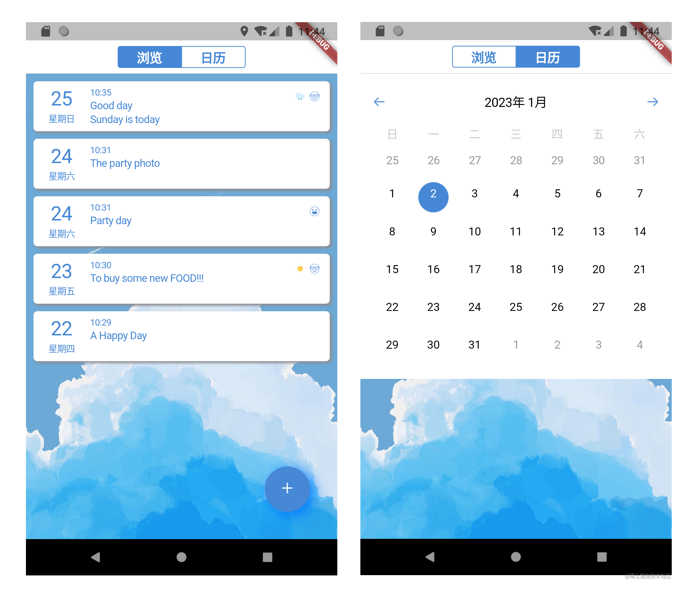
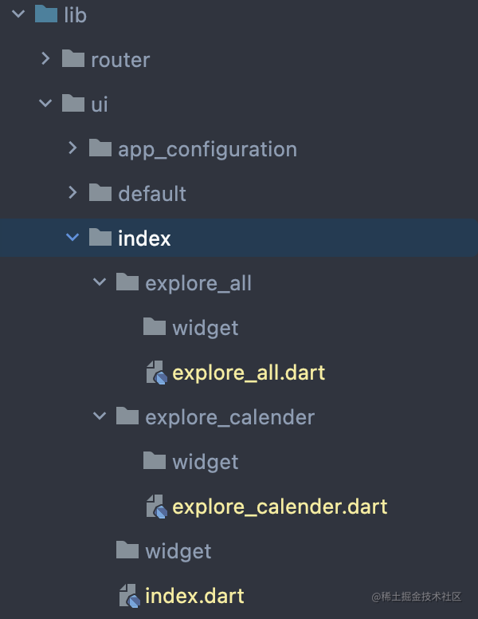
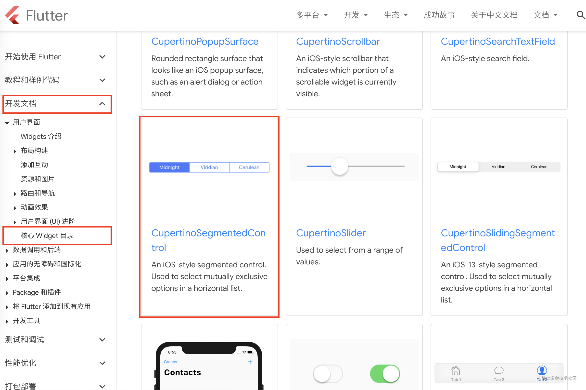
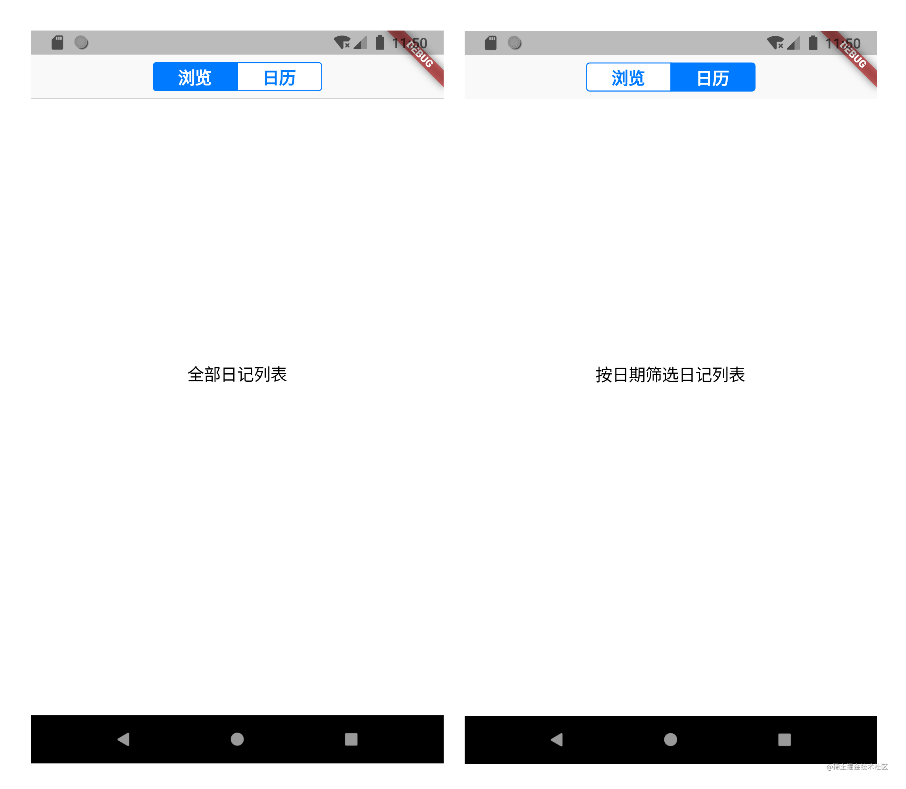

# 实战项目二：多 Tab 式主页布局结构

原文链接：https://juejin.cn/book/7178741001677176836/section/7179876594335367226

欢迎回来，我们继续“日记”项目的实战。

前两讲我带大家实现了持久化数据，说的是数据层面的事情，不涉及 UI 交互。实际上，一个完整的应用程序通常包含了 UI 交互和数据，二者相互配合，最终构成了整个 App。所以，本讲我们回到 UI 层面，一起实现主页，如下图所示：



仔细观察这张图，会发现主页其实是由两个页面构成的：一个是上图左侧的日记列表，它被称为“浏览”页面；另一个则是根据日期筛选日记的“日历”页面。本讲聚焦这两个页面切换结构的实现，以及日记列表页面的实现。日历页面则留到下下讲中，因为它涉及了另一个知识点：自定义组件。

主页的源码已经在项目伊始添加完毕，并加入跳转路由表，有关这部分内容，请大家回看[第 17 讲：实现“日记”项目多页面管理](https://juejin.cn/book/7178741001677176836/section/7180607573492498444)。

好了，闲话不多讲，下面我们就来进入正题吧！

## 初制“原料”

前面提到，主页的源码文件已经添加，虽然目前还没什么实际功能，但至少它在那里，只是浏览和日历页面连源码文件都还没有。俗话说：“巧妇难为无米之炊”，我们至少要先让这两个页面占个位，否则一会儿切换的时候就没得可切了。

主页的源码文件名为 index.dart，位于项目根目录下 lib\ui\index\ 目录中。浏览和日历页面在结构上从属于首页，因此我也把它们放在了上述目录中，只不过用不同的子目录来分开它们。浏览页面取名为 explore_all，日历页面取名为 explore_calendar，最终的结果是这样的：



`💡 提示：根据每个项目的实际情况，上述源码结构仅适用于子页面不再做其它用途的情况。如果浏览或日历页面同时被其它页面管理，或有单独使用的情况，如此结构便不再合理，应将它们置于与 index 目录同级或更高层级的位置。`

这两个页面目前只是“初制”，没有什么有意义的内容，它们各自的源码暂时如下：

```dart
import 'package:flutter/cupertino.dart';
class ExploreAllPage extends StatefulWidget {
const ExploreAllPage({Key? key}) : super(key: key);
@override
State<ExploreAllPage> createState() => _ExploreAllPageState();
}
class _ExploreAllPageState extends State<ExploreAllPage> {
@override
Widget build(BuildContext context) {
return Center(child: Text('全部日记列表'));
}
}

```

```dart
import 'package:flutter/cupertino.dart';
class ExploreCalenderPage extends StatefulWidget {
const ExploreCalenderPage({Key? key}) : super(key: key);
@override
State<ExploreCalenderPage> createState() => _ExploreCalenderPageState();
}
class _ExploreCalenderPageState extends State<ExploreCalenderPage> {
@override
Widget build(BuildContext context) {
return Center(child: Text('按日期筛选日记列表'));
}
}

```

相信聪明的你一定能分出哪个源码对应哪个页面吧？没错，上面那个就是浏览页面，下面的则是日历页面。

有了“原料”，接下来就是把它们加工成完整的“菜品”了，也就是页面切换结构的实现。

## 多 Tab 式切换结构的实现

回到本讲一开始的图片，页面的切换实际是通过最上方导航栏实现的，是非常常见的 iOS 风格。

其实一开始，我和大家一样，都不知道该用什么组件实现这个效果，但是别急，这类常见的组件大概率都会内置在 Flutter SDK 中，这也就意味着官网一定会有相应的文档详细阐述了使用方法。

于是，我打开 Flutter 官网，找到“开发文档”，顺藤摸瓜，找到了“核心 Widget 目录”，最终找到了“Cupertino（iOS-style Widgets）”大类。还记得吗？Flutter SDK 中有一个规律，凡是 iOS 风格的组件基本都被称为“CupertinoXxx”，所以到这一步，基本就成功了一大半了。

接着，在 Cupertino（iOS-style Widgets）大类中继续探索，最终，我发现了这个：



看到这，我觉得已经接近事实真相了。随后我点进该组件的详细文档页：[CupertinoSegmentedControl class - cupertino library - Dart API (flutter-io.cn)](https://api.flutter-io.cn/flutter/cupertino/CupertinoSegmentedControl-class.html)，大家也可以现在就打开它。这真的是“宝藏”资源，虽然是英文的，但是它给了丰富的代码示例和代码“练习场”，我们甚至可以直接在文档中编码、实验，看看它是否满足我们的需要。

接下来要做什么，不用多说了吧？直接照搬，然后稍作修改就可以了！我来说说具体我是怎么做的。

首先要把前面“初制”的“原料”——浏览和日历页面用起来。结合示例代码，我也用了一个 Map 数据结构来组织它们，具体代码如下：

```dart
Map<Object, Widget> segmentedControlWidgets() {
return {
0: Container(
padding: const EdgeInsets.only(left: 25, right: 25),
child: const Text('浏览')),
1: Container(
padding: const EdgeInsets.only(left: 25, right: 25),
child: const Text('日历'),
),
};
}

```

然后便是 CupertinoSegmentedControl 组件的使用了。和示例代码一样，我也在 CupertinoPageScaffold 组件的 middle 属性中使用它，完整的代码如下
：

```dart
class _IndexPageState extends State<IndexPage> {
int currentPage = 0;
Map<Object, Widget> segmentedControlWidgets() {
return {
0: Container(
padding: const EdgeInsets.only(left: 25, right: 25),
child: const Text('浏览')),
1: Container(
padding: const EdgeInsets.only(left: 25, right: 25),
child: const Text('日历'),
),
};
}
@override
Widget build(BuildContext context) {
return CupertinoPageScaffold(
navigationBar: CupertinoNavigationBar(
middle: CupertinoSegmentedControl(
children: segmentedControlWidgets(),
groupValue: currentPage,
onValueChanged: (value) {
setState(() {
currentPage = value as int;
});
}),
),
child: Container(
child: currentPage == 0 ? const ExploreAllPage() : const ExploreCalenderPage(),
),
);
}
}

```

此处我使用了一个变量 currentPage 来记录和切换当前要显示的页面，groupValue 则表示当前所在页。当用户试图切换页面时，onValueChanged 会被调用，currentPage 发生改变，进而改变当前要显示的页面。

如此编码后，多 Tab 页面切换结构就实现了，如下图所示：



怎么样，是不是很简单？

编程其实就应该这么简单，不知道该用什么组件的时候，只要把握一个原则：常见的且是系统原生的，SDK 中大概率内置，翻翻官方文档就会有惊喜（比如 CupertinoSegmentedControl）；不常见的，或者不是系统原生的，也别怕，Flutter 中“一切皆组件”，正确的排列组合之后，自定义组件便会诞生（比如日历组件）。

接下来就是完善“浏览”页面了。

## “浏览”页面：通用的列表布局

再次观察“浏览”页面：


除了背景和右下角的添加日记按钮外，其实就只剩下垂直列表布局了。列表中的每个项目的布局也是一致的，理论上这种一致的布局方式，只需要写一次就可以，这是大部分编程框架的规律。

想到垂直列表，会想到什么组件？对了，是 Column，它和 Row，一个是垂直排布，一个是水平排布。

但这还不够，当日记数量多于一个屏幕高度的时候，用户需要滚动来查看更多。这个滚动用啥组件呢？首先，“滚动”的英文是“Scroll”，在本例中，只有 Column 组件需要滑动，于是我最终找到了一个名为“SingleChildScrollView”的组件。

到此，实现的思路都有了。参考官方提供的文档，实现整个垂直布局应该没有难度。相关代码片段如下：

```dart
import 'package:flutter/cupertino.dart';
import '../../../constants.dart';
import '../../../main.dart' hide Diary;
import '../../../router/routes.dart';
import '../../../util/db_util.dart';
import '../widget/diary_list_widget.dart';
class _ExploreAllPageState extends State<ExploreAllPage> {
List<Map<String, Object?>> allDiaryRow = [];
List<Diary> allDiary = [];
// 添加新日记按钮
Widget addNewDiaryButton() {
return Positioned(
right: 20,
bottom: 20,
child: CupertinoButton(
child: Container(
width: 60,
height: 60,
decoration: BoxDecoration(
color: Consts.themeColor,
borderRadius: const BorderRadius.all(Radius.circular(80)),
border: Border.all(width: 0, style: BorderStyle.none),
boxShadow: const [
BoxShadow(
color: CupertinoColors.systemBlue,
offset: Offset(5.0, 5.0),
blurRadius: 15.0,
spreadRadius: 0.1)
],
),
child: const Icon(
CupertinoIcons.add,
color: CupertinoColors.white,
size: 20,
),
),
onPressed: () {
//TODO 跳转到新建日记页面
},
),
);
}
@override
Widget build(BuildContext context) {
return Container(
width: double.infinity,
height: double.infinity,
padding: const EdgeInsets.only(top: 5),
decoration: const BoxDecoration(
image: DecorationImage(
fit: BoxFit.cover,
image: AssetImage('assets/image/bg.jpg'),
),
),
child: Stack(
children: [DiaryListWidget.diaryList(allDiary), addNewDiaryButton()]),
);
}
}

```

这段代码中，`allDiaryRow`表示从数据库获取来的原始数据，`allDiary`表示用于 UI 展示的数据，后者由前者重新组织整理得到。数据库操作在前一讲：[持久化数据（二）](https://juejin.cn/book/7178741001677176836/section/7180609141101035552) 中已经讲过，此处正好派上用场。

`❗️ 注意：Diary 同时存在于 main.dart 和 db_util.dart。此处的 Diary 表示完整的一条日记数据，导包时应选择 db_util.dart。`

程序运行后，默认会展示“浏览”页面。为了显示所有日记，该页面会在启动后立即查询数据库，并重新组织数据，呈现在页面上。因此，在 _ExploreAllPageState 类的 initState() 方法中，就应该做查询数据库的操作。相关代码如下：

```dart
// 载入所有日记
void loadAllDiary() async {
await DatabaseUtil.instance.openDb();
allDiaryRow = await DatabaseUtil.instance.queryAll();
allDiary.clear();
if (allDiaryRow.isNotEmpty) {
for (int i = 0; i < allDiaryRow.length; i++) {
allDiary.add(Diary().fromMap(allDiaryRow[i]));
}
}
setState(() {});
}
@override
void initState() {
super.initState();
loadAllDiary();
}

```

解决了数据层面的问题，让我们再次回到 UI 层面。

敏锐的你可能会问：到现在也没看到 Column 和 SingleChildScrollView，它们在哪儿呢？

答案是：它们在 DiaryListWidget 类里面。

DiaryListWidget 是我封装的组件类，这么做的主要目的其实就是为了代码好维护，让 explore_page 更加简洁一些。

说到这，DiaryListWidget 的职责也就清晰了：它就是滚动列表组件！让我们一起看看它的代码吧：

```dart
class DiaryListWidget {
// 全部日记列表
static Widget diaryList(List<Diary> allDiary) {
if (allDiary == [] || allDiary.isEmpty) {
return Container();
} else {
List<Widget> allDiaryWidget = [];
for (int i = 0; i < allDiary.length; i++) {
allDiaryWidget.add(ItemSingleDiaryWidget(
diary: allDiary[i],
));
}
return SingleChildScrollView(
child: Column(
children: allDiaryWidget,
),
);
}
}
}

```

这样就完了吗？还没有！

DiaryListWidget 只提供了滚动和垂直列表组件，并未定义每一条数据具体的样式。上面这段代码中，ItemSingleDiaryWidget 才是具体的一条数据应该显示的布局结构实现。它的完整代码如下：

```dart
import 'package:flutter/cupertino.dart';
import 'package:flutter_svg/svg.dart';
import '../../../constants.dart';
import '../../../util/datetime_util.dart';
import '../../../util/db_util.dart';
class ItemSingleDiaryWidget extends StatefulWidget {
const ItemSingleDiaryWidget({Key? key, required this.diary})
: super(key: key);
final Diary diary;
@override
State<StatefulWidget> createState() => _ItemSingleDiaryWidgetState();
}
class _ItemSingleDiaryWidgetState extends State<ItemSingleDiaryWidget>
with SingleTickerProviderStateMixin {
late AnimationController controller;
double beginScale = 1.0, endScale = 1.0;
@override
void initState() {
super.initState();
// 定义整体缩放动画
controller = AnimationController(
vsync: this, duration: const Duration(milliseconds: 100));
controller.addStatusListener((status) {
if (status == AnimationStatus.completed) {
//TODO 显示日记详情
controller.reverse();
}
});
}
// 左侧区域
Widget leftArea() {
return Column(
children: [
Text(
widget.diary.date.day.toString(),
style: const TextStyle(color: Consts.themeColor, fontSize: 26),
),
Container(height: 2),
Text(
DateTimeUtil.parseWeekDay(widget.diary.date),
style: const TextStyle(color: Consts.themeColor, fontSize: 12),
),
],
);
}
// 中间区域
Widget rightArea() {
return Column(
crossAxisAlignment: CrossAxisAlignment.start,
children: [
Text(DateTimeUtil.parseTime(widget.diary.date),
style: const TextStyle(color: Consts.themeColor, fontSize: 12)),
Container(height: 2),
Text(
widget.diary.title != ''
? widget.diary.title
: DateTimeUtil.parseDate(widget.diary.date),
style: const TextStyle(color: Consts.themeColor, fontSize: 14)),
Container(height: 2),
Text(
widget.diary.content,
style: const TextStyle(color: Consts.themeColor, fontSize: 14),
maxLines: 1,
overflow: TextOverflow.ellipsis,
),
],
);
}
// 天气和情绪
Widget weatherAndEmotionArea() {
return Positioned(
right: 5,
top: 5,
child: Row(
children: [
widget.diary.weather['path'] != null
? SvgPicture.asset(
widget.diary.weather['path'],
width: 14.0,
height: 14.0,
)
: const SizedBox(width: 14.0, height: 14.0),
const SizedBox(width: 5),
widget.diary.emotion['path'] != null
? SvgPicture.asset(
widget.diary.emotion['path'],
width: 14.0,
height: 14.0,
)
: const SizedBox(width: 14.0, height: 14.0),
],
),
);
}
// 显示日志详情
void showDiaryDetail(double startX, double startY) {
setState(() {
endScale = 1.1;
});
if (!controller.isAnimating) {
controller.forward();
}
}
@override
Widget build(BuildContext context) {
return ScaleTransition(
scale: Tween(begin: beginScale, end: endScale).animate(controller),
child: GestureDetector(
onTapUp: (tapUpDetails) {
showDiaryDetail(
tapUpDetails.globalPosition.dx, tapUpDetails.globalPosition.dy);
},
child: Container(
padding: const EdgeInsets.only(left: 20, top: 8, bottom: 8, right: 8),
margin: const EdgeInsets.only(left: 10, right: 10, top: 5, bottom: 5),
decoration: const BoxDecoration(
boxShadow: [
BoxShadow(
color: CupertinoColors.systemGrey,
offset: Offset(2.0, 2.0),
blurRadius: 2,
spreadRadius: 0.5)
],
color: CupertinoColors.white,
borderRadius: BorderRadius.all(Radius.circular(5)),
),
child: Stack(children: [
Row(
children: [
leftArea(),
Container(width: 20),
Expanded(child: rightArea())
],
),
weatherAndEmotionArea()
]),
),
),
);
}
}

```

这段代码虽然看上去很长，但是理解起来基本没什么难度。需要说明的是：用来表示天气和情绪的图标是若干 svg 格式的图片，需要集成相关的包以提供支持。datetime_util.dart，是我自己实现的，用来把时间的原始毫秒值转换为人类易于理解的文字格式。constants.dart 包含了一系列常量值，提供了天气和情绪图标的名称和路径值。

datetime_util.dart 和 constants.dart 的完整代码请大家参考本讲末尾的附录内容。

最后，关于 pubspec.yaml，我做了如下修改：

```yaml
dependencies:
flutter:
sdk: flutter
...
# SVG类型图片
flutter_svg: ^1.1.1+1
# 国际化
intl: ^0.17.0

...

flutter:
uses-material-design: true
assets:
- assets/image/

```

## 小结

🎉 恭喜，您完成了本次课程的学习！

📌 以下是本次课程的重点内容总结：

本讲我介绍了如何选择合适的组件实现需求，这是一个非常重要的解决问题的原则，或者说是思维方式。对于常见的且是系统原生的组件，Flutter SDK 中大概率内置，翻翻官方文档就会有惊喜（比如 CupertinoSegmentedControl）；不常见的，或者不是系统原生的，也别怕，Flutter 中“一切皆组件”，正确的排列组合之后，自定义组件便会诞生（比如日历组件）。

对于日记列表页面（即浏览页面），我们使用了 Column 和 SingleChildScrollView 实现了垂直排列和手势滚动。由于这二者没有平台特异性，因此这种组合方式对于这种跨平台也非常通用。在实际开发中，我们经常会遇到这种垂直+滚动的布局方式，比如新闻客户端、聊天界面、音乐播放列表等等。

好了，本讲内容到此为止，希望能够对你有所帮助。在下一讲中，我们一起实现写日记页面，一旦写日记页面完成，也就意味着本讲实现的浏览页面将不再空白一片，可以看到所有保存下来的日记了。我们下一讲再见！

## 附录一：datetime_util.dart 完整代码

```ini
import 'package:intl/intl.dart';
class DateTimeUtil {
/// 最近日记列表中的单个条目时间，规则如下：
/// 1.当天的消息，显示时间（没日期）
/// 2.超过1天、小于2天，显示昨天+时间
/// 3.超过2天、小于1周，显示星期+时间
/// 4.大于1周，显示时间：日期（年+月+日）+时间
static String parseDateTimeToFriendlyRead(int timeMillis) {
DateTime dateTime = DateTime.fromMillisecondsSinceEpoch(timeMillis);
int year = dateTime.year;
int month = dateTime.month;
int day = dateTime.day;
String weekDay = '';
switch (dateTime.weekday) {
case 1:
weekDay = '星期一';
break;
case 2:
weekDay = '星期二';
break;
case 3:
weekDay = '星期三';
break;
case 4:
weekDay = '星期四';
break;
case 5:
weekDay = '星期五';
break;
case 6:
weekDay = '星期六';
break;
case 7:
weekDay = '星期日';
break;
}
int hour = dateTime.hour;
int minute = dateTime.minute;
int second = dateTime.second;
DateTime dateTimeNow = DateTime.now();
int yearNow = dateTime.year;
int monthNow = dateTime.month;
int dayNow = dateTime.day;
int hourNow = dateTime.hour;
int minuteNow = dateTime.minute;
int secondNow = dateTime.second;
int passedDays = dateTimeNow.difference(dateTime).inHours;
if (yearNow == year && monthNow == month && passedDays <= 1 * 24) {
// 对应第1条规则
return '$hour:$minute';
} else if (yearNow == year &&
monthNow == month &&
passedDays > 1 * 24 &&
passedDays <= 2 * 24) {
// 对应第2条规则
return '昨天 $hour:$minute';
} else if (yearNow == year &&
monthNow == month &&
passedDays > 2 * 24 &&
passedDays <= 7 * 24) {
// 对应第3条规则
return '$weekDay $hour:$minute';
} else {
// 对应第4条规则
return '$year-$month-$day $hour:$minute:$second';
}
}
/// 获取当前时间
static String parseDateTimeNow() {
DateTime dateTime = DateTime.now();
String weekDay = '';
switch (dateTime.weekday) {
case 1:
weekDay = '星期一';
break;
case 2:
weekDay = '星期二';
break;
case 3:
weekDay = '星期三';
break;
case 4:
weekDay = '星期四';
break;
case 5:
weekDay = '星期五';
break;
case 6:
weekDay = '星期六';
break;
case 7:
weekDay = '星期日';
break;
}
DateFormat outputFormat = DateFormat("yyyy/MM/dd $weekDay\nHH:mm");
return outputFormat.format(dateTime);
}
/// 获取给定时间的星期
static String parseWeekDay(DateTime date) {
String weekDay = '';
switch (date.weekday) {
case 1:
weekDay = '星期一';
break;
case 2:
weekDay = '星期二';
break;
case 3:
weekDay = '星期三';
break;
case 4:
weekDay = '星期四';
break;
case 5:
weekDay = '星期五';
break;
case 6:
weekDay = '星期六';
break;
case 7:
weekDay = '星期日';
break;
}
return weekDay;
}
/// 获取给定时间的时刻（仅时间）
static String parseTime(DateTime date) {
DateFormat outputFormat = DateFormat("HH:mm");
return outputFormat.format(date);
}
/// 获取给定时间的日期（完整年月日）
static String parseDate(DateTime date) {
DateFormat outputFormat = DateFormat("yyyy/MM/dd");
return outputFormat.format(date);
}
/// 获取给定时间的日期（年月）
static String parseMonth(DateTime date) {
DateFormat outputFormat = DateFormat("yyyy年 M月");
return outputFormat.format(date);
}
}

```

## 附录二：constants.dart 完整代码

```dart
import 'dart:ui';
class Consts {
static const Color themeColor = Color(0xFF4788D6);
static const List weatherResource = [
{'name': '晴', 'path': 'assets/image/weather01.svg'},
{'name': '阴', 'path': 'assets/image/weather02.svg'},
{'name': '多云', 'path': 'assets/image/weather03.svg'},
{'name': '小雨', 'path': 'assets/image/weather04.svg'},
{'name': '中雨', 'path': 'assets/image/weather05.svg'},
{'name': '大雨', 'path': 'assets/image/weather06.svg'},
{'name': '雷阵雨', 'path': 'assets/image/weather07.svg'},
{'name': '雨夹雪', 'path': 'assets/image/weather08.svg'},
{'name': '小雪', 'path': 'assets/image/weather09.svg'},
{'name': '中雪', 'path': 'assets/image/weather10.svg'},
{'name': '大雪', 'path': 'assets/image/weather11.svg'},
{'name': '冰雹', 'path': 'assets/image/weather12.svg'},
{'name': '阵雪', 'path': 'assets/image/weather13.svg'},
{'name': '阵雨', 'path': 'assets/image/weather14.svg'},
{'name': '龙卷风', 'path': 'assets/image/weather15.svg'},
{'name': '沙尘暴', 'path': 'assets/image/weather16.svg'},
{'name': '雾', 'path': 'assets/image/weather17.svg'},
{'name': '雾霾', 'path': 'assets/image/weather18.svg'},
{'name': '扬尘', 'path': 'assets/image/weather19.svg'},
{'name': '台风', 'path': 'assets/image/weather20.svg'},
];
static const List emotionResource = [
{'name': '不知道', 'path': 'assets/image/emotion01.svg'},
{'name': '得意', 'path': 'assets/image/emotion02.svg'},
{'name': '孤独', 'path': 'assets/image/emotion03.svg'},
{'name': '充实', 'path': 'assets/image/emotion04.svg'},
{'name': '烦躁', 'path': 'assets/image/emotion05.svg'},
{'name': '暖心', 'path': 'assets/image/emotion06.svg'},
{'name': '惊喜', 'path': 'assets/image/emotion07.svg'},
{'name': '开心', 'path': 'assets/image/emotion08.svg'},
{'name': '难过', 'path': 'assets/image/emotion09.svg'},
{'name': '梦境', 'path': 'assets/image/emotion10.svg'},
{'name': '疲惫', 'path': 'assets/image/emotion11.svg'},
{'name': '迷茫', 'path': 'assets/image/emotion12.svg'},
{'name': '尴尬', 'path': 'assets/image/emotion13.svg'},
{'name': '努力', 'path': 'assets/image/emotion14.svg'},
{'name': '平静', 'path': 'assets/image/emotion15.svg'},
{'name': '逃避', 'path': 'assets/image/emotion16.svg'},
{'name': '委屈', 'path': 'assets/image/emotion17.svg'},
{'name': '生气', 'path': 'assets/image/emotion18.svg'},
{'name': '甜蜜', 'path': 'assets/image/emotion19.svg'},
];
}

```
