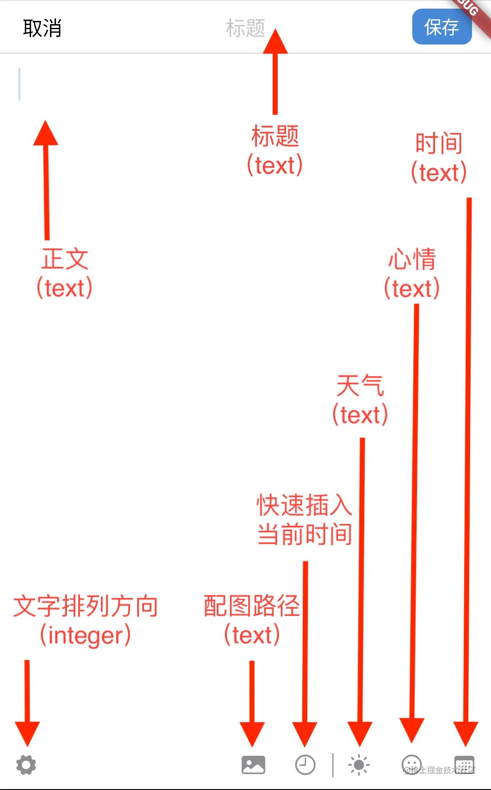
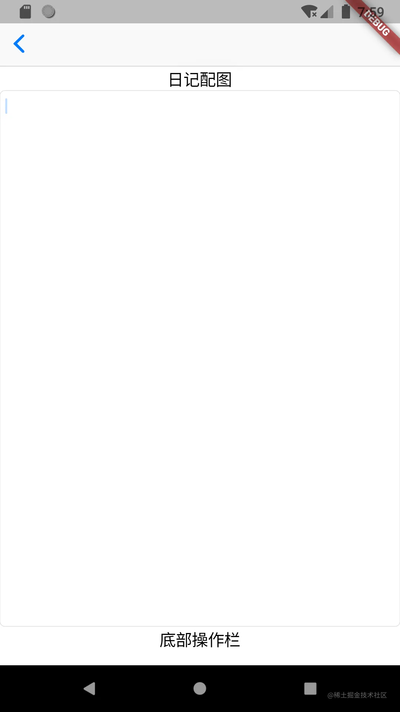
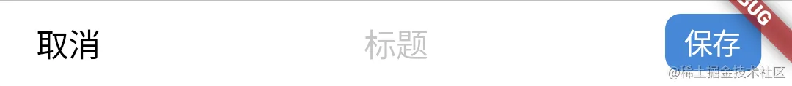
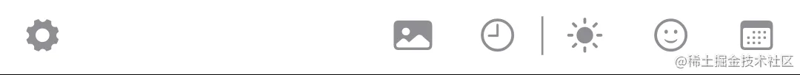
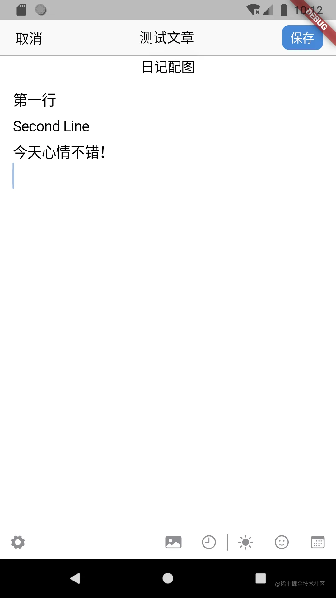
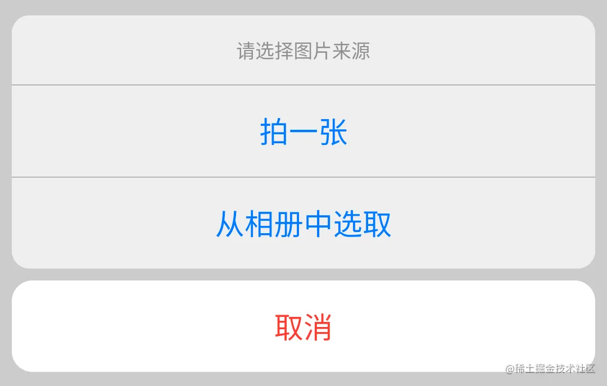
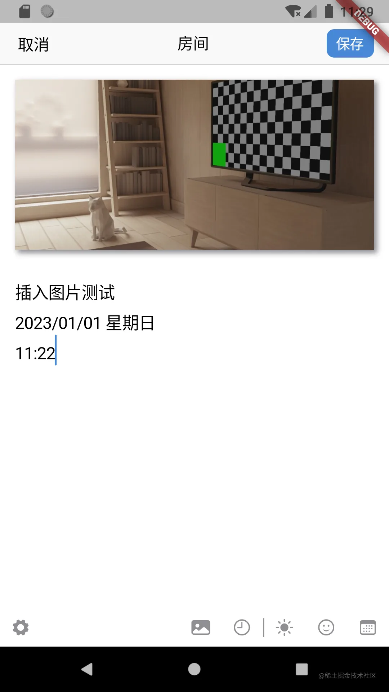
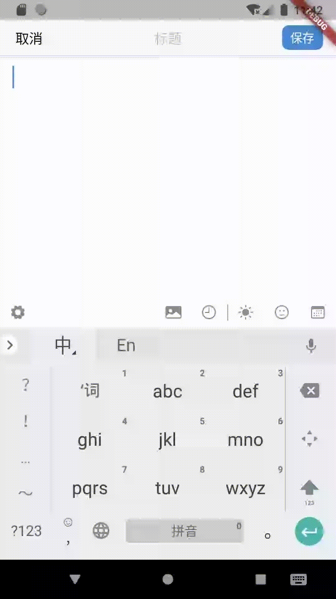
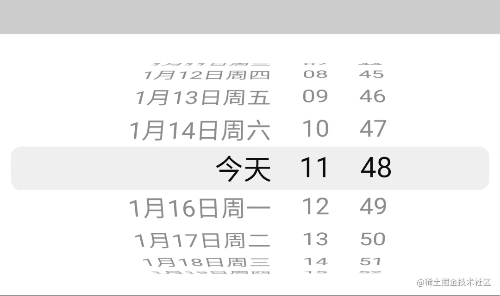

# 实战项目二：写新日记页面

原文链接：https://juejin.cn/book/7178741001677176836/section/7181703823738535973

在前一讲中，我们一起完成了主页多Tab切换结构和全部日记列表页面。但由于数据库中不存在日记数据，所以我们也无法看到和验证日记列表页面是否符合预期。

于是乎，趁热打铁。本讲我将带大家一起实现日记书写页面（write_new.dart）以及该页面大部分应有的功能。对于设置功能以及事件总线的使用，我放到后面的章节中单独介绍。完成新建日记页面后，用户不仅可以书写日记，还可以从日记列表页面中找到这条日记。

## UI 初实现

先来看看写日记页面的样子及功能图：



从图中可以看到，整个界面从上至下分别是：顶部的导航栏、配图（该控件仅在选取图片后出现）、正文以及底部的操作栏构成。显然，整个界面的排布是自上而下垂直排列的。所以，除了导航栏外，我们自然会想到使用 Column 组件来组织每个部分。

于是，先宏观后微观。来到 write_new.dart，在代码层面把整个结构定下来。具体代码如下：

```dart
class _WriteNewPageState extends State<WriteNewPage> {
// 顶部导航栏
CupertinoNavigationBar topNavigationBar() {
return CupertinoNavigationBar();
}
// 日记配图（仅在添加了图片后显示）
Widget diaryPicture() {
return Text('日记配图');
}
// 文本输入区
Widget textInputArea() {
return Expanded(
child: CupertinoTextField(),
);
}
// 底部操作栏
Widget bottomOperationBar() {
return SizedBox(
height: 40,
child: Text('底部操作栏'),
);
}
@override
Widget build(BuildContext context) {
return CupertinoPageScaffold(
navigationBar: topNavigationBar(),
child: SafeArea(
child: Column(
children: [
diaryPicture(),
textInputArea(),
bottomOperationBar(),
],
),
),
);
}
}

```

相信大家学到本讲，对于理解这段代码已经没有什么难度了。值得注意的是 SafeArea，它的作用是使页面的内容部分处于导航栏的下面，防止被导航栏遮盖。此时，整个页面的的结构就很清晰了：



接着，逐步细化，先从导航栏开始。

## 导航栏

要实现的导航栏长这样：



从左至右，它其实由三部分构成：取消按钮、标题输入框和右侧的保存按钮。通过前面的学习，我们知道，iOS 中的导航栏需要 CupertinoNavigationBar 组件。通过阅读该组件的源码，可以发现在注释部分有如下描述：

>

```dart
/// It also supports a [leading] and [trailing] widget before and after the
/// [middle] widget while keeping the [middle] widget centered.
///
/// The [leading] widget will automatically be a back chevron icon button (or a
/// close button in case of a fullscreen dialog) to pop the current route if none
/// is provided and [automaticallyImplyLeading] is true (true by default).
///
/// The [middle] widget will automatically be a title text from the current
/// [CupertinoPageRoute] if none is provided and [automaticallyImplyMiddle] is
/// true (true by default).

```

从这段描述中我们可以得出以下结论：

1. 导航栏支持 leading、trailing 和 middle 三个属性，分别对应左、右、中三个位置；

2. leading 会根据页面跳转情况自动生成返回或关闭按钮，automaticallyImplyLeading 属性控制是否自动生成，默认值为 true；

3. middle 会根据路由自动生成标题文本，automaticallyImplyMiddle 属性控制是否自动生成，默认值为 true。

看到这，相信大家和我一样，已经有了实现思路。接下来就是代码实现了，总的来说并不难：

```dart
TextEditingController titleInputController = TextEditingController();
// 顶部导航栏
CupertinoNavigationBar topNavigationBar() {
return CupertinoNavigationBar(
leading: SizedBox(
width: 40,
child: CupertinoButton(
padding: const EdgeInsets.all(0),
child: const Text(
'取消',
style: TextStyle(color: CupertinoColors.label),
),
onPressed: () {
router.pop(context);
},
),
),
middle: CupertinoTextField(
controller: titleInputController,
textAlign: TextAlign.center,
decoration: const BoxDecoration(border: null),
placeholder: '标题',
),
trailing: SizedBox(
height: 30,
width: 50,
child: CupertinoButton(
color: Consts.themeColor,
padding: const EdgeInsets.all(0),
child: Text('保存',
style: const TextStyle(color: CupertinoColors.white, fontSize: 15),
),
onPressed: () {
//TODO 保存日记
},
),
),
);
}

```

完成了导航栏后，我们继续往下走，来到日记内容区。我们暂且不管图片显示，先实现文字输入区。

## 日记文字输入区

提到“文字输入”，我们下意识就会想到 CupertinoTextField 组件。但是，CupertinoTextField 组件的默认风格不仅有边框，而且还只能单行输入。这显然不符合最终的效果要求，况且还要做些四边留边距等等美化工作，以兼顾视觉效果。

按照以往的编程经验，源代码的注释一直是我们的“好老师”。阅读这些注释或参阅官方文档的指导，很快就会发现：组件本身的属性可以满足上述所有的要求，于是进行编码实现，代码片段如下：

```dart
TextEditingController contentInputController = TextEditingController();
// 文字从右至左
bool textRightToLeft = false;
// 文本输入区
Widget textInputArea() {
return Expanded(
child: CupertinoTextField(
textAlign: !textRightToLeft ? TextAlign.start : TextAlign.end,
controller: contentInputController,
padding: const EdgeInsets.only(left: 16, right: 16, top: 10),
cursorColor: Consts.themeColor,
style: const TextStyle(fontSize: 18, height: 1.8),
autofocus: true,
maxLines: 500,
textAlignVertical: TextAlignVertical.top,
decoration: const BoxDecoration(border: null),
),
);
}

```

在这段代码中，textRightToLeft 变量控制文字显示的方向。当它是 true 时，文字靠右；反之则靠左显示，默认值是 false。autofocus 属性表示是否自动获取焦点，我在这里传 true 值，当写新日记页面显示时，光标便会显示在文本输入区，并弹出软键盘。用户直接输入的内容便会在该区域显示了。

decoration 是装饰器，可以实现对组件的边框、颜色、背景图片等等进行定义，而这里的 BoxDecoration 则定义了边框样式。对于本例而言，不需要任何边框。

说到这，我们不妨看看 CupertinoTextField 中 decoration 属性的默认值：

```dart
const BoxDecoration _kDefaultRoundedBorderDecoration = BoxDecoration(
color: CupertinoDynamicColor.withBrightness(
color: CupertinoColors.white,
darkColor: CupertinoColors.black,
),
border: _kDefaultRoundedBorder,
borderRadius: BorderRadius.all(Radius.circular(5.0)),
);

```

为什么组件默认会有圆角矩形的边框呢？这段代码给出了答案。

color 属性定义了在明亮和暗黑模式下不同的背景颜色，border 定义了边框样式（颜色和线条粗细），borderRadius 定义了边框矩形圆角的角度。

如果我们日后需要实现边框，便可参考这段代码实现了。稍后的插图环节还有 BoxDecoration 的应用，大家可以看到它更多的属性赋值。

到此，文本输入区就搞定了，接下来是较为复杂的底部操作栏。

## 底部操作栏

先来分析一下底部操作栏的 UI 结构：



从图中可以看出：底部操作栏整体上呈水平排列。说到水平排列，就会想到 Row 组件。接着，如果以插入图片按钮为分界线，左侧只有一个设置按钮，右侧是若干对日记内容进行编辑的按钮。换言之，整个底部操作栏的右侧若干组件是依次排列的，左侧则填充整个操作栏的剩余空间。

`💡 提示：左侧设置按钮明明是居左，为什么是填充整个操作栏的剩余空间呢？这是因为剩余空间作为单独的区域，是从左至右排列的，设置按钮位于整个剩余空间的最左侧。`

大家还记得刚刚的文字输入区，是如何填满屏幕中间的大部分区域吗？没错，它被 Expanded 组件容纳。此处我们用相同的方法实现整个底部操作栏。

```dart
Map selectedWeather = {};
Map selectedEmotion = {};
DateTime selectedDate = DateTime.now();
// 显示设置窗口
void showSettingDialog() {
//TODO 显示设置窗口
}
// 插入图片
void insertImage() {
//TODO 插入图片
}
// 在文本底部插入时间日期
void insertDateTime() {
//TODO 插入时间日期
}
// 设置天气
void setWeather() {
//TODO 设置天气
}
// 设置心情
void setEmotion() {
//TODO 设置心情
}
// 设置日期
void setDate() {
//TODO 设置日期
}
// 底部操作栏
Widget bottomOperationBar() {
return SizedBox(
height: 40,
child: Row(
crossAxisAlignment: CrossAxisAlignment.center,
children: [
// 设置按钮
Expanded(
child: Container(
alignment: Alignment.centerLeft,
child: CupertinoButton(
padding: const EdgeInsets.all(0),
child: const Icon(CupertinoIcons.gear_solid,
size: 20, color: CupertinoColors.systemGrey),
onPressed: () {
showSettingDialog();
}),
),
),
// 插入图片按钮
CupertinoButton(
padding: const EdgeInsets.all(0),
child: const Icon(CupertinoIcons.photo_fill,
size: 20, color: CupertinoColors.systemGrey),
onPressed: () {
insertImage();
}),
// 插入当前日期时间按钮
CupertinoButton(
padding: const EdgeInsets.all(0),
child: const Icon(CupertinoIcons.time,
size: 20, color: CupertinoColors.systemGrey),
onPressed: () {
insertDateTime();
}),
// 分割线
Container(
width: 1,
height: 20,
color: CupertinoColors.systemGrey,
alignment: Alignment.center,
),
// 设置当前天气按钮
CupertinoButton(
padding: const EdgeInsets.all(0),
child: selectedWeather == {} || selectedWeather['path'] == null
? const Icon(CupertinoIcons.sun_max_fill,
size: 20, color: CupertinoColors.systemGrey)
: SvgPicture.asset(
selectedWeather['path'],
width: 20.0,
height: 20.0,
),
onPressed: () {
setWeather();
}),
// 设置当前心情按钮
CupertinoButton(
padding: const EdgeInsets.all(0),
child: selectedEmotion == {} || selectedEmotion['path'] == null
? const Icon(CupertinoIcons.smiley,
size: 20, color: CupertinoColors.systemGrey)
: SvgPicture.asset(
selectedEmotion['path'],
width: 20.0,
height: 20.0,
),
onPressed: () {
setEmotion();
}),
// 设置日记日期按钮
CupertinoButton(
padding: const EdgeInsets.all(0),
child: Icon(CupertinoIcons.calendar,
size: 20,
color: selectedDate.year == DateTime.now().year &&
selectedDate.month == DateTime.now().month &&
selectedDate.day == DateTime.now().day
? CupertinoColors.systemGrey
: Consts.themeColor),
onPressed: () {
setDate();
}),
],
),
);
}

```

在这段代码中，selectedWeather、selectedEmotion 和 selectedDate 分别暂存当前选择的天气、心情和时间。其中，selectDate 默认是启动新日记页面的时间，这是出于用户使用便利性上的考虑。

SvgPicture 来自 flutter_svg 包，用于显示 SVG 格式的矢量图。在我写本讲时，它的最新稳定版本号是 1.1.1+1。

运行这段代码，尝试在界面上输入一些文本，界面如下图显示：



慢慢地，我们越来越接近最终的样子了。

从代码中可以看出，操作栏上所有操作的具体实现都留空了，接下来我们逐个实现它们。

### 插入配图 & 显示

插入图片，允许用户使用摄像头拍照或选取一张已有的照片。这显然是移动端常有的功能，对于电脑和网页是不提供的，所以要先做平台判断。

Flutter SDK 自带了判断平台的 API，将其与现有代码结合，回到 bottomOperationBar() 方法，找到插入图片按钮，做如下修改：

```dart
// 插入图片按钮
Platform.isIOS || Platform.isAndroid
? CupertinoButton(
padding: const EdgeInsets.all(0),
child: const Icon(CupertinoIcons.photo_fill,
size: 20, color: CupertinoColors.systemGrey),
onPressed: () {
insertImage();
})
: Container(),

```

如此，便可在电脑和网页端屏蔽插入图片按钮了。

经过调研，我发现 image_picker 包（[image_picker | Flutter Package (flutter-io.cn)](https://pub.flutter-io.cn/packages/image_picker)）能很好地满足需求。截至我写作本讲，它的最新稳定版版本号是 0.8.5+3。

按照官方的示例代码进行编码：

```dart
import 'package:image_picker/image_picker.dart';
final ImagePicker imagePicker = ImagePicker();
XFile? image;
// 插入图片
void insertImage() {
showCupertinoModalPopup<void>(
context: context,
builder: (BuildContext context) => CupertinoActionSheet(
title: const Text('请选择图片来源'),
cancelButton: CupertinoActionSheetAction(
isDestructiveAction: true,
onPressed: () async {
Navigator.pop(context);
},
child: const Text('取消'),
),
actions: <CupertinoActionSheetAction>[
CupertinoActionSheetAction(
onPressed: () async {
Navigator.pop(context);
image = await imagePicker.pickImage(source: ImageSource.camera);
setState(() {});
},
child: const Text('拍一张'),
),
CupertinoActionSheetAction(
onPressed: () async {
Navigator.pop(context);
image = await imagePicker.pickImage(source: ImageSource.gallery);
setState(() {});
},
child: const Text('从相册中选取'),
),
],
),
);
}
// 日记配图（仅在添加了图片后显示）
Widget diaryPicture() {
return image == null
? Container()
: Container(
margin: const EdgeInsets.all(16),
decoration: BoxDecoration(
image: DecorationImage(
fit: BoxFit.cover,
image: FileImage(File(image!.path)),
),
boxShadow: const [
BoxShadow(
color: CupertinoColors.systemGrey,
offset: Offset(3.0, 3.0),
blurRadius: 4,
spreadRadius: 0.5)
],
),
height: 180,
);
}

```

在这段代码中，除了 image_picker 包外，主要的技术点还有两个：一个是 showCupertinoModalPopup，另一个是 BoxDecoration。showCupertinoModalPopup 是 iOS 风格的弹出菜单，对于本例而言，它是这样的：



对于 showCupertinoModalPopup 的用法，其实较为固定，大家可以参照代码和上图进行对应，理解后有个大概印象。在实际开发中，直接复制粘贴，然后稍加修改即可。

完成了图片插入功能后，剩下的功能其实非常容易了。

### 添加日期

添加日期的功能，要求在用户输入的所有文本末尾换行，并在接下来的两行中分别插入日期和时间。如下图所示：



如果对该功能进行拆解，会发现它有三个具体需求：

1. 在原有文字末尾插入换行；

2. 新增两行，分别是日期和时间；

3. 文字选择位置始终处于末尾。

综上，完善 insertDateTime() 方法：

```dart
// 在文本底部插入时间日期
void insertDateTime() {
contentInputController.text =
"${contentInputController.text}\n${DateTimeUtil.parseDateTimeNow()}";
contentInputController.selection = TextSelection(
baseOffset: contentInputController.text.length,
extentOffset: contentInputController.text.length);
}

```

### 天气 & 心情

对于天气和心情的选择，实际是类似的逻辑。大家应该还记得在上讲末尾的附录二，它使用常量定义了天气和心情的名称和路径。为了查看方便，我把它们列举一二：

```dart
static const List weatherResource = [
{'name': '晴', 'path': 'assets/image/weather01.svg'},
...
];
static const List emotionResource = [
{'name': '不知道', 'path': 'assets/image/emotion01.svg'},
...
];

```

回到 write_new，使用 showCupertinoModalPopup 方法，该方法提供了 iOS 风格的底部弹出层，与 CupertinoPicker 配合，便可实现 iOS 中另一种常见的弹出式选择菜单。以天气为例，代码如下：

```dart
// 设置天气
void setWeather() {
showCupertinoModalPopup<void>(
context: context,
builder: (BuildContext context) => Container(
height: 216,
padding: const EdgeInsets.only(top: 6.0),
margin: EdgeInsets.only(
bottom: MediaQuery.of(context).viewInsets.bottom,
),
color: CupertinoColors.systemBackground.resolveFrom(context),
child: SafeArea(
top: false,
child: CupertinoPicker(
magnification: 1.22,
squeeze: 1.2,
useMagnifier: true,
itemExtent: 30,
onSelectedItemChanged: (int selectedItem) {
setState(() {
selectedWeather = Consts.weatherResource[selectedItem];
});
},
children: List<Widget>.generate(20, (int index) {
return Center(
child: Text(
Consts.weatherResource[index]['name'],
textAlign: TextAlign.center,
),
);
}),
),
),
));
}

```

运行程序，界面显示如下：



### 自定义日记时间

最后一个功能便是自定义日记的时间，用户点击操作栏最右侧的按钮后，界面底部弹出如下图所示的选取框：



我们都知道，showCupertinoModalPopup 可以实现底部弹出层。经过调研，我发现 CupertinoDatePicker 就对应着图中所示的时间选择器。所以，不妨将 showCupertinoModalPopup 和 CupertinoDatePicker 结合使用，实现所需功能。代码如下：

```dart
// 设置日期
void setDate() {
showCupertinoModalPopup<void>(
context: context,
builder: (BuildContext context) => Container(
height: 216,
padding: const EdgeInsets.only(top: 6.0),
margin: EdgeInsets.only(
bottom: MediaQuery.of(context).viewInsets.bottom,
),
color: CupertinoColors.systemBackground.resolveFrom(context),
child: SafeArea(
top: false,
child: CupertinoDatePicker(
initialDateTime: selectedDate,
mode: CupertinoDatePickerMode.dateAndTime,
use24hFormat: true,
onDateTimeChanged: (DateTime newDate) {
setState(() => selectedDate = newDate);
},
),
),
));
}

```

当运行这段程序时，相信大家都会遇到一个问题：日期选择器的语言居然是英文的。而且反复翻看 CupertinoDatePicker 的源码，也并没有语言选择的属性。

其实，对于 Flutter App 来说，默认的程序语言就是英文。若要解决上述问题，需要在程序中声明支持的语言。这需要两个步骤来完成：一是启用国际化支持，二是声明支持的语言和区域。

启用国际化支持需要项目集成 flutter_localizations 包，需要修改 pubspec.yaml，方法如下：

```yaml
dependencies:
flutter:
sdk: flutter
# 国际化
flutter_localizations:
sdk: flutter
...

```

`❗️ 注意：和集成大部分包不同，flutter_localizations 无需声明版本号。但是要加 sdk: flutter。`

声明程序支持的语言和区域，一般在 CupertinoApp 或 MaterialApp 中进行。对于本例，回到 main.dart，将原代码改为：

```dart
class MyApp extends StatelessWidget {
const MyApp({Key? key}) : super(key: key);
@override
Widget build(BuildContext context) {
return CupertinoApp(
localizationsDelegates: const [
GlobalWidgetsLocalizations.delegate,
GlobalMaterialLocalizations.delegate,
GlobalCupertinoLocalizations.delegate,
],
supportedLocales: const [
Locale('zh', 'CH')
],
locale: const Locale('zh'),
onGenerateRoute: router.generator,
home: const Diary());
}
}

```

好了，重新运行程序吧。如无意外，选择日期的弹出层的语言已经变成简体中文了。

## 保存日记 & 旧日记的编辑功能

本讲的末尾，我们一起来实现页面最后两个功能：保存和编辑旧日记。

大家应该还有印象，启动写日记界面的时候，路由是这样定义的：

```dart
router.define("$writeDiaryPage/:id", handler: writeDiaryHandler);

```

回想一下，在讨论数据库那一讲中，我曾提到一个重要的概念：ID 列，它的自增长和唯一性，为准确定位查找某条日记数据提供了基础。

根据 SQLite 的特性以及最初实现的创建数据表的语句，ID 列的值不可能是负数。于是，我们便可根据这一规律来确定启动新日记页面到底是要做什么。

- 如果 ID 的值是负数（如 -1），则为新建日记；

- 如果 ID 的值不是负数，则根据 ID 到数据库中找到旧日记数据，自动把数据还原到它们该在的位置上。

在用户点击界面右上方的保存按钮时：

- 如果 ID 的值是负数（如 -1），则向数据库中添加一条新的日记数据；

- 如果 ID 的值不是负数，则根据 ID 更新原有数据。

另外，为了使程序更加易用，当 ID 的值不是负数时（即编辑旧日记），显示为“编辑”；反之显示为“保存”。

于是，完善 saveDiary() 方法，添加恢复数据的方法：recoveryDiary()，增加按钮文字随动逻辑。关键代码如下：

```dart
@override
void initState() {
super.initState();
// 载入旧的日记内容
if (widget.id != "-1") {
recoverDiary(int.parse(widget.id));
}
}
// 保存这条日记
void saveDiary() async {
await DatabaseUtil.instance.openDb();
Diary singleDiary = Diary();
singleDiary.title = titleInputController.text;
singleDiary.image = image != null ? image!.path : '';
singleDiary.content = contentInputController.text;
singleDiary.textRightToLeft = textRightToLeft;
singleDiary.weather = selectedWeather;
singleDiary.emotion = selectedEmotion;
singleDiary.date = selectedDate;
if (widget.id == '-1') {
// 新创建的日记
await DatabaseUtil.instance.insert(singleDiary);
} else {
// 编辑旧的日记
singleDiary.id = int.parse(widget.id);
await DatabaseUtil.instance.update(singleDiary);
}
}
// 恢复数据
void recoverDiary(int id) async {
List<Map<String, Object?>> uniqueDiaryRow =
await DatabaseUtil.instance.queryById(id);
if (uniqueDiaryRow.isNotEmpty) {
Diary uniqueDiary = Diary();
uniqueDiary.fromMap(uniqueDiaryRow[0]);
titleInputController.text = uniqueDiary.title;
textRightToLeft = uniqueDiary.textRightToLeft;
contentInputController.text = uniqueDiary.content;
image = XFile(uniqueDiary.image);
selectedDate = uniqueDiary.date;
selectedEmotion = uniqueDiary.emotion;
selectedWeather = uniqueDiary.weather;
setState(() {});
}
}
// 顶部导航栏
CupertinoNavigationBar topNavigationBar() {
return CupertinoNavigationBar(
leading: SizedBox(
width: 40,
child: CupertinoButton(
padding: const EdgeInsets.all(0),
child: const Text(
'取消',
style: TextStyle(color: CupertinoColors.label),
),
onPressed: () {
router.pop(context);
},
),
),
middle: CupertinoTextField(
controller: titleInputController,
textAlign: TextAlign.center,
decoration: const BoxDecoration(border: null),
placeholder: '标题',
),
trailing: SizedBox(
height: 30,
width: 50,
child: CupertinoButton(
color: Consts.themeColor,
padding: const EdgeInsets.all(0),
child: Text(
widget.id == '-1' ? '保存' : '修改',
style: const TextStyle(color: CupertinoColors.white, fontSize: 15),
),
onPressed: () {
saveDiary();
},
),
),
);
}

```

到此，本讲内容就接近尾声了，新（包括编辑）日记的页面已经基本完成了。

这里的“基本”，其实并未包含事件总线和设置弹窗的实现。那么，事件总线将扮演什么角色，弹窗如何实现，又有哪些讲究呢？在后面几讲中，答案一一揭晓。

## 小结

🎉 恭喜，您完成了本次课程的学习！

📌 以下是本次课程的重点内容总结：

本讲我介绍了新日记页面的实现，涉及到的技术点不少，但都还算好理解，只是略烦琐。我在这里结构化梳理一下，方便大家对本讲内容有更清晰的架构。

1. Column 和 Row，一个是垂直布局，一个是水平布局。用于实现本讲整体界面和下方操作栏；

2. Expanded 用于填充某个布局中连续的空白区域，用于日记的文字内容输入框和底部的设置按钮；

3. SafeArea 使页面的内容部分处于导航栏的下面，防止被导航栏遮盖；

4. CupertinoNavigationBar 是 iOS 风格的导航栏，用于实现返回、日记标题输入和保存/关闭按钮；

5. Platform 用于判断平台，本例中，对于电脑和网页端，不显示添加图片按钮；

6. image_picker 包，提供调用摄像头拍照结果返回和相册选取照片的功能；

7. showCupertinoModalPopup + CupertinoActionSheet 实现底部弹出式菜单，用于选择照片来源；

8. showCupertinoModalPopup + CupertinoPicker 实现底部弹出式菜单，用于选择天气 & 心情；

9. showCupertinoModalPopup + CupertinoDatePicker，实现底部弹出式菜单，用于自定义日期时间；

10. 在 CupertinoApp 或 MaterialApp 中限定程序支持的语言和区域，用于修改组件的默认语言；

11. 数据库 ID 列值的巧妙运用，当值为 -1 时，为新建日记；反之则为编辑旧日记。

好了，本讲内容到此为止，大家可以试着保存一条日记，然后回到主界面上，看看列表中是否已经有刚才的日记了呢？如果没有，重启一下程序试试吧！

在下一讲中，我们一起实现自定义日历组件，它和日记列表页面并列，位于主界面上。有了这个组件，就可以根据日期来筛选某一天的日记了。我们下一讲见！

## 附录一：write_new.dart完整源码

```dart
import 'dart:io';
import 'package:flutter/cupertino.dart';
import 'package:flutter_svg/svg.dart';
import '../../constants.dart';
import '../../../main.dart' hide Diary;
import '../../util/datetime_util.dart';
import '../../util/db_util.dart';
import 'package:image_picker/image_picker.dart';
class WriteNewPage extends StatefulWidget {
const WriteNewPage({Key? key, required this.id}) : super(key: key);
final String id;
@override
State<WriteNewPage> createState() => _WriteNewPageState();
}
class _WriteNewPageState extends State<WriteNewPage> {
TextEditingController titleInputController = TextEditingController();
TextEditingController contentInputController = TextEditingController();
// 文字从右至左
bool textRightToLeft = false;
Map selectedWeather = {};
Map selectedEmotion = {};
DateTime selectedDate = DateTime.now();
final ImagePicker imagePicker = ImagePicker();
XFile? image;
@override
void initState() {
super.initState();
// 载入旧的日记内容
if (widget.id != "-1") {
recoverDiary(int.parse(widget.id));
}
}
// 保存这条日记
void saveDiary() async {
await DatabaseUtil.instance.openDb();
Diary singleDiary = Diary();
singleDiary.title = titleInputController.text;
singleDiary.image = image != null ? image!.path : '';
singleDiary.content = contentInputController.text;
singleDiary.textRightToLeft = textRightToLeft;
singleDiary.weather = selectedWeather;
singleDiary.emotion = selectedEmotion;
singleDiary.date = selectedDate;
if (widget.id == '-1') {
// 新创建的日记
await DatabaseUtil.instance.insert(singleDiary);
} else {
// 编辑旧的日记
singleDiary.id = int.parse(widget.id);
await DatabaseUtil.instance.update(singleDiary);
}
}
// 恢复数据
void recoverDiary(int id) async {
List<Map<String, Object?>> uniqueDiaryRow =
await DatabaseUtil.instance.queryById(id);
if (uniqueDiaryRow.isNotEmpty) {
Diary uniqueDiary = Diary();
uniqueDiary.fromMap(uniqueDiaryRow[0]);
titleInputController.text = uniqueDiary.title;
textRightToLeft = uniqueDiary.textRightToLeft;
contentInputController.text = uniqueDiary.content;
image = XFile(uniqueDiary.image);
selectedDate = uniqueDiary.date;
selectedEmotion = uniqueDiary.emotion;
selectedWeather = uniqueDiary.weather;
setState(() {});
}
}
// 显示设置窗口
void showSettingDialog() {
//TODO 显示设置窗口
}
// 插入图片
void insertImage() {
showCupertinoModalPopup<void>(
context: context,
builder: (BuildContext context) => CupertinoActionSheet(
title: const Text('请选择图片来源'),
cancelButton: CupertinoActionSheetAction(
isDestructiveAction: true,
onPressed: () async {
Navigator.pop(context);
},
child: const Text('取消'),
),
actions: <CupertinoActionSheetAction>[
CupertinoActionSheetAction(
onPressed: () async {
Navigator.pop(context);
image = await imagePicker.pickImage(source: ImageSource.camera);
setState(() {});
},
child: const Text('拍一张'),
),
CupertinoActionSheetAction(
onPressed: () async {
Navigator.pop(context);
image = await imagePicker.pickImage(source: ImageSource.gallery);
setState(() {});
},
child: const Text('从相册中选取'),
),
],
),
);
}
// 在文本底部插入时间日期
void insertDateTime() {
contentInputController.text =
"${contentInputController.text}\n${DateTimeUtil.parseDateTimeNow()}";
contentInputController.selection = TextSelection(
baseOffset: contentInputController.text.length,
extentOffset: contentInputController.text.length);
}
// 设置天气
void setWeather() {
showCupertinoModalPopup<void>(
context: context,
builder: (BuildContext context) => Container(
height: 216,
padding: const EdgeInsets.only(top: 6.0),
margin: EdgeInsets.only(
bottom: MediaQuery.of(context).viewInsets.bottom,
),
color: CupertinoColors.systemBackground.resolveFrom(context),
child: SafeArea(
top: false,
child: CupertinoPicker(
magnification: 1.22,
squeeze: 1.2,
useMagnifier: true,
itemExtent: 30,
onSelectedItemChanged: (int selectedItem) {
setState(() {
selectedWeather = Consts.weatherResource[selectedItem];
});
},
children: List<Widget>.generate(20, (int index) {
return Center(
child: Text(
Consts.weatherResource[index]['name'],
textAlign: TextAlign.center,
),
);
}),
),
),
));
}
// 设置心情
void setEmotion() {
showCupertinoModalPopup<void>(
context: context,
builder: (BuildContext context) => Container(
height: 216,
padding: const EdgeInsets.only(top: 6.0),
margin: EdgeInsets.only(
bottom: MediaQuery.of(context).viewInsets.bottom,
),
color: CupertinoColors.systemBackground.resolveFrom(context),
child: SafeArea(
top: false,
child: CupertinoPicker(
magnification: 1.22,
squeeze: 1.2,
useMagnifier: true,
itemExtent: 30,
onSelectedItemChanged: (int selectedItem) {
setState(() {
selectedEmotion = Consts.emotionResource[selectedItem];
});
},
children: List<Widget>.generate(19, (int index) {
return Center(
child: Text(
Consts.emotionResource[index]['name'],
textAlign: TextAlign.center,
),
);
}),
),
),
));
}
// 设置日期
void setDate() {
showCupertinoModalPopup<void>(
context: context,
builder: (BuildContext context) => Container(
height: 216,
padding: const EdgeInsets.only(top: 6.0),
margin: EdgeInsets.only(
bottom: MediaQuery.of(context).viewInsets.bottom,
),
color: CupertinoColors.systemBackground.resolveFrom(context),
child: SafeArea(
top: false,
child: CupertinoDatePicker(
initialDateTime: selectedDate,
mode: CupertinoDatePickerMode.dateAndTime,
use24hFormat: true,
onDateTimeChanged: (DateTime newDate) {
setState(() => selectedDate = newDate);
},
),
),
));
}
// 顶部导航栏
CupertinoNavigationBar topNavigationBar() {
return CupertinoNavigationBar(
leading: SizedBox(
width: 40,
child: CupertinoButton(
padding: const EdgeInsets.all(0),
child: const Text(
'取消',
style: TextStyle(color: CupertinoColors.label),
),
onPressed: () {
router.pop(context);
},
),
),
middle: CupertinoTextField(
controller: titleInputController,
textAlign: TextAlign.center,
decoration: const BoxDecoration(border: null),
placeholder: '标题',
),
trailing: SizedBox(
height: 30,
width: 50,
child: CupertinoButton(
color: Consts.themeColor,
padding: const EdgeInsets.all(0),
child: Text(
widget.id == '-1' ? '保存' : '修改',
style: const TextStyle(color: CupertinoColors.white, fontSize: 15),
),
onPressed: () {
saveDiary();
},
),
),
);
}
// 日记配图（仅在添加了图片后显示）
Widget diaryPicture() {
return image == null
? Container()
: Container(
margin: const EdgeInsets.all(16),
decoration: BoxDecoration(
image: DecorationImage(
fit: BoxFit.cover,
image: FileImage(File(image!.path)),
),
boxShadow: const [
BoxShadow(
color: CupertinoColors.systemGrey,
offset: Offset(3.0, 3.0),
blurRadius: 4,
spreadRadius: 0.5)
],
),
height: 180,
);
}
// 文本输入区
Widget textInputArea() {
return Expanded(
child: CupertinoTextField(
textAlign: !textRightToLeft ? TextAlign.start : TextAlign.end,
controller: contentInputController,
padding: const EdgeInsets.only(left: 16, right: 16, top: 10),
cursorColor: Consts.themeColor,
style: const TextStyle(fontSize: 18, height: 1.8),
autofocus: true,
maxLines: 500,
textAlignVertical: TextAlignVertical.top,
decoration: const BoxDecoration(border: null),
),
);
}
// 底部操作栏
Widget bottomOperationBar() {
return SizedBox(
height: 40,
child: Row(
crossAxisAlignment: CrossAxisAlignment.center,
children: [
// 设置按钮
Expanded(
child: Container(
alignment: Alignment.centerLeft,
child: CupertinoButton(
padding: const EdgeInsets.all(0),
child: const Icon(CupertinoIcons.gear_solid,
size: 20, color: CupertinoColors.systemGrey),
onPressed: () {
showSettingDialog();
}),
),
),
// 插入图片按钮
Platform.isIOS || Platform.isAndroid
? CupertinoButton(
padding: const EdgeInsets.all(0),
child: const Icon(CupertinoIcons.photo_fill,
size: 20, color: CupertinoColors.systemGrey),
onPressed: () {
insertImage();
})
: Container(),
// 插入当前日期时间按钮
CupertinoButton(
padding: const EdgeInsets.all(0),
child: const Icon(CupertinoIcons.time,
size: 20, color: CupertinoColors.systemGrey),
onPressed: () {
insertDateTime();
}),
// 分割线
Container(
width: 1,
height: 20,
color: CupertinoColors.systemGrey,
alignment: Alignment.center,
),
// 设置当前天气按钮
CupertinoButton(
padding: const EdgeInsets.all(0),
child: selectedWeather == {} || selectedWeather['path'] == null
? const Icon(CupertinoIcons.sun_max_fill,
size: 20, color: CupertinoColors.systemGrey)
: SvgPicture.asset(
selectedWeather['path'],
width: 20.0,
height: 20.0,
),
onPressed: () {
setWeather();
}),
// 设置当前心情按钮
CupertinoButton(
padding: const EdgeInsets.all(0),
child: selectedEmotion == {} || selectedEmotion['path'] == null
? const Icon(CupertinoIcons.smiley,
size: 20, color: CupertinoColors.systemGrey)
: SvgPicture.asset(
selectedEmotion['path'],
width: 20.0,
height: 20.0,
),
onPressed: () {
setEmotion();
}),
// 设置日记日期按钮
CupertinoButton(
padding: const EdgeInsets.all(0),
child: Icon(CupertinoIcons.calendar,
size: 20,
color: selectedDate.year == DateTime.now().year &&
selectedDate.month == DateTime.now().month &&
selectedDate.day == DateTime.now().day
? CupertinoColors.systemGrey
: Consts.themeColor),
onPressed: () {
setDate();
}),
],
),
);
}
@override
Widget build(BuildContext context) {
return CupertinoPageScaffold(
navigationBar: topNavigationBar(),
child: SafeArea(
child: Column(
children: [
diaryPicture(),
textInputArea(),
bottomOperationBar(),
],
),
),
);
}
}

```
