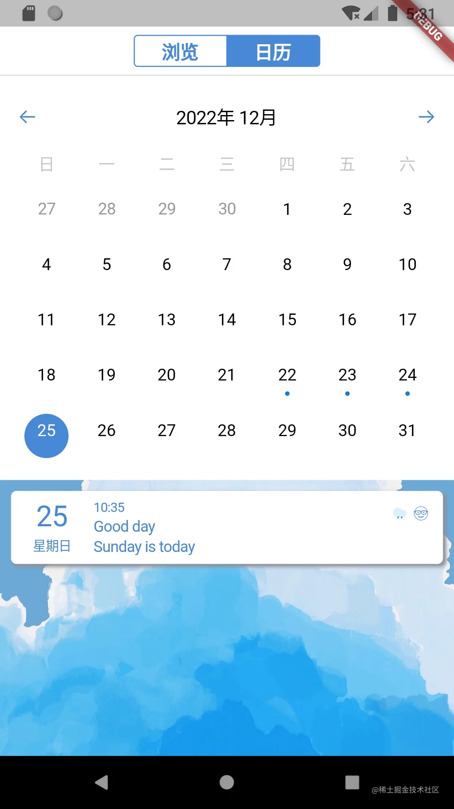
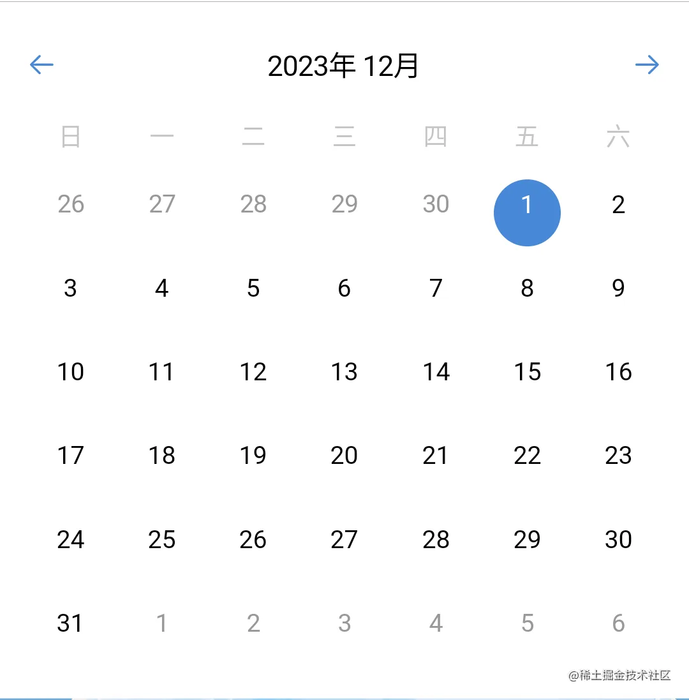

# 实战项目二：自定义组件：功能更丰富的日历

原文链接：https://juejin.cn/book/7178741001677176836/section/7181704402640568379

今天，我们再次讨论自定义组件。先来看这样一张图：



没错，这张图就是本案例主页中的“日历”页。

相信到今天，分析 UI 结构的技能大家已经掌握得很好了。从宏观上看，整个界面呈垂直布局，自上而下分别是日历组件和日记列表组件。在操作上，若某天存在日记，则在日历组件的相应位置亮蓝灯。比如图中的 22 日、23 日和 24 日。此外，日历和日记列表组件联动：下方的日记列表仅显示所选日期的日记。

回顾在讲数据库时，我们已经实现了根据日期查询数据的方法。所以联动数据部分实现起来较为容易，本讲不再详细讲解，读者可参考本讲末尾的附录部分一探究竟。

接下来，我们把目光聚焦到日历，逐步实现这个组件。

在 Flutter 中，“一切皆组件”，再复杂的组件也不过是基础组件的排列组合。现在，让我们先对日历组件进行功能拆解，梳理需求。

## 功能拆解

作为日历，正确显示当前日期是必须的。从图上看，当前日期包含组件顶栏的年月显示和下方的日期矩阵。如果再进一步拆解，可以发现日历中还填充了上个月和/或下个月的日期。虽然它们是灰色的，不可点击，但它们确实是摆在那里的，也需要我们去实现它。再有就是蓝灯提示。综上，我把功能点简单梳理罗列如下：

- 顶栏显示当前选区所处的年月，并提供相邻月份切换功能；

- 顶栏和日期矩阵之间显示星期；

- 日期显示矩阵需填充本月所有的日期，空白部分填充相邻月份的日期；

- 本月的日期可点击，可跳转。若当天含有日记，则下方以蓝色圆点（即“蓝灯”）方式提示；

- 相邻月份的日期显示为灰色字体，不可点击，不可跳转；

- 当前选择的日期的背景改为蓝色，圆形。

## 算法 & 实现

如同我们在建造一个犬舍和摩天大楼一样。简单的犬舍，即使构建失败，重试的成本很低，而且简单。但摩天大楼就不同了，它的失败成本远远超出一个犬舍。

到编程上也是类似的，对于复杂的需求，没有规划，贸然行动，其结果可能会面临巨大的成本消耗。

所以，在动手编码之前，特别是这种数据和 UI 都需要处理的时候，通常要先有个规划。

`💡 提示：当然，我在这里提供的算法仅是诸多解决方案中的一种，肯定还会有其它更好的算法。大家如果有什么好点子，欢迎一起探讨。`

相信大家和我的想法一样，整个组件最难实现的，莫过于日期矩阵。

我的思路是这样的：日期矩阵其实是包含三个部分的日期：上个月、本月、下个月。它们的分界线实际上是本月 1 日和最后一天。比如下图中的日历：



- 对于本月，首先确定最开始第一天的所在位置，然后让日期循环加 1，依次填充进矩阵。直到月份发生改变（即月份 +1） ；

- 对于上个月，由于周的开始是周日，因此让本月第一天循环减 1，依次填充进矩阵。直到首个周日的到来；

- 对于下个月，依然是由于周的开始是周日，因此让本月的最后一天循环加 1，依次填充进矩阵。直到首个周六的到来。

在 Dart 中，`DateTime`中的`add()`和`substract()`可以实现增加和减少天数的运算。当结果跳转到下个月或上个月时，年份和/或月份会自动增加或减少。

拿上图举例，在 2023 年 12 月 1 日减 1 天，时间将变为 2023 年 11 月 30 日；在 2023 年 12 月 31 日加 1 天，时间将变为 2024 年 1 月 1 日。

接着，由于日期矩阵是完全填充，没有空白格的，因此整个矩阵内的元素个数（即天数）恰好是 7 的倍数。

看到这，数据上的算法其实已经可以确定下来了。如果用代码实现的话，会是这样的：

```dart
List<DateTime> allDates() {
    List<DateTime> returnData = [];
    DateTime singleDate = DateTime(currentDate.year, currentDate.month, 1);
    int month = currentDate.month;
    List<DateTime> datesOfThisMonth = [];
    List<DateTime> dateData = [];
    // 上个月日期填充
    for (int i = 0; i < singleDate.weekday; i++) {
        dateData.add(singleDate.subtract(Duration(days: singleDate.weekday - i)));
        datesOfThisMonth.add(dateData[i]);
    }
    // 本月首天
    dateData.add(singleDate);
    // 本月日期填充
    while (singleDate.month == month) {
        datesOfThisMonth.add(singleDate);
        dateData.add(singleDate.add(const Duration(days: 1)));
        singleDate = singleDate.add(const Duration(days: 1));
    }
    // 下月日期填充
    for (int i = 0; i < 7 - singleDate.weekday; i++) {
        dateData.add(singleDate.add(Duration(days: i)));
        datesOfThisMonth.add(singleDate[i]);
    }
    // 汇总所有日期
    for (int i = 0; i < datesOfThisMonth.length; i++) {
        returnData.add(datesOfThisMonth[i]);
    }
    return returnData;
}
```

但是这还不够，界面上摆放的是组件（Widget），无法直接摆放 DateTime。还需要对`allDates()`方法进行改进，把返回值的类型：`List<DateTime>`改成`List<Widget>`。

具体代码如下：

```dart
// 计算并生成单个日期组件
List<Widget> allDates() {
    int currentDay = currentDate.day;
    List<Widget> returnData = [];
    DateTime singleDate = DateTime(currentDate.year, currentDate.month, 1);
    int month = currentDate.month;
    List<Widget> datesOfThisMonth = [];
    List<DateTime> dateData = [];
    // 上个月日期填充
    for (int i = 0; i < singleDate.weekday; i++) {
        dateData.add(singleDate.subtract(Duration(days: singleDate.weekday - i)));
        datesOfThisMonth.add(
            Expanded(
                child: Container(
                    alignment: Alignment.center,
                    padding: const EdgeInsets.all(5),
                    child: Column(
                        mainAxisAlignment: MainAxisAlignment.spaceEvenly,
                        mainAxisSize: MainAxisSize.max,
                        children: [
                            Text(
                                dateData[i].day.toString(),
                                style: const TextStyle(
                                    fontSize: 15, color: CupertinoColors.inactiveGray),
                                textAlign: TextAlign.center,
                            ),
                            const SizedBox(height: 10)
                        ],
                )),
            ),
        );
    }
    // 本月首天
    dateData.add(singleDate);
    // 本月日期填充
    while (singleDate.month == month) {
        DateTime uniqueDate = singleDate;
        datesOfThisMonth.add(
            Expanded(
                child: CupertinoButton(
                    padding: const EdgeInsets.all(0),
                    child: Container(
                        alignment: Alignment.center,
                        padding: const EdgeInsets.all(5),
                        child: CircleAvatar(
                            backgroundColor: currentDay == singleDate.day
                            ? Consts.themeColor
                            : CupertinoColors.white,
                            child: Column(
                                mainAxisAlignment: MainAxisAlignment.spaceEvenly,
                                mainAxisSize: MainAxisSize.max,
                                children: [
                                    Text(singleDate.day.toString(),
                                        style: TextStyle(
                                            fontSize: 15,
                                            color: currentDay == singleDate.day
                                            ? CupertinoColors.white
                                            : CupertinoColors.black),
                                        textAlign: TextAlign.center),
                                    widget.markedDate.contains(uniqueDate) &&
                                    currentDay != singleDate.day
                                    ? diaryExistDot()
                                    : const SizedBox(height: 4)
                                ],
                            ),
                    )),
                    onPressed: () {
                        setState(() {
                                currentDate = uniqueDate;
                        });
                        widget.onDateChanged(currentDate);
                    },
                ),
            ),
        );
        dateData.add(singleDate.add(const Duration(days: 1)));
        singleDate = singleDate.add(const Duration(days: 1));
    }
    // 下月日期填充
    for (int i = 0; i < 7 - singleDate.weekday; i++) {
        dateData.add(singleDate.add(Duration(days: i)));
        datesOfThisMonth.add(
            Expanded(
                child: Container(
                    alignment: Alignment.center,
                    padding: const EdgeInsets.all(5),
                    child: Column(
                        mainAxisAlignment: MainAxisAlignment.spaceEvenly,
                        mainAxisSize: MainAxisSize.max,
                        children: [
                            Text(dateData[dateData.length - 1].day.toString(),
                                style: const TextStyle(
                                    fontSize: 15, color: CupertinoColors.inactiveGray),
                                textAlign: TextAlign.center),
                            const SizedBox(height: 10)
                    ]),
                ),
            ),
        );
    }
    // 汇总所有日期
    for (int i = 0; i < datesOfThisMonth.length; i++) {
        returnData.add(datesOfThisMonth[i]);
    }
    return returnData;
}
```

大家注意阅读这段代码，当月日期我用了`CupertinoButton`。这样做的目的显然是增加点击响应，也就是为用户切换日期提供可能。

这里返回的`List<Widget>`指的是日期矩阵内单个元素，而非整个日期矩阵。

大家还记得前面我曾提到的数字 7 吗？日期矩阵中一行恰好是 7 个元素，元素总数又是 7 的倍数。于是，便可首先根据总元素数计算出总行数，再以 `7 * 行数` 为循环结束条件遍历整个矩阵元素，最后将每行内的元素作为 Row 组件的子组件，再将所有行的 Row 组件作为 Column 组件的子组件，构建整个日期矩阵。代码片段如下：

```dart
// 生成日期组件矩阵
List<Widget> allDatesWidget(List<Widget> allDates) {
    List<Widget> allLinesWidgets = [];
    int linesCount = allDates.length ~/ 7;
    for (int i = 0; i < linesCount; i++) {
        List<Widget> singleLineWidgets = [];
        for (int j = 0; j < 7; j++) {
            singleLineWidgets.add(allDates[i * 7 + j]);
        }
        allLinesWidgets.add(Row(
                mainAxisSize: MainAxisSize.max,
                mainAxisAlignment: MainAxisAlignment.spaceBetween,
                children: singleLineWidgets));
    }
    return allLinesWidgets;
}
@override
Widget build(BuildContext context) {
    return Container(
        color: CupertinoColors.white,
        padding: const EdgeInsets.all(15),
        child: Column(
            children: [
                // 日期矩阵
                Container(
                    margin: const EdgeInsets.only(top: 10),
                    child: Column(
                        children: allDatesWidget(allDates()),
                    ),
                )
            ],
        ),
    );
}
```

到此，我们应该可以得到正确的日期矩阵了。

后面的工作无需多说，自然是添加年月显示、相邻月份跳转以及数据库查询和UI 显示了。这些功能实现起来都比较简单，大家可以先自行尝试实现。本讲末尾附录为大家提供了完整的 explore_calendar.dart 和 calendar_widget.dart 源码。如果你在实现过程中遇到了困难，可以参考使用。

## 小结

🎉 恭喜，您完成了本次课程的学习！

📌 以下是本次课程的重点内容总结：

本讲我以日历为例，介绍了如何在 Flutter 中实现稍复杂的自定义组件。通过本讲的学习，相信大家对“一切皆组件”这句话有更深刻的理解：再复杂的组件也不过是基础组件的排列组合。

对于较为复杂的自定义组件而言，实现它的步骤是先进行功能拆解，把看似复杂的功能梳理成清晰的需求，拆解成若干易于实现的“小功能”。然后逐个“击破”它们。

此外，对 Dart 编程语言的理解也很重要。我相信有的人面对日期计算，会下意识地自行实现。而自行实现会面对很多挑战，比如闰年的处理、年/月份的自动加/减 1 等等。如果之前对 DateTime 有印象，就不至于创造这些困难，而是轻松解决了。

好了，本讲到此就该和大家说再见了。

在下一讲中，我将介绍事件总线的使用方法，它和观察者模式很像，但又不完全一样。它们都是发布订阅模型，为编码提供了很多方便。让我们拭目以待，下一讲见！

## 附录一：explore_calendar.dart 完整源码

```dart
import 'package:flutter/cupertino.dart';
import '../../../util/db_util.dart';
import '../widget/diary_list_widget.dart';
import 'widget/calender_widget.dart';
class ExploreCalenderPage extends StatefulWidget {
    const ExploreCalenderPage({Key? key}) : super(key: key);
    @override
    State<ExploreCalenderPage> createState() => _ExploreCalenderPageState();
}
class _ExploreCalenderPageState extends State<ExploreCalenderPage> {
    List<Map<String, Object?>> allDiaryRow = [];
    List<Diary> allDiary = [];
    List<Map<String, Object?>> allDiaryMonthlyRow = [];
    List<Diary> allDiaryMonthly = [];
    var saveDiaryDoneListener;
    DateTime selectedDate = DateTime.now();
    Set<DateTime> markedDates = {};
    // 日期选择器组件
    Widget calenderSelector() {
        return CalenderWidget(
            markedDate: markedDates,
            onDateChanged: (currentDate) {
                selectedDate = currentDate;
                loadAllDiary();
            },
        );
    }
    // 载入所有日记
    void loadAllDiary() async {
        await DatabaseUtil.instance.openDb();
        // 读取当天的日记
        allDiaryRow = await DatabaseUtil.instance.queryByDate(selectedDate);
        allDiary.clear();
        if (allDiaryRow.isNotEmpty) {
            for (int i = 0; i < allDiaryRow.length; i++) {
                allDiary.add(Diary().fromMap(allDiaryRow[i]));
            }
        }
        // 读取当月的日记
        allDiaryMonthlyRow = await DatabaseUtil.instance.queryByMonth(selectedDate);
        if (allDiaryMonthlyRow.isNotEmpty) {
            for (int i = 0; i < allDiaryMonthlyRow.length; i++) {
                Diary singleDiary = Diary().fromMap(allDiaryMonthlyRow[i]);
                markedDates.add(DateTime(singleDiary.date.year, singleDiary.date.month,
                        singleDiary.date.day));
            }
        }
        setState(() {});
    }
    @override
    void initState() {
        super.initState();
        loadAllDiary();
    }
    @override
    Widget build(BuildContext context) {
        return SafeArea(
            child: Container(
                decoration: const BoxDecoration(
                    image: DecorationImage(
                        fit: BoxFit.cover,
                        image: AssetImage('assets/image/bg.jpg'),
                    ),
                ),
                child: Column(
                    children: [
                        calenderSelector(),
                        Container(height: 5),
                        Expanded(
                            child: SingleChildScrollView(
                                child: DiaryListWidget.diaryList(allDiary),
                            ),
                        ),
                    ],
                ),
            ),
        );
    }
}
```

## 附录二：calendar_widget.dart 完整源码

```dart
import 'package:flutter/cupertino.dart';
import 'package:flutter/material.dart';
import '../../../../constants.dart';
import '../../../../util/datetime_util.dart';
class CalenderWidget extends StatefulWidget {
    const CalenderWidget(
        {Key? key, required this.markedDate, required this.onDateChanged})
    : super(key: key);
    final Set<DateTime> markedDate;
    final Function onDateChanged;
    @override
    State<StatefulWidget> createState() => _CalenderWidgetState();
}
class _CalenderWidgetState extends State<CalenderWidget> {
    DateTime currentDate = DateTime.now();
    // 跳到上一个月
    void jumpToPreviousMonth() {
        setState(() {
                currentDate = currentDate.subtract(const Duration(days: 31));
        });
        widget.onDateChanged(currentDate);
    }
    // 跳到下一个月
    void jumpToNextMonth() {
        setState(() {
                currentDate = currentDate.add(const Duration(days: 31));
        });
        widget.onDateChanged(currentDate);
    }
    // 年月顶栏
    Widget topBar() {
        return Row(
            mainAxisSize: MainAxisSize.max,
            mainAxisAlignment: MainAxisAlignment.spaceBetween,
            children: [
                SizedBox(
                    width: 20,
                    child: CupertinoButton(
                        padding: const EdgeInsets.all(0),
                        child: const Icon(CupertinoIcons.arrow_left, size: 18),
                        onPressed: () {
                            jumpToPreviousMonth();
                        },
                    ),
                ),
                Text(DateTimeUtil.parseMonth(currentDate)),
                SizedBox(
                    width: 20,
                    child: CupertinoButton(
                        padding: const EdgeInsets.all(0),
                        child: const Icon(CupertinoIcons.arrow_right, size: 18),
                        onPressed: () {
                            jumpToNextMonth();
                        },
                    ),
                ),
            ],
        );
    }
    // 存在日志指示灯
    Widget diaryExistDot() {
        return const SizedBox(
            width: 4,
            height: 4,
            child: CircleAvatar(),
        );
    }
    // 计算并生成单个日期组件
    List<Map> allDates() {
        int currentDay = currentDate.day;
        List<Map> returnData = [];
        DateTime singleDate = DateTime(currentDate.year, currentDate.month, 1);
        int month = currentDate.month;
        List<Widget> datesOfThisMonth = [];
        List<DateTime> dateData = [];
        // 上个月日期填充
        for (int i = 0; i < singleDate.weekday; i++) {
            dateData.add(singleDate.subtract(Duration(days: singleDate.weekday - i)));
            datesOfThisMonth.add(
                Expanded(
                    child: Container(
                        alignment: Alignment.center,
                        padding: const EdgeInsets.all(5),
                        child: Column(
                            mainAxisAlignment: MainAxisAlignment.spaceEvenly,
                            mainAxisSize: MainAxisSize.max,
                            children: [
                                Text(
                                    dateData[i].day.toString(),
                                    style: const TextStyle(
                                        fontSize: 15, color: CupertinoColors.inactiveGray),
                                    textAlign: TextAlign.center,
                                ),
                                const SizedBox(height: 10)
                            ],
                    )),
                ),
            );
        }
        // 本月首天
        dateData.add(singleDate);
        // 本月日期填充
        while (singleDate.month == month) {
            DateTime uniqueDate = singleDate;
            datesOfThisMonth.add(
                Expanded(
                    child: CupertinoButton(
                        padding: const EdgeInsets.all(0),
                        child: Container(
                            alignment: Alignment.center,
                            padding: const EdgeInsets.all(5),
                            child: CircleAvatar(
                                backgroundColor: currentDay == singleDate.day
                                ? Consts.themeColor
                                : CupertinoColors.white,
                                child: Column(
                                    mainAxisAlignment: MainAxisAlignment.spaceEvenly,
                                    mainAxisSize: MainAxisSize.max,
                                    children: [
                                        Text(singleDate.day.toString(),
                                            style: TextStyle(
                                                fontSize: 15,
                                                color: currentDay == singleDate.day
                                                ? CupertinoColors.white
                                                : CupertinoColors.black),
                                            textAlign: TextAlign.center),
                                        widget.markedDate.contains(uniqueDate) &&
                                        currentDay != singleDate.day
                                        ? diaryExistDot()
                                        : const SizedBox(height: 4)
                                    ],
                                ),
                        )),
                        onPressed: () {
                            setState(() {
                                    currentDate = uniqueDate;
                            });
                            widget.onDateChanged(currentDate);
                        },
                    ),
                ),
            );
            dateData.add(singleDate.add(const Duration(days: 1)));
            singleDate = singleDate.add(const Duration(days: 1));
        }
        // 下月日期填充
        for (int i = 0; i < 7 - singleDate.weekday; i++) {
            dateData.add(singleDate.add(Duration(days: i)));
            datesOfThisMonth.add(
                Expanded(
                    child: Container(
                        alignment: Alignment.center,
                        padding: const EdgeInsets.all(5),
                        child: Column(
                            mainAxisAlignment: MainAxisAlignment.spaceEvenly,
                            mainAxisSize: MainAxisSize.max,
                            children: [
                                Text(dateData[dateData.length - 1].day.toString(),
                                    style: const TextStyle(
                                        fontSize: 15, color: CupertinoColors.inactiveGray),
                                    textAlign: TextAlign.center),
                                const SizedBox(height: 10)
                        ]),
                    ),
                ),
            );
        }
        // 汇总所有日期
        for (int i = 0; i < datesOfThisMonth.length; i++) {
            returnData.add({'date': dateData[i], 'widget': datesOfThisMonth[i]});
        }
        return returnData;
    }
    // 生成日期组件矩阵
    List<Widget> allDatesWidget(List<Map> allDates) {
        List<Widget> allLinesWidgets = [];
        int linesCount = allDates.length ~/ 7;
        for (int i = 0; i < linesCount; i++) {
            List<Widget> singleLineWidgets = [];
            for (int j = 0; j < 7; j++) {
                singleLineWidgets.add(allDates[i * 7 + j]['widget'] as Widget);
            }
            allLinesWidgets.add(Row(
                    mainAxisSize: MainAxisSize.max,
                    mainAxisAlignment: MainAxisAlignment.spaceBetween,
                    children: singleLineWidgets));
        }
        return allLinesWidgets;
    }
    @override
    Widget build(BuildContext context) {
        return Container(
            color: CupertinoColors.white,
            padding: const EdgeInsets.all(15),
            child: Column(
                children: [
                    // 年月顶栏
                    topBar(),
                    // 分割线
                    Container(
                        height: 10,
                    ),
                    // 星期显示标头
                    Row(
                        mainAxisSize: MainAxisSize.max,
                        mainAxisAlignment: MainAxisAlignment.spaceBetween,
                        children: const [
                            Expanded(
                                child: Text('日',
                                    style: TextStyle(
                                        color: CupertinoColors.placeholderText, fontSize: 15),
                                    textAlign: TextAlign.center),
                            ),
                            Expanded(
                                child: Text('一',
                                    style: TextStyle(
                                        color: CupertinoColors.placeholderText, fontSize: 15),
                                    textAlign: TextAlign.center),
                            ),
                            Expanded(
                                child: Text('二',
                                    style: TextStyle(
                                        color: CupertinoColors.placeholderText, fontSize: 15),
                                    textAlign: TextAlign.center),
                            ),
                            Expanded(
                                child: Text('三',
                                    style: TextStyle(
                                        color: CupertinoColors.placeholderText, fontSize: 15),
                                    textAlign: TextAlign.center),
                            ),
                            Expanded(
                                child: Text('四',
                                    style: TextStyle(
                                        color: CupertinoColors.placeholderText, fontSize: 15),
                                    textAlign: TextAlign.center),
                            ),
                            Expanded(
                                child: Text('五',
                                    style: TextStyle(
                                        color: CupertinoColors.placeholderText, fontSize: 15),
                                    textAlign: TextAlign.center),
                            ),
                            Expanded(
                                child: Text('六',
                                    style: TextStyle(
                                        color: CupertinoColors.placeholderText, fontSize: 15),
                                    textAlign: TextAlign.center),
                            ),
                        ],
                    ),
                    // 日期矩阵
                    Container(
                        margin: const EdgeInsets.only(top: 10),
                        child: Column(
                            children: allDatesWidget(allDates()),
                        ),
                    )
                ],
            ),
        );
    }
}
```
