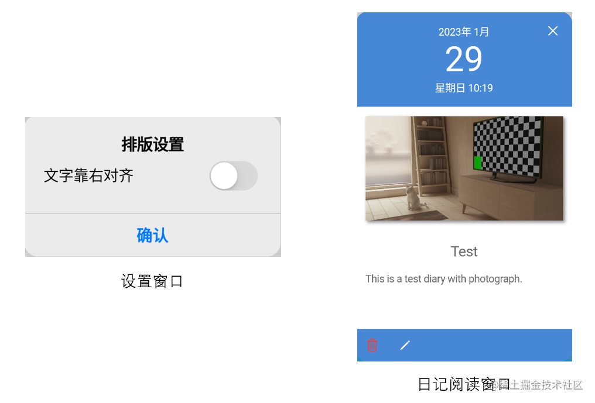
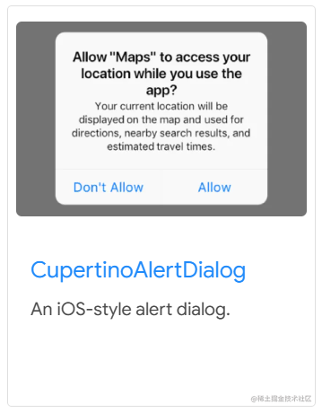

# 实战项目二：日记阅读窗口 & 设置窗口的实现

原文链接：https://juejin.cn/book/7178741001677176836/section/7181704274877874233

回顾整个“日记”项目，大部分功能都已经实现了。到今天为止，还差两个小功能需要完善。一个是在写新日记页面的设置窗口，二是阅读日记内容窗口。显然，它们二者都用到了相同的技能：弹窗，而且还是带有自定义布局样式的弹窗。它们的样子如下图所示：



本讲我将带大家依次实现上图中的两个弹窗，作为“日记”项目开发的最后收尾。

## 开胃菜：排版设置窗口

从宏观上讲，我把排版设置窗口的实现依然分为 UI 交互和数据两部分。数据层面比较容易处理，大家还记得在上一讲中提到的事件总线吧？其中有一个事件就是改变文字对齐方式的。此处，仅需在 Switch 开关控件状态发生变化时，调用`fire()`方法传出事件就行了。这里我重点说 UI 交互。

如果你是苹果手机或是平板电脑的用户，这种弹窗样式会很熟悉，它遍布在系统和常见的 App 中。到了 Flutter，还记得找这类组件的原则吗？没错！只需要到官网的组件库里去翻一翻就行了。因为自带的或者常见的组件，Flutter SDK 中就已经备好了。

经过一番查找，我发现用 CupertinoAlertDialog 似乎比较合适，它的示例图片是这样的：



是不是和我们的最终目标很像呢？

接下来怎么做，大家都很熟悉了吧？把示例代码拿过来，然后修改适配，即可与现有的 write_new.dart 源码结合到一起了，代码片段如下：

```dart
class _WriteNewPageState extends State<WriteNewPage> {
...
var textRightToLeftEventListener;
...
@override
void initState() {
super.initState();
...
// 改变文字从右至左排版监听器
textRightToLeftEventListener =
eventBus.on<WriteTextRightToLeft>().listen((event) {
setState(() {
textRightToLeft = event.textRightToLeft;
});
});
...
}
...
@override
void dispose() {
super.dispose();
saveDiaryDoneListener.cancel();
textRightToLeftEventListener.cancel();
}
...
// 显示设置窗口
void showSettingDialog() {
showCupertinoModalPopup(
context: context,
builder: (BuildContext context) {
return CupertinoAlertDialog(
title: const Text('排版设置'),
content: Column(
children: [
// 文字靠右
Row(
mainAxisAlignment: MainAxisAlignment.spaceBetween,
children: [
const Text(
'文字靠右对齐',
style: TextStyle(fontSize: 16),
),
CupertinoSwitch(
value: textRightToLeft,
onChanged: (bool value) {
setState(() {
textRightToLeft = value;
});
eventBus.fire(WriteTextRightToLeft(textRightToLeft));
})
],
),
],
),
actions: <CupertinoDialogAction>[
CupertinoDialogAction(
isDefaultAction: true,
onPressed: () {
router.pop(context);
},
child: const Text('确认'))
],
);
});
}
...
}

```

这样做，虽然能实现弹窗及相关的功能，但是还不够。试想一下，如果某个弹窗需要大量代码实现。上面这种写法无疑会将弹窗的具体实现和其它页面混合在一起。或者某个弹窗是公共的，多个页面都有机会弹出它，那么这种写法更会平添重复工作。所以，更好的解决方案是：封装弹窗实现。

于是，我在项目的 lib\ui\write_new\widget 中创建 setting_dialog_widget.dart 源码文件，它将承载弹窗的完整实现。代码如下：

```dart
import 'package:flutter/cupertino.dart';
import '../../../main.dart';
import '../../../util/eventbus_util.dart';
class SettingDialog extends StatefulWidget {
const SettingDialog({Key? key}) : super(key: key);
@override
State<StatefulWidget> createState() => _SettingDialogState();
}
class _SettingDialogState extends State<SettingDialog> {
// 文字从右至左
bool textRightToLeft = false;
@override
void initState() {
super.initState();
}
@override
Widget build(BuildContext context) {
return CupertinoAlertDialog(
title: const Text('排版设置'),
content: Column(
children: [
// 文字靠右
Row(
mainAxisAlignment: MainAxisAlignment.spaceBetween,
children: [
const Text(
'文字靠右对齐',
style: TextStyle(fontSize: 16),
),
CupertinoSwitch(
value: textRightToLeft,
onChanged: (bool value) {
setState(() {
textRightToLeft = value;
});
eventBus.fire(WriteTextRightToLeft(textRightToLeft));
})
],
),
],
),
actions: <CupertinoDialogAction>[
CupertinoDialogAction(
isDefaultAction: true,
onPressed: () {
router.pop(context);
},
child: const Text('确认'))
],
);
}
}

```

接着，回到 write_new.dart，修改`showSettingDialog()`方法如下：

```dart
// 显示设置窗口
void showSettingDialog() {
showCupertinoModalPopup(
context: context,
builder: (BuildContext context) {
return const SettingDialog();
});
}

```

怎么样？这样一来，代码是不是清爽很多？

现在，思考一个问题：在上述流程中，事件的发布者和订阅者是谁？如果没有事件总线，代码该怎么写才行呢？

显然，谁调用了`fire()`，谁就是发布者，所以弹窗是发布者；谁调用了`on()`，谁就是订阅者，所以写新日记页面就是订阅者。

如果没有事件总线，或许就要构建回调方法了，或者直接把弹窗的实现也放在 write_new.dart 中。但无论怎样，代码的耦合度会上升，复杂度随之增加。所以，大家是不是更能体会事件总线的意义了呢？

经过了设置弹窗的“磨练”，到阅读日记弹窗，就相当有经验了。它们二者不同之处就在于布局样式的不同。

### 自定样式：阅读日记弹窗

得益于在 Flutter 中，“一切皆组件”，想要什么样式，用不同的组件排列组合就能实现了。

大家回想一下，在前面的设置弹窗，是什么决定了弹窗内部的布局样式呢？对！是 CupertinoAlertDialog，它定义了弹窗中标题、内容、按钮等等的布局和样式。

所以，如果想要实现自定义布局，直接来个“釜底抽薪”。用自定义的布局替换 CupertinoAlertDialog，不就行了吗？

说干就干，还是先封装弹窗。由于弹窗在阅读日记时就会显示，因此我把它放在了 lib\ui\index\widget，命名为 read_diary_dialog.dart，与 item_single_diary_widget.dart 并列。后者是单个日记项目的布局定义，是弹出阅读窗口的唯一路径。

read_diary_dialog.dart 的实现较为简单，你可以自行开发编写，然后对照如下代码：

```dart
import 'dart:io';
import 'package:flutter/cupertino.dart';
import '../../../constants.dart';
import '../../../main.dart' hide Diary;
import '../../../router/routes.dart';
import '../../../util/datetime_util.dart';
import '../../../util/db_util.dart';
import '../../../util/eventbus_util.dart';
class ReadDiaryDialog extends StatefulWidget {
const ReadDiaryDialog({Key? key, required this.diary}) : super(key: key);
final Diary diary;
@override
State<StatefulWidget> createState() => _ReadDiaryDialogState();
}
class _ReadDiaryDialogState extends State<ReadDiaryDialog> {
// 顶部日期显示区域
Widget dateTime() {
return SizedBox(
width: double.infinity,
child: Stack(
children: [
Container(
width: double.infinity,
padding: const EdgeInsets.only(top: 20, bottom: 20),
child: Column(
children: [
Text(
DateTimeUtil.parseMonth(widget.diary.date),
style: const TextStyle(
fontSize: 18, color: CupertinoColors.white),
),
Text(
widget.diary.date.day.toString(),
style: const TextStyle(
fontSize: 60, color: CupertinoColors.white),
),
Text(
'${DateTimeUtil.parseWeekDay(widget.diary.date)} ${DateTimeUtil.parseTime(widget.diary.date)}',
style: const TextStyle(
fontSize: 18, color: CupertinoColors.white),
)
],
)),
Positioned(
top: 5,
right: 5,
child: CupertinoButton(
child: const Icon(
CupertinoIcons.clear,
color: CupertinoColors.white,
),
onPressed: () {
router.pop(context);
},
),
)
],
),
);
}
// 日记内容区
Widget diaryContent() {
return Container(
width: double.infinity,
color: CupertinoColors.white,
child: SingleChildScrollView(
child: Column(
children: [
// 图片
widget.diary.image == ''
? Container()
: Container(
margin: const EdgeInsets.all(16),
decoration: BoxDecoration(
image: DecorationImage(
fit: BoxFit.cover,
image: FileImage(File(widget.diary.image)),
),
boxShadow: const [
BoxShadow(
color: CupertinoColors.systemGrey,
offset: Offset(3.0, 3.0),
blurRadius: 4,
spreadRadius: 0.5)
],
),
height: 180,
),
// 标题
Container(
width: double.infinity,
padding: const EdgeInsets.only(left: 16, right: 16, top: 10),
child: Text(
widget.diary.title,
textAlign: TextAlign.center,
style: const TextStyle(
fontSize: 25, height: 1.8, color: Color(0x99000000)),
),
),
// 内容
Container(
width: double.infinity,
padding: const EdgeInsets.only(left: 16, right: 16, top: 10),
child: Text(
widget.diary.content,
textAlign: !widget.diary.textRightToLeft
? TextAlign.start
: TextAlign.end,
style: const TextStyle(
fontSize: 18, height: 1.8, color: Color(0x99000000)),
),
)
],
),
),
);
}
// 底部操作栏
Widget bottomBar() {
return Row(
mainAxisSize: MainAxisSize.max,
children: [
CupertinoButton(
child: const Icon(
CupertinoIcons.delete_simple,
color: CupertinoColors.systemRed,
),
onPressed: () {
showCupertinoDialog(
context: context,
builder: (BuildContext context) {
return CupertinoAlertDialog(
title: Text('要删除"${widget.diary.title}"吗？'),
content: const Text('删除的日记无法恢复'),
actions: <CupertinoDialogAction>[
CupertinoDialogAction(
isDestructiveAction: true,
onPressed: () async {
router.pop(context);
router.pop(context);
await DatabaseUtil.instance.openDb();
await DatabaseUtil.instance.delete(widget.diary);
eventBus.fire(DiaryListChanged());
},
child: const Text('确认')),
CupertinoDialogAction(
isDefaultAction: true,
onPressed: () {
router.pop(context);
},
child: const Text('取消'))
],
);
;
});
},
),
CupertinoButton(
child: const Icon(
CupertinoIcons.pencil,
color: CupertinoColors.white,
),
onPressed: () {
showCupertinoDialog(
context: context,
builder: (BuildContext context) {
return CupertinoAlertDialog(
title: Text('再次编辑"${widget.diary.title}"吗？'),
content: const Text('即使是不好的回忆，也值得纪念'),
actions: <CupertinoDialogAction>[
CupertinoDialogAction(
isDestructiveAction: true,
onPressed: () async {
router.pop(context);
router.pop(context);
// 跳转到编辑
router.navigateTo(context,
"${Routes.writeDiaryPage}/${widget.diary.id}");
},
child: const Text('确认')),
CupertinoDialogAction(
isDefaultAction: true,
onPressed: () {
router.pop(context);
},
child: const Text('取消'))
],
);
});
},
),
],
);
}
@override
Widget build(BuildContext context) {
return Container(
width: double.infinity,
margin: const EdgeInsets.only(top: 40, bottom: 40, left: 20, right: 20),
decoration: const BoxDecoration(
color: Consts.themeColor,
borderRadius: BorderRadius.all(Radius.circular(20)),
),
child: Column(
children: [
dateTime(),
Expanded(
child: diaryContent(),
),
bottomBar()
],
),
);
}
}

```

接着，回到 item_single_diary_widget.dart，修改`initState()`方法中的内容如下：

```dart
@override
void initState() {
super.initState();
// 定义整体缩放动画
controller = AnimationController(
vsync: this, duration: const Duration(milliseconds: 100));
controller.addStatusListener((status) {
if (status == AnimationStatus.completed) {
showCupertinoModalPopup(
context: context,
builder: (BuildContext context) {
return ReadDiaryDialog(diary: widget.diary);
});
controller.reverse();
}
});
}

```

大家看到那个熟悉的`showCupertinoModalPopup()`方法了吗？这一次的builder不再是返回 CupertinoAlertDialog 实例，而是完全自定义的组件。而这便是“一切皆组件”带来的便利。

## 小结

🎉 恭喜，您完成了本次课程的学习！

📌 以下是本次课程的重点内容总结：

本讲我带大家实现了两个弹窗，一是写新日记页面的设置窗口，另一个是阅读日记内容的窗口。到此，收尾了“日记”项目。

在整个实现的过程中，我们一起巩固了查找合适组件的方法、事件总线的应用以及一切皆组件的意义。

本讲的内容难度不大，相信大家通过本讲的学习，对于上述三个知识点，印象会更加深刻。

从下一讲开始，我们将进入游戏的世界。通过对经典游戏：Flappy Bird 的复刻，使其能够编写一次代码，运行在全平台上。

当然，我更希望这个游戏项目起到抛砖引玉的作用，激发大家的创意，打造更多有趣、好玩的游戏。

让我们开始吧！
