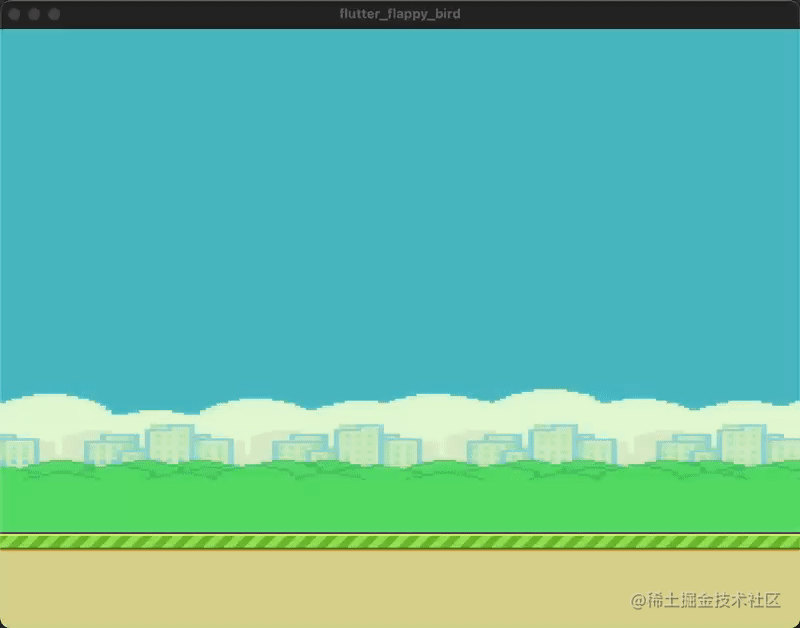
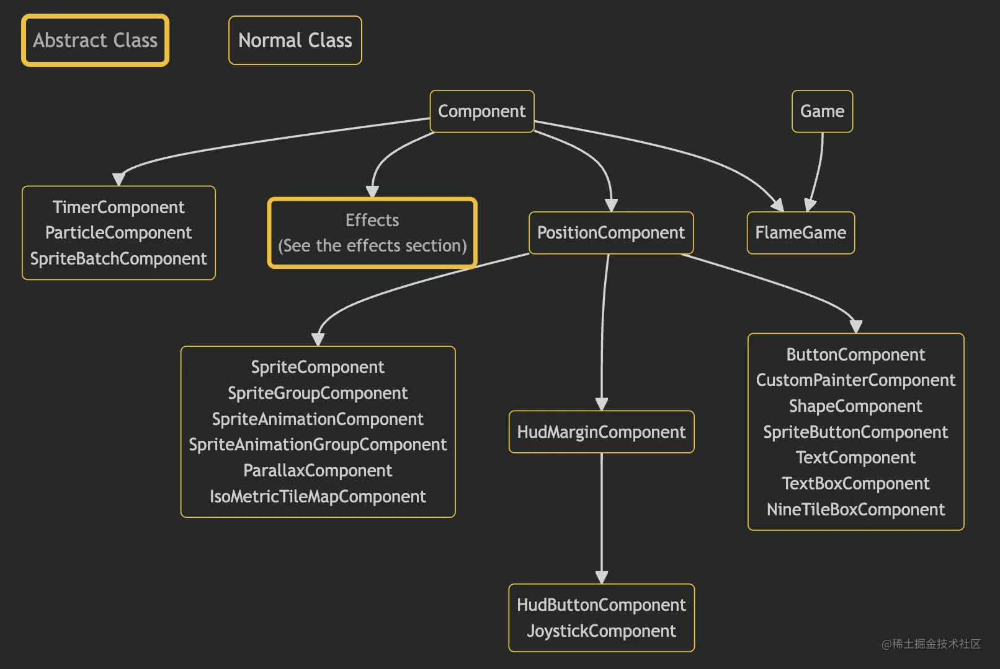
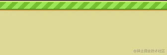
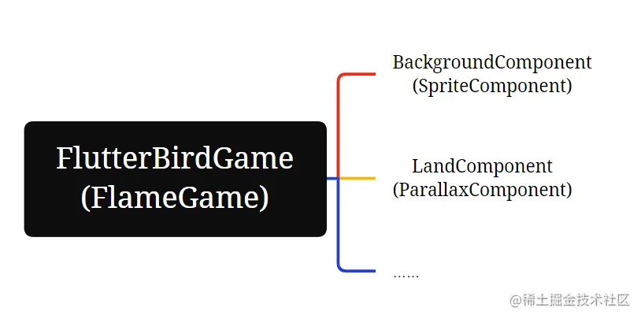

# 实战项目三：静止 & 移动的背景、触摸事件监听

原文链接：https://juejin.cn/book/7178741001677176836/section/7181704654001012795

到前一讲的末尾，已经搭建好项目代码的骨架。从本讲开始，就是填肉的工作了。先来完成远景和陆地。

其中，远景是始终不动的，陆地则分为两个状态：移动和静止。它根据游戏的状态发生变化。在游戏开始前和游戏中时，陆地是移动的，一旦小鸟撞上管道或者掉在地上，陆地则停止移动。这个规律可以通过下方的 GIF 演示动画很轻松地发现：


具体到本讲，我们将实现如下 GIF 图演示的效果：



`💡 提示：你注意到了吗？这个游戏是在 macOS 中运行的。别忘了，重制的 Flappy Bird 也是一个跨平台的游戏。`

正如本讲开头说的那样，我们将一起完成远景和陆地的实现。由于游戏主角：小鸟暂时没有做出来，因此我暂时用屏幕触摸来控制陆地的移动和停止。

在开发应用程序的时候，我反复提到一句话：“Flutter 中一切皆组件”。如今依然如此，flame 游戏引擎提供了名为 GameWidget 的组件和不同类型的 Component。实际上，游戏世界中的各种元素，使用的就是不同类型的 Component。但是，这里的“Component”并不是指 Flutter 中的“组件”。所以要请 GameWidget 出来帮忙。那么，GameWidget 到底是何许人也？它和 Component 之间又有何联系呢？

## GameWidget & FlameGame & Component

我是如何知道 GameWidget 才是 Flutter 中的“组件”呢？因为我在官网的文档中找到了答案。

在[Game Widget — Flame](https://docs.flame-engine.org/1.6.0/flame/game_widget.html)页面中，一开头是这样描述的：

>

The `GameWidget` is a Flutter `Widget` that is used to insert a `Game` inside the Flutter widget tree.

意思就是 GameWidget 是一个 Flutter 的组件，用来在 Flutter 组件树中插入一个 Game 实例。

从这句话里，我得到了两个答案，另外还有一个疑问。

答案之一就是GameWidget 才是 Flutter 中的“组件”；答案之二就是这个 GameWidget 可以看作任何一个普通的组件，和其它组件一起组合使用。

一个疑问就是：Game 实例又是什么？

于是我顺藤摸瓜，在[FlameGame — Flame](https://docs.flame-engine.org/1.6.0/flame/game.html)页面中找到了答案：

>

`FlameGame` is the most commonly used `Game` class in Flame.
The `FlameGame` class implements a `Component` based `Game`. It has a tree of components and calls the `update` and `render` methods of all components that have been added to the game.

看到了吗？Game 其实本质上是一个抽象类，FlameGame 继承自 Component，Component 又实现了 Game，是最常使用的 Game 类型实例。

另一方面，在 Component 类中调用了`update()`和`render()`方法。所有继承自 Component 的子类，也就是游戏中被添加的那些元素都会通过这两个方法进行更新和渲染。

如果你到 flame 官网探索，或许会看到下面这张图：



这张图摘自 flame 官网，它较为详细地列出了 FlameGame、Game、Component 与各种不同类型的 Component 之间的关系。

`💡 提示：还记得在前一讲中提到的游戏循环吗？update 就是画面更新，render 就是画面渲染。还差一个输入响应？别急，稍后我会介绍触摸响应。`

好了，相信大家看到图中有那么多种 Component，肯定会有些迷茫。背景图和陆地，到底该选哪个 Component 啊……

为了节省时间，我在这里直接给出答案：背景图选择 SpriteComponent，也就是精灵组件；陆地选择 ParallaxComponent，也就是视差组件。

## 构建 BackgroundComponent

精灵组件（SpriteComponent）可以说是最常用的组件类型了。开发者可以从资源文件（一般是图片）中直接构建精灵（Sprite），这里的“精灵”就是游戏中的元素。

而作为游戏背景，无需移动，也无需缩放，可以说是最简单的精灵元素了。一般来说，要使用某个类型的 Component，都要继承它，并按照父类制定的规则完成代码。

所以，BackgroundComponent 的代码我是这样写的：

```dart
class BackgroundComponent extends SpriteComponent {
BackgroundComponent() : super();
@override
Future<void>? onLoad() async {
sprite = await Sprite.load('bg_day.png');
}
@override
void onGameResize(Vector2 size) {
super.onGameResize(size);
this.size = size;
position = Vector2.zero();
}
}

```

`onLoad()`和`onGameResize()`都是 Component 类中的方法。初始化 Component 的工作在`onLoad()`中执行；`onGameResize()`则是在屏幕尺寸发生改变时得到执行。

`💡 提示：为什么要处理屏幕尺寸变化呢？当移动设备切换横竖屏，或者 Web、PC 端调整窗口大小时，都会引发屏幕尺寸发生改变。如果不处理，游戏内容则不会正常显示。`

还要注意`onGameResize()`方法中的 this.size，它位于PositionComponent 类中，表示元素大小。背景图是填满整个屏幕的，因此无论屏幕尺寸如何变化，背景图的大小始终等于屏幕尺寸大小。

背景图到此就构建完成了，接下来是陆地。

## 构建 LandComponent

和背景不同，陆地时而移动，时而停止。它的素材图是这样的：



回看前文提到的效果图，二者对比不难发现。游戏中的陆地就是由多张素材图，水平相连，拼合在一起，朝左侧移动的！

像这种元素，使用 ParallaxComponent（视差组件）再合适不过了。我是这样实现的：

```dart
import 'package:flame/components.dart';
import 'package:flame/src/parallax.dart';
import '../scean/flappy_bird.dart';
final imageData = [
ParallaxImageData('land.png'),
];
class LandComponent extends ParallaxComponent<FlappyBirdGame> {
LandComponent(this.screenSize) : super(size: Vector2(screenSize.x, 96));
Vector2 screenSize;
bool _allowMove = false;
@override
Future<void>? onLoad() async {
parallax = await gameRef.loadParallax(
imageData,
baseVelocity: Vector2(60, 0),
);
return super.onLoad();
}
@override
void update(double dt) {
super.update(dt);
if (_allowMove) {
parallax?.baseVelocity = Vector2(0, 0);
} else {
parallax?.baseVelocity = Vector2(60, 0);
}
}
@override
void onGameResize(Vector2 size) {
super.onGameResize(size);
screenSize = size;
this.size.x = screenSize.x;
parallax?.size = this.size;
position = Vector2(0, screenSize.y - 96);
}
bool getAllowMove() {
return _allowMove;
}
void setAllowMove(bool isAllowMove) {
_allowMove = isAllowMove;
}
}

```

一开始，我把要使用的素材文件以数组的形式定义在 imageData 常量中。接着，在`onLoad()`方法中实例化 parallax 变量，达到初始化组件的目的。在`update()`方法中，我用 _allowMove 变量作为开关，控制陆地的移动与否。并暴露`getAllowMove()`和`setAllowMove()`方法给外部调用，方便控制。最后，在`onGameResize()`方法中，screenSize 表示屏幕尺寸，在构建 LandComponent 实例时由外部传入。`screenSize.y - 96`的含义则是整个陆地占屏幕下方 96 个单位的高度。

到此，陆地也构建完成了。

## 构建 FlameGame

下面的工作就要把背景和陆地相结合，然后让游戏“跑”起来了。

还记得 FlameGame 吗？它本质上也是 Component，也有`onLoad()`方法。不如照猫画虎，在该方法中创建 BackgroundComponent 和 LandComponent 实例，然后添加到 FlameGame 中。代码如下：

```dart
import 'package:flame/components.dart';
import 'package:flame/game.dart';
import '../elements/background.dart';
import '../elements/land.dart';
class FlappyBirdGame extends FlameGame {
late Component backgroundComponent;
late Component landComponent;
@override
Future<void>? onLoad() async {
backgroundComponent = BackgroundComponent();
landComponent = LandComponent(size);
await add(backgroundComponent);
await add(landComponent);
return super.onLoad();
}
}

```

到这，不知道你发现了没有。整个游戏的 Component 结构是这样的：



## 处理响应

使用 flame 引擎处理用户点击其实是非常容易的，只需要实现 TapDetector 接口即可。但是，我决定在 FlappyBirdGame 类中处理。这样做的好处是将用户的触控在此处统一处理，然后根据游戏状态，分发给不同的 Component，最后在各 Component 中自行处理各自的逻辑。

修改后的 FlappyBirdGame 完整代码如下：

```dart
import 'package:flame/components.dart';
import 'package:flame/game.dart';
import 'package:flame/input.dart';
import '../elements/background.dart';
import '../elements/land.dart';
class FlappyBirdGame extends FlameGame with TapDetector{
late Component backgroundComponent;
late Component landComponent;
@override
Future<void>? onLoad() async {
backgroundComponent = BackgroundComponent();
landComponent = LandComponent(size);
await add(backgroundComponent);
await add(landComponent);
return super.onLoad();
}
@override
void onTapDown(TapDownInfo info) {
super.onTapDown(info);
(landComponent as LandComponent)
.setAllowMove(!(landComponent as LandComponent).getAllowMove());
}
}

```

`💡 提示：onTapDown()方法中的 TapDownInfo 对象还提供了触摸坐标信息。此外，开发者还可以复写 onTapUp() 等方法处理其它类型的触摸事件。`

好了，所有准备工作均已就绪，让游戏跑起来吧！

## 添加 GameWidget

回到 main.dart，完成 GameWidget 的添加：

```javascript
import 'package:flame/game.dart';
import 'package:flutter/material.dart';
import 'package:flutter_flappy_bird/scean/flappy_bird.dart';
void main() {
runApp(GameWidget(game: FlappyBirdGame()));
}

```

然后运行程序，反复点击屏幕。如无意外，则可以看到静止的背景，以及随点击移动或停止移动的陆地。

## 小结

🎉 恭喜，您完成了本次课程的学习！

📌 以下是本次课程的重点内容总结：

本讲实现了 Flappy Bird 游戏中的背景和陆地。

在动手前，我带大家明确了 GameWidget、FlameGame、Component 三者的关系。并与前一讲中的“游戏循环”相呼应，找到代码中更新画面和渲染画面的具体位置。

构建背景，使用的是最常见的 SpriteComponent；构建陆地，使用的则是 ParallaxComponent。前者被称为精灵组件，后者被称为视差组件。

在构建好这些元素后，我介绍了如何处理点击响应。具体说来，则是实现 TapDetector 接口。另外，我采用了在 FlameGame 层面统一处理，然后分发给不同的 Component 的做法。这种处理方式结构更加清晰，更易于维护。

下一讲，我们稍微上升一点难度：让元素动起来。这个“动”包含元素本身的动画，以及通过点击改变原有运动轨迹。没错，游戏的主角：小鸟即将登场。
