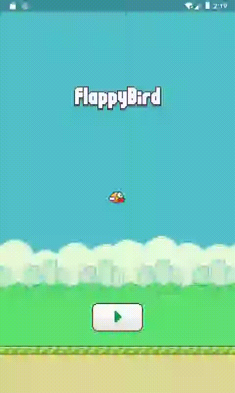

# 实战项目三：记分器文字渲染

原文链接：https://juejin.cn/book/7178741001677176836/section/7181704602931167287

到现在为止，Flappy Bird 游戏已经完成大部分的设计和编码实现了。玩家不仅可以进行游戏，还能体验背景音乐和音效带来的氛围上的渲染，但似乎还差点什么。

没错，还差记分器以及各种游戏标题、开始按钮。如果用动图展示的话，这些组件的显示样式和时机应该是这样的：



仔细分析图中的表象，根据游戏状态的不同，可以得到如下规律：

1. 当游戏处于开始前，显示 Flappy Bird 字样的标题和开始游戏按钮；

2. 游戏进行时，画面中央靠上的部分显示得分；

3. 游戏结束时，显示 Game Over 字样标题，得分依旧保持现实状态。

`💡 提示：细心的你一定会发现，得分和 Game Over 标题被管道覆盖住了。别着急，我会在下一讲介绍组件之间叠放顺序的实现，它能够完美地解决这个问题。`

这些标题、按钮和记分器，再加上之前所有的组件，构成了完整的 Flappy Bird 游戏世界。学习完本讲，这个世界就能完整地呈现在玩家眼前了。

## 实现思路

再动手编码前，我们先来设计实现这些组件的思路。

相信学到本讲，大家应该都能轻易想到：Flappy Bird、Game Over 和开始游戏按钮，使用 SpriteComponent 不就行了吗？

确实如此，实现它们并不难，唯一需要注意的就是根据游戏状态不同，动态进行添加和移除。而游戏状态从哪里得到呢？还记得 BirdComponent 吗？对于本例而言，小鸟的状态和游戏状态紧密相关，可以复用。

而记分器，除了需要添加类似的逻辑外，还需要实现记分的功能。

仔细观察动图可以发现，小鸟一旦飞过障碍物，就计 1 分。实际上，为了降低难度，我把记分的标准降低为飞行过半就记分，而不是完全飞过。但无论难度如何，都涉及一个问题：那就是小鸟和管道在横坐标上的关系。

我的判断思路是：既然小鸟在横轴上的坐标不变，那就只要等到管道移动至屏幕靠左的一半就立即记分。小鸟和管道障碍物是相对运动的，如此，便相当于小鸟飞过了管道的一半。

有了实现思路，接下来就到了具体的编码环节，让我们动起手来吧！

## 编码实现

### 构建所需的所有 SpriteComponent

首先，构建所有的 SpriteComponent 组件，包括 Flappy Bird、Game Over、开始游戏按钮以及记分器。废话不多说，先来看游戏前，Flappy Bird 标题的代码：

```dart
import 'package:flame/components.dart';
import 'package:flutter_flappy_bird/elements/bird.dart';
class TitleComponent extends SpriteComponent {
TitleComponent(this.screenSize, this.birdComponent)
: super(size: Vector2(178, 48));
Vector2 screenSize;
final BirdComponent birdComponent;
@override
Future<void>? onLoad() async {
sprite = await Sprite.load('title.png');
}
@override
void onGameResize(Vector2 size) {
super.onGameResize(size);
screenSize = size;
position = Vector2((size.x - 178) / 2, (size.y / 2 - 48) / 2);
}
@override
void update(double dt) {
super.update(dt);
if (birdComponent.getCurrentStatus() == BirdComponent.statusFlying ||
birdComponent.getCurrentStatus() == BirdComponent.statusGameOver) {
removeFromParent();
}
}
}

```

这段代码名为 title.dart。它的素材图大小为 178 * 48，所以在`onGameResize()`方法中，进行了屏幕中点的偏移计算，从而使其居中显示在屏幕上。
在`update()`方法中，通过对传入的 birdComponent，也就是小鸟组件的状态进行判断，当游戏处于进行时和游戏结束时，主动移除自己，从而在屏幕上消失。

再来看开始游戏按钮，它和 Flappy Bird 标题的出现时机一模一样，唯一不同的就是显示位置了。于是趁热打铁，实现开始游戏按钮：

```dart
import 'package:flame/components.dart';
import 'bird.dart';
class StartButtonComponent extends SpriteComponent {
StartButtonComponent(this.screenSize, this.birdComponent)
: super(size: Vector2(116, 70));
Vector2 screenSize;
final BirdComponent birdComponent;
@override
Future<void>? onLoad() async {
sprite = await Sprite.load('button_play.png');
}
@override
void onGameResize(Vector2 size) {
super.onGameResize(size);
screenSize = size;
position = Vector2((size.x - 116) / 2, (size.y - 96) - 70 - 20);
}
@override
void update(double dt) {
super.update(dt);
if (birdComponent.getCurrentStatus() == BirdComponent.statusFlying ||
birdComponent.getCurrentStatus() == BirdComponent.statusGameOver) {
removeFromParent();
}
}
}

```

怎么样，到这为止，都还算好理解吧？

这里其实有一个逻辑上值得优化的点。在`update()`方法中，其实只需要做如下判断即可：

```dart
if (birdComponent.getCurrentStatus() == BirdComponent.statusFlying) {
removeFromParent();
}

```

你能说出为什么吗？

其实，游戏结束的状态必然要先经过游戏中的状态。因此，处于游戏中时，组件已经被移除了，其实就无需再对游戏结束的状态进行判断了。

接下来是 Game Over 的标题组件，它的实现是这样的：

```dart
import 'package:flame/components.dart';
import 'bird.dart';
class GameOverComponent extends SpriteComponent {
GameOverComponent(this.screenSize, this.birdComponent)
: super(size: Vector2(204, 54));
Vector2 screenSize;
final BirdComponent birdComponent;
@override
Future<void>? onLoad() async {
sprite = await Sprite.load('game_over.png');
}
@override
void onGameResize(Vector2 size) {
super.onGameResize(size);
screenSize = size;
position = Vector2((screenSize.x - 204) / 2, 50);
}
@override
void update(double dt) {
super.update(dt);
if (birdComponent.getCurrentStatus() != BirdComponent.statusGameOver) {
removeFromParent();
}
}
}

```

是不是思路也很类似？唯一不同的就是出现的时机：只有当游戏处于结束状态时，该组件才显示，其它状态都不显示。

好了，搞定了组件的实现和消失的处理，接下来就要回到 flappy_bird.dart，在合适的位置把这些组件添加到屏幕上了。关键代码如下：

```dart
class FlappyBirdGame extends FlameGame with TapDetector {
...
@override
Future<void>? onLoad() async {
...
titleComponent = TitleComponent(size, birdComponent as BirdComponent);
startButtonComponent =
StartButtonComponent(size, birdComponent as BirdComponent);
gameOverComponent = GameOverComponent(size, birdComponent as BirdComponent);
...
await add(titleComponent);
await add(startButtonComponent);
return super.onLoad();
}
...
// 小鸟飞行状态改变回调
void _onBirdFlyStatusCallback(int status) {
if (status == BirdComponent.statusGameOver) {
if (!contains(gameOverComponent) &&
gameOverComponent.findParent() == null) {
add(gameOverComponent);
}
}
}
...
@override
void onTapDown(TapDownInfo info) {
super.onTapDown(info);
...
} else if ((birdComponent as BirdComponent).getCurrentStatus() ==
BirdComponent.statusGameOver) {
...
add(titleComponent);
add(startButtonComponent);
}
}
}

```

仔细阅读这段代码，组件的添加规律就是在合适的时机，调用`add()`方法，传入需要添加的组件。相应的组件就会动态地添加到屏幕上了，简直不要太容易。

最后，我们单独实现记分器。这里用到了自定义字体，该字体位于 assets\fonts 目录中，名为 game_font.ttf。使用它实现记分器组件的完整代码如下：

```dart
import 'package:flame/components.dart';
import 'package:flutter/material.dart';
import 'bird.dart';
class ScoreComponent extends PositionComponent {
ScoreComponent(this.screenSize, this.birdComponent)
: super(size: Vector2(120, 44));

Vector2 screenSize;
final BirdComponent birdComponent;
late TextComponent scoreText;
@override
Future<void>? onLoad() async {
scoreText = TextComponent(
textRenderer: TextPaint(
style: const TextStyle(
fontFamily: 'game_font',
fontSize: 30,
color: Colors.white,
shadows: [
Shadow(color: Colors.black, offset: Offset(1, 1), blurRadius: 1),
]),
),
);
scoreText.text = "0";
scoreText.position = Vector2(0, 0);
add(scoreText);
}
@override
void onGameResize(Vector2 size) {
super.onGameResize(size);
screenSize = size;
position = Vector2((screenSize.x - 24) / 2, 120);
}
@override
void update(double dt) {
super.update(dt);
if (birdComponent.getCurrentStatus() == BirdComponent.statusBeforeGame) {
removeFromParent();
}
}
void setScore(int score) {
scoreText.text = score.toString();
}
}

```

可以看到，`onLoad()`方法中，构建了 TextComponent 类型的 scoreText，为其定义了详细的样式。最终调用`add()`方法将其添加到屏幕上。

接着，在`update()`方法中，进行了状态判断，便于在合适的时候移除屏幕。

最后的`setScore()`方法则用于设置分数。单纯的记分器组件，是无法感知管道的运动状态的，所以也就无从得知是否需要记分。因此我对外暴露这个方法，由 flappy_bird.dart 统领全局，调用该方法实现分值设置。

那么，谁最清楚管道的运动状态呢？答案肯定是管道自身。

在已经实现了的 pipes.dart 中，定义了 PipeUpComponent 和 PipeDownComponent。它们成对出现，共同构成完整的上下管道组。因此，只需要在 PipeUpComponent 或 PipeDownComponent 中实现一次记分逻辑即可。我最终选定在 PipeUpComponent 中实现。

大家都知道，在`update()`回调方法中，可以轻松地获取当前运动位置。那么，在这里判断是否运动过半就再合适不过了。于是，关键代码的实现是这样的：

```dart
@override
void update(double dt) {
super.update(dt);
if (position.x <= -50) {
removeFromParent();
} else {
if (_containBird()) {
birdComponent.changeStatus(BirdComponent.statusGameOver);
} else {
position.sub(Vector2(1, 0));
// 判断是否已经过半（得分）
if (position.x <= screenSize.x / 2) {
if (onHalfPassedCallback != null) {
onHalfPassedCallback!();
onHalfPassedCallback = () {};
}
}
// 添加新的管道组
if (screenSize.x - position.x >= 150) {
addNewCallback();
addNewCallback = () {};
}
}
}
}

```

和添加新的管道组类似，一旦完成记分，就将方法体（`onHalfPassedCallback()`）置空，以防重复记分。这个`onHalfPassedCallback()`方法则是在构建 PipeUpComponent 时传入的参数，它最初位于 flappy_bird.dart 中。

此外，由于 flappy_bird.dart 是游戏全局的“统领者”，因此它实现对分数的增加和设置，代码如下：

```dart
class FlappyBirdGame extends FlameGame with TapDetector {
...
int score = 0;
...
// 动态添加管道
void _addNewPipeGroup() {
...
Component pipeUpComponent = PipeUpComponent(upPipeHeight.toDouble(), () {
_addNewPipeGroup();
}, birdComponent as BirdComponent, _onBirdFlyPassedCallback);
...
}
...
// 得分回调
void _onBirdFlyPassedCallback() {
score++;
(scoreComponent as ScoreComponent).setScore(score);
}
...
@override
void onTapDown(TapDownInfo info) {
super.onTapDown(info);
// 未启动游戏时，启动游戏，并触发一次向上飞的动作
if ((birdComponent as BirdComponent).getCurrentStatus() ==
BirdComponent.statusBeforeGame) {
...
score = 0;
(scoreComponent as ScoreComponent).setScore(score);
...
}
}
}

```

在程序初始化和游戏一开始时，score 的值为 0，随着游戏的进行，`_onBirdFlyPassedCallback()`不断被调用，玩家分数随之上涨。

到此，记分器完整地实现了。

## 小结

🎉 恭喜，您完成了本次课程的学习！

📌 以下是本次课程的重点内容总结：

通过本讲的学习，我们一同完善了 Flappy Bird，整个游戏世界里的每个元素都完成了添加和互动。

下一讲，我们进一步弥补当前的不足。通过对组件叠放次序的重新规划，将记分器和 Game Over 标题组件始终显示在最前，避免被管道组件遮挡。我们下一讲见！
