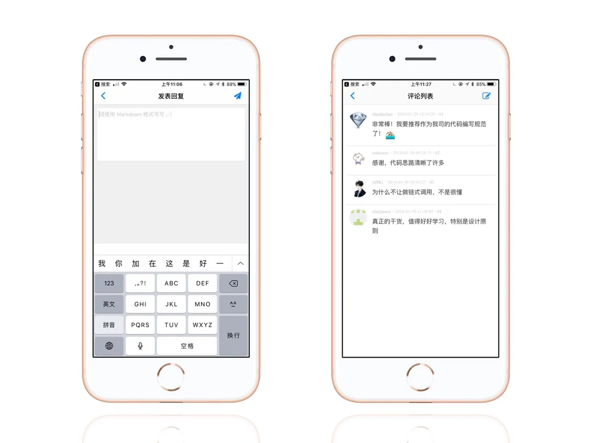
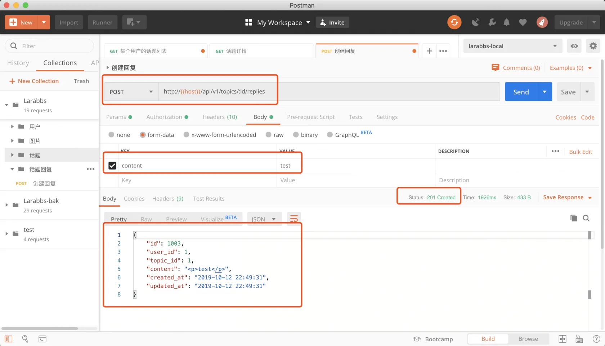
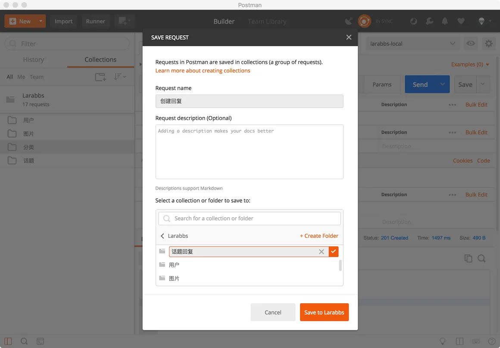

# 7.1. 添加回复

原文链接：https://learnku.com/courses/laravel-advance-training/9.x/add-a-reply/12619

## 添加回复

在这个章节中，我们将开发话题回复功能，先参考下话题回复界面：



## 1. 创建 Controller

```bash
$ php artisan make:controller Api/RepliesController
```

## 2. 增加路由

只有登录用户才可以进行回复

routes/api.php

```
.
.
.
use App\Http\Controllers\Api\RepliesController;
.
.
.
// 发布, 修改，删除话题
Route::apiResource('topics', TopicsController::class)->only([
'store', 'update', 'destroy'
]);

// 发布, 删除回复
Route::apiResource('topics.replies', RepliesController::class)->only([
'store', 'destroy'
]);
.
.
.
```

回复一定属于某个话题，所以我们设计为 `topics/{topic}/replies`，为某个话题添加回复，这样会让资源与资源的关系更加直观。

这里定义了两个接口

- POST  topics/{topic}/replies  添加回复；

- DELETE topics/{topic}/replies/{reply}  删除回复

## 3. 增加 Request

创建 ReplyRequest：

```bash
$ php artisan make:request Api/ReplyRequest
```

app/Http/Requests/Api/ReplyRequest.php

```
<?php

namespace App\Http\Requests\Api;

class ReplyRequest extends FormRequest
{
    public function rules()
    {
        return [
            'content' => 'required|min:2',
        ];
    }
}
```

## 4. 增加 ReplyResource

```bash
$ php artisan make:resource ReplyResource
```

app/Http/Resources/ReplyResource.php

```
<?php

namespace App\Http\Resources;

use Illuminate\Http\Resources\Json\JsonResource;

class ReplyResource extends JsonResource
{
    public function toArray($request)
    {
        return [
            'id' => $this->id,
            'user_id' => (int) $this->user_id,
            'topic_id' => (int) $this->topic_id,
            'content' => $this->content,
            'created_at' => (string) $this->created_at,
            'updated_at' => (string) $this->updated_at,
        ];
    }
}
```

## 5. 修改 Controller

修改文件

app/Http/Controllers/Api/RepliesController.php

```
<?php

namespace App\Http\Controllers\Api;

use App\Models\Topic;
use App\Models\Reply;
use Illuminate\Http\Request;
use App\Http\Resources\ReplyResource;
use App\Http\Requests\Api\ReplyRequest;

class RepliesController extends Controller
{
    public function store(ReplyRequest $request, Topic $topic, Reply $reply)
    {
        $reply->content = $request->content;
        $reply->topic()->associate($topic);
        $reply->user()->associate($request->user());
        $reply->save();

        return new ReplyResource($reply);
    }
}
```

## 6. PostMan 调试



调试成功，状态码为 201， 响应 body 为回复数据。保存接口，新建话题回复目录。



## 代码版本控制

```bash
$ git add -A
$ git commit -m '话题回复'
```
