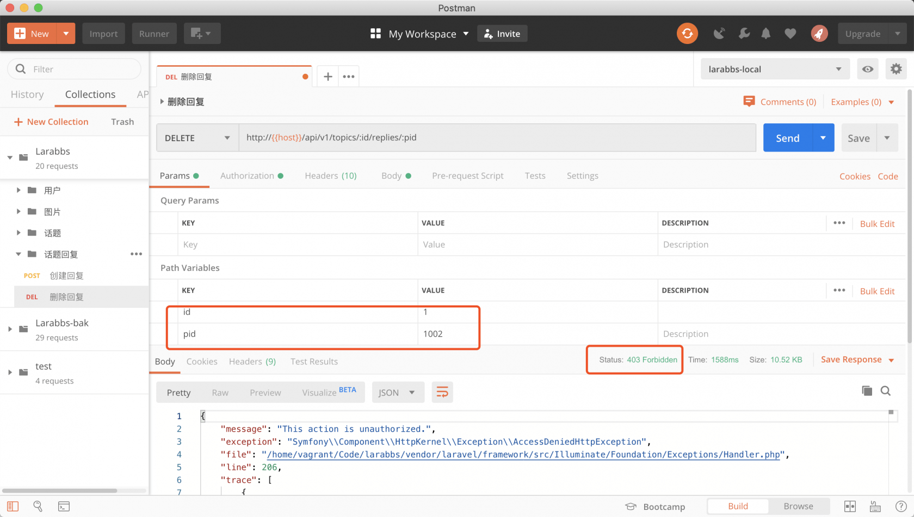
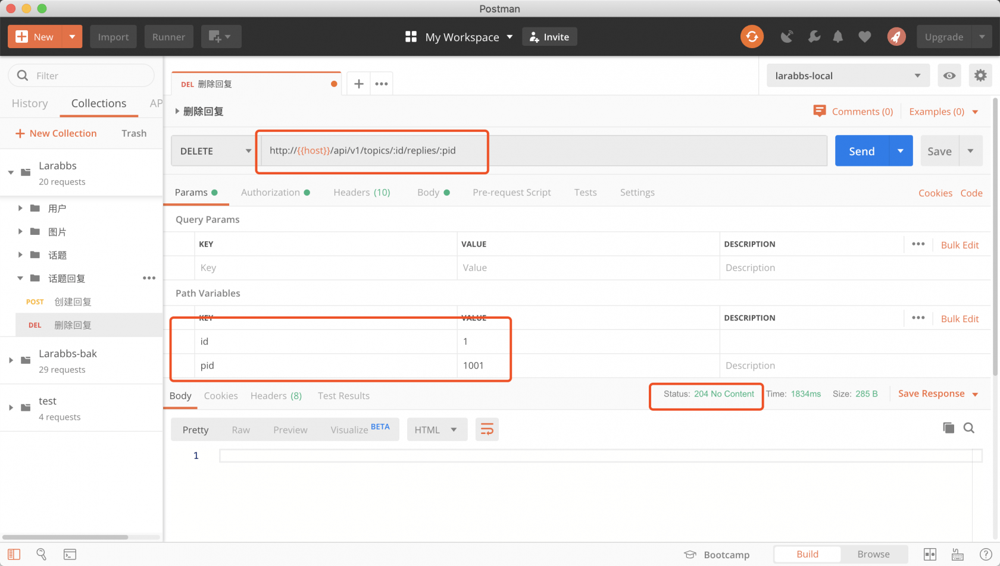

# 7.2. 删除回复

原文链接：https://learnku.com/courses/laravel-advance-training/9.x/delete-reply/12620

## 删除回复

本章节我们将开发帖子回复的删除功能。每一次开发『删除』这种危险性较高的功能时，我们需要特别注意权限的控制。根据现有的 Larabbs 回复功能，拥有删除回复权限的身份只有以下三种：

- 『回复的作者』

- 『回复话题的作者』

- 『管理员』

接下来我们开始开发此功能，同时做好权限控制。

## 1. 增加路由

上一节中我们已经定义了路由。

routes/api.php

```
.
.
.
// 发布, 删除回复
Route::apiResource('topics.replies', RepliesController::class)->only([
'store', 'destroy'
]);

.
.
.
```

## 2. 修改 Controller

app/Http/Controllers/Api/RepliesController.php

```
.
.
.
public function destroy(Topic $topic, Reply $reply)
{
if ($reply->topic_id != $topic->id) {
abort(404);
}

$this->authorize('destroy', $reply);
$reply->delete();

return response(null, 204);
}

.
.
.
```

注意这里的 `destroy` 使用的是已存在的 [授权策略](https://learnku.com/docs/laravel/5.8/authorization#generating-policies) 类：

app/Policies/ReplyPolicy.php

```
<?php

namespace App\Policies;

use App\Models\User;
use App\Models\Reply;

class ReplyPolicy extends Policy
{
public function destroy(User $user, Reply $reply)
{
return $user->isAuthorOf($reply) || $user->isAuthorOf($reply->topic);
}
}
```

设定了只有 话题的作者和评论的作者，才有权限删除评论。

## 3. PostMan 调试



用非管理员账户，找一个不是自己发布的话题，尝试删除他人的回复，报错 403 没有权限。



尝试删除自己发布的回复，删除成功，返回 204。

>

注意这里截图中的 id 可能与你自己环境中的 id 不同，根据真实情况进行测试。

## 代码版本控制

```
$ git add -A
$ git commit -m '删除回复'
```
