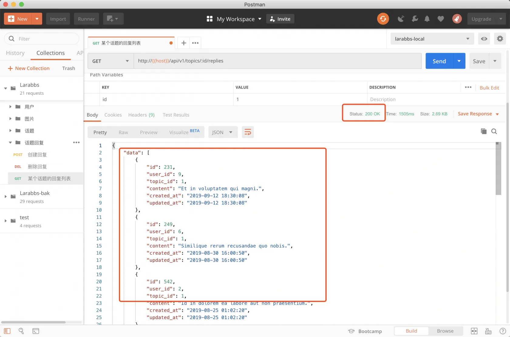
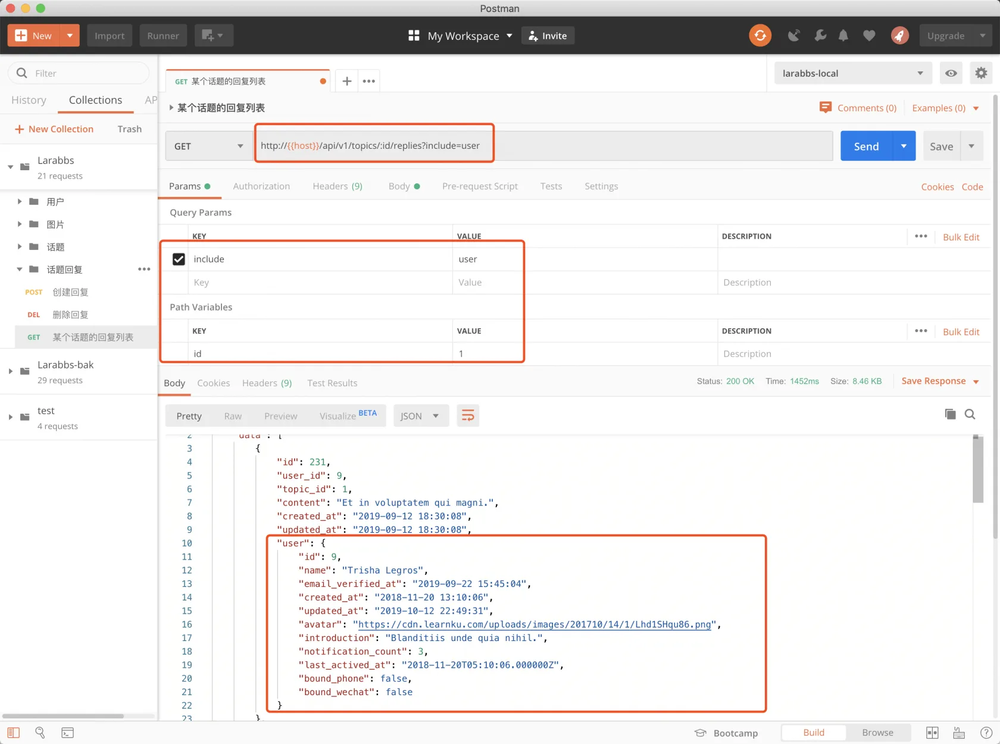
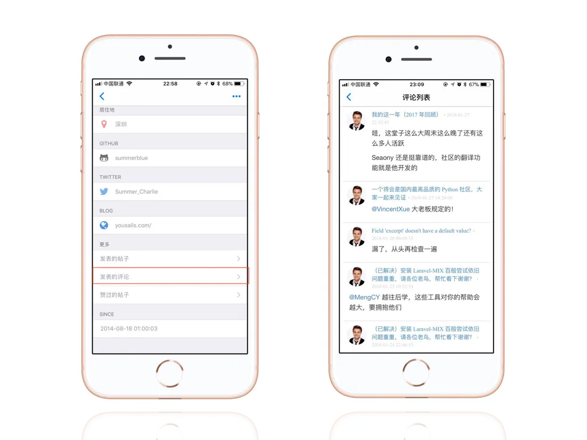
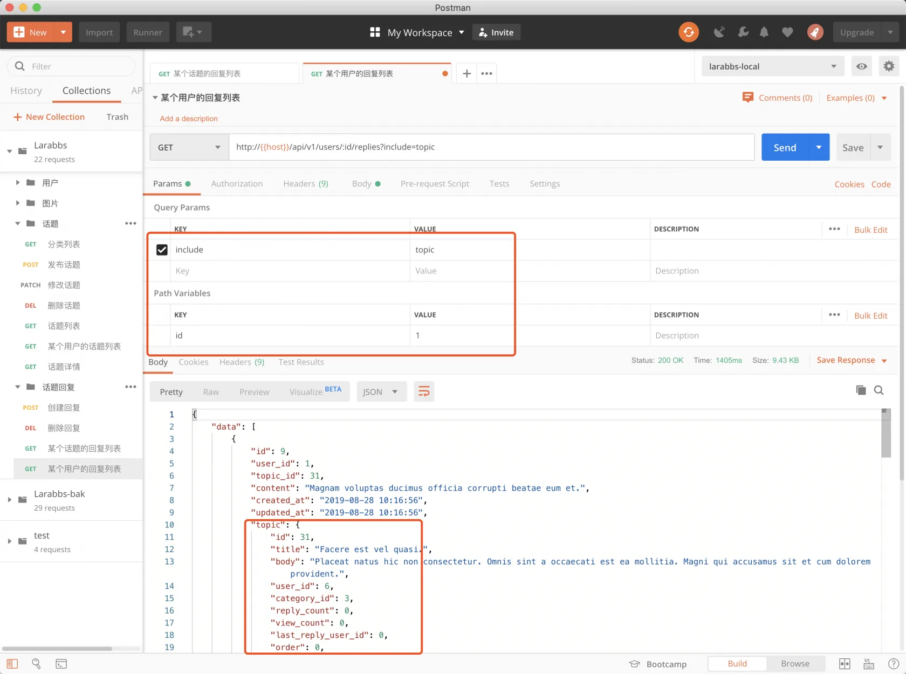
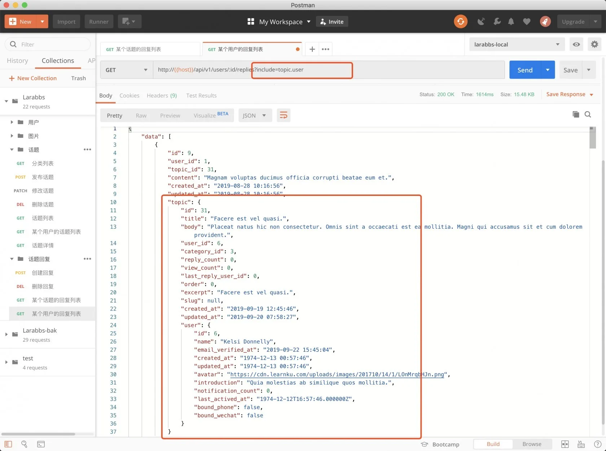

# 7.3. 回复列表

原文链接：https://learnku.com/courses/laravel-advance-training/9.x/reply-list/12621

## 某个话题的回复列表

### 1. 添加路由

第一步我们先添加路由，请注意该接口游客是可以访问的：

routes/api.php

```
.
.
.
// 话题列表，详情
Route::apiResource('topics', TopicsController::class)->only([
'index', 'show'
]);

// 话题回复列表
Route::apiResource('topics.replies', RepliesController::class)->only([
'index',
]);

.
.
.
```

### 2. 修改 Controller

app/Http/Controllers/Api/RepliesController.php

```
.
.
.
public function index(Topic $topic)
{
$replies = $topic->replies()->paginate();

return ReplyResource::collection($replies);
}
.
.
.
```

### 3. PostMan 调试



响应数据中包括中该话题的评论数据，及分页数据。

### 4. 调整 Include 参数

我们需要的不仅仅是回复数据，还需要显示回复人姓名，头像等用户数据。

再次回忆一下之前添加的 QueryBuilder，首先为了代码复用先添加一个  `ReplyQuery`。

```
$ touch app/Http/Queries/ReplyQuery.php
```

app/Http/Queries/ReplyQuery.php

```
<?php

namespace App\Http\Queries;

use App\Models\Reply;
use Spatie\QueryBuilder\QueryBuilder;
use Spatie\QueryBuilder\AllowedFilter;

class ReplyQuery extends QueryBuilder
{
public function __construct()
{
parent::__construct(Reply::query());

$this->allowedIncludes('user', 'topic');
}
}
```

app/Http/Controllers/Api/RepliesController.php

```
.
.
.
use App\Http\Queries\ReplyQuery;
.
.
.
public function index($topicId, ReplyQuery $query)
{
$replies = $query->where('topic_id', $topicId)->paginate();

return ReplyResource::collection($replies);
}
.
.
.
```

修改 Resource：

app/Http/Resources/ReplyResource.php

```
<?php

namespace App\Http\Resources;

use Illuminate\Http\Resources\Json\JsonResource;

class ReplyResource extends JsonResource
{
public function toArray($request)
{
return [
'id' => $this->id,
'user_id' => (int) $this->user_id,
'topic_id' => (int) $this->topic_id,
'content' => $this->content,
'created_at' => (string) $this->created_at,
'updated_at' => (string) $this->updated_at,
'user' => new UserResource($this->whenLoaded('user')),
'topic' => new TopicResource($this->whenLoaded('topic')),
];
}
}
```

增加 `include=user` 再次使用 PostMan 调试



## 某个用户回复列表

除了某个话题的回复，我们还可能查看某个用户发布的所有回复。



### 1. 添加路由

routes/api.php

```
.
.
.
// 话题回复列表
Route::apiResource('topics.replies', RepliesController::class)->only([
'index',
]);

// 某个用户的回复列表
Route::get('users/{user}/replies', [RepliesController::class, 'userIndex'])
->name('users.replies.index');

.
.
.
```

### 2. 修改 Controller

app/Http/Controllers/Api/RepliesController.php

```
.
.
.
public function userIndex($userId, ReplyQuery $query)
{
$replies = $query->where('user_id', $userId)->paginate();

return ReplyResource::collection($replies);
}
.
.
.
```

分页查询用户的所有评论，使用 `ReplyResource` 转换评论数据并返回。

### 3. 使用 PostMan 调试



返回 `回复数据` 以及 `回复的话题数据`。

## 发布话题的用户数据

假设现在的客户端界面进行了调整，某个用户的回复列表页面，不仅需要显示话题的标题，还需要显示 `发布话题` 的用户的头像及姓名，也就是除了回复关联的话题资源，还需要话题关联的用户资源。

其实也很简单，只需要调整一下 `ReplyQuery` 即可，不仅可以引入 `topic`，还可以引入 `topic.user` 也就是话题的发布者。

app/Http/Queries/ReplyQuery.php

```
.
.
.
class ReplyQuery extends QueryBuilder
{
public function __construct()
{
parent::__construct(Reply::query());

$this->allowedIncludes('user', 'topic', 'topic.user');
}
}
```

测试一下。



## 代码版本控制

```
$ git add -A
$ git commit -m '回复列表'
```
