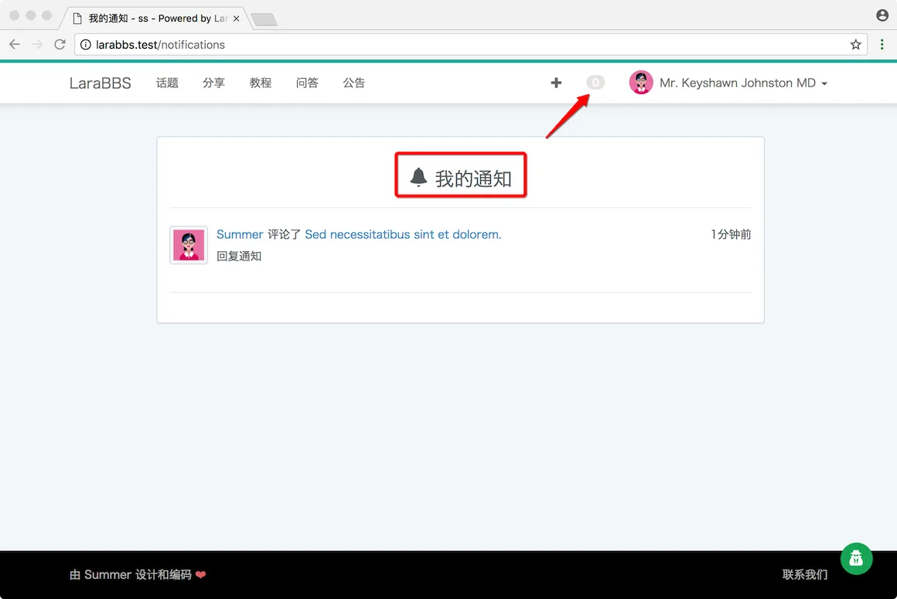
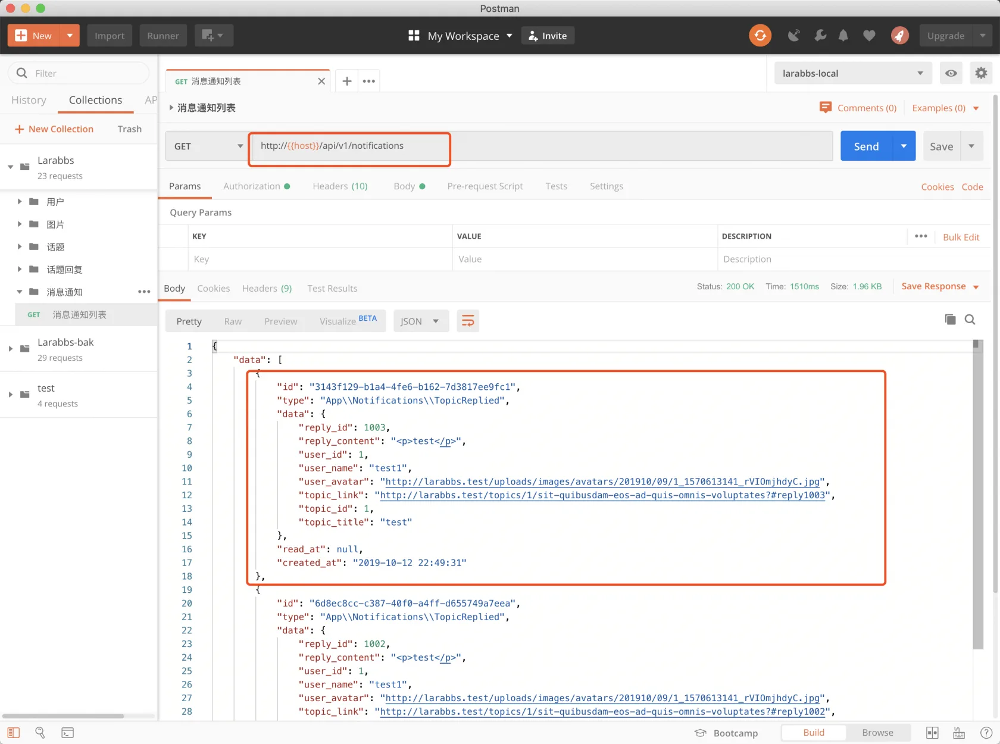
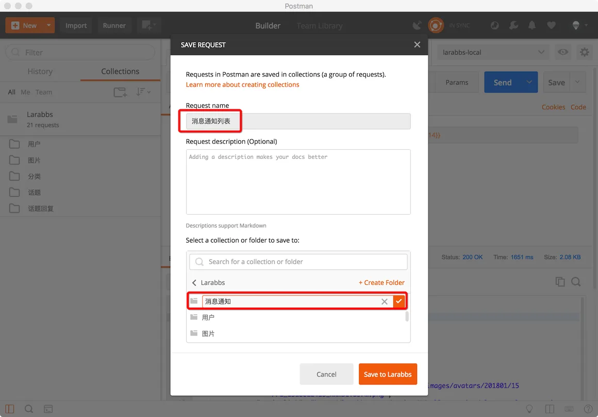
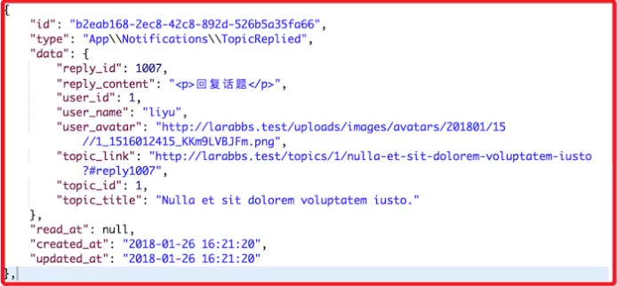

# 7.4. 消息通知列表

原文链接：https://learnku.com/courses/laravel-advance-training/9.x/message-notification/12622

## 消息通知列表

接下来我们开发 `消息通知` 接口，在 [第二本教程](https://learnku.com/courses/laravel-intermediate-training/6.x) 中我们开发过消息通知的功能，就是当话题有新回复时，我们将通知话题作者。



## 1. 增加 Controller

```
$ php artisan make:controller Api/NotificationsController
```

## 2. 增加路由

登录用户可以查看自己收到的通知

routes/api.php

```
.
.
.
use App\Http\Controllers\Api\NotificationsController;
.
.
.
// 发布, 删除回复
Route::apiResource('topics.replies', RepliesController::class)->only([
'store', 'destroy'
]);

// 通知列表
Route::apiResource('notifications', NotificationsController::class)->only([
'index'
]);

.
.
.
```

## 3. 增加 Resource

```
$ php artisan make:resource NotificationResource
```

修改文件

app/Http/Resources/NotificationResource.php

```
<?php

namespace App\Http\Resources;

use Illuminate\Http\Resources\Json\JsonResource;

class NotificationResource extends JsonResource
{
public function toArray($request)
{
return[
'id' => $this->id,
'type' => $this->type,
'data' => $this->data,
'read_at' => (string) $this->read_at ?: null,
'created_at' => (string) $this->created_at,
];
}
}
```

## 4. 修改 Controller

修改文件

app/Http/Controllers/Api/NotificationsController.php

```
<?php

namespace App\Http\Controllers\Api;

use Illuminate\Http\Request;
use App\Http\Resources\NotificationResource;

class NotificationsController extends Controller
{
public function index(Request $request)
{
$notifications = $request->user()->notifications()->paginate();

return NotificationResource::collection($notifications);
}
}

```

用户模型的 notifications 方法是 [Laravel 的消息通知系统](https://learnku.com/docs/laravel/5.5/notifications) 为我们提供的方法，按通知创建时间倒叙排序。

## 5. PostMan 调试



新增 `消息通知` 目录保存接口



## 6. 关于返回的数据

大家注意到了我们返回的数据里，`reply_content` 是 HTML 形式返回的，客户端可使用系统内置的 WebView UI 组件来渲染。iOS 有 [UIWebView](https://developer.apple.com/documentation/uikit/uiwebview) ，Android 有 [WebView](https://developer.android.com/reference/android/webkit/WebView.html) 。



## 代码版本控制

```
$ git add -A
$ git commit -m '消息通知列表'
```
