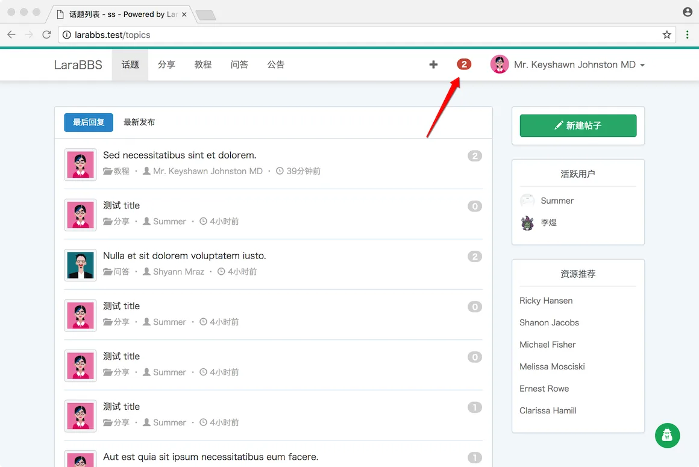
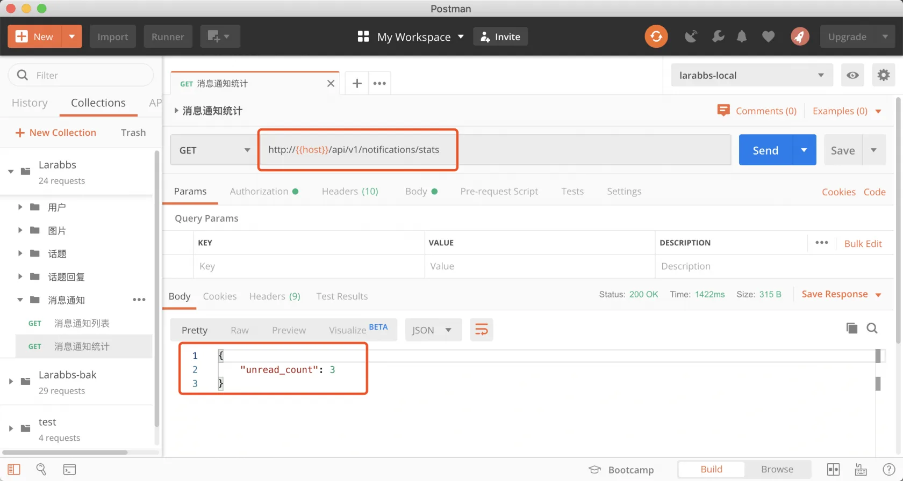

# 7.5. 未读消息统计

原文链接：https://learnku.com/courses/laravel-advance-training/9.x/unread-message-statistics/12623

## 未读消息数量



在网页端，用户有未读消息了，会在 header 中有红色提示。对于 APP 来说，需要一个接口查询当前用户 `未读消息数量`。

## 1. 增加路由

routes/api.php

```
.
.
.
// 通知列表
Route::apiResource('notifications', NotificationsController::class)->only([
'index'
]);

// 通知统计
Route::get('notifications/stats', [NotificationsController::class, 'stats'])
->name('notifications.stats');

.
.
.
```

这里我们设计为 `notifications/stats` ，stats 是 statistics 的缩写，意思是统计，这个接口可以直观的表述为——通知数据的统计。

## 2. 修改 Controller

app/Http/Controllers/Api/NotificationsController.php

```
.
.
.
public function stats(Request $request)
{
return response()->json([
'unread_count' => $request->user()->notification_count,
]);
}
.
.
.
```

当有新的通知时，`App\Observers\ReplyObserver.php` 已经帮我们进行了统计，可以查看一下代码。

```
public function created(Reply $reply)
{
$reply->topic->updateReplyCount();
// 通知话题作者有新的评论
$reply->topic->user->notify(new TopicReplied($reply));
}
```

notify 方法会将 notification_count 进行 +1。所以 `$this->user()->notification_count;` 就是用户未读消息数。

## 3. PostMan 调试

可以先登录 `larabbs.test` 回复某个用户的话题，为该用户新增几个未读通知。



新增 `消息通知` 目录，保存接口。

## 代码版本控制

```bash
$ git add -A
$ git commit -m '消息通知统计'
```
