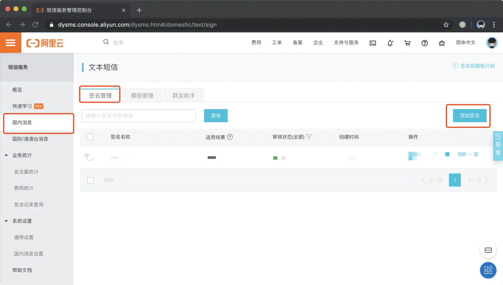
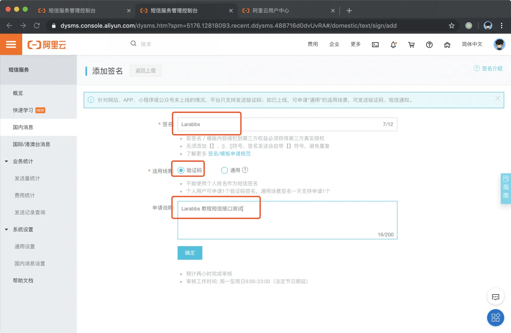
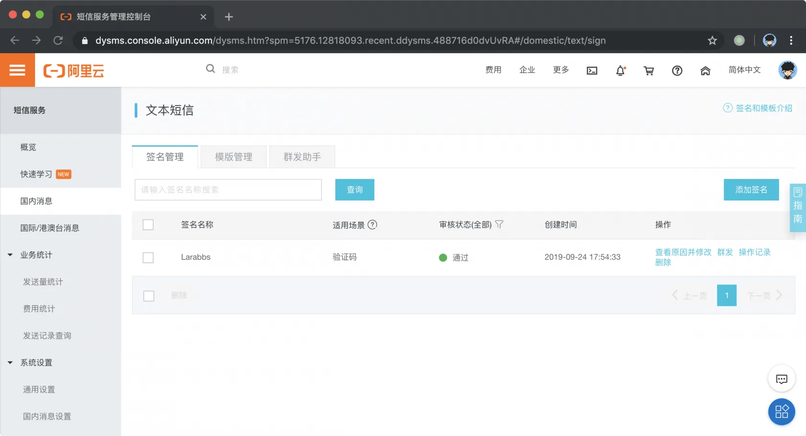
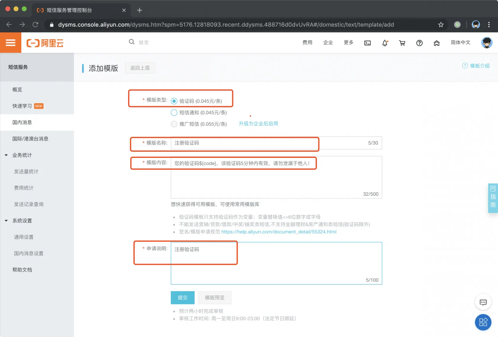
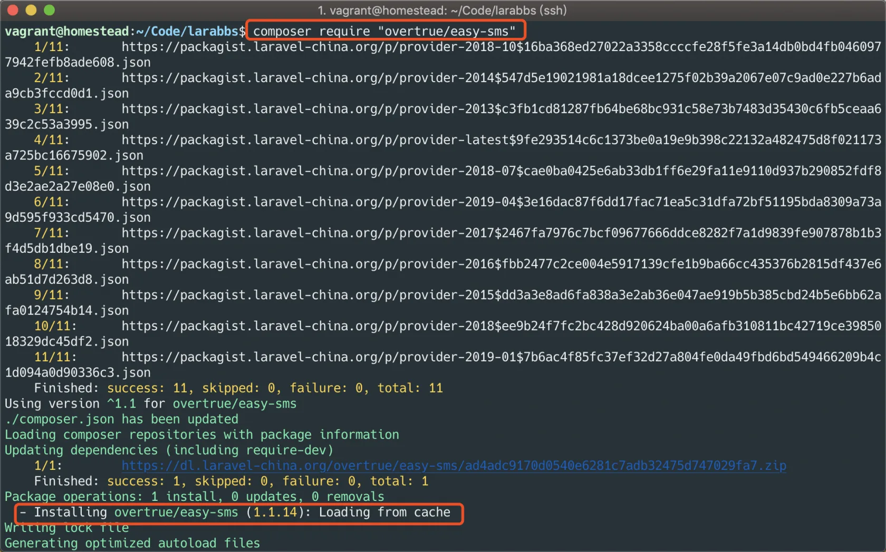
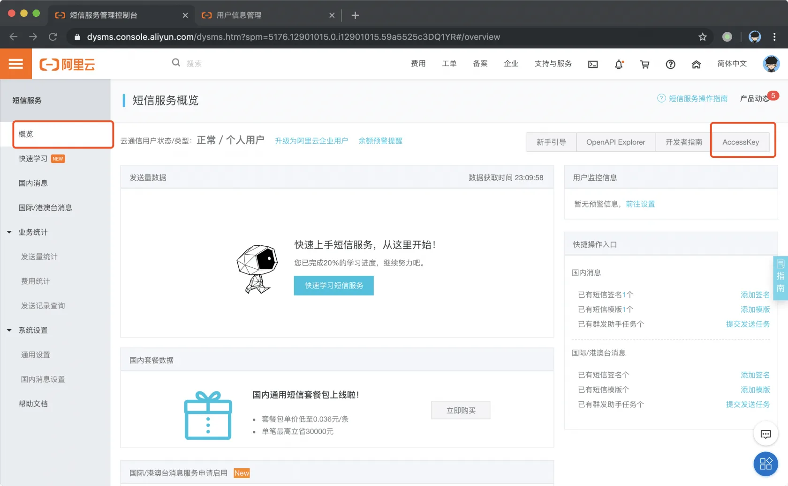
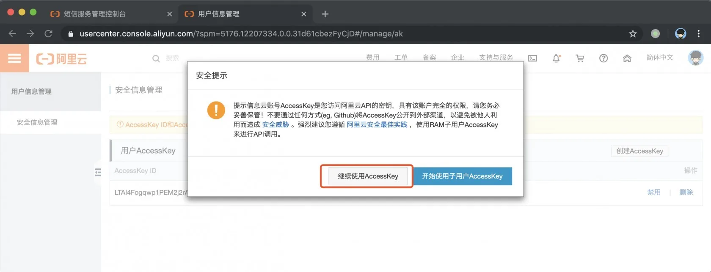
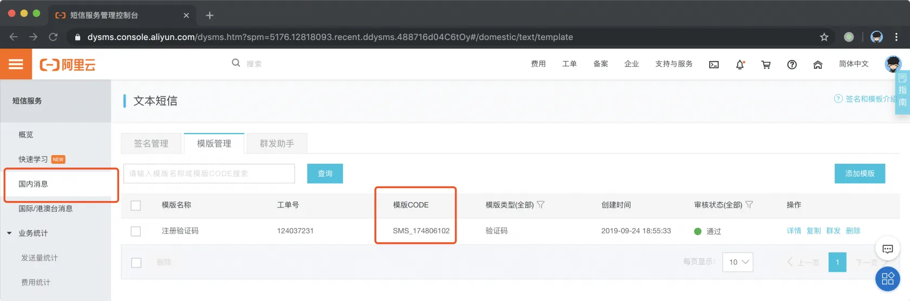
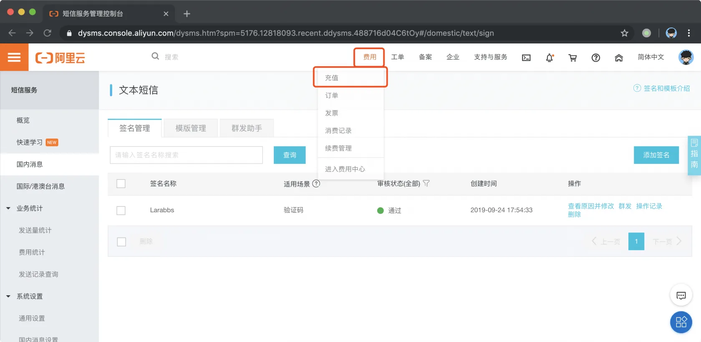
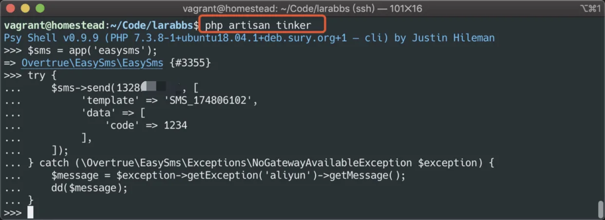

# 3.2. 短信提供商

原文链接：https://learnku.com/courses/laravel-advance-training/9.x/sms-provider/12596

## 1. 服务商注册

>

由于国家政策监管要求，云通信短信服务审核管理规则升级，自 2020 年 12 月 17 日起，未上线业务不支持申请验证码签名使用。
目前个人业务只有个人已备案的可以核实业务的网站、个人开发的已经上架的 app 可以申请签名使用。其他场景是企业相关的，个人申请时需要提供企业的营业执照和授权委托书来申请的。
建议您有已备案的可以核实业务的网站，或者有已经上架的 app 之后再申请签名使用。

>

由于政策原因，个人申请短信服务可能无法通过。

短信的服务商有很多，这里选择比较常用的 [阿里云](https://www.aliyun.com/product/sms?spm=5176.10695662.1128094.1.2a6b4beefNNW54&aly_as=hYtZKQhL)。

根据相关政策的要求，各个短信服务商提供的短信服务大都分为两个部分：『签名』以及『模板』，签名通常是项目或者企业的名称，模板是短信的内容。只有通过审核的签名和模板才能够正常发送短信，所以我们先进入阿里云的 [管理后台](https://dysms.console.aliyun.com/dysms.htm) 。

### 添加签名

选择国内消息 》签名管理 》添加签名：



内容可以参照截图，个人用户`场景`只能选择`验证码`。



提交并等待签名审核通过。



### 添加模板

选择国内消息 》模板管理 》添加模板：



提交并等待模板审核通过。

## 2. 安装 easy-sms

[easy-sms](https://github.com/overtrue/easy-sms) 是安正超写的一个短信发送组件，利用这个组件，我们可以快速的实现短信发送功能。

```bash
$ composer require "overtrue/easy-sms"
```



由于该组件还没有 Laravel 的 ServiceProvider，为了方便使用，我们可以自己封装一下。
首先在 config 目录中增加 easysms.php 文件，

```bash
$ touch config/easysms.php
```

填入如下内容。

config/easysms.php

```
<?php

return [
// HTTP 请求的超时时间（秒）
'timeout' => 10.0,

// 默认发送配置
'default' => [
// 网关调用策略，默认：顺序调用
'strategy' => \Overtrue\EasySms\Strategies\OrderStrategy::class,

// 默认可用的发送网关
'gateways' => [
'aliyun',
],
],
// 可用的网关配置
'gateways' => [
'errorlog' => [
'file' => '/tmp/easy-sms.log',
],
'aliyun' => [
'access_key_id' => env('SMS_ALIYUN_ACCESS_KEY_ID'),
'access_key_secret' => env('SMS_ALIYUN_ACCESS_KEY_SECRET'),
'sign_name' => 'Larabbs',
],
],
];
```

然后创建一个 ServiceProvider

```bash
$ php artisan make:provider EasySmsServiceProvider
```

修改文件

app/providers/EasySmsServiceProvider.php

```
<?php

namespace App\Providers;

use Overtrue\EasySms\EasySms;
use Illuminate\Support\ServiceProvider;

class EasySmsServiceProvider extends ServiceProvider
{
    public function boot()
    {
        //
    }

    public function register()
    {
        $this->app->singleton(EasySms::class, function ($app) {
                return new EasySms(config('easysms'));
        });

        $this->app->alias(EasySms::class, 'easysms');
    }
}
```

最后 打开 `config/app.php` 在 providers 中增加 `App\Providers\EasySmsServiceProvider::class,`

config/app.php

```
.
.
.
'providers' => [
.
.
.
App\Providers\EventServiceProvider::class,
App\Providers\RouteServiceProvider::class,

App\Providers\EasySmsServiceProvider::class,
],
.
.
.
```



接下来我们到阿里云后台获取 API 的 Access Key：



在 `.env`中配置 `SMS_ALIYUN_ACCESS_KEY_ID` 和 `SMS_ALIYUN_ACCESS_KEY_SECRET`，注意下面需要替换为你自己的 key：

```
.
.
.
# aliyun 短信
SMS_ALIYUN_ACCESS_KEY_ID=LTAI4FejA****
SMS_ALIYUN_ACCESS_KEY_SECRET=nhYplbr2kpulOU****
```

在 `.env.example` 中也加入配置示例，提交到版本库，方便以后部署

```
.
.
.
# aliyun 短信
SMS_ALIYUN_ACCESS_KEY_ID=
SMS_ALIYUN_ACCESS_KEY_SECRET=
```

## 3. 调试短信

接着在 tinker 中调试一下短信是否可以正常发送。先去后台查询一下短信模板的 code。



还要给你的账户中充点值，阿里云的价格是 `0.047元/条` 所以充值几块钱够测试即可。



我们使用 artisan 调试一下，试试能否收到短信。

```bash
$ php artisan tinker
```

输入如下代码，注意将 `13212345678` 替换为你自己的手机，将 `SMS_174806102` 替换为你的模板 ID。

```bash
$sms = app('easysms');
try {
$sms->send(13212345678, [
'template' => 'SMS_174806102',
'data' => [
'code' => 1234
],
]);
} catch (\Overtrue\EasySms\Exceptions\NoGatewayAvailableException $exception) {
$message = $exception->getException('aliyun')->getMessage();
dd($message);
}
```



相信你的手机上已经收到验证码了，『【Larabbs】您的验证码1234，该验证码5分钟内有效，请勿泄漏于他人！』。

>

如果你遇到报错  `cURL error 28: Resolving timed out after 5519 milliseconds (see http://curl.haxx.se/libcurl/c/libcurl-errors.html)` 可以将配置中的超时时间增加，修改 `config/easysms.php`中的 `timeout` 即可。

## 4. 代码版本控制

最后提交代码提交。

```bash
$ git add -A
$ git commit -m '短信调试'
```
