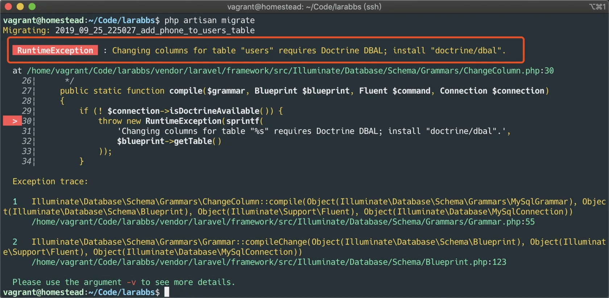
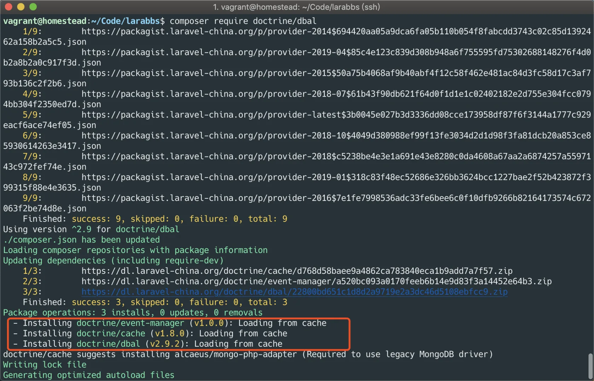
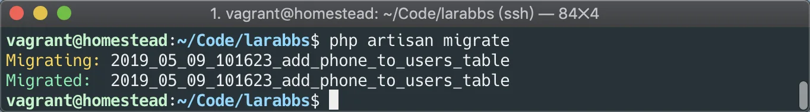
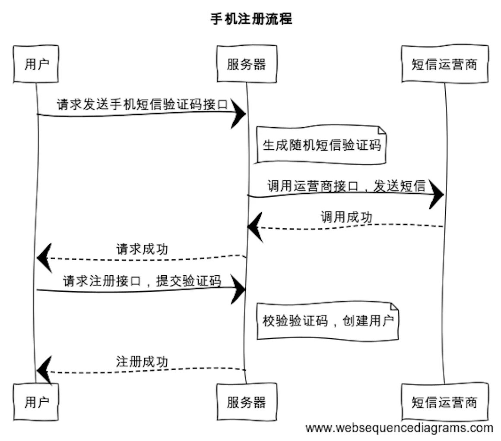
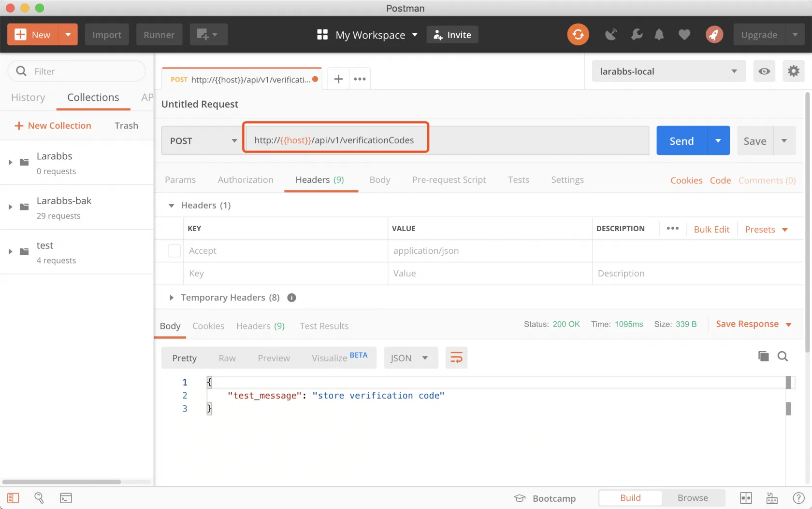
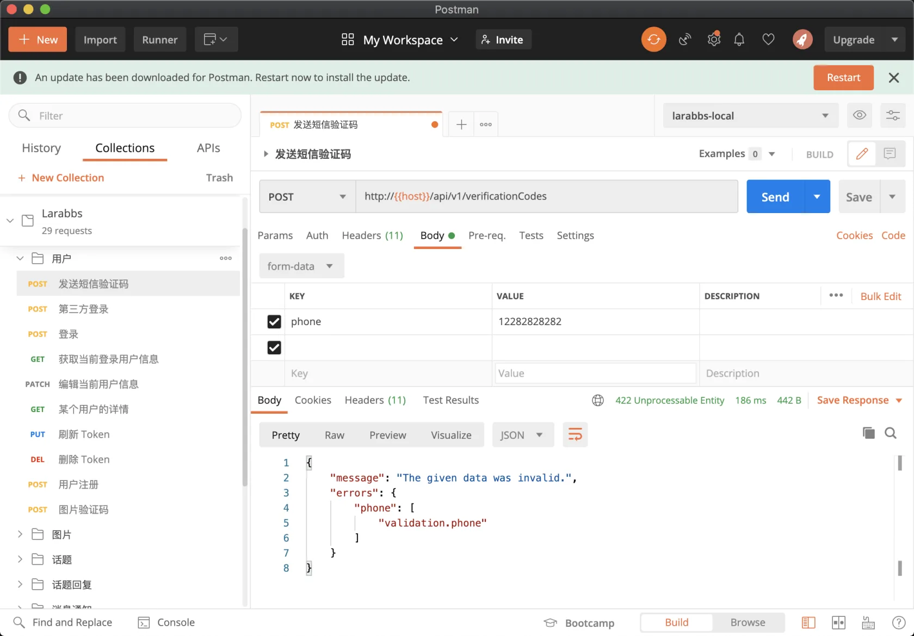
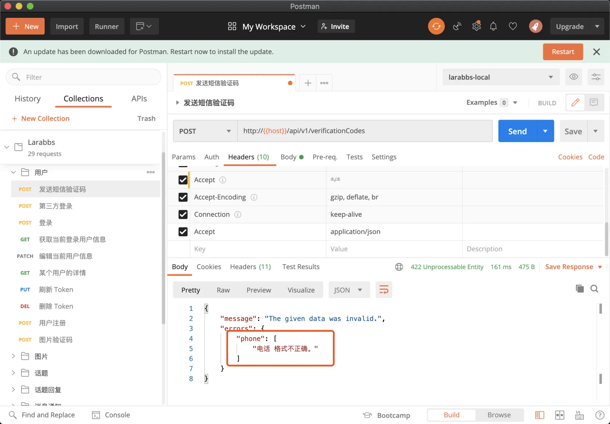
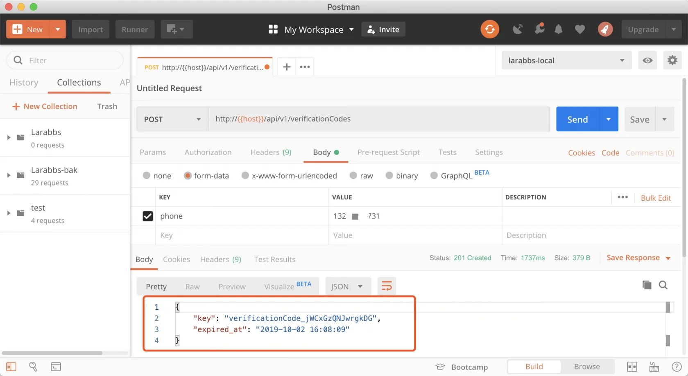
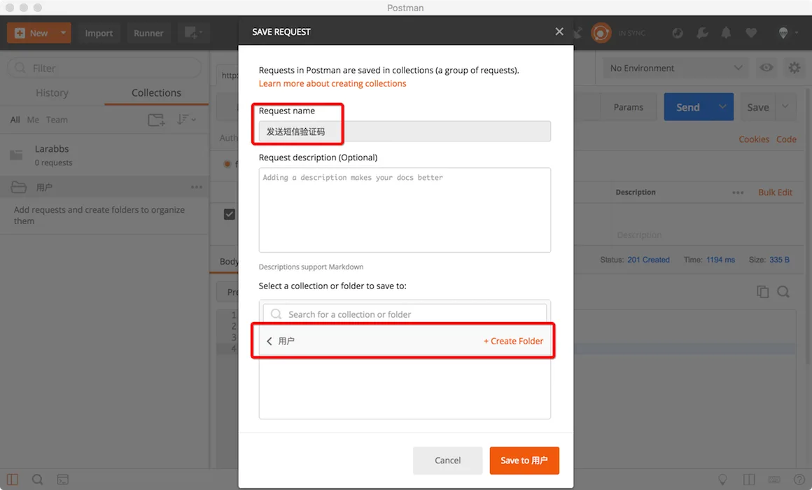

# 3.3. 手机注册验证码

原文链接：https://learnku.com/courses/laravel-advance-training/9.x/development-of-mobile-phone-registration-function/12597

## 1. 修改数据结构

接下来我们要准备开始手机注册功能的开发，开始之前我们需要对 LaraBBS 做一些修改。

现在的 Larabbs 是通过邮箱注册的，用户表中还没有手机字段，所以我们首先需要在 `users` 表中增加 `phone` 字段。因为是手机注册，还需要修改 `email` 字段为`nullable`。

```bash
$ php artisan make:migration add_phone_to_users_table --table=users
```

修改文件如以下，注意文件名中的变量：

database/migrations/`{your_date}`_add_phone_to_users_table.php

```
<?php

use Illuminate\Support\Facades\Schema;
use Illuminate\Database\Schema\Blueprint;
use Illuminate\Database\Migrations\Migration;

class AddPhoneToUsersTable extends Migration
{
    public function up()
    {
        Schema::table('users', function (Blueprint $table) {
                $table->string('phone')->nullable()->unique()->after('name');
                $table->string('email')->nullable()->change();
        });
    }

    public function down()
    {
        Schema::table('users', function (Blueprint $table) {
                $table->dropColumn('phone');
                $table->string('email')->nullable(false)->change();
        });
    }
}
```

执行 migrate

```bash
$ php artisan migrate
```



发现报错了，因为我们修改数据表字段的属性，这个功能需要 `doctrine/dbal` 组件，我们先安装它：

```bash
$ composer require doctrine/dbal
```



再次执行 migrate，执行成功



## 2. 构建短信验证码接口

我们先将注册流程简化一下，将发送图片验证码的流程去掉，流程如下：



### 1). 新建基类

首先来搭建一下基础环境，创建一个基础 Controller，此类作为所有 API 请求控制器的『基类』。

```bash
$ php artisan make:controller Api/Controller
```

注意我们增加了一个命名空间 `Api`，以后接口相关的控制器，统一会放在 `Api` 目录中，会让代码结构更清晰。前面提到过接口版本控制的重要性，我们还可以在 `Api` 目录中增加 `V1`，`V2` 等目录，进一步区分不同版本的接口，为了教学方便，我们暂时不做进一步区分。 将 `Controller.php` 文件替换为以下的内容。

app/Http/Controllers/Api/Controller.php

```
<?php

namespace App\Http\Controllers\Api;

use Illuminate\Http\Request;
use App\Http\Controllers\Controller as BaseController;

class Controller extends BaseController
{
    //
}
```

基类暂时保持为空，所有的 Api 控制器都会继承这个基类，方便以后进行扩展。

### 2). 构建短信验证控制器

接下来创建 `VerificationCodes` 的控制器。

```bash
$ php artisan make:controller Api/VerificationCodesController
```

修改文件如以下：

app/Http/Controllers/Api/VerificationCodesController.php

```
<?php

namespace App\Http\Controllers\Api;

use Illuminate\Http\Request;

class VerificationCodesController extends Controller
{
    public function store()
    {
        return response()->json(['test_message' => 'store verification code']);
    }
}
```

>

通过 artisan 创建出来的控制器，默认会继承 App\Http\Controllers\Controller，我们只需要删除 `use App\Http\Controllers\Controller` 这一行即可，这样会继承相同命名空间下的 Controller，也就是我们上一步中添加的那个控制器。

### 3). 新增路由

下面我们开始写第一个接口 `发送短信验证码`，先添加路由

routes/api.php

```
<?php

use Illuminate\Http\Request;
use Illuminate\Support\Facades\Route;
use App\Http\Controllers\Api\VerificationCodesController;

Route::prefix('v1')->name('api.v1.')->group(function () {
// 短信验证码
Route::post('verificationCodes', [VerificationCodesController::class, 'store'])
->name('verificationCodes.store');
});
```

这样所有 v1 版本的路由都会默认使用 Api 目录中的控制器，你还可以根据版本继续细分到 v1  ，v2 目录中。

### 4). PostMan 里测试一下

接下来使用 PostMan 访问 `发送短信验证码` 接口，注意使用 `POST` 方式提交。



访问正常。

### 5). 创建 API 表单请求验证类

我们通过手机号请求接口，获得短信验证码。每当接收用户提交的参数时，都需要对数据做验证，以保证数据的准确性，接下来创建属于 Api 的表单请求验证类：

当然也需要创建一个基类，方便做一些统一方法的封装，对于接口的验证类，我们也统一放在 Api 目录中。

```bash
$ php artisan make:request Api/FormRequest
```

app/Http/Requests/Api/FormRequest.php

```
<?php

namespace App\Http\Requests\Api;

use Illuminate\Foundation\Http\FormRequest as BaseFormRequest;

class FormRequest extends BaseFormRequest
{
    public function authorize()
    {
        return true;
    }
}
```

创建验证码的验证类

```bash
$ php artisan make:request Api/VerificationCodeRequest
```

app/Http/Requests/Api/VerificationCodeRequest.php

```
<?php

namespace App\Http\Requests\Api;

class VerificationCodeRequest extends FormRequest
{
    public function rules()
    {
        return [
            'phone' => [
                'required',
                'regex:/^((13[0-9])|(14[5,7])|(15[0-3,5-9])|(17[0,3,5-8])|(18[0-9])|166|198|199)\d{8}$/',
                'unique:users'
            ]
        ];
    }
}
```

必须提交 `phone` 参数，必须是一个合法的电话格式，而且该手机号未注册过。

这里我们使用了一个正则来验证手机号的合法性，但是每当有新的号段产生，我们还得去修改正则，显然这不是最好的方案，这里推荐使用 [propaganistas/laravel-phone](https://github.com/Propaganistas/Laravel-Phone) 扩展包。

>

具体的扩展包使用可以参考 [视频教程](https://learnku.com/courses/laravel-package/2019/mobile-phone-number-verification-propaganistaslaravel-phone/1950)

修改表单验证类：

app/Http/Requests/Api/VerificationCodeRequest.php

```
<?php

namespace App\Http\Requests\Api;

class VerificationCodeRequest extends FormRequest
{
    public function rules()
    {
        return [
            'phone' => 'required|phone:CN,mobile|unique:users',
        ];
    }
}
```

### 6). 增加短信模板配置

短信模板的 code 是一个变量，应该增加一个对应的配置，这样方便更换不同的模板。

config/easysms.php

```
.
.
.
'gateways' => [
'errorlog' => [
'file' => '/tmp/easy-sms.log',
],
'aliyun' => [
'access_key_id' => env('SMS_ALIYUN_ACCESS_KEY_ID'),
'access_key_secret' => env('SMS_ALIYUN_ACCESS_KEY_SECRET'),
'sign_name' => 'Larabbs',
'templates' => [
'register' => env('SMS_ALIYUN_TEMPLATE_REGISTER'),
]
],
],
.
.
.
```

可以将配置写入 `easysms` 配置中，增加了一个 `templates` 的配置，配置是个数组，可以再继续增加其他不同的模板。

最后在 env 文件中配置 `SMS_ALIYUN_TEMPLATE_REGISTER`。

.env

```
SMS_ALIYUN_TEMPLATE_REGISTER=SMS_174806102
```

每次 env 中有配置变动，不要忘记需改 `.env.example` 方便部署。

.env.example

```
SMS_ALIYUN_TEMPLATE_REGISTER=
```

### 7). 继续编写控制器逻辑

再次编辑 `VerificationCodesController`：

app/Http/Controllers/Api/VerificationCodesController.php

```
<?php

namespace App\Http\Controllers\Api;

use Illuminate\Support\Str;
use Illuminate\Http\Request;
use Overtrue\EasySms\EasySms;
use App\Http\Requests\Api\VerificationCodeRequest;

class VerificationCodesController extends Controller
{
    public function store(VerificationCodeRequest $request, EasySms $easySms)
    {
        $phone = $request->phone;

        // 生成4位随机数，左侧补0
        $code = str_pad(random_int(1, 9999), 4, 0, STR_PAD_LEFT);

        try {
            $result = $easySms->send($phone, [
                    'template' => config('easysms.gateways.aliyun.templates.register'),
                    'data' => [
                        'code' => $code
                    ],
            ]);
        } catch (\Overtrue\EasySms\Exceptions\NoGatewayAvailableException $exception) {
            $message = $exception->getException('aliyun')->getMessage();
            abort(500, $message ?: '短信发送异常');
        }

        $key = Str::random(15);
        $cacheKey = 'verificationCode_'.$key;
        $expiredAt = now()->addMinutes(5);
        // 缓存验证码 5 分钟过期。
        \Cache::put($cacheKey, ['phone' => $phone, 'code' => $code], $expiredAt);

        return response()->json([
                'key' => $key,
                'expired_at' => $expiredAt->toDateTimeString(),
        ])->setStatusCode(201);
    }
}
```

思路是：

- 生成 4 位随机码；

- 用 `easySms` 发送短信到用户手机；

- 发送成功后，生成一个 key，在缓存中存储这个 key 对应的手机以及验证码，5 分钟过期；

- 将 `key` 以及 `过期时间` 返回给客户端。

>

做接口的思路与我们做网页应用不同，网站中处理验证码，通常是存入 session，注册的时候验证用户输入的验证码与 session 中的验证码是否相同。但是接口是无状态，相互独立的，处理这种相互关联，有先后调用顺序的接口时，常常是第一个接口返回一个随机的 key，利用这个 key 去调用第二个接口。

关于发送成功后返回的随机 key 这里有几种思路：

1. 使用手机号作为 key，不推荐这样，两个并发请求，如果使用了相同的手机号，无论是什么原因导致的这种情况的发生，都会造成某一个验证不通过；

2. 为了防止上面一种情况，可以使用 `手机号` + `几位随机字符串`，例如 4 位随机字符串，或者当前时间戳，冲突的概率很小；

3. 使用一个 x 位的随机字符串，一般短时间内的随机字符串，例如 15 位，冲突的概率也很小。

第 2，3 种方式皆可，课程中使用第三种方式。

### 8). 测试

通过 PostMan 调试一下：

输入错误的手机号码，提示电话格式不正确。



有了错误信息，但是报错还不是中文，可以安装扩展包 [overtrue/laravel-lang](https://github.com/overtrue/laravel-lang)，显示其他语言的提示，上一本教程已经安装过这个扩展包了，记得将中文发布出来。

```bash
$ php artisan lang:publish zh_CN
```

修改语言文件，增加一个  phone 的验证错误的文字：

resources/lang/zh_CN/validation.php

```
.
.
.
'phone'        => ':attribute 格式不正确。',

'custom' => [
.
.
.
```

再次调用接口，已经可以返回正确的提示了。



输入正确的手机号，可以正确发送短信。


记得将接口保存下来，方便下次调试，我们可以增加一个二级目录 `用户`，接口名称为 `发送短信验证码`。



## 3. 测试环境验证码

我们在本地或者测试环境，其实不必每次都真实发送验证码，为了方便测试，节约短信费用，我们可以增加如下代码：

app/Http/Controllers/Api/VerificationCodesController.php

```
.
.
.
if (!app()->environment('production')) {
$code = '1234';
} else {
// 生成4位随机数，左侧补0
$code = str_pad(random_int(1, 9999), 4, 0, STR_PAD_LEFT);

try {
$result = $easySms->send($phone, [
'template' => config('easysms.gateways.aliyun.templates.register'),
'data' => [
'code' => $code
],
]);
} catch (\Overtrue\EasySms\Exceptions\NoGatewayAvailableException $exception) {
$message = $exception->getException('aliyun')->getMessage();
abort(500, $message ?: '短信发送异常');
}
}
.
.
.
```

除了正式环境外，其他环境，默认不真实发送短信，短信验证码默认为`1234`。大家也可以考虑增加一个配置，控制是否真实发送短信。

## 4. 代码版本控制

做下代码版本控制：

```bash
$ git add -A
$ git commit -m '发送短信验证码'
```
