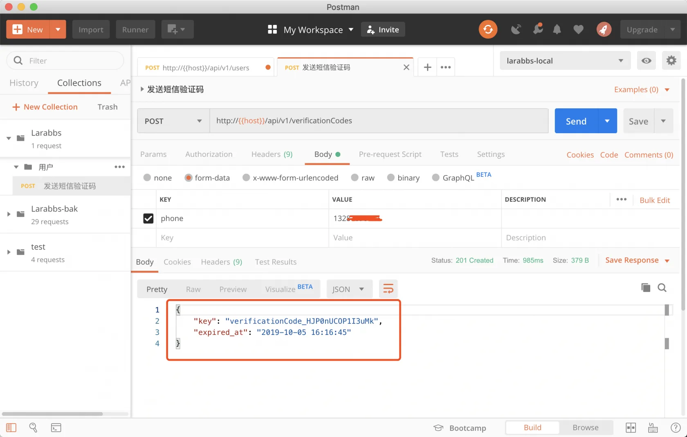
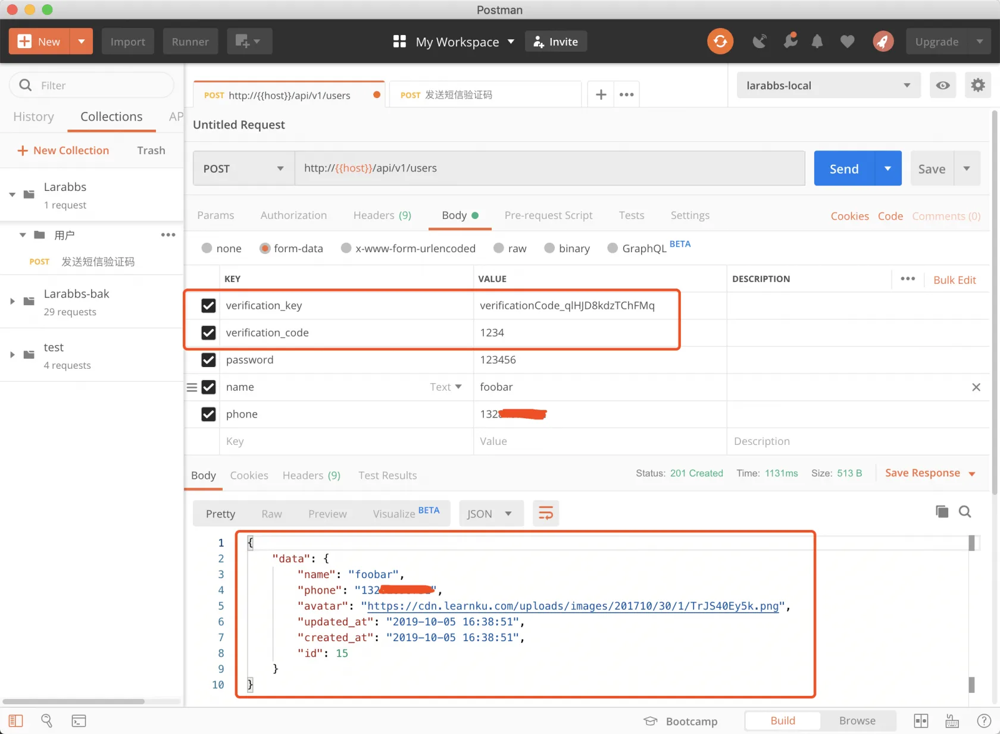
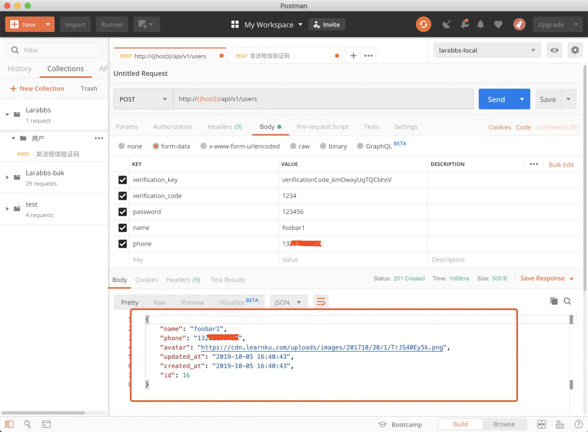

# 3.4. 构建用户注册接口

原文链接：https://learnku.com/courses/laravel-advance-training/9.x/building-a-user-registration-interface/12598

## 1. 新增路由

接着来完成用户注册的逻辑，先创建用户控制器

```
php artisan make:controller Api/UsersController
```

添加用户注册路由。

routes/api.php

```
.
.
.
use App\Http\Controllers\Api\UsersController;
.
.
.
Route::prefix('v1')->name('api.v1.')->group(function () {
// 短信验证码
Route::post('verificationCodes', [VerificationCodesController::class, 'store'])
->name('verificationCodes.store');

// 用户注册
Route::post('users', [UsersController::class, 'store'])
->name('users.store');
});

```

## 2. 表单验证类

```
$ php artisan make:request Api/UserRequest
```

修改文件如下：

app/Http/Requests/Api/UserRequest.php

```
<?php

namespace App\Http\Requests\Api;

class UserRequest extends FormRequest
{
public function rules()
{
return [
'name' => 'required|between:3,25|regex:/^[A-Za-z0-9\-\_]+$/|unique:users,name',
'password' => 'required|alpha_dash|min:6',
'verification_key' => 'required|string',
'verification_code' => 'required|string',
];
}

public function attributes()
{
return [
'verification_key' => '短信验证码 key',
'verification_code' => '短信验证码',
];
}
}
```

## 2. API 资源

创建一个用户资源类，这里可以再看一下文档 [API 资源《Laravel 6 中文文档》](https://learnku.com/docs/laravel/6.x/eloquent-resources/5180) ：

```
$ php artisan make:resource UserResource
```

使用默认生成的代码即可，暂时不用修改。

## 4. 修改控制器

app/Http/Controllers/Api/UsersController.php

```
<?php

namespace App\Http\Controllers\Api;

use App\Models\User;
use Illuminate\Http\Request;
use App\Http\Resources\UserResource;
use App\Http\Requests\Api\UserRequest;
use Illuminate\Auth\AuthenticationException;

class UsersController extends Controller
{
public function store(UserRequest $request)
{
$cacheKey = 'verificationCode_'.$request->verification_key;
$verifyData = \Cache::get($cacheKey);

if (!$verifyData) {
abort(403, '验证码已失效');
}

if (!hash_equals($verifyData['code'], $request->verification_code)) {
// 返回401
throw new AuthenticationException('验证码错误');
}

$user = User::create([
'name' => $request->name,
'phone' => $verifyData['phone'],
'password' => $request->password,
]);

// 清除验证码缓存
\Cache::forget($cacheKey);

return new UserResource($user);
}
}

```

>

注意这里的密码并部署明文存储，之前的课程中，已经在 User 模型添加了修改器，密码会自动加密。

## 5. 修改 User 模型

修改 user 模型的 fillable 未设置 phone，不然 phone 属性无法正确保存，修改如下：

app/Models/User.php

```
.
.
.
protected $fillable = [
'name',
'phone',
'email',
'password',
'introduction',
'avatar',
];
.
.
.
```

## 6. 代码详解

这里我们比对验证码是否与缓存中一致时，使用了 [hash_equals](http://php.net/manual/zh/function.hash-equals.php) 方法。

```
hash_equals($verifyData['code'], $request->verification_code)
```

hash_equals 是可防止时序攻击的字符串比较，那么什么是时序攻击呢？比如这段代码我们使用

```
$verifyData['code'] == $request->verification_code
```

进行比较，那么两个字符串是从第一位开始逐一进行比较的，发现不同就立即返回 false，那么通过计算返回的速度就知道了大概是哪一位开始不同的，这样就实现了电影中经常出现的按位破解密码的场景。而使用 `hash_equals` 比较两个字符串，无论字符串是否相等，函数的时间消耗是恒定的，这样可以有效的防止时序攻击。

验证码失效了，说明客户端未及时刷新验证码，4xx 系列错误应该都是适用的，这里我们抛出 403 错误。

验证码错误的情况，抛出 `AuthenticationException` 异常，状态码为 401，这里主要考虑到 401 的解释：

>

客户端在没有提供适当的身份认证凭证的时候向受保护的资源发送请求。他可能提供了错误的凭证或完全没有提供凭证。凭证可以是用户名和密码、一个 API Key 或者一个认证的token–任何 API 质询时所期望的内容。

现在用户需要用正确的验证码来创建用户，验证码可以作为用户的身份凭证，401 是合适的状态码。

>

对状态码不熟悉的同学，请重温下 [正确使用状态码](https://learnku.com/courses/laravel-advance-training/5.5/787/follow-github-to-learn-restful-http-api-design#7-%E6%AD%A3%E7%A1%AE%E4%BD%BF%E7%94%A8%E7%8A%B6%E6%80%81%E7%A0%81) 一文。

注册成功后，返回状态码为 201。

## 7. PostMan 测试一下

下面使用 PostMan 调试一下用户注册流程



带着 key 请求用户注册接口。



## 8. 修改返回数据格式

注意到返回的数据中 User 资源数据被放在了 `data` 字段下面，这是默认的数据返回格式，当有数据嵌套时，数据嵌套的层数会特别多，所以我们选择去掉 `data` 这一层包裹。

app/Providers/AppServiceProvider.php

```
.
.
.
use Illuminate\Http\Resources\Json\JsonResource;

.
.
.
public function boot()
{
.
.
.
JsonResource::withoutWrapping();
}
.
.
.
```

换一个手机号和用户名，重新注册一个用户。



响应数据已经没有 `data` 这一层了。

## 9. 代码版本控制

最后，提交我们的代码

```
$ git add -A
$ git commit -m "用户注册"
```
