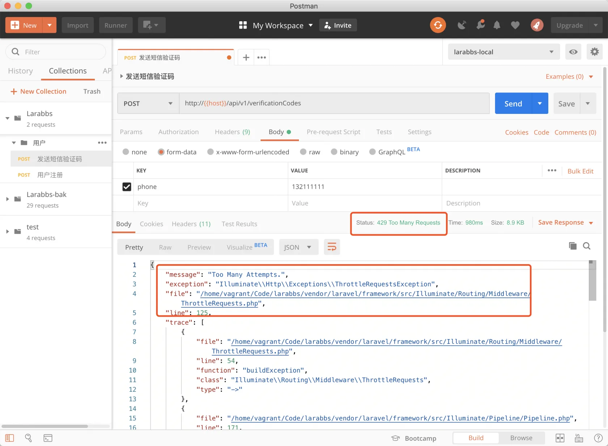
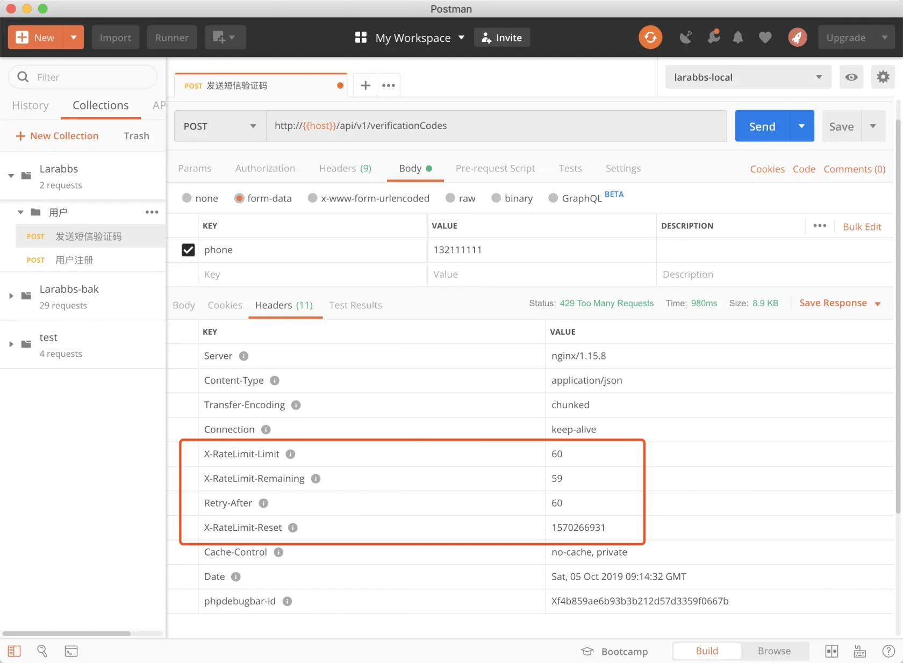

# 3.5. 节流处理防止攻击

原文链接：https://learnku.com/courses/laravel-advance-training/9.x/throttling-to-prevent-attacks/12599

## 1. 接口安全

验证码轰炸，是最常见的攻击方式，恶意调用 `发送短信验证码` 接口，给一个用户手机或多个手机号码频繁发送验证码短信，对其造成非常负面的影响，如果接口被轰炸，会导致我们的短信供应商那里的账户余额很快被耗尽。而手机注册的接口，通过不断尝试短信验证码，很容易在短信验证码未过期前，就被破解出来。

接口安全很重要，我们需要有合理的节流机制，来防止以上提到的攻击。节流机制，说到底就是对调用频率的限制，限制每个 ip 的调用次数。

## 2. 增加调用频率限制

Laravel 已经提供了频率限制的功能，可以查看一下文档 [路由《Laravel 6 中文文档》](https://learnku.com/docs/laravel/9.x/routing/5135#rate-limiting) ，使用起来非常方便，先来测试一下，修改路由，增加一个中间件：

routes/api.php

```
.
.
.
Route::prefix('v1')
->name('api.v1.')
->middleware('throttle:1,1')
->group(function () {
.
.
.
});
```

我们暂时设置为1分钟1次，方便测试。使用 PostMan 请求发送验证码接口

第一次请求可以正常得到响应，第二次请求响应如下：





看到结果返回`429 Too Many Requests`，查看 `Headers` 其中有`X_RateLimit` 相关的头信息。客户端判断状态码为 429 返回 `操作频率过快，请稍后再试`等提示即可。

## 3. 增加配置

写成配置，可以更方便的控制调用频率：

```bash
$ touch config/api.php
```

config/api.php

```
<?php

return [
/*
* 接口频率限制
*/
'rate_limits' => [
// 访问频率限制，次数/分钟
'access' =>  env('RATE_LIMITS', '60,1'),
// 登录相关，次数/分钟
'sign' =>  env('SIGN_RATE_LIMITS', '10,1'),
],
];
```

我们增加了两种限制，一种登录相关的，一分钟可以调用10次，一种是访问相关的，一分钟调用60次。然后调整路由代码：

routes/api.php

```
.
.
.
Route::prefix('v1')
->name('api.v1.')
->group(function () {

Route::middleware('throttle:' . config('api.rate_limits.sign'))
->group(function () {
// 短信验证码
Route::post('verificationCodes', [VerificationCodesController::class, 'store'])
->name('verificationCodes.store');

// 用户注册
Route::post('users', [UsersController::class, 'store'])
->name('users.store');
});

Route::middleware('throttle:' . config('api.rate_limits.access'))
->group(function () {

});
});
```

>

在开发中，合理地抽象『程序配置信息』是一个合格的工程师的必备技能之一。

## 提交修改的代码

```bash
$ git add -A
$ git commit -m "频率限制"
```
