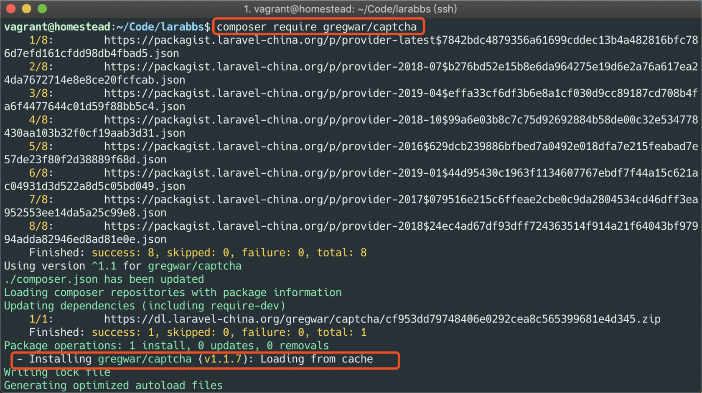
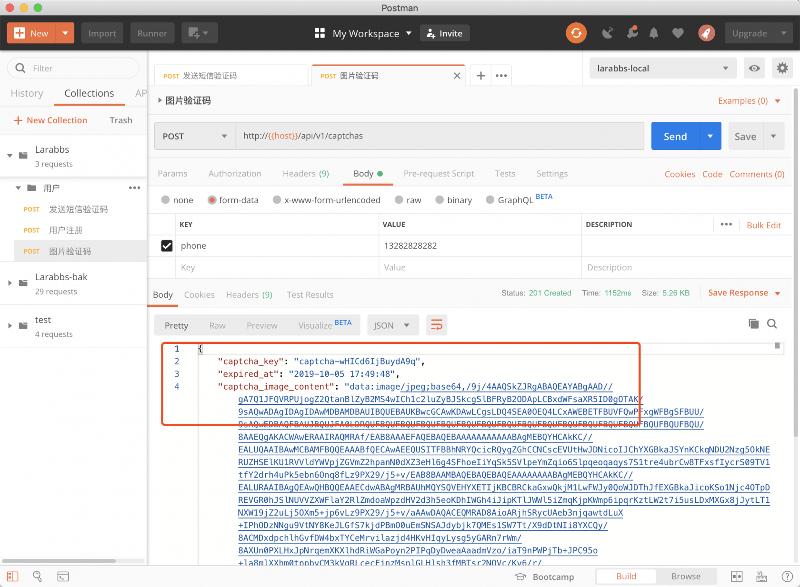
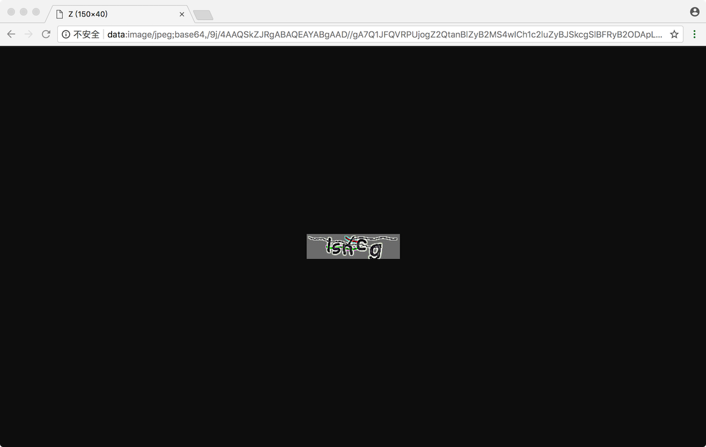
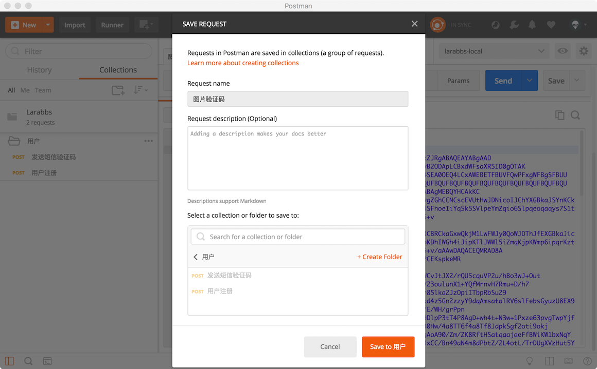
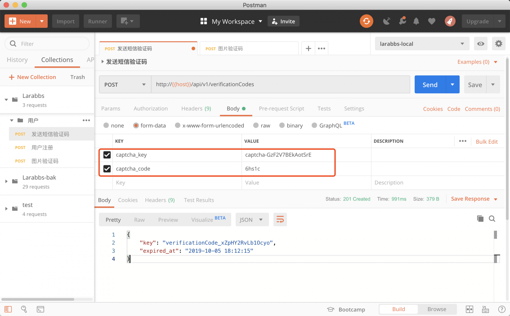

# 3.6. 图片验证码

原文链接：https://learnku.com/courses/laravel-advance-training/9.x/picture-verification-code/12600

## 图片验证码的作用

为了保证短信验证码接口不会被攻击，我们使用 `throttle` 中间件限制了接口访问频率，但是依旧不安全。虽然限制了 IP，但是攻击者依然可以使用大量代理 IP 进行攻击。这个时候，就需要增加一些机器无法识别，或者说识别成本高的人为因素 —— 验证码。

回忆一下『知乎APP』完整的注册流程，我们可以在发送短信验证码之前，增加一步图片验证码。

## 1. 安装 gregwar/captcha

图片验证码接口的流程是：

- 生成图片验证码

- 生成随机的 key，将验证码文本存入缓存。

- 返回随机的 key，以及验证码图片

Larabbs 项目中已经安装了 [mews/captcha](https://github.com/mewebstudio/captcha)，你可以尝试直接使用，但是本课程我们使用 [gregwar/captcha](https://github.com/Gregwar/Captcha) 来完成图片验证码的功能。

```
$ composer require gregwar/captcha
```



## 2. 开发接口

### 1). 新建控制器和表单验证类

创建 `CaptchasController` 以及 `CaptchaRequest`

```
$ php artisan make:controller Api/CaptchasController
$ php artisan make:request Api/CaptchaRequest
```

修改文件如下

app/Http/Requests/Api/CaptchaRequest.php

```
<?php

namespace App\Http\Requests\Api;

class CaptchaRequest extends FormRequest
{
public function rules()
{
return [
'phone' => 'required|phone:CN,mobile|unique:users',
];
}
}
```

app/Http/Controllers/Api/CaptchasController.php

```
<?php

namespace App\Http\Controllers\Api;

use  Illuminate\Support\Str;
use Illuminate\Http\Request;
use Gregwar\Captcha\CaptchaBuilder;
use App\Http\Requests\Api\CaptchaRequest;

class CaptchasController extends Controller
{
public function store(CaptchaRequest $request, CaptchaBuilder $captchaBuilder)
{
$key = Str::random(15);
$cacheKey =  'captcha_'.$key;
$phone = $request->phone;

$captcha = $captchaBuilder->build();
$expiredAt = now()->addMinutes(2);
\Cache::put($cacheKey, ['phone' => $phone, 'code' => $captcha->getPhrase()], $expiredAt);

$result = [
'captcha_key' => $key,
'expired_at' => $expiredAt->toDateTimeString(),
'captcha_image_content' => $captcha->inline()
];

return response()->json($result)->setStatusCode(201);
}
}

```

### 2). 新建路由

接下来，先来增加图片验证码路由：

routes/api.php

```
.
.
.
use App\Http\Controllers\Api\CaptchasController;
.
.
.
Route::middleware('throttle:' . config('api.rate_limits.sign'))
->group(function () {
// 图片验证码
Route::post('captchas', [CaptchasController::class, 'store'])
->name('captchas.store');

.
.
.
```

### 3). 代码分解

分析一下代码：

- 增加了 `CaptchaRequest` 要求用户必须通过手机号调用`图片验证码`接口。

- controller 中，注入`CaptchaBuilder`，通过它的 build 方法，创建出来验证码图片

- 使用 `getPhrase` 方法获取验证码文本，跟手机号一同存入缓存。

- 返回 captcha_key，过期时间以及 `inline` 方法获取的 base64 图片验证码

这里给图片验证码设置为 2 分钟过期，并且考虑到图片验证码比较小，直接以 base64 格式返回图片，大家可以考虑在这里返回图片 url，例如 `http://larabbs.test/captchas/{captcha_key}`，然后访问该链接的时候生成并返回图片。

### 4). 测试一下

调试一下接口，可以先删除数据库中前几节测试创建的用户，因为手机号是 `unique` 的。删除成功后再次发送请求：



请求成功，复制 `captcha_image_content` 的值，到浏览器中打开



可以看到我们生成的验证码，我们先保存下接口：



### 5). 集成到短信验证码接口里

接下来需要修改一下原来的 `发送短信验证码接口`，通过`captcha_key`和`captcha_code` 请求该接口，修改如下：

app/Http/Requests/Api/VerificationCodeRequest.php

```
<?php

namespace App\Http\Requests\Api;

class VerificationCodeRequest extends FormRequest
{
public function rules()
{
return [
'captcha_key' => 'required|string',
'captcha_code' => 'required|string',
];
}

public function attributes()
{
return [
'captcha_key' => '图片验证码 key',
'captcha_code' => '图片验证码',
];
}
}
```

app/Http/Controllers/Api/VerificationCodesController.php

```
<?php

namespace App\Http\Controllers\Api;

use Illuminate\Support\Str;
use Illuminate\Http\Request;
use Overtrue\EasySms\EasySms;
use App\Http\Requests\Api\VerificationCodeRequest;
use Illuminate\Auth\AuthenticationException;

class VerificationCodesController extends Controller
{
public function store(VerificationCodeRequest $request, EasySms $easySms)
{
$captchaCacheKey =  'captcha_'.$request->captcha_key;
$captchaData = \Cache::get($captchaCacheKey);

if (!$captchaData) {
abort(403, '图片验证码已失效');
}

if (!hash_equals($captchaData['code'], $request->captcha_code)) {
// 验证错误就清除缓存
\Cache::forget($captchaCacheKey);
throw new AuthenticationException('验证码错误');
}

$phone = $captchaData['phone'];

if (!app()->environment('production')) {
$code = '1234';
} else {
// 生成4位随机数，左侧补0
$code = str_pad(random_int(1, 9999), 4, 0, STR_PAD_LEFT);

try {
$result = $easySms->send($phone, [
'template' => config('easysms.gateways.aliyun.templates.register'),
'data' => [
'code' => $code
],
]);
} catch (\Overtrue\EasySms\Exceptions\NoGatewayAvailableException $exception) {
$message = $exception->getException('aliyun')->getMessage();
abort(500, $message ?: '短信发送异常');
}
}

$smsKey = 'verificationCode_'.Str::random(15);
$smsCacheKey = 'verificationCode_'.$smsKey;
$expiredAt = now()->addMinutes(5);
// 缓存验证码 5分钟过期。
\Cache::put($smsCacheKey, ['phone' => $phone, 'code' => $code], $expiredAt);
// 清除图片验证码缓存
\Cache::forget($captchaCacheKey);

return response()->json([
'key' => $smsKey,
'expired_at' => $expiredAt->toDateTimeString(),
])->setStatusCode(201);
}
}
```

主要增加了验证图片验证码的步骤，用户手机号从缓存中获取，最后清除图片验证码缓存。

修改 `发送验证码接口` 参数，测试一下：



最后调用用户注册接口，可以创建用户了。用户注册接口没有任何修改，这里就不截图了。记得保存修改后的接口。

## 代码版本控制

最后我们提交修改的代码

```
$ git add -A
$ git commit -m "图片验证码"
```
