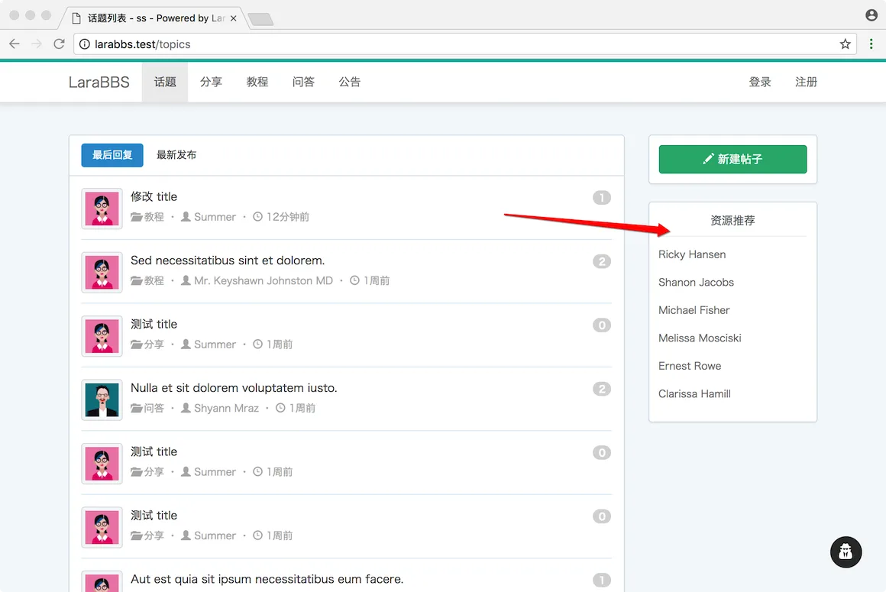
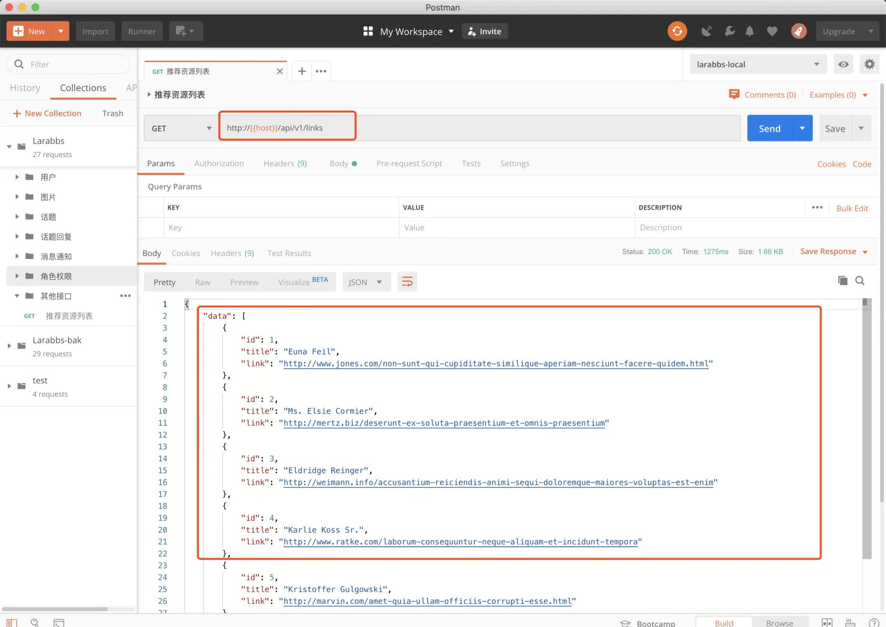
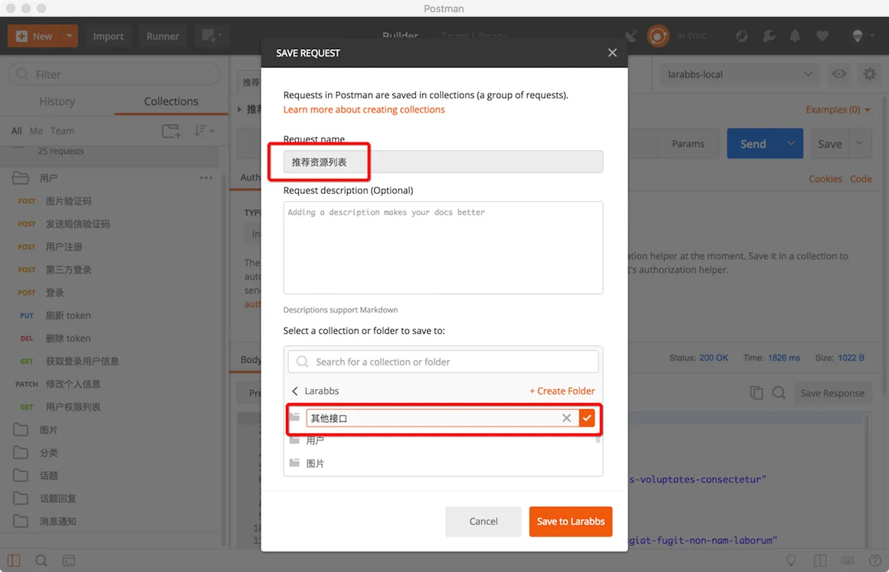

# 9.1. 资源推荐接口

原文链接：https://learnku.com/courses/laravel-advance-training/9.x/resource-recommendation-interface/12630

## 资源推荐接口

Larabbs 的侧边栏有个推荐资源的功能，这一节我们来开发对应的接口。因为该功能已经在上一本教程中完成，我们只是为其写个接口，实现起来非常方便。



## 1. 添加 Controller

```
$ php artisan make:controller Api/LinksController
```

## 2. 添加路由

推荐资源是游客可以访问的接口

routes/api.php

```
.
.
.
use App\Http\Controllers\Api\LinksController;
.
.
.
// 某个用户的回复列表
Route::get('users/{user}/replies', [RepliesController::class, 'userIndex'])
->name('users.replies.index');

// 资源推荐
Route::apiResource('links', LinksController::class)->only([
'index'
]);

.
.
.
```

## 3. 添加 Resource

```
$ php artisan make:resource LinkResource
```

app/Http/Resources/LinkResource.php

```
<?php

namespace App\Http\Resources;

use Illuminate\Http\Resources\Json\JsonResource;

class LinkResource extends JsonResource
{
public function toArray($request)
{
return [
'id' => $this->id,
'title' => $this->title,
'link' => $this->link,
];
}
}
```

## 4. 修改 Controller

app/Http/Controllers/Api/LinksController.php

```
<?php

namespace App\Http\Controllers\Api;

use App\Models\Link;
use Illuminate\Http\Request;
use App\Http\Resources\LinkResource;

class LinksController extends Controller
{
public function index(Link $link)
{
$links = $link->getAllCached();

LinkResource::wrap('data');
return LinkResource::collection($links);
}
}
```

Link 模型已经存在，getAllCached 会对结果进行缓存，可以看一下代码：

app/Models/Link.php

```
<?php

namespace App\Models;

use Illuminate\Database\Eloquent\Factories\HasFactory;
use Cache;

class Link extends Model
{
use HasFactory;

protected $fillable = ['title', 'link'];

public $cache_key = 'larabbs_links';
protected $cache_expire_in_seconds = 1440 * 60;

public function getAllCached()
{
// 尝试从缓存中取出 cache_key 对应的数据。如果能取到，便直接返回数据。
// 否则运行匿名函数中的代码来取出 links 表中所有的数据，返回的同时做了缓存。
return Cache::remember($this->cache_key, $this->cache_expire_in_seconds, function(){
return $this->all();
});
}
}

```

## 5. PostMan 调试

[初始化整个项目](https://learnku.com/courses/laravel-advance-training/5.5/785/install-larabbs) 的时候，我们执行了 `php artisan migrate --seed` 命令，links 表中应该已经生成了部分假数据，如果你想填充更多的数据，可以单独执行：

```
$ php artisan db:seed --class=LinksTableSeeder
```



可以看到接口返回了推荐的资源数据，结果正确。

## 6. 保存接口

可以将接口保存在 `其他接口` 目录中：



## Git 版本控制

```
$ git add -A
$ git commit -m "推荐资源列表"
```
