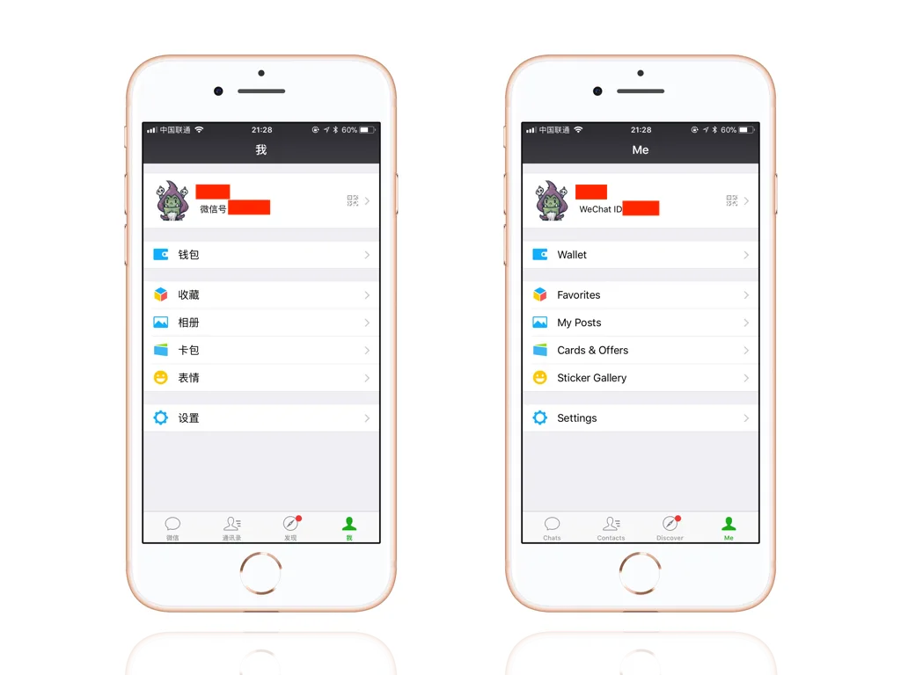
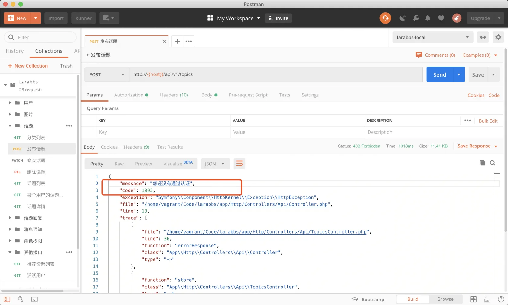
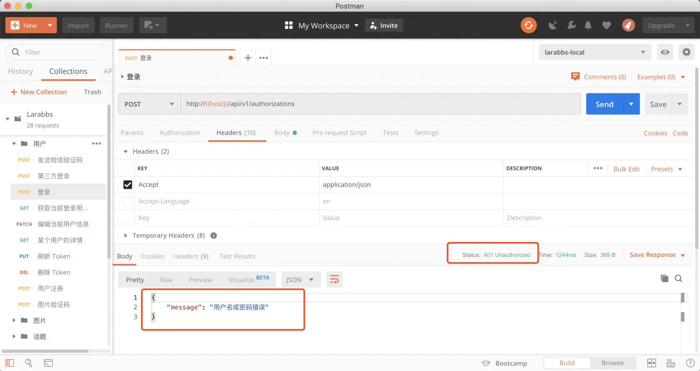
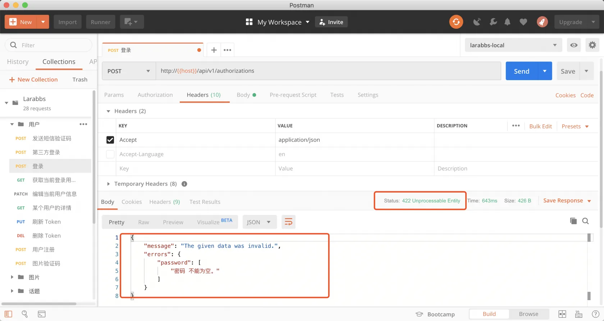
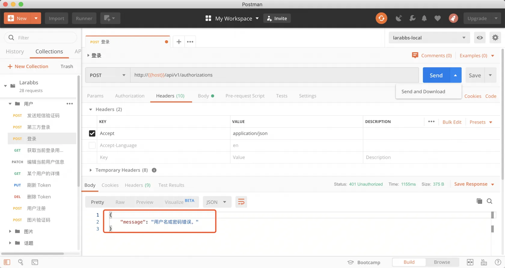
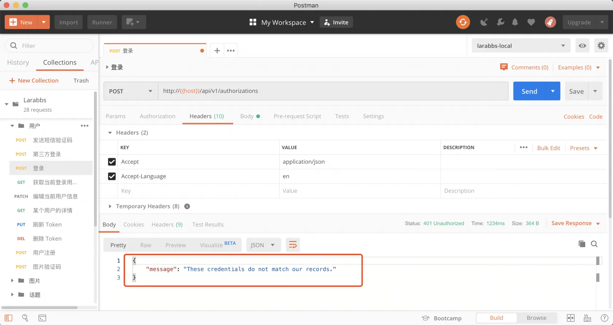

# 9.3. 本地化

原文链接：https://learnku.com/courses/laravel-advance-training/9.x/internationalization/12632

## 本地化

这一节我们来实现接口的本地化。本地化主要的是客户端的工作，切换语言后，客户端显示不同的界面，例如下面就是微信 中文 和 英文 语言下的界面。



除了界面显示之外，还有一些报错信息需要做本地化，举个例子，用户登录时，密码错误：

- 英文客户端，提示 `invalid username or password`

- 中文客户端，提示 `用户名和密码错误`

报错信息本地化的处理方式，一般有两种：

- 客户端通过服务器端返回的状态码和错误码，自行翻译为错误信息；

- 服务器端返回状态码时，返回已经格式化了的错误消息。

接下来我们会一一讲解。

## 1. 本地化完全交给客户端

因为我们是 RESTFul 风格的接口，返回了标准的状态码，大部分情况下，客户端可以根据状态码，以及语言设置提示给用户不同语言的报错信息。例如上面的例子，客户端调用 `登录` 接口时，报错信息中的 message 统一为中文，客户端根据状态码等标识进行本地化提示。

```
{
"message": "用户名和密码错误",
"status_code": 401
}
```

但是某些情况下，只有状态码是不够的，比如下面这个场景 `发布话题`，我们增加了以下限制：

| 错误原因 |
| --- |
| 状态码 |
| 错误描述 |

| 被加入黑名单的用户不能发帖 |
| --- |
| 403 |
| 您已被加入黑名单 |

| 会员用户才能发帖 |
| --- |
| 403 |
| 您还不是会员 |

| 实名认证的用户才能发帖 |
| --- |
| 403 |
| 您还没有通过认证 |

状态码都是 403 但是报错信息却不同，这时就需要定义不同的错误码，以便让客户端进行判断：

| 错误原因 |
| --- |
| 状态码 |
| 错误描述 |
| 自定义错误码 |

| 被加入黑名单的用户不能发帖 |
| --- |
| 403 |
| 您已被加入黑名单 |
| 1001 |

| 会员用户才能发帖 |
| --- |
| 403 |
| 您还不是会员 |
| 1002 |

| 实名认证的用户才能发帖 |
| --- |
| 403 |
| 您还没有通过认证 |
| 1003 |

接口响应类似下面这样：

```
{
"message": "您还没有通过认证",
"code": 1003
}
```

### 错误响应增加 code 参数

app/Exceptions/Handler.php

```
.
.
.
use Illuminate\Support\Arr;
.
.
.
protected function convertExceptionToArray(Throwable $e)
{
return config('app.debug') ? [
'message' => $e->getMessage(),
'code' => $e->getCode(),
'exception' => get_class($e),
'file' => $e->getFile(),
'line' => $e->getLine(),
'trace' => collect($e->getTrace())->map(function ($trace) {
return Arr::except($trace, ['args']);
})->all(),
] : [
'message' => $this->isHttpException($e) ? $e->getMessage() : 'Server Error',
'code' => $e->getCode(),
];
}
.
.
.
```

可以重写 `convertExceptionToArray` 方法，在错误响应中增加 `code` 数据，也就是获取异常中的 code。

### 进行封装

这样抛出异常，并且增加 `code` ，响应中就会自动增加 `code`。

app/Http/Controllers/Api/Controller.php

```
<?php

namespace App\Http\Controllers\Api;

use Illuminate\Http\Request;
use App\Http\Controllers\Controller as BaseController;
use Symfony\Component\HttpKernel\Exception\HttpException;

class Controller extends BaseController
{
public function errorResponse($statusCode, $message=null, $code=0)
{
throw new HttpException($statusCode, $message, null, [], $code);
}
}
```

我们在 `Api/Controller` 中加了 `errorResponse` 方法，所以我们在任意 API 控制器中直接使用 `$this->errorResponse` 即可。

### 添加测试代码

比如我们在 `发布话题` 接口的代码中增加下面的测试代码：

app/Http/Controllers/Api/TopicsController.php

```
.
.
.
public function store(TopicRequest $request, Topic $topic)
{
return $this->errorResponse(403, '您还没有通过认证', 1003);
.
.
.
```

由于是我们假设的业务，所以直接抛出异常，观察响应。

### 使用 PostMan 调试



可以看到响应中增加了 code 字段。记得还原测试代码：

```
$ git checkout app/Http/Controllers/Api/TopicsController.php
```

## 2. 接口根据客户端语言切换错误信息

如果接口根据客户端语言设置，返回对应语言的报错信息，客户端就可以直接将服务器报错提示给用户。由于每个接口都是无状态的，客户端需要在每次请求接口的时候增加参数，告诉接口支持的语言。我们可以利用 HTTP 的 `Accept-Language` 头信息。

- Accept-Language zh-CN —— 简体中文

- Accept-Language en  —— 英文

### 增加 middleware

通过以下命令创建一个中间件。

```
$ php artisan make:middleware ChangeLocale
```

打开文件，填入如下代码：

app/Http/Middleware/ChangeLocale.php

```
<?php

namespace App\Http\Middleware;

use Closure;

class ChangeLocale
{
public function handle($request, Closure $next)
{
$language = $request->header('accept-language');
if ($language) {
\App::setLocale($language);
}

return $next($request);
}
}
```

逻辑很简单，获取请求头中的 `accept-language`，然后设置语言。

### 注册中间件

app/Http/Kernel.php

```
protected $routeMiddleware = [
.
.
.
// 接口语言设置
'change-locale' => \App\Http\Middleware\ChangeLocale::class,
.
.
.
];
```

routes/api.php

```
.
.
.
Route::prefix('v1')
->namespace('Api')
->middleware('change-locale')
->name('api.v1.')
->group(function () {
.
.
.
```

我们注册了 `change-locale` 这个中间件，并且在 v1版本的接口中增加该中间件。

### PostMan 调试

接下来我们以 `登录` 接口为例。

由于我们已经在 config/app.php 中设置了默认的语言为`'locale' => 'zh-CN',` 简体中文，所以我们直接访问登录接口，密码只填写3位。



可以看到中文的报错信息：

增加 `accept-language` 头，值为 `en` 切换为英文。



可以切换语言，并且得到了正确的报错信息，看一下登录的代码：

app/Http/Controllers/Api/AuthorizationsController.php

```
.
.
.
if (!$token = \Auth::guard('api')->attempt($credentials)) {
throw new AuthenticationException('用户名或密码错误');
}

.
.
.
```

发现用户名密码错误的时候，报错并没有进行本地化处理，修改代码如下：

```
.
.
.
if (!$token = \Auth::guard('api')->attempt($credentials)) {
throw new AuthenticationException(trans('auth.failed'));
}
.
.
.
```

输入错误的密码，访问登录接口来测试。

使用默认的中文：



设置为英文：



## 方案总结

第一种方案比较专业，大部分的第三方 API 平台接口提供方都会提供状态码，如 [新浪微博](http://open.weibo.com/wiki/Error_code) 错误码，但是你需要一个个地将错误码写出。在某些开发需求中，错误码可能不仅影响本地化，有时客户端需要服务器返回的特定状态码做不同的业务处理，比如跳转到不同的页面。

第二种方案比较便捷，客户端可以直接将服务器的报错消息显示给用户，从快速实现的角度来看，省去了错误码的定义，并且后期可通过服务器代码来控制错误消息内容，也带来一定的灵活性。

从接口的可扩展性、适用性和专业性上考虑，最合理的也是最推荐的做法是将两种方案合并 —— API 既提供错误码，又提供错误消息。

另外，错误消息 默认 返回英文，也会是比较合理的最佳实践，当然最终视 API 业务逻辑而定。

## 代码版本控制

```
$ git add -A
$ git commit -m '本地化'
```
