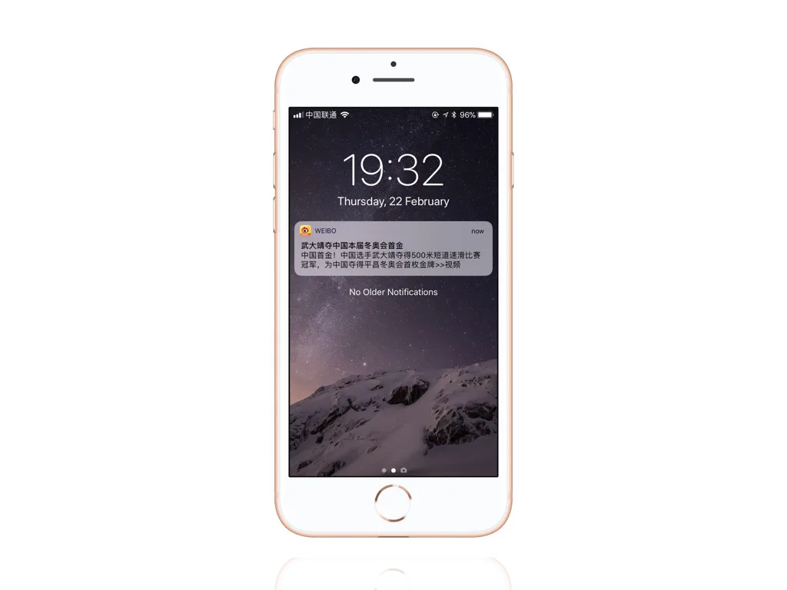
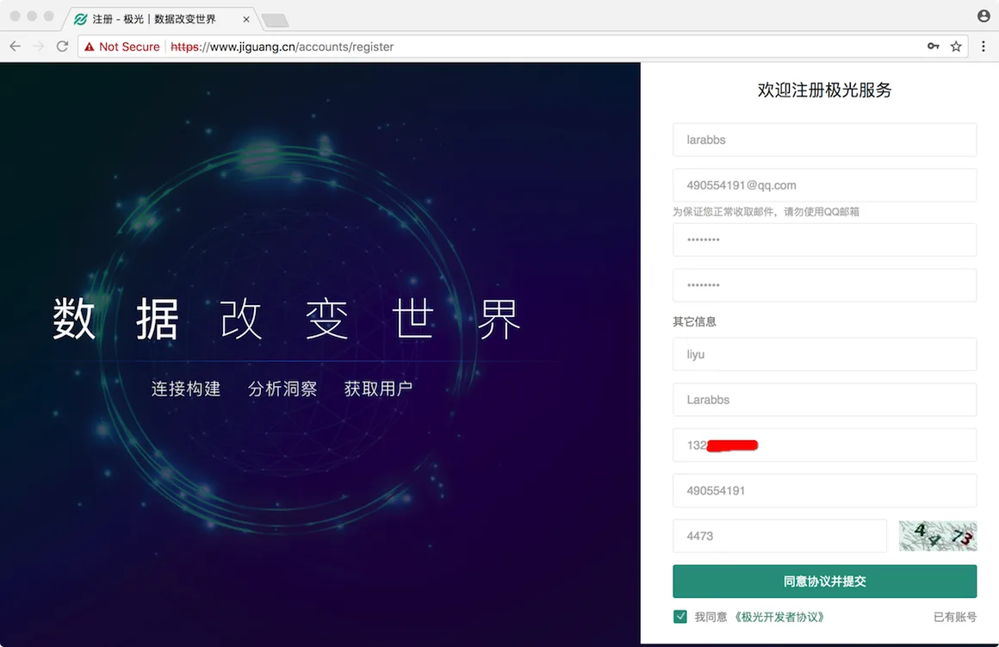
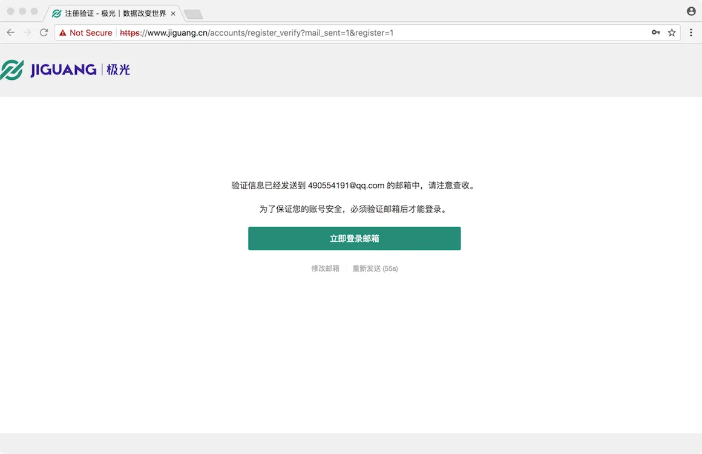
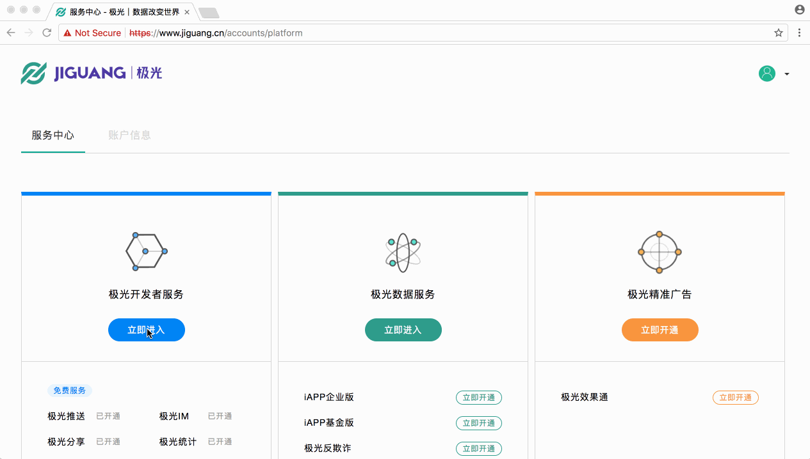
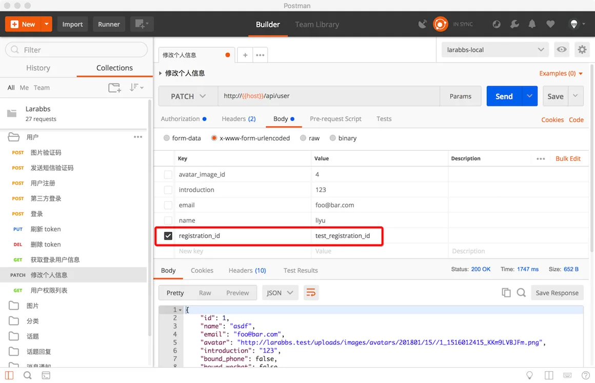
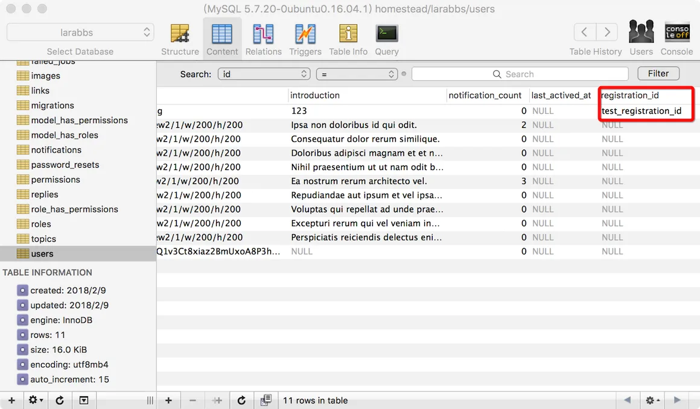
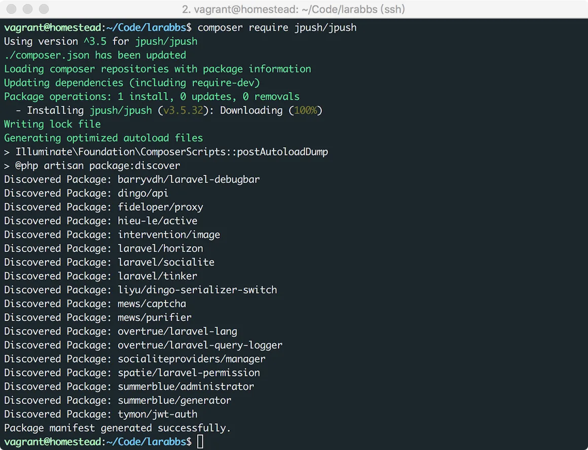

# 9.4. 消息推送

原文链接：https://learnku.com/courses/laravel-advance-training/9.x/message-push/12633

## 消息推送



消息推送是 APP 开发中非常重要的功能，可以让不在前台运行的 APP，及时收到消息通知，应用于新闻内容、促销活动、产品信息、版本更新提醒、订单状态提醒等多种场景。

因为我们没有客户端的配合，不方便测试，这一节我们主要以 iOS 为例，介绍一下消息推送的机制，以及实现一些基础代码。

## 推送原理

APNs (英文全称：Apple Push Notification service），即苹果推送通知服务。

消息推送分为本地通知和远程通知，本地通知是由本地应用触发的，是基于时间行为的一种通知形式，例如闹钟定时、待办事项提醒，又或者一个应用在一段时候后不使用通常会提示用户使用此应用等都是本地通知，因为本地通知没有服务器的参与，所以我们在这里不展开讨论，主要来了解一下远程通知。

远程通知主要步骤为：

- 在 APNs 下载 push 证书，设置在服务器中

- APP 获取 APNs 分配的 deviceToken （应用的唯一标识，不同设备，不同的应用 deviceToken 都会不同），提交给服务器，服务器记录下 deviceToken

- 消息推送时，服务器将 deviceToken 和要发送的消息提交给 APNs，并使用 push 证书签名

- APNs 会在自己已经注册的 iPhone 列表中根据 deviceToken 查找目标 iPhone。然后将消息发给目标 iPhone。

- iPhone 会把消息发送给相应的程序，并且已设定的方式弹出。

自己实现远程推送的功能会有很多的配置工作，再加上以后还有 Android 设备的推送，有很多繁琐的工作要处理，所以我们一般使用第三方的推送服务，省去了很多开发工作，第三方推送的统计也同时满足了运营的需求。

## 注册极光推送

[极光推送](https://www.jiguang.cn/) 是我们常用的第三方推送服务商，以下简称 Jpush。Jpush 同时支持 iOS 和 Android 平台的消息推送，服务器只需要实现一套代码即可。我们先来 [注册](https://www.jiguang.cn/accounts/register) 一个 Jpush 账号。

填写必填信息，注册：



注册成功后，需要验证注册邮箱：



邮箱验证成功后，我们会进入极光的控制台，接下来创建一个 Larabbs 应用：



最后我们会看到 Jpush 的 key 和  Secret，记录下这两个数据，下面会用到。

由于使用了第三方服务，远程通知的流程变为：

- 服务器配置 Jpush 的  AppKey 和  Secret；

- APP 获取 APNs 分配的 deviceToken，去 Jpush 注册并获取 RegistrationID；

- APP 将 RegistrationID 提交到服务器，服务器记录下对应用户的 RegistrationID；

- 消息推送时，服务器通过 Jpush sdk 提交 RegistrationID 及消息到 Jpush 服务器；

- Jpush 负责之后的消息推送。

原来是将 deviceToken 提交至服务器，现在是将 RegistrationID 提交至服务器，RegistrationID 相当于设备在 Jpush 中的唯一标识，服务器需要将 RegistrationID 与单个用户绑定，这样就能推送消息给指定用户。

## 注册 Registration ID

### 添加 registration_id 字段

为 `users` 表增加 `registration_id` 字段：

```
$ php artisan make:migration add_registration_id_to_users_table
```

database/migrations/< your_date >_add_registration_id_to_users_table.php  注意替换日期变量

```
<?php

use Illuminate\Support\Facades\Schema;
use Illuminate\Database\Schema\Blueprint;
use Illuminate\Database\Migrations\Migration;

class AddRegistrationIdToUsersTable extends Migration
{
public function up()
{
Schema::table('users', function (Blueprint $table) {
$table->string('registration_id')->nullable();
});
}

public function down()
{
Schema::table('users', function (Blueprint $table) {
$table->dropColumn('registration_id');
});
}
}
```

执行 `migrate` 命令：

```
$ php artisan migrate
```

### 修改编辑个人信息接口

APP 需要将 RegistrationID 提交到服务器，只需要调整 `编辑个人信息` 接口即可。

app/Http/Controllers/Api/UsersController.php

```
.
.
.
public function update(UserRequest $request)
{
$user = $request->user();

$attributes = $request->only(['name', 'email', 'introduction', 'registration_id']);
.
.
.
```

修改模型的 `fillable`：

app/Models/User.php

```
.
.
.
protected $fillable = [
'name',
'phone',
'email',
'password',
'introduction',
'avatar',
'weixin_openid',
'weixin_unionid',
'registration_id'
];

.
.
.
```

### 使用 PostMan 调试



只提交 registration_id ，查看数据库中数据，保存成功。



## 推送消息通知

回忆一下 Larabbs 的 [消息通知](https://learnku.com/courses/laravel-advance-training/5.5/946/message-notification) 功能，我们在有消息消息通知的时候，推送给对应的用户。

### 安装 Jpush SDK

```
$ composer require jpush/jpush
```



### 封装 SDK

为了方便使用，进行一下简单的封装：

```
$ php artisan make:provider JpushServiceProvider
```

app/Providers/JpushServiceProvider.php

```
<?php

namespace App\Providers;

use JPush\Client;
use Illuminate\Support\ServiceProvider;

class JpushServiceProvider extends ServiceProvider
{
public function boot()
{
//
}

public function register()
{
$this->app->singleton(Client::class, function ($app) {
return new Client(config('jpush.key'), config('jpush.secret'));
});

$this->app->alias(Client::class, 'jpush');
}
}
```

config/app.php

```
.
.
.
App\Providers\EasySmsServiceProvider::class,
App\Providers\JpushServiceProvider::class,
.
.
.
```

创建配置文件：

```
$ touch config/jpush.php
```

config/jpush.php

```
<?php

return [
'key' => env('JPUSH_KEY'),
'secret' => env('JPUSH_SECRET'),
];
```

在 env 文件中填写 Jpush 的 key 和 secret

.env

```
.
.
.
# jpush
JPUSH_KEY=9c6f53edad67db7ec24bfe32
JPUSH_SECRET=deeb2a04669ab79******
```

这样我们可以直接依赖注入 `JPush\Client` 或者 `app('jpush')` 来使用 Jpush 的 SDK。

### 消息推送

参考一下文档，我们需要定义一个 JPush 的频道用来发送消息推送。

在  `app/Notifications/` 目录下创建一个 `Channels/` 目录：

```
$ mkdir app/Notifications/Channels
```

创建 `JPushChannel.php`。

```
$ touch app/Notifications/Channels/JPushChannel.php
```

app/Notifications/Channels/JPushChannel.php

```
<?php

namespace App\Notifications\Channels;

use JPush\Client;
use Illuminate\Notifications\Notification;

class JPushChannel
{
protected $client;

public function __construct(Client $client)
{
$this->client = $client;
}

public function send($notifiable, Notification $notification)
{
$notification->toJPush($notifiable, $this->client->push())->send();
}
}

```

JPush 频道定义好了，接下来就需要在 Notification 中定义 toJPush 方法了。

app/Notifications/TopicReplied.php

```
.
.
.
use JPush\PushPayload;
use App\Notifications\Channels\JPushChannel;
.
.
.
public function via($notifiable)
{
// 开启通知的频道
return ['database', 'mail', JPushChannel::class];
}

public function toJPush($notifiable, PushPayload $payload): PushPayload
{
return $payload
->setPlatform('all')
->addRegistrationId($notifiable->registration_id)
->setNotificationAlert(strip_tags($this->reply->content));
}
}

```

逻辑很简单，在 TopicReplied 这个 Notification 中增加 toJPush 方法，定义该如何推送，推送什么内容，然后在 via 方法中增加 JPushChannel 频道。这样有消息回复的时候，就会同时进行消息推送。

## 代码版本控制

```
$ git add -A
$ git commit -m 'push notification'
```
