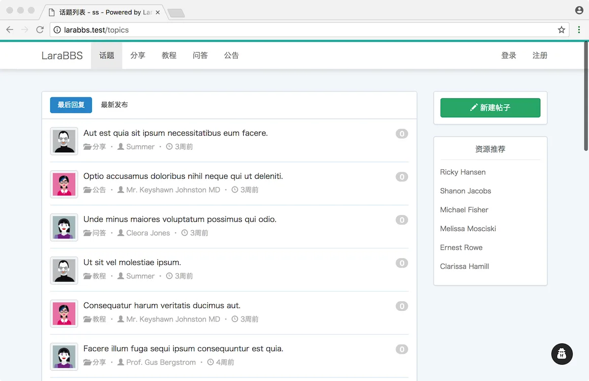
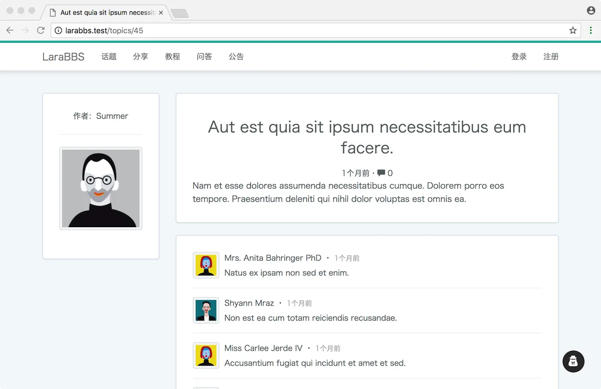
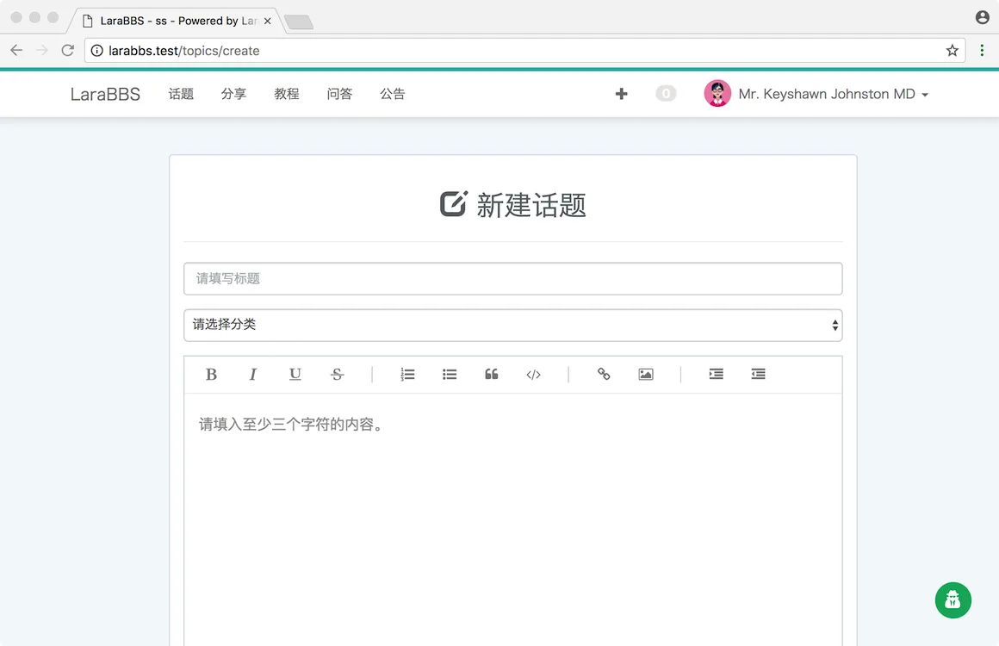
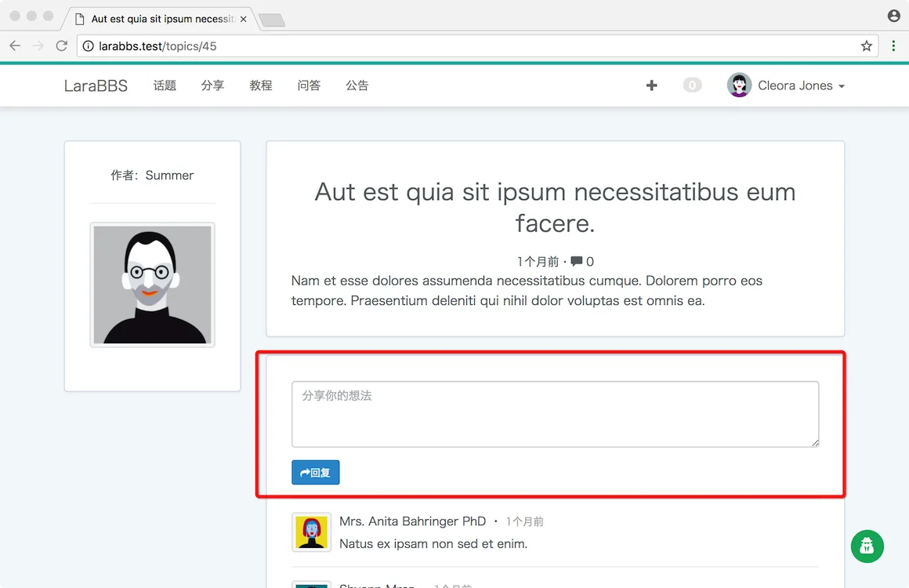
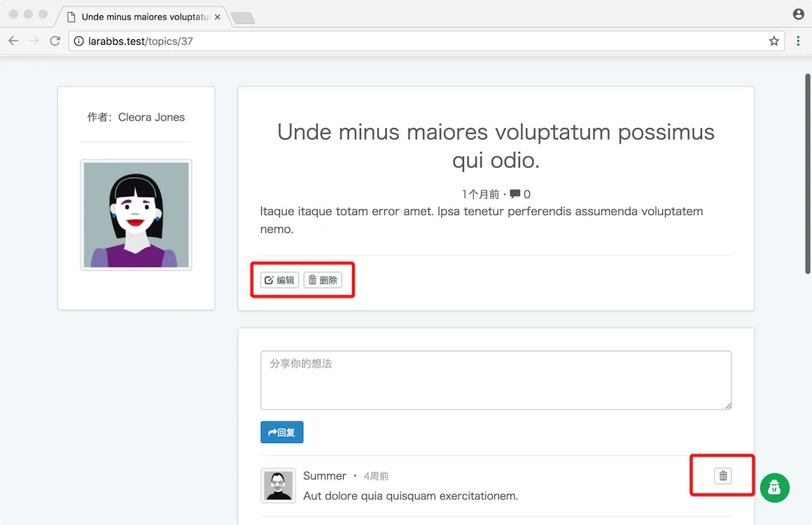

# 2.4. LaraBBS 数据模型讲解

原文链接：https://learnku.com/courses/laravel-advance-training/9.x/explanation-of-data-model/12590

## 数据模型

对于没有看过第二本教程的用户，我们需要先来介绍一下 Larabbs，了解一下数据模型。

## 产品简介

Larabbs 是一款论坛软件，主要功能就是发布话题，评论。

Larabbs 中有四个角色，游客，用户，管理员，站长，都可以查看话题列表，话题详情以及评论。

登录的用户可以发布话题，回复话题。

用户可以修改、删除自己发布的话题，删除自己发布的评论。有权限的用户可以修改、删除所有人的话题，删除所有人的评论。

## 主要数据模型

Larabbs 主要有下面用户，话题，分类，评论这几个主要的数据模型

用户 （users）

- id —— 主键

- name —— 姓名

- email —— 邮箱，用于登录

- password —— 密码

- remember_token —— 记住我 token

- created_at —— 创建时间

- updated_at —— 更新时间

- avatar —— 用户头像

- introduction —— 简介

- notification_count —— 未读消息数

- last_actived_at —— 最后登录时间

分类 （categories）

- id —— 主键

- name —— 分类名称

- description —— 分类描述

- created_at —— 创建时间

- updated_at —— 更新时间

话题 (topics)

- id —— 主键

- title —— 标题

- body —— 内容

- user_id —— 用户id

- category_id —— 分类id

- reply_count —— 评论数

- view_count —— 点击数

- last_reply_user_id —— 最后回复用户

- order —— 排序

- excerpt —— 话题摘录

- slug —— title 翻译

- created_at —— 创建时间

- updated_at —— 更新时间

从字段可以看出来两个模型之间的关系，话题属于（belongsTo）一个分类，话题属于（belongsTo）一个用户，一个用户拥有（hasMany） 多个话题。

评论 (replies)

- id —— 主键

- topic_id —— 话题id

- user_id —— 用户id

- content —— 评论内容

- created_at —— 创建时间

- updated_at —— 更新时间

评论属于（belongsTo）一个话题，属于（belongsTo）一个用户，话题拥有（hasMany）多个评论。
