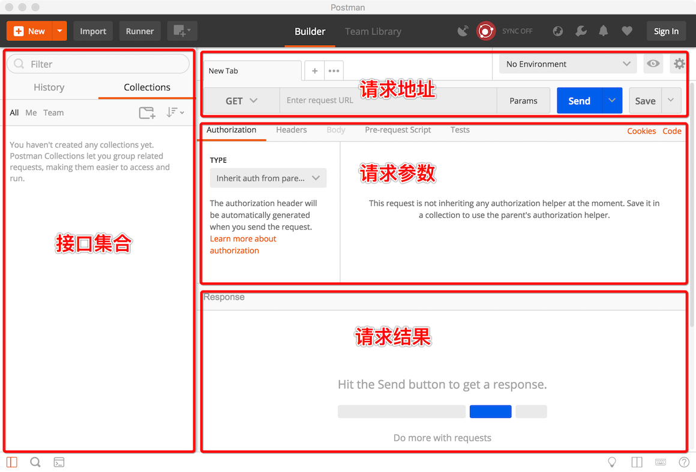
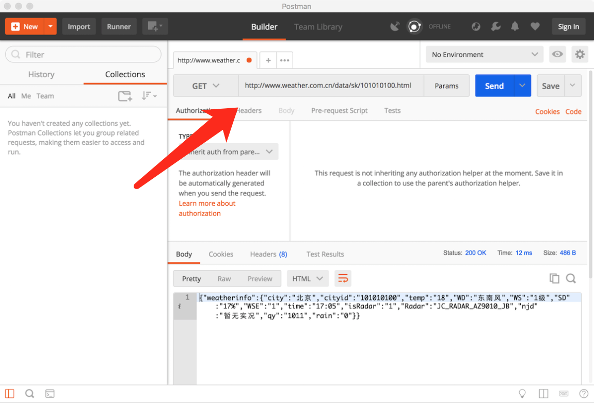
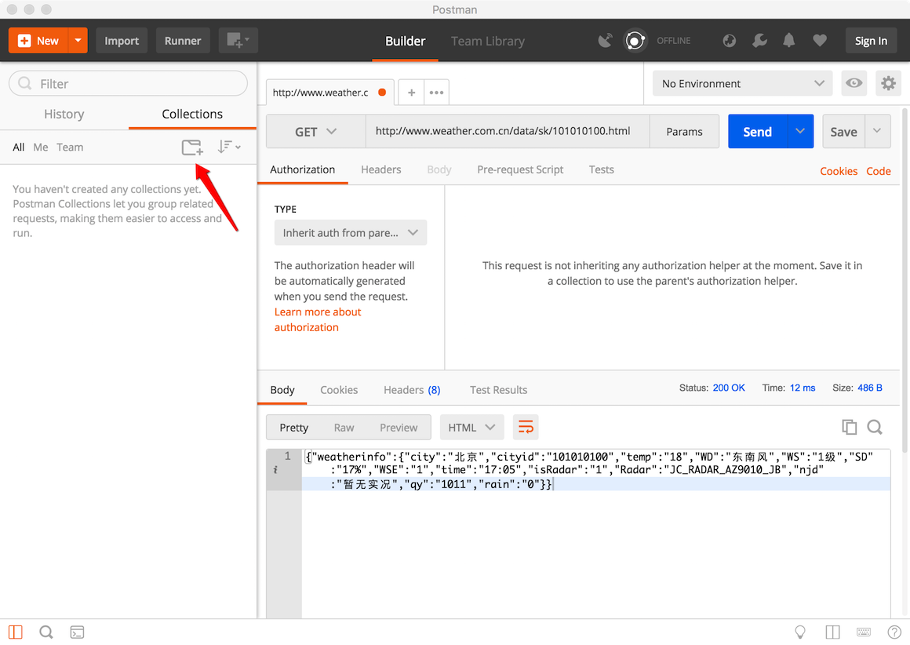
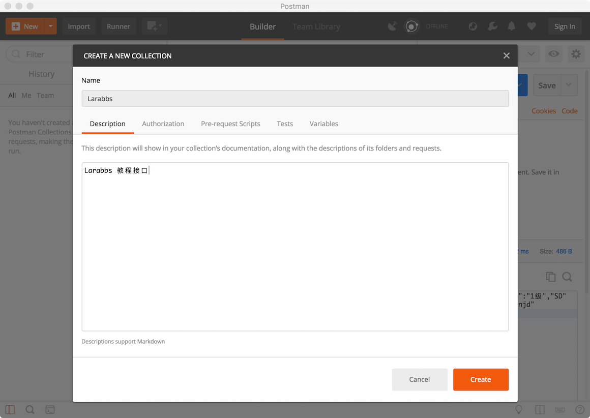
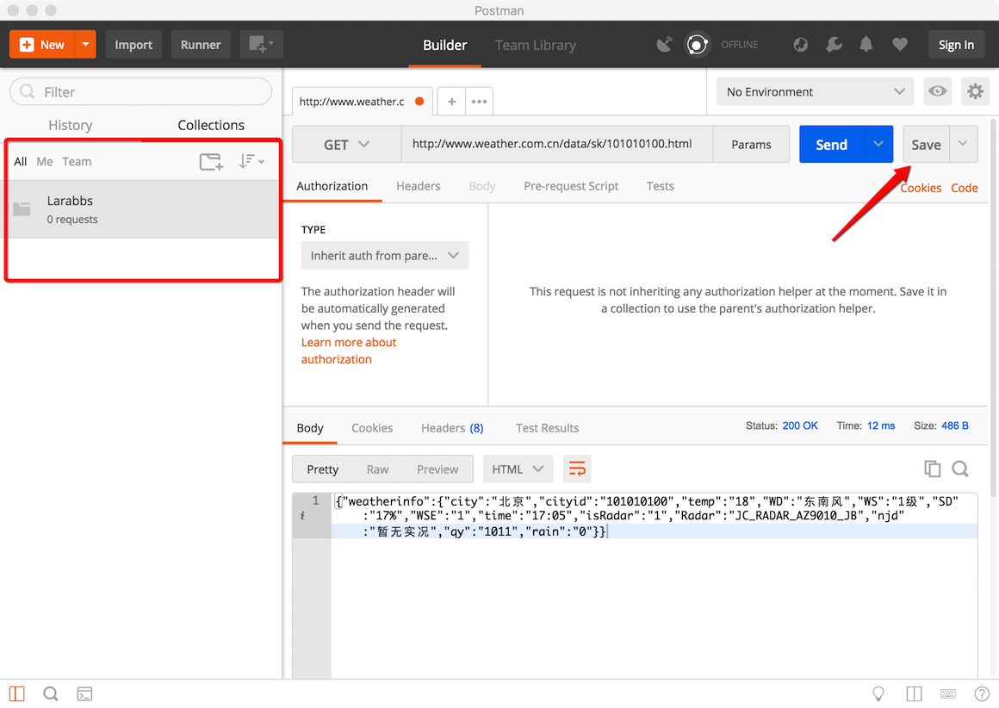
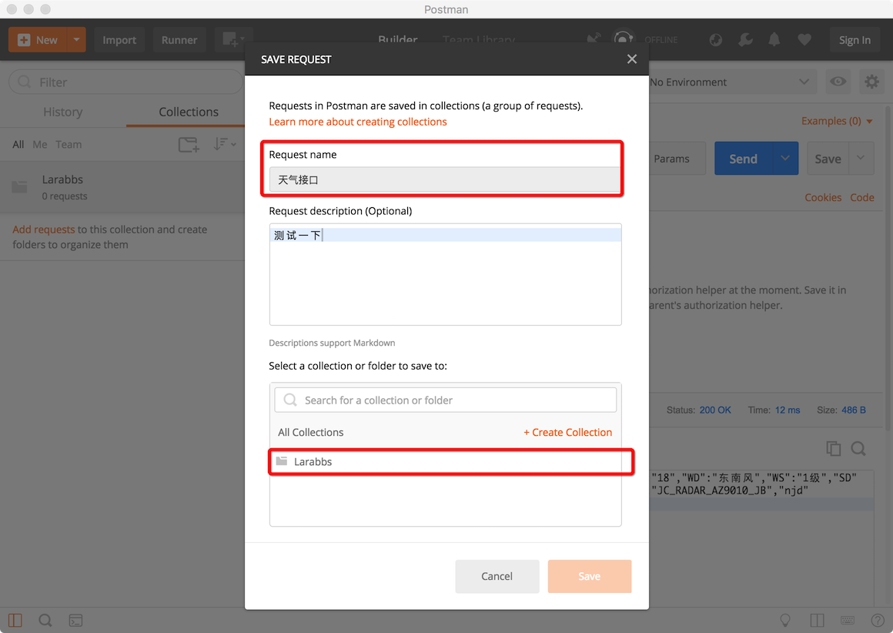
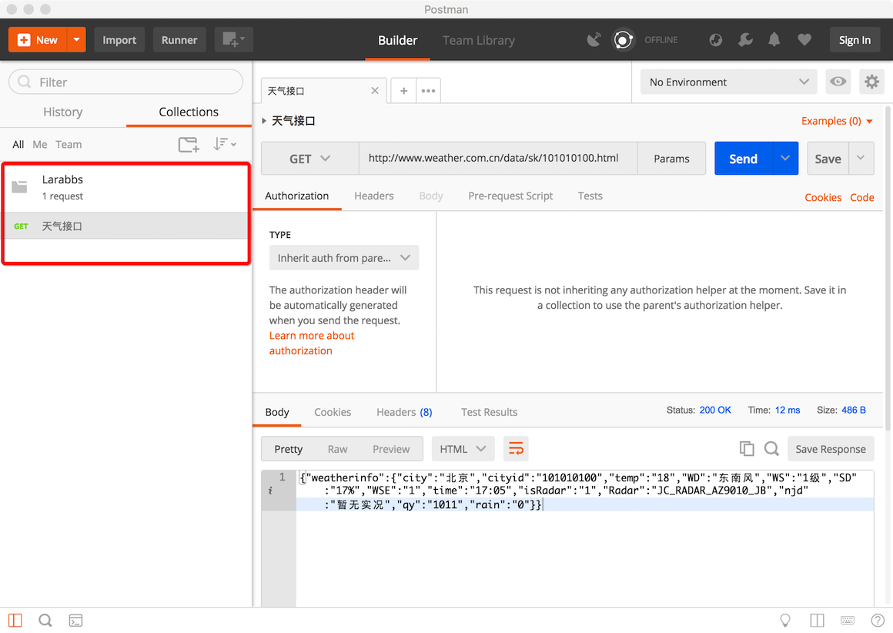

# 2.6. 安装 PostMan

原文链接：https://learnku.com/courses/laravel-advance-training/9.x/install-postman/12592

## 1. 什么是 PostMan？

PostMan 是一款跨平台的 API 调试工具，可以在 [PostMan官网](https://www.getpostman.com/) 下载，或者使用 [百度网盘下载](https://pan.baidu.com/s/1dEMMD2L)。

打开 PostMan 界面如上图所示，大体可以分为四个区域，左侧`接口集合`类似文件夹的功能，我们可以把我们的接口保存在这里，右侧上中下分别是`请求地址`，`请求参数`和`请求结果`。

随便找个接口调用一下，这个是国家气象局提供的 [天气预报接口](http://www.weather.com.cn/data/sk/101010100.html)，将其填入『请求地址』处：

可以在左侧的区域，保存接口，我们新建一个 `Larabbs` 目录。

在左侧我们看到了新建的文件夹 Larabbs，然后保存接口。

可以给接口起个名字，填写响应的描述。

我们可以将已经调试好的接口保存下来，方便下次调试，PostMan 也为我们提供了导出导入接口的功能，方便分享接口给他人，当然 PostMan 也为付费用户提供了更多方便的功能，大家有需要的可以去官网了解，目前免费版的功能已经满足我们的需求。
