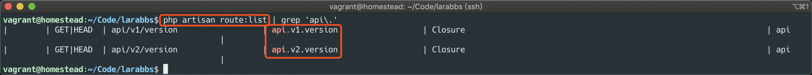
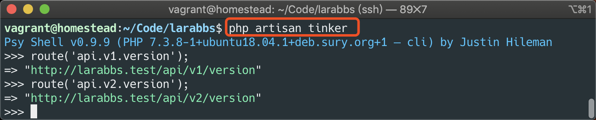
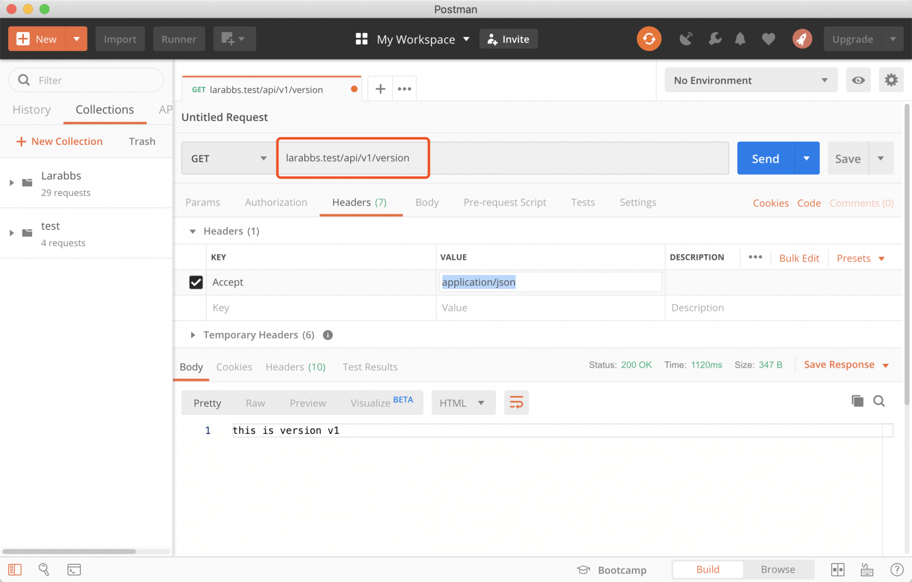
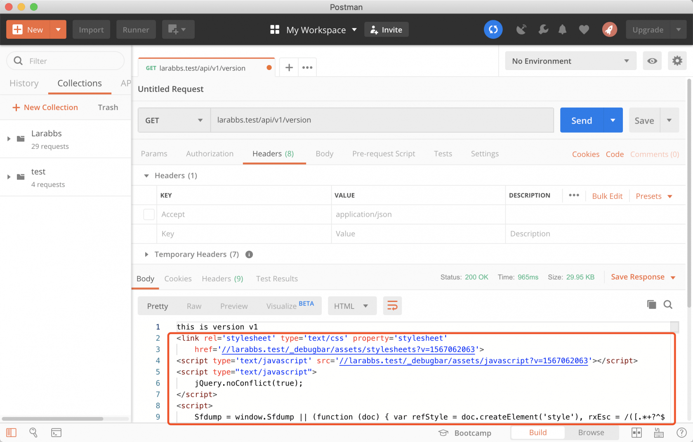
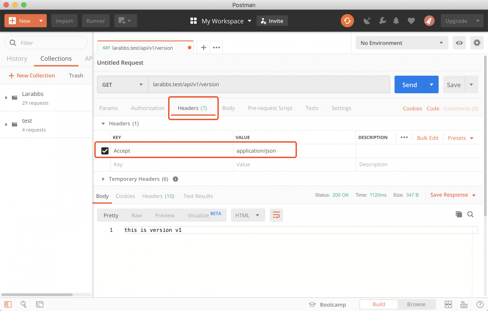
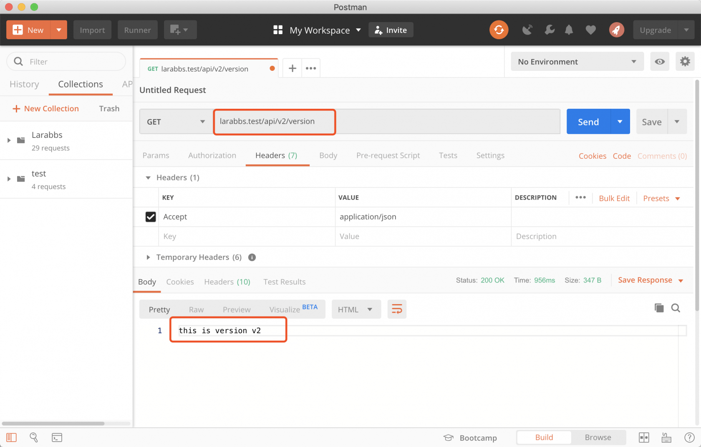
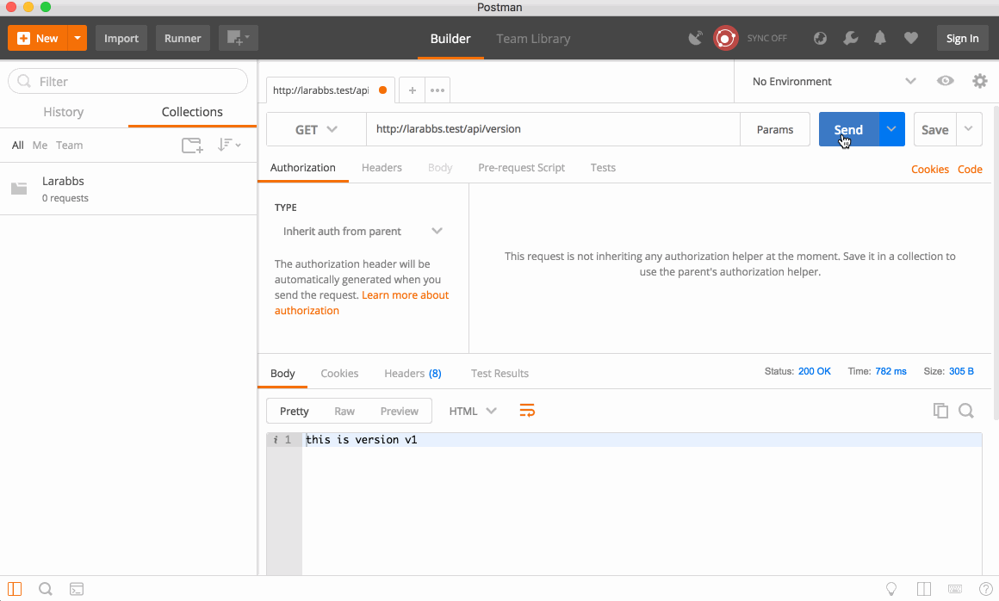
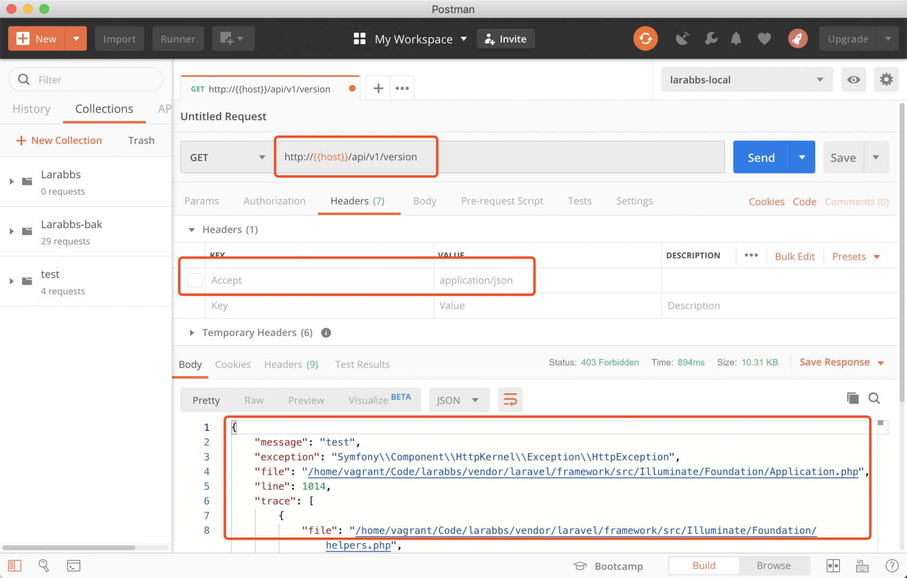

# 2.7. API 基础环境

原文链接：https://learnku.com/courses/laravel-advance-training/9.x/api-foundation-environment/12593

在之前的版本的课程中，一直是使用 [Dingo Api](https://github.com/dingo/api/) 来快速完成接口开发的，Dingo Api 是一个完整的 API 开发工具包，包含了非常多的功能，尤其是很好的结合了 [Fractal](https://fractal.thephpleague.com/) 来进行资源数据的格式化。

Laravel 5.5 开始提供了[API Resources](https://learnku.com/docs/laravel/7.x/eloquent-resources) 的功能，用来格式化资源，到现在的 Laravel 9.x，功能越来越完善，也有其他的扩展包代替 Dingo 提供的其他功能，所以从 `9.x` 开始，我们不再使用 Dingo 来开发接口，使用 Laravel 框架自带的功能，会得到更多的优化和帮助，也会有更多的扩展包可以使用。

当然继续使用 Dingo 开发也是没有任何问题的。

## 1. 接口版本控制

回顾一下之前的课程 [2.5. Github 的 Restful HTTP API 设计分解](https://learnku.com/courses/laravel-advance-training/9.x/follow-github-to-learn-restful-http-api-design/10006) 接口版本控制通常有两种方式，通过 URL 前缀或 Accept 头来区分。

如果使用 Dingo 来开发，可以方便的使用 Accept 头来进行版本的切换，但是不使用其他扩展包的情况下，直接使用 URL 是最简单的方式。

### 测试接口

先来写两个测试路由

routes/api.php

```
.
.
.
Route::prefix('v1')->name('api.v1.')->group(function() {
Route::get('version', function() {
return 'this is version v1';
})->name('version');
});

Route::prefix('v2')->name('api.v2.')->group(function() {
Route::get('version', function() {
return 'this is version v2';
})->name('version');
});
```

在 `api` 路由中添加两个测试路由。使用 `prefix` 方法指定不同版本的前缀，这里添加了两个版本，`v1` 和 `v2`。同时使用了 `name` 方法给路由名称增加了前缀，方便获取不同版本的接口地址。

使用命令  `route:list` 查看一下路由。



在 `tinker` 中尝试通过路由名称获取 URL。



### 接口调试

上一节我们已经安装好了 PostMan，尝试访问一下刚才添加的路由。`api.php` 路由中注册的所有路由，默认的前缀都是 api，尝试访问  `v1` 的版本 larabbs.test/api/v1/version。



注意这里如果你的访问结果是如下这样，有很多额外的 html ：



你需要检查一下 Headers ，确认已经添加了 Accept 头，值为 `application/json`。



这个 Accept Header 非常重要，用来告诉 Laravel 该如何返回响应，同时一些扩展包例如 `laravel-debugbar` 也会根据这个 头来决定是否添加 `debugbar` 。

尝试访问 v2 版本的接口 larabbs.test/api/v2/version 。



## 2. PostMan 的环境变量功能

PostMan 为我们提供了环境变量的功能，通过切换不同的值，可以使用不同的环境，比如 `host` 我们就可以做成变量，这样当我们某一天切换了本地调试的域名，比如由 larabbs.app 切换为 larabbs.test 时，不用去每个接口中修改，只需要修改变量即可。



比如上面，我们增加了一个环境变量 `host`，然后我们选择对应的环境，将域名替换为 `{{host}}`，PostMan url 中，使用双括号表示变量。同样能访问得到正确的结果。

## 3. 默认 Accept 头

Accept 这个头非常重要，决定了响应返回的格式，设置为 `application/json` 你遇到的所有报错，Laravel 会默认帮你处理为 Json 的格式。

但是这个头必须是客户端进行接口调用的时候设置，当有些时候客户端无法正确设置的时候，有没有办法默认就返回 Json 格式的响应呢。

其实我们可以添加一个中间件，给所有的 API 路由手动设置一下。

```
$ php artisan make:middleware AcceptHeader
```

app/Http/Middleware/AcceptHeader.php

```
<?php

namespace App\Http\Middleware;

use Closure;
use Illuminate\Http\Request;

class AcceptHeader
{
public function handle(Request $request, Closure $next)
{
$request->headers->set('Accept', 'application/json');

return $next($request);
}
}
```

代码非常简单，就是给请求添加一个 Accept 的头。

app/Http/Kernel.php

```
.
.
.
protected $middlewareGroups = [
'web' => [
.
.
.
],
'api' => [
\App\Http\Middleware\AcceptHeader::class,
'throttle:60,1',
\Illuminate\Routing\Middleware\SubstituteBindings::class,
],
];
.
.
.
```

最后在 api 中间件组中添加上这个中间件即可。

修改路由，抛出一个 403 错误测试一下。

routes/api.php

```
Route::prefix('v1')->name('api.v1.')->group(function() {
Route::get('version', function() {
abort(403, 'test');
return 'this is version v1';
})->name('version');
});
```

访问 [larabbs.test/api/v1/version](http://larabbs.test/api/v1/version) 。



现在在客户端无法正确设置 Accept 头的时候也能正常工作了，但是还是推荐所有客户端正确设置 Accept 头。

## 代码版本控制

删除一下测试的代码，只保留 v1 版本的路由分组。

```
<?php

use Illuminate\Http\Request;
use Illuminate\Support\Facades\Route;

Route::prefix('v1')->name('api.v1.')->group(function() {

});

```

提交代码

```
$ git add -A
$ git commit -m 'API 基础配置'
```
