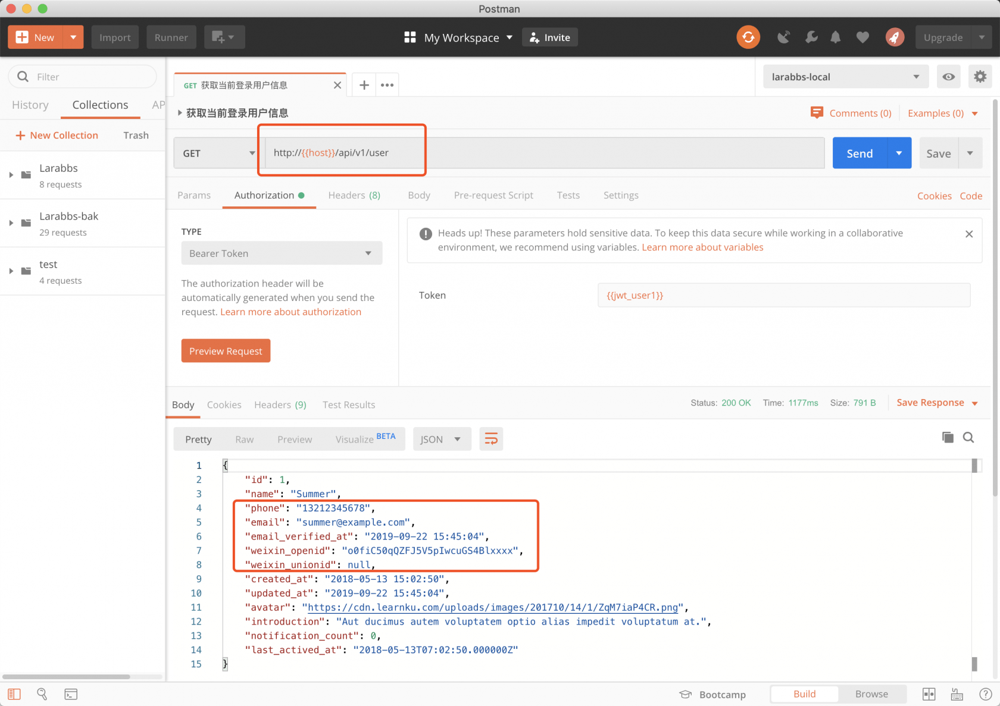
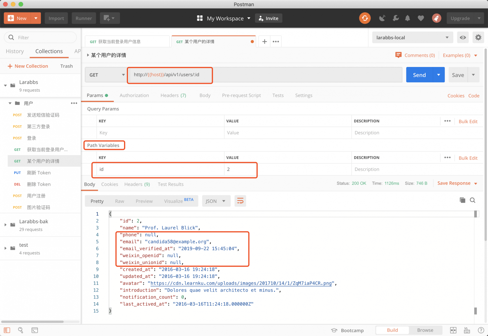
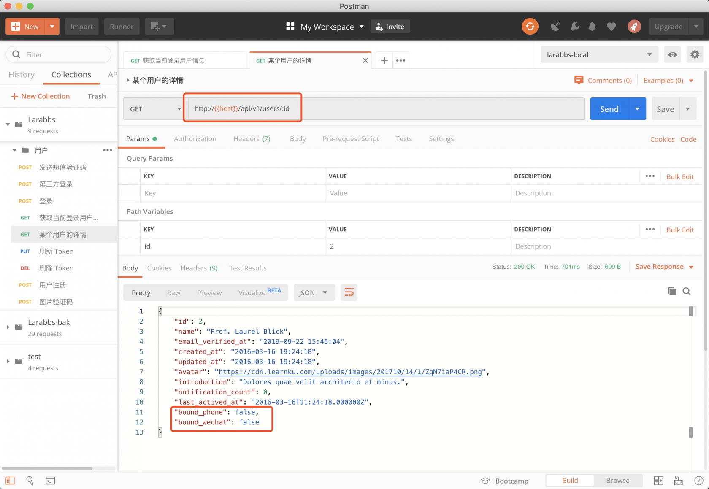
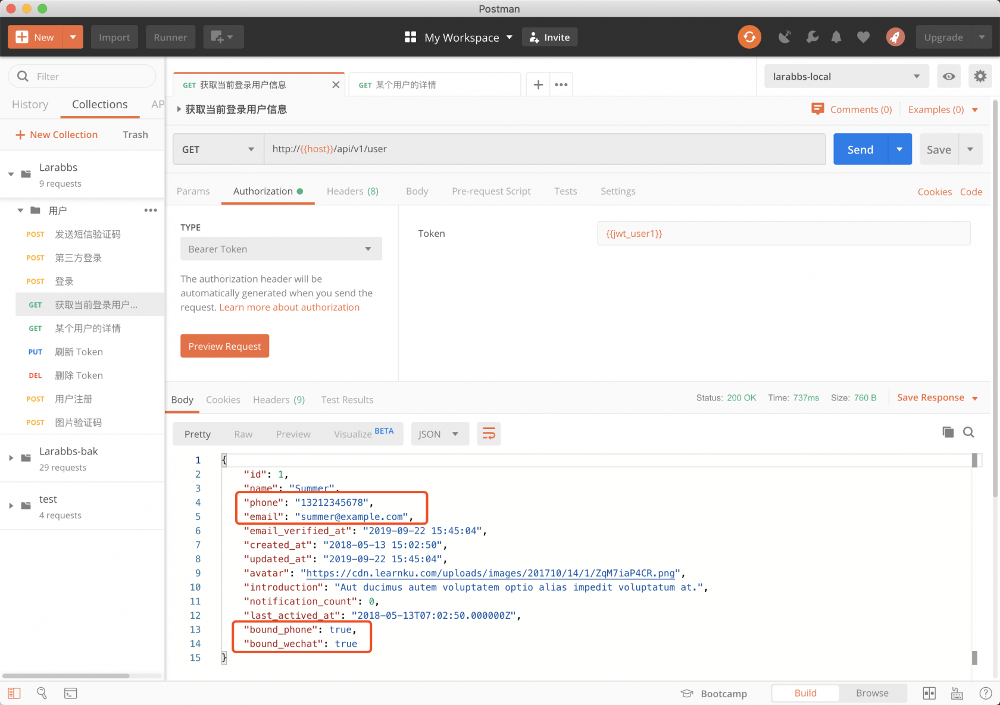

# 5.1. 获取用户信息

原文链接：https://learnku.com/courses/laravel-advance-training/9.x/get-personal-information/12609

上一章我们已经搞定了用户登录，登录成功后，接口会返回用户的 Token （JWT），并且已经创建了 UserResource 用来返回用户数据，接着我们需要通过用户 Token 获取用户的信息。

## 添加路由

routes/api.php

```
.
.
.
Route::middleware('throttle:' . config('api.rate_limits.access'))
->group(function () {
// 游客可以访问的接口

// 某个用户的详情
Route::get('users/{user}', [UsersController::class, 'show'])
->name('users.show');

// 登录后可以访问的接口
Route::middleware('auth:api')->group(function() {
// 当前登录用户信息
Route::get('user', [UsersController::class, 'me'])
->name('user.show');
});
});

.
.
.
```

还记得我们添加的调用频率限制吗，除了登录相关的接口，其他接口我们放在 access 这个频率限制的分组中，也就是剩下要完成的接口，统一 1 分钟只能调 用 60 次。

这里我们设计了两个接口：

1. 某个用户的信息 —— /users/{user}；

2. 当前登录用户的信息 —— /user。

当前登录用户也就是请求中带有正确  JWT 的用户，我们使用 `auth:api`  中间件验证用户的 JWT 是否合法。这样就将接口继续分为了两类：

- 游客可以访问的接口；

- 登录用户才可以访问的接口。

注意两个接口一个是单数，一个是复数。 user 主要参考了 Github 的设计思路 ，可以理解为`我`的意思。

## 修改控制器

app/Http/Controllers/Api/UsersController.php

```
.
.
.
public function show(User $user, Request $request)
{
return new UserResource($user);
}

public function me(Request $request)
{
return new UserResource($request->user());
}
}
```

可以看到控制器中的代码非常简单，由于有了路由模型绑定，所以 `某个用户的信息` 接口，可以直接获取到 id 对应的用户。而 `auth:api` 中间件对用户身份进行了判断，JWT 不正确的用户会抛出 401，而正确登录的用户，也就是 JWT 正确的用户，可以直接通过 `$request->user()` 获取，最后返回 `UserResource` 即可。

使用 Postman 请求接口测试一下：

传入正确的 JWT 请求当前用户信息。


传入 ID 请求某个用户的信息。


注意一下返回的用户信息，其中的 `phone`，`email`等都是敏感信息， 而 `weixin_openid` 不仅是敏感信息，用户也不需要关心这个数据，但是现在由于 `UserResource` 现在是个通用的用户数据层，所以我们还需要处理一下敏感信息。

## 屏蔽敏感信息

首先修改 User 模型将 `weixin_openid` 隐藏。

app/Models/User.php

```
.
.
.
protected $hidden = [
'password',
'remember_token',
'weixin_openid',
'weixin_unionid'
];
.
.
.
```

修改一下 `UserResource`。

app/Http/Resources/UserResource.php

```
<?php

namespace App\Http\Resources;

use Illuminate\Http\Resources\Json\JsonResource;

class UserResource extends JsonResource
{
protected $showSensitiveFields = false;

public function toArray($request)
{
if (!$this->showSensitiveFields) {
$this->resource->makeHidden(['phone', 'email']);
}

$data = parent::toArray($request);

$data['bound_phone'] = $this->resource->phone ? true : false;
$data['bound_wechat'] = ($this->resource->weixin_unionid || $this->resource->weixin_openid) ? true : false;

return $data;
}

public function showSensitiveFields()
{
$this->showSensitiveFields = true;

return $this;
}
}
```

在 `toArray` 方法中，最后的返回数据中，增加了两个字段：

- `bound_phone`是否绑定手机；

- `bound_wechat`是否绑定微信。

>

或者可以返回`phone` 但是部分手机数字用 `*` 替换，总之就是需要保护用户敏感信息。

接着简单的设计了一个 `showSensitiveFields` 的开关，默认是 false，也就是默认将 `phone` 和 `email` 字段隐藏。

app/Http/Controllers/Api/UsersController.php

```
.
.
.
public function store(UserRequest $request)
{
.
.
.
return (new UserResource($user))->showSensitiveFields();
}

public function show(User $user, Request $request)
{
return new UserResource($user);
}

public function me(Request $request)
{
return (new UserResource($request->user()))->showSensitiveFields();
}
}
```

这样我们在控制器中就可以调用开关，用来控制是否返回敏感信息。

再次使用 Postman 测试一下

获取某个用户信息接口不会返回敏感信息。



获取自己的信息会返回敏感信息。



## 代码版本控制

```
$ git add -A
$ git commit -m '用户信息'
```
