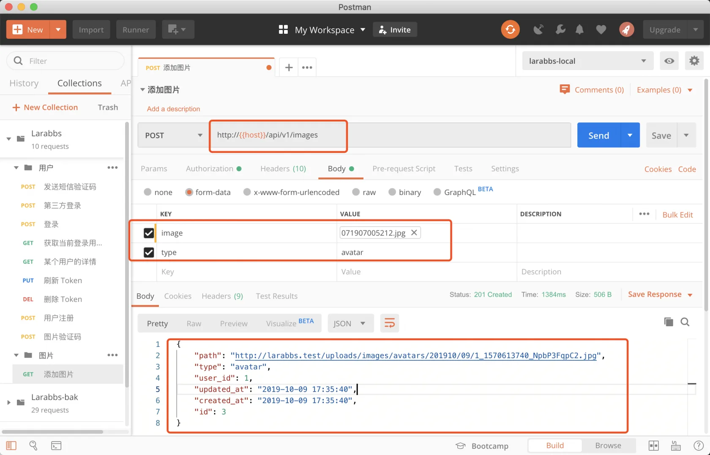
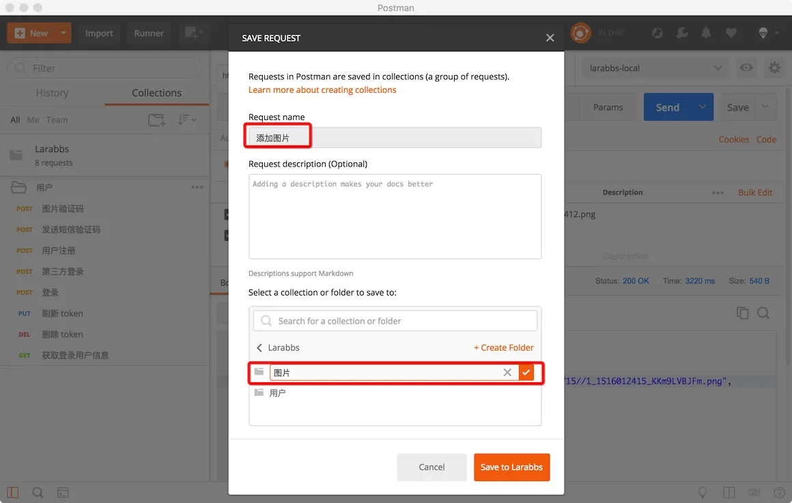
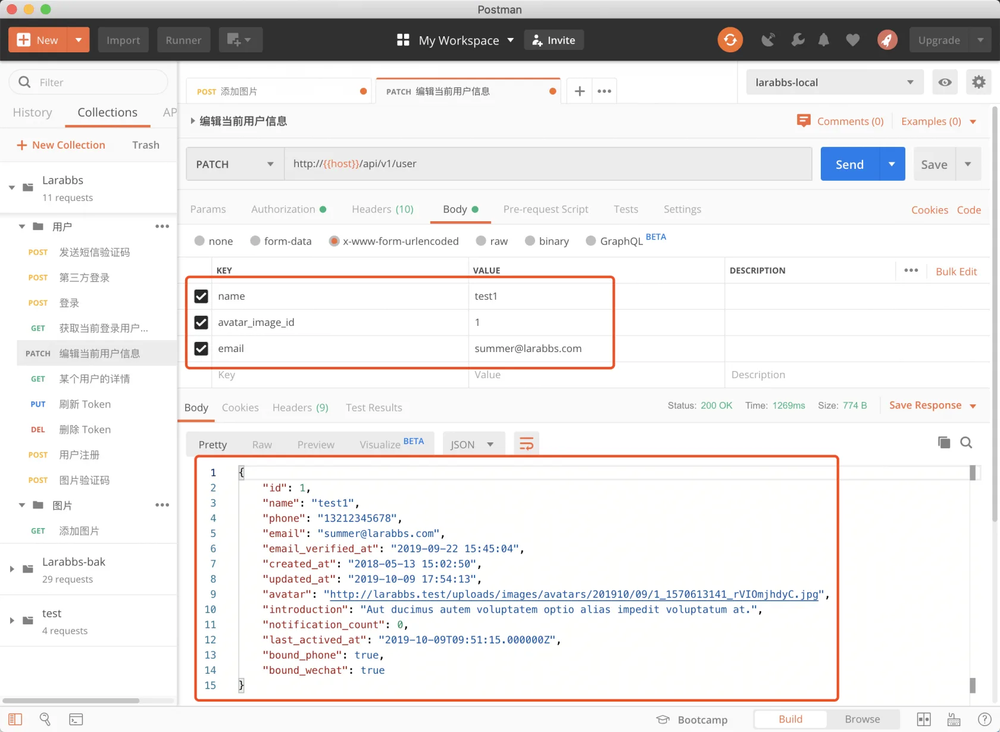

# 5.2. 编辑个人资料

原文链接：https://learnku.com/courses/laravel-advance-training/9.x/editing-personal-data/12610

## 编辑个人资料

在本章节中，我们将开发用户的编辑接口，允许用户对自己的用户名、邮箱、简介和头像进行修改。

## 数据的提交方式

HTTP 提交数据有两种方式

- application/x-www-form-urlencoded(默认值)

- multipart/form-data

大家应该记得，form 表单提交文件的时候，需要增加 `enctype="multipart/form-data"`，才能正确传输文件，因为默认的`enctype` 是 `enctype="application/x-www-form-urlencoded"`。

需要明确的是，只有当 POST 配合 `multipart/form-data` 时才能正确传输文件。

## 图片资源

我们设计 API 时，修改相关的 API 通常会使用 `put` 或 `patch`，但是因为要修改用户头像，又必须使用 POST 的 `multipart/form-data`，难道所有涉及到文件的接口我们都必须设计为 POST 吗？

其实一般有关文件上传的接口，我们一般会设计为两个，例如 Larabbs 的业务，我们可以设计一个图片资源——images，修改头像的逻辑为：

- 调用 POST `/images` 在服务器创建图片资源；

- 通过图片资源的 `id` 或路径，请求修改头像接口。

我们首先可以添加一个图片资源

```
$ php artisan make:migration create_images_table
```

修改文件，注意替换文件日期

database/migrations/< your_date >_create_images_table.php

```
<?php

use Illuminate\Support\Facades\Schema;
use Illuminate\Database\Schema\Blueprint;
use Illuminate\Database\Migrations\Migration;

class CreateImagesTable extends Migration
{
public function up()
{
Schema::create('images', function (Blueprint $table) {
$table->id();
$table->bigInteger('user_id')->index();
$table->string('type')->index();
$table->string('path');
$table->timestamps();
});
}

public function down()
{
Schema::dropIfExists('images');
}
}
```

images 表记录了用户 id，图片路径，以及图片类型。图片类型有两种 `avatar` 和 `topic`，分别用于用户头像以及话题中的图片。记录图片类型是因为不同类型的图片有不同的尺寸，以及不同的文件目录，修改个人头像所使用的 `image` 必须为 `avatar` 类型。

执行 `migrate`。

```
$ php artisan migrate
```

创建模型，request 以及controller。

```
$ php artisan make:model Image
$ php artisan make:request Api/ImageRequest
$ php artisan make:controller Api/ImagesController
```

添加路由

routes/api.php

```
.
.
.
use App\Http\Controllers\Api\ImagesController;
.
.
.
// 登录后可以访问的接口
Route::middleware('auth:api')->group(function() {
// 当前登录用户信息
Route::get('user', 'UsersController@me')
->name('user.show');
// 上传图片
Route::post('images', [ImagesController::class, 'store'])
->name('images.store');

});
.
.
.
```

修改如下

app\Models\Image.php

```
<?php

namespace App\Models;

use Illuminate\Database\Eloquent\Factories\HasFactory;
use Illuminate\Database\Eloquent\Model;

class Image extends Model
{
use HasFactory;

protected $fillable = ['type', 'path'];

public function user()
{
return $this->belongsTo(User::class);
}
}
```

app/Http/Requests/Api/ImageRequest.php

```
<?php

namespace App\Http\Requests\Api;

class ImageRequest extends FormRequest
{
public function rules()
{

$rules = [
'type' => 'required|string|in:avatar,topic',
];

if ($this->type == 'avatar') {
$rules['image'] = 'required|mimes:jpeg,bmp,png,gif|dimensions:min_width=200,min_height=200';
} else {
$rules['image'] = 'required|mimes:jpeg,bmp,png,gif';
}

return $rules;
}

public function messages()
{
return [
'image.dimensions' => '图片的清晰度不够，宽和高需要 200px 以上',
];
}
}
```

参考 Larabbs 网页部分的头像处理，我们要求如果是头像类型的图片资源，宽和高必须在 200px 以上。

创建 `ImageResource`

```
$ php artisan make:resource ImageResource
```

app/Http/Controllers/Api/ImagesController.php

```
<?php

namespace App\Http\Controllers\Api;

use App\Models\Image;
use Illuminate\Support\Str;
use Illuminate\Http\Request;
use App\Handlers\ImageUploadHandler;
use App\Http\Resources\ImageResource;
use App\Http\Requests\Api\ImageRequest;

class ImagesController extends Controller
{
public function store(ImageRequest $request, ImageUploadHandler $uploader, Image $image)
{
$user = $request->user();

$size = $request->type == 'avatar' ? 416 : 1024;
$result = $uploader->save($request->image, Str::plural($request->type), $user->id, $size);

$image->path = $result['path'];
$image->type = $request->type;
$image->user_id = $user->id;
$image->save();

return new ImageResource($image);
}
}
```

两种图片类型，头像和话题，会利用 `ImageUploadHandler` 进行存储和裁剪。使用 PostMan 测试一下图片接口。



记得保存接口，可以新建一个图片目录



### 编辑个人资料接口

添加编辑个人资料接口

routes/api.php

```
.
.
.
// 编辑登录用户信息
Route::patch('user', [UsersController::class, 'update'])
->name('user.update');

// 上传图片
Route::post('images', 'ImagesController@store')
->name('images.store');
.
.
.
```

注意这里使用的方法是 patch，patch 与 put 的区别为：

- put 替换某个资源，需提供完整的资源信息；

- patch 部分修改资源，提供部分资源信息。

修改 `UserRequest`

app/Http/Requests/Api/UserRequest.php

```
<?php

namespace App\Http\Requests\Api;

class UserRequest extends FormRequest
{
public function rules()
{
switch($this->method()) {
case 'POST':
return [
'name' => 'required|between:3,25|regex:/^[A-Za-z0-9\-\_]+$/|unique:users,name',
'password' => 'required|string|min:6',
'verification_key' => 'required|string',
'verification_code' => 'required|string',
];
break;
case 'PATCH':
$userId = auth('api')->id();

return [
'name' => 'between:3,25|regex:/^[A-Za-z0-9\-\_]+$/|unique:users,name,' .$userId,
'email'=>'email|unique:users,email,'.$userId,
'introduction' => 'max:80',
'avatar_image_id' => 'exists:images,id,type,avatar,user_id,'.$userId,
];
break;
}
}

public function attributes()
{
return [
'verification_key' => '短信验证码 key',
'verification_code' => '短信验证码',
];
}

public function messages()
{
return [
'name.unique' => '用户名已被占用，请重新填写',
'name.regex' => '用户名只支持英文、数字、横杆和下划线。',
'name.between' => '用户名必须介于 3 - 25 个字符之间。',
'name.required' => '用户名不能为空。',
];
}
}
```

修改头像时，我们先创建 `avatar` 类型的图片资源，然后提交 `avatar_image_id` 即可。

app/Http/Controllers/Api/UsersController.php

```
.
.
.
use App\Models\Image;
.
.
.
public function update(UserRequest $request)
{
$user = $request->user();

$attributes = $request->only(['name', 'email', 'introduction']);

if ($request->avatar_image_id) {
$image = Image::find($request->avatar_image_id);

$attributes['avatar'] = $image->path;
}

$user->update($attributes);

return (new UserResource($user))->showSensitiveFields();
}
.
.
.
```

客户端提交什么，服务器就修改对应的资源。使用 PostMan 调用接口，别忘了设置 `Bearer Token` ，之前教程中我们增加的几个 token 变量可以直接使用，例如 `{{jwt_user1}}`，指定你要修改哪个用户的资料。



注意这里需要使用 `x-www-form-urlencoded`。

## 代码版本控制

```
$ git add -A
$ git commit -m '编辑用户信息'
```
