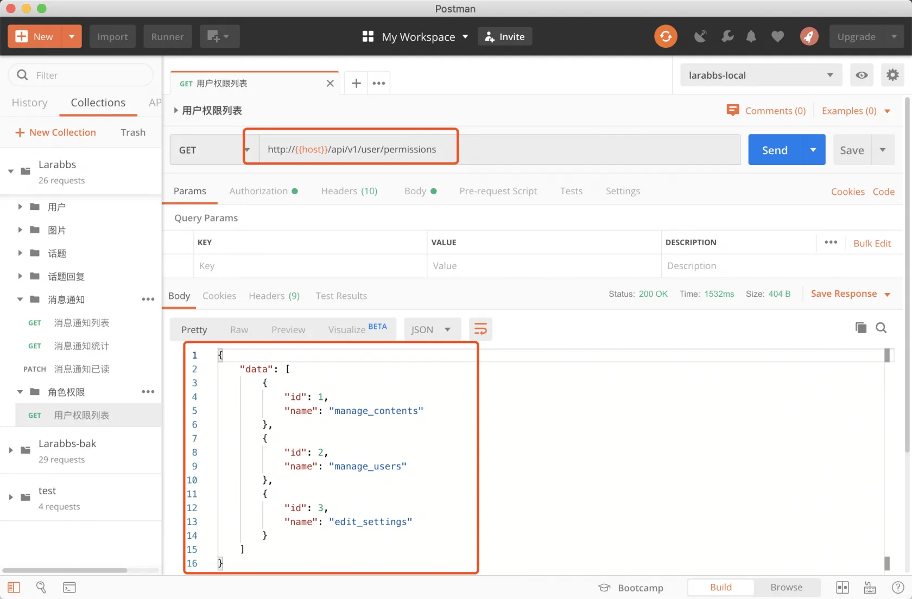
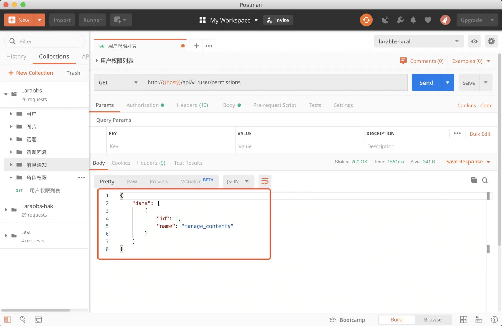
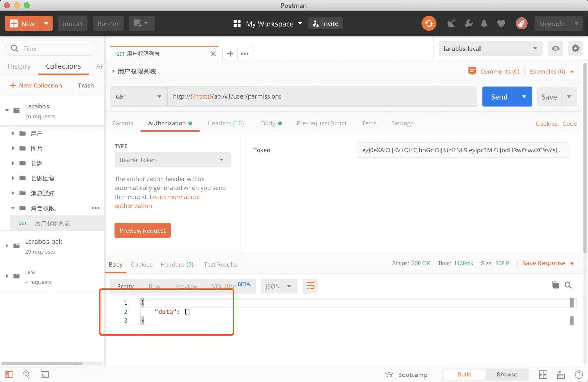

# 8.2. 权限列表

原文链接：https://learnku.com/courses/laravel-advance-training/9.x/permissions-list/12627

## 权限列表

在这个章节中，我们来开发权限数据接口。客户端可以在用户登录成功之后，请求 `权限列表接口`，缓存在本地，渲染页面的时候，根据用户权限，以及用户与资源的关系，来完成对页面显示的控制。

## 1. 增加 Controller

```
$ php artisan make:controller Api/PermissionsController
```

## 2. 添加路由

首先需要获取『自己的』权限，我们使用 `user` 表示 `我` 的概念，所以设计为 `user/permissions`。

```
.
.
.
use App\Http\Controllers\Api\PermissionsController;
.
.
.
// 标记消息通知为已读
Route::patch('user/read/notifications', [NotificationsController::class, 'read'])
->name('user.notifications.read');

// 当前登录用户权限
Route::get('user/permissions', [PermissionsController::class, 'index'])
->name('user.permissions.index');
.
.
.
```

## 3. 增加 Resource

```
$ php artisan make:resource PermissionResource
```

app/Http/Resources/PermissionResource.php

```
<?php

namespace App\Http\Resources;

use Illuminate\Http\Resources\Json\JsonResource;

class PermissionResource extends JsonResource
{
public function toArray($request)
{
return [
'id' => $this->id,
'name' => $this->name,
];
}
}

```

## 4. 修改 Controller

app/Http/Controllers/Api/PermissionsController.php

```
<?php

namespace App\Http\Controllers\Api;

use Illuminate\Http\Request;
use App\Http\Resources\PermissionResource;

class PermissionsController extends Controller
{
public function index(Request $request)
{
$permissions = $request->user()->getAllPermissions();

PermissionResource::wrap('data');
return PermissionResource::collection($permissions);
}
}
```

## 5. PostMan 调试

使用 id 为 1 的用户（站长）访问权限列表接口，看到该用户拥有全部权限。



使用 id 为 2 的用户（管理员）访问权限列表接口，看到该用户拥有 `manage_contents` 权限。



使用 id 为 3 的用户（普通用户）访问权限列表接口，该用户没有权限。



## 安全问题

将用户权限请求后缓存在本地会不会引入安全问题呢？

我们知道客户端的一切都是可以通过某种途径修改的，例如反编译 APP 后，修改代码，将某个用户权限修改为站长拥有的所有权限。这样是不是就代表用户可以修改或删除所有的话题了呢？

其实不是的，客户端缓存的权限列表，只是用于控制界面显示。数据的操作权限是在服务器端，接口服务器在执行某个操作时，始终会判断用户权限。例如 `TopicsController` 中的代码

app/Http/Controllers/Api/TopicsController.php

```
.
.
.
public function update(TopicRequest $request, Topic $topic)
{
$this->authorize('update', $topic);

$topic->update($request->all());
return new TopicResource($topic);
}

public function destroy(Topic $topic)
{
$this->authorize('destroy', $topic);

$topic->delete();
return response(null, 204);
}
.
.
.
```

在这个例子中，`话题修改接口` 和 `话题删除接口` 都会通过 [授权策略](https://learnku.com/docs/laravel/5.5/authorization) 提供的  `authorize` 方法来判断了用户是否具备某个操作的权限。

## 代码版本控制

```
$ git add -A
$ git commit -m '用户权限列表'
```
