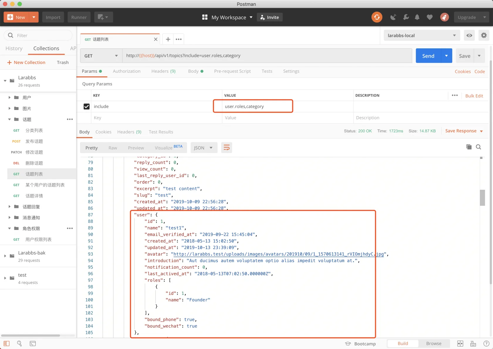

# 8.3. 用户角色

原文链接：https://learnku.com/courses/laravel-advance-training/9.x/role-list/12628

## 用户角色列表

这个章节我们来处理用户角色的部分，客户端有可能在某些地方显示用户角色信息，例如某个用户的个人页面里，显示出用户是站长，还是管理员，可以通过 Include 机制实现。

## 1. 增加  RoleResource

```bash
$ php artisan make:resource RoleResource
```

app/Http/Resources/RoleResource.php

```
<?php

namespace App\Http\Resources;

use Illuminate\Http\Resources\Json\JsonResource;

class RoleResource extends JsonResource
{
    public function toArray($request)
    {
        return [
            'id' => $this->id,
            'name' => $this->name,
        ];
    }
}
```

## 2. 修改 UserResource

app/Http/Resources/UserResource.php

```
public function toArray($request)
{
.
.
.
$data['bound_phone'] = $this->resource->phone ? true : false;
$data['bound_wechat'] = ($this->resource->weixin_unionid || $this->resource->weixin_openid) ? true : false;
$data['roles'] = RoleResource::collection($this->whenloaded('roles'));

return $data;
}
```

当模型加载了 roles 关系时，显示角色相关的数据。

## 3.. 修改 TopicQuery

app/Http/Queries/TopicQuery.php

```
.
.
.
parent::__construct(Topic::query());

$this->allowedIncludes('user', 'user.roles', 'category')
.
.
.
```

修改一下可用的 include 参数，增加 `user.roles`。

## 4. PostMan 调试

传入参数 `include=user.roles,category`。



## 代码版本控制

```bash
$ git add -A
$ git commit -m '显示用户角色'
```
