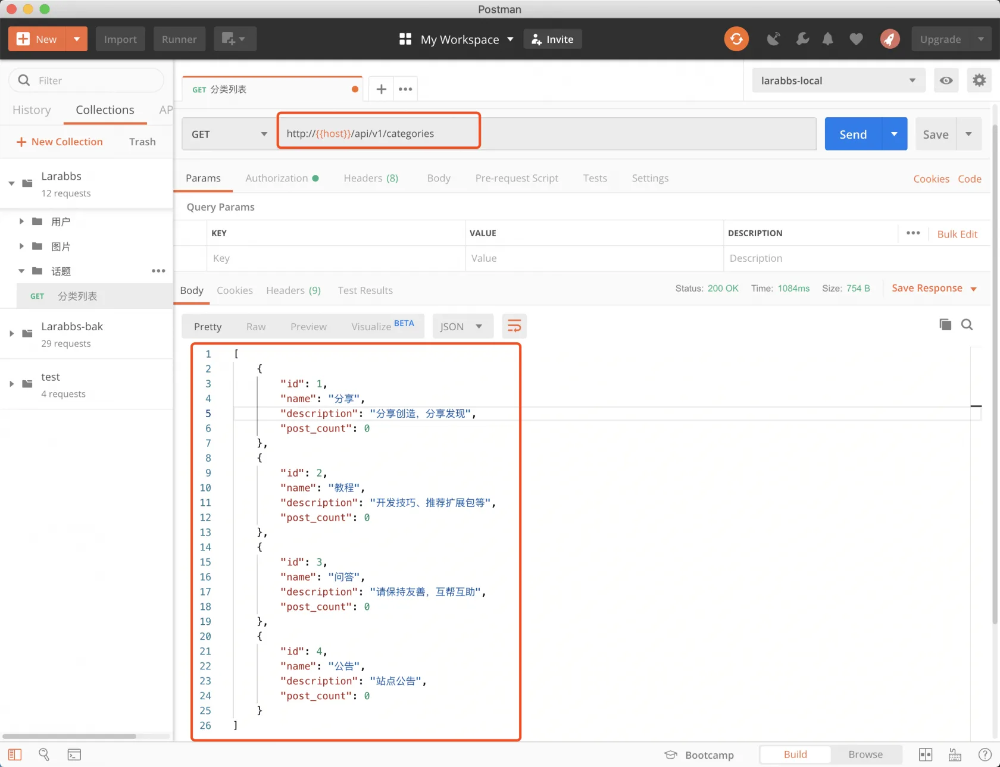
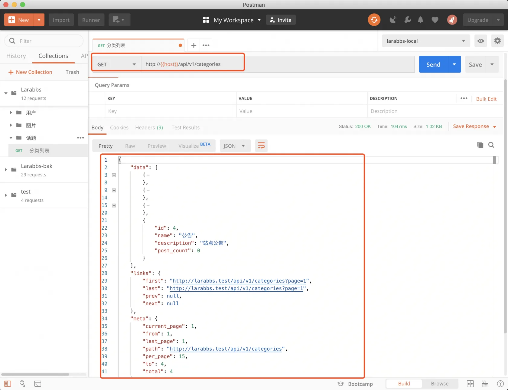
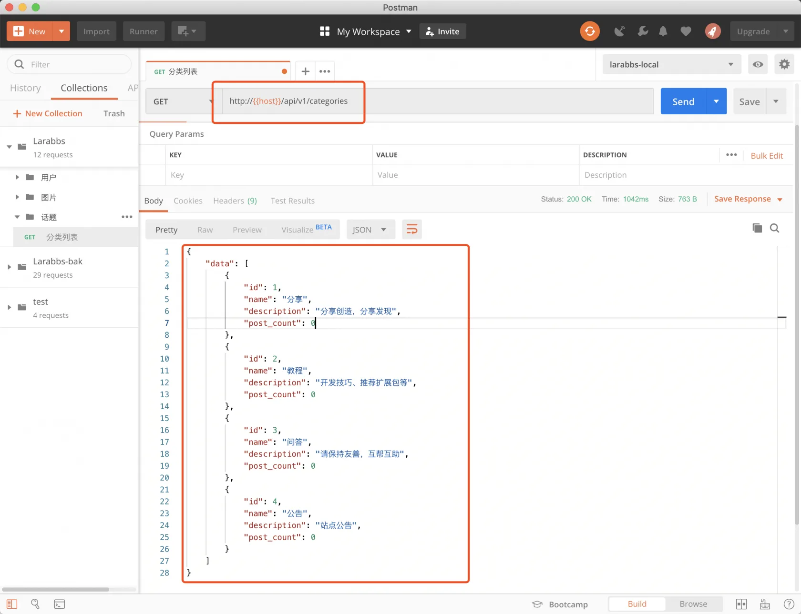

# 6.1. 分类列表

原文链接：https://learnku.com/courses/laravel-advance-training/9.x/classification-list/12612

## 分类列表

在这一章中，我们将完成话题相关的接口开发，每个话题一定是发布到某个分类下面，所以必须先要获取分类，所以这一节先来完成分类列表的接口。

## 1. 创建 Resource

```
$ php artisan make:resource CategoryResource
```

## 2. 创建 controller

```
$ php artisan make:controller Api/CategoriesController
```

修改如下

app/Http/Controllers/Api/CategoriesController.php

```
<?php

namespace App\Http\Controllers\Api;

use App\Models\Category;
use Illuminate\Http\Request;
use App\Http\Resources\CategoryResource;

class CategoriesController extends Controller
{
public function index()
{
return CategoryResource::collection(Category::all());
}
}
```

返回所有的分类信息。

## 2. 添加路由

回忆一下 Larabbs 的模型关系，每一个话题一定会属于某个分类，所以发布话题的时候，我们会从列表中选择一个分类，APP 首页也会显示出来不同分类便签，便于切换。

新增 `分类列表` 接口，分类列表是游客可访问的接口，不需要 token 验证。

routes/api.php

```
.
.
.
use App\Http\Controllers\Api\CategoriesController;
.
.
.
// 游客可以访问的接口

// 分类列表
Route::apiResource('categories', CategoriesController::class)
->only('index');

// 某个用户的详情
Route::get('users/{user}', [UsersController::class, 'show'])
->name('users.show');

.
.
.
```

## 4. 测试一下

使用 PostMan 调试一下接口：



## 5. 调整数据格式

这里你会发现一个问题，响应数据直接是一个数组，这是因为我们已经设置了 API 资源的数据包裹 `Resource::withoutWrapping();`，这样默认的单个资源，以及不分页的集合资源返回的数据中都不会增加 `data`
这一层。

但是这样就造成了，集合资源和分页资源的响应数据不统一，试着使用分页获取分类数据并返回。

- app/Http/Controllers/Api/CategoriesController.php*
```
.
.
.
return CategoryResource::collection(Category::paginate());
.
.
.
```



你会发现分页后数据中默认增加了分页相关的信息，而分类的数据是放在 `data` 下面的。由于大部分情况下我们返回的集合数据都会使用分页，所以为了数据统一，我们让无分页的集合资源也放在 `data` 下面。

- app/Http/Controllers/Api/CategoriesController.php*
```
.
.
.
public function index()
{
CategoryResource::wrap('data');
return CategoryResource::collection(Category::all());
}
.
.
.
```



这样就能确保所有集合资源的响应格式是统一的。

## 提交代码

```
$ git add -A
$ git commit -m '分类列表'
```
