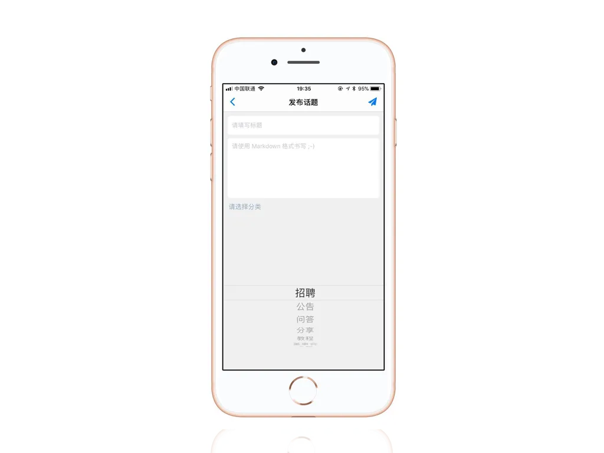
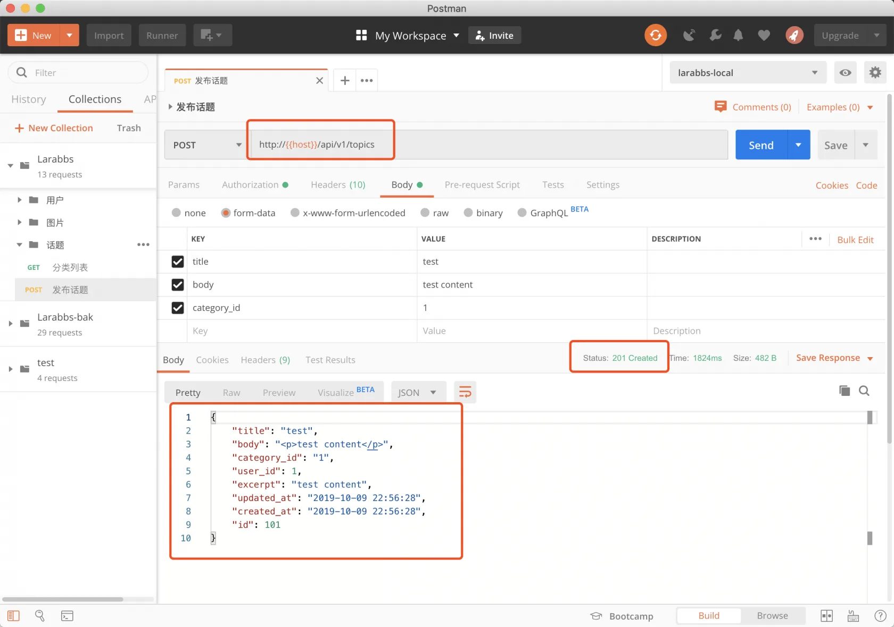
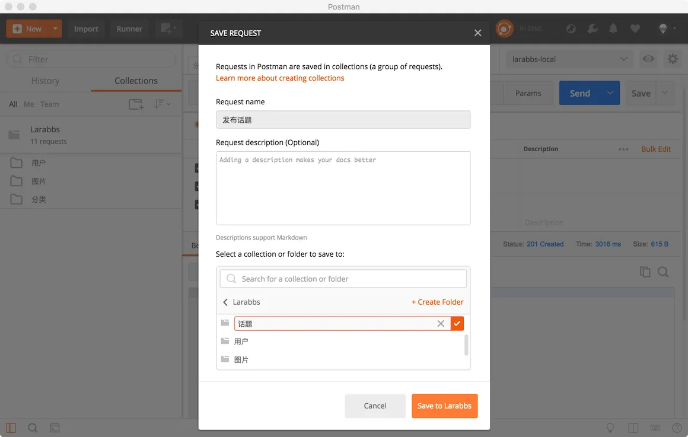

# 6.2. 发布话题

原文链接：https://learnku.com/courses/laravel-advance-training/9.x/issue-a-topic/12613

## 发布话题

这一节我们来完成发布话题的接口，首先参考以下发布话题的界面：



需要填写话题标题，话题内容，选择话题分类。

## 1. 创建 Controller

```bash
$ php artisan make:controller Api/TopicsController
```

## 2. 增加路由

首先来添加路由，只有登录用户才可以发布话题。

routes/api.php

```
.
.
.
use App\Http\Controllers\Api\TopicsController;
.
.
.
// 游客可以访问的接口

// 话题列表，详情
Route::apiResource('topics', TopicsController::class)->only([
'index', 'show'
]);
.
.
.
// 登录后可以访问的接口
.
.
.
// 发布，修改，删除话题
Route::apiResource('topics', TopicsController::class)->only([
'store', 'update', 'destroy'
]);

.
.
.
```

我们使用 resource 方法创建路由，不需要身份验证的接口为：

- topics.index ——话题列表；

- topics.show——话题详情；

需要身份验证的接口有：

- topics.store —— 发布话题；

- topics.update ——话题修改；

- topics.destroy——话题删除。

这节课我们先来完成话题发布。

## 3. 增加 Request

创建 TopicRequest：

```bash
$ php artisan make:request Api/TopicRequest
```

app/Http/Requests/Api/TopicRequest.php

```
<?php

namespace App\Http\Requests\Api;

class TopicRequest extends FormRequest
{
    public function rules()
    {
        return [
            'title' => 'required|string',
            'body' => 'required|string',
            'category_id' => 'required|exists:categories,id',
        ];
    }

    public function attributes()
    {
        return [
            'title' => '标题',
            'body' => '话题内容',
            'category_id' => '分类',
        ];
    }
}
```

## 4. 增加 Resource

```bash
$ php artisan make:resource TopicResource
```

如下修改：
app/Http/Resources/TopicResource.php

```
<?php

namespace App\Http\Resources;

use Illuminate\Http\Resources\Json\JsonResource;

class TopicResource extends JsonResource
{
    public function toArray($request)
    {
        return [
            'id' => $this->id,
            'title' => $this->title,
            'body' => $this->body,
            'category_id' => (int)$this->category_id,
            'user_id' => (int)$this->user_id,
            'reply_count' => (int)$this->reply_count,
            'view_count' => (int)$this->view_count,
            'last_reply_user_id' => (int)$this->last_reply_user_id,
            'order' => (int)$this->order,
            'excerpt' => $this->excerpt,
            'slug' => $this->slug,
            'created_at' => (string) $this->created_at,
            'updated_at' => (string) $this->updated_at,
        ];
    }
}
```

## 4. 修改 Controller

修改文件

app/Http/Controllers/Api/TopicsController.php

```
<?php

namespace App\Http\Controllers\Api;

use App\Models\Topic;
use Illuminate\Http\Request;
use App\Http\Resources\TopicResource;
use App\Http\Requests\Api\TopicRequest;

class TopicsController extends Controller
{
    public function store(TopicRequest $request, Topic $topic)
    {
        $topic->fill($request->all());
        $topic->user_id = $request->user()->id;
        $topic->save();

        return new TopicResource($topic);
    }
}
```

## 5. PostMan 调试



调试成功，保存接口，新建话题目录。


## 代码版本控制

```bash
$ git add -A
$ git commit -m '发布话题'
```
