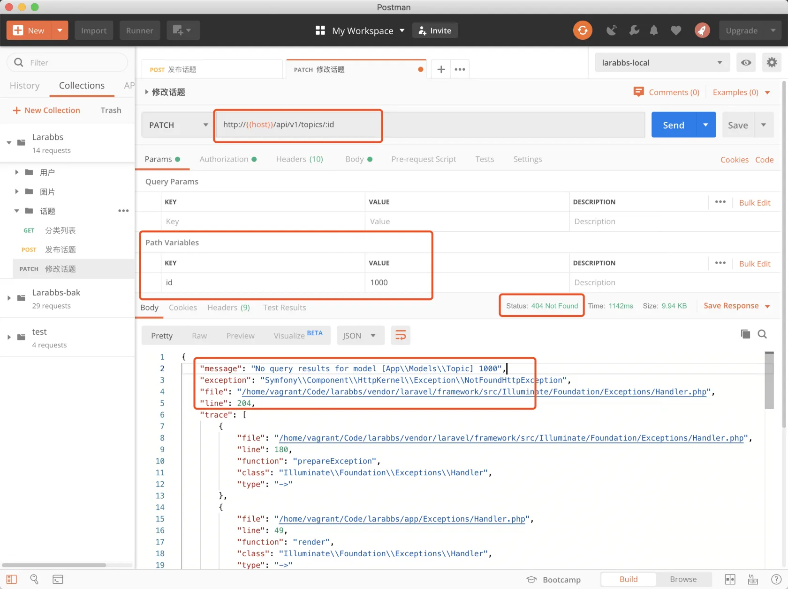
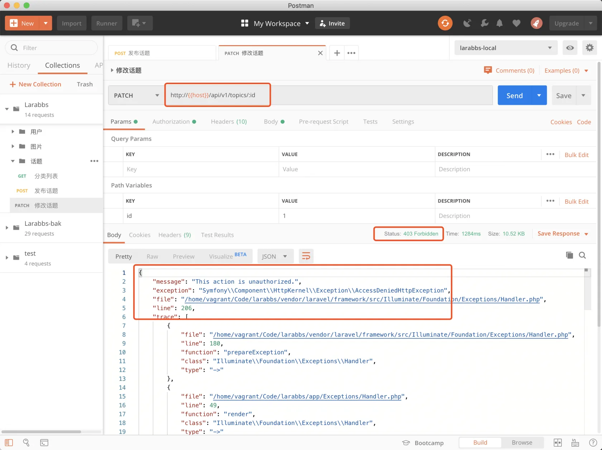
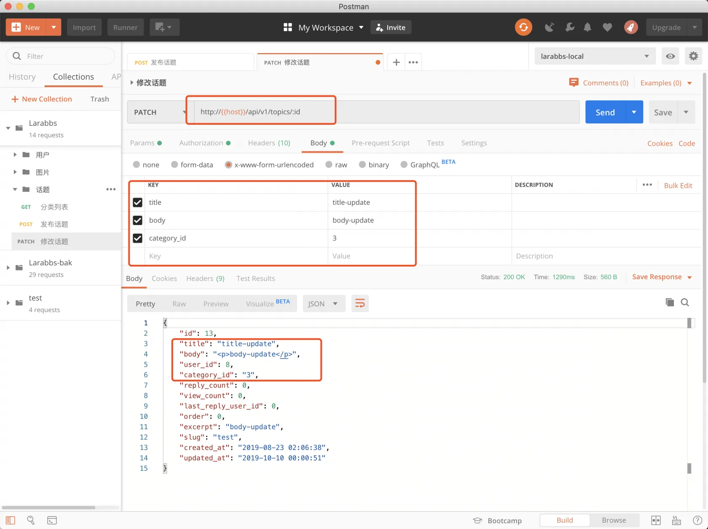

# 6.3. 修改话题

原文链接：https://learnku.com/courses/laravel-advance-training/9.x/modify-topics/12614

## 修改话题

本章节我们将一起开发修改话题的接口，路由上节课已经添加好了。

## 1. 修改 Request

app/Http/Requests/Api/TopicRequest.php

```
.
.
.
public function rules()
{
switch($this->method()) {
case 'POST':
return [
'title' => 'required|string',
'body' => 'required|string',
'category_id' => 'required|exists:categories,id',
];
break;
case 'PATCH':
return [
'title' => 'string',
'body' => 'string',
'category_id' => 'exists:categories,id',
];
break;
}
}
.
.
.
```

## 2. 修改 Controller

app/Http/Controllers/Api/TopicsController.php

```
.
.
.
public function update(TopicRequest $request, Topic $topic)
{
$this->authorize('update', $topic);

$topic->update($request->all());
return new TopicResource($topic);
}
.
.
.
```

在第二本教程中，已经添加了 topic 相关的 `policy`，所以这里可以直接使用 `$this->authorize('update', $topic);` 来判断用户是否有权限修改话题。

## 3. PostMan 调试

首先我们输入一个不存在的话题 id，应该会返回 404。



尝试修改别人的话题，这里我们使用 id 为8 的用户，id 为 1 的用户发布的话题。



没有权限修改，返回 403 错误。

>

注意不要使用有 `manage_contents` 权限的用户，也就是id 为 1 ，2 的用户，他们有管理内容的权限，所以可以修改任何人的话题。

最后正常修改自己的话题。



修改成功，注意 patch 需要使用 `x-www-form-urlencoded`。

## 代码版本控制

```bash
$ git add -A
$ git commit -m '话题修改'
```
