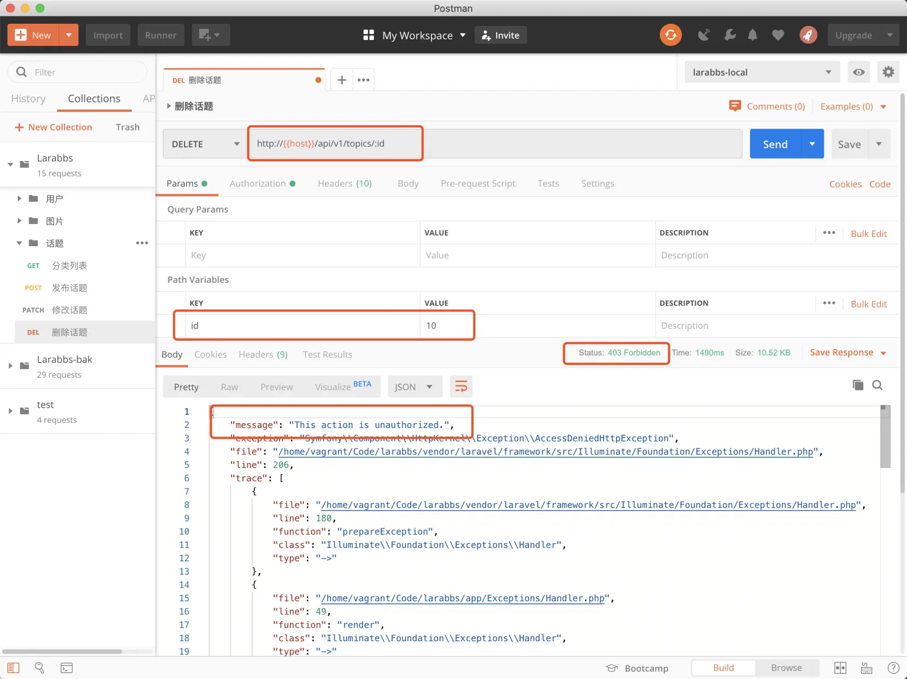
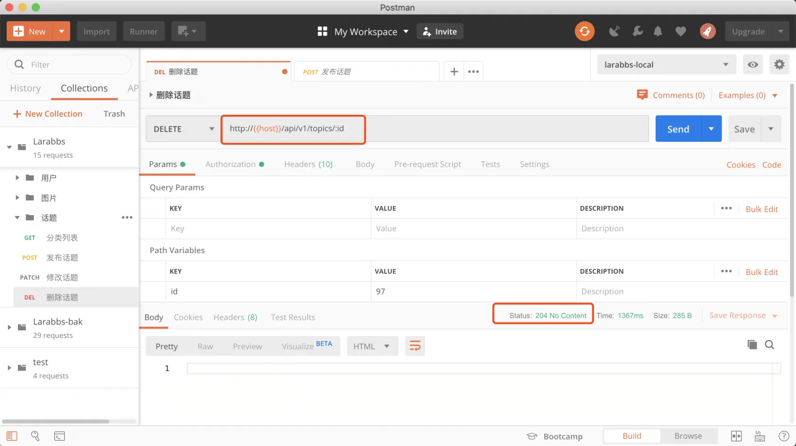

# 6.4. 删除话题

原文链接：https://learnku.com/courses/laravel-advance-training/9.x/deleting-the-topic/12615

## 删除话题

这一节我们将开发删除话题的接口，其实很简单，路由前面的课程中已经添加过了，只需要完成删除的  `destroy` 方法即可。

## 1. 修改 Controller

app/Http/Controllers/Api/TopicsController.php

```
.
.
.
public function destroy(Topic $topic)
{
$this->authorize('destroy', $topic);

$topic->delete();

return response(null, 204);
}
.
.
.
```

注意这里我们使用的是 `destroy` 的权限控制，判断用户是否有权限删除。

## 2. PostMan 调试

尝试删除别人的话题，注意不要使用有 `manage_contents` 权限的用户，也就是 ID 为 1，2的用户。



删除自己的话题。



删除成功

## 提交代码

```
$ git add -A
$ git commit -m '删除话题'
```
