# 6.5. 话题列表

原文链接：https://learnku.com/courses/laravel-advance-training/9.x/list-of-posts/12616

## 话题列表

参考以下界面：

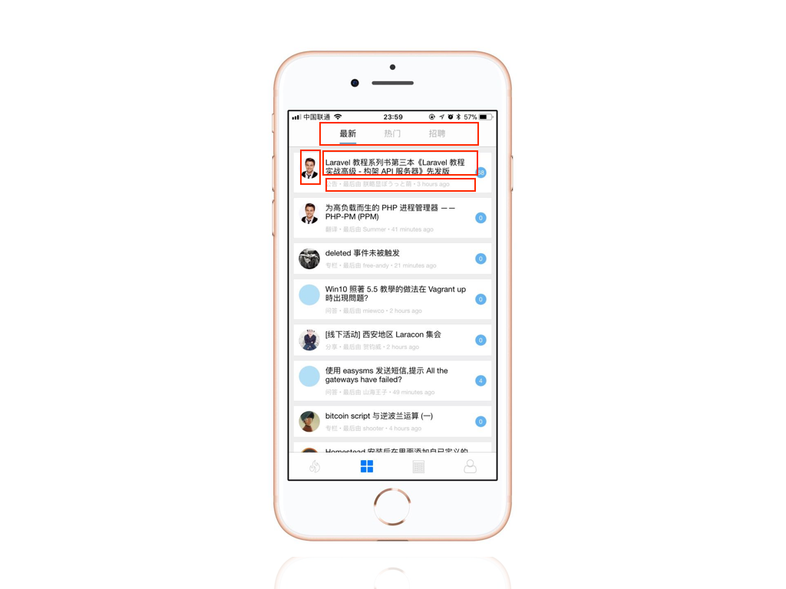

可以通过分类搜索，根据创建时间及最新回复排序，列表显示了用户信息，话题信息，分类信息。

### 1. 修改 Controller

因为使用的是 `resource` 方法创建的路由，我们直接完成  `index` 方法即可。

app/Http/Controllers/Api/TopicsController.php

```
.
.
.
public function index(Request $request, Topic $topic)
{
$query = $topic->query();

if ($categoryId = $request->category_id) {
$query->where('category_id', $categoryId);
}

$topics = $query->withOrder($request->order)->paginate();

return TopicResource::collection($topics);
}

.
.
.
```

PostMan 调用测试一下。

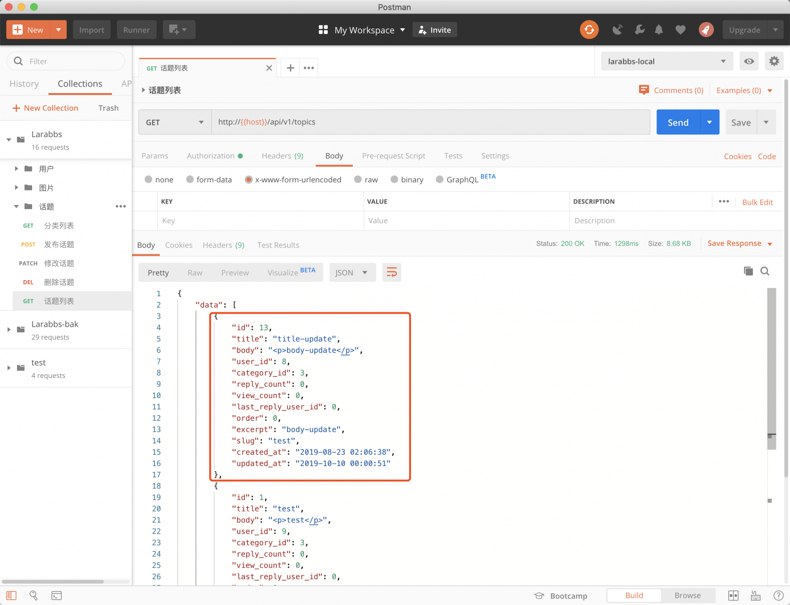

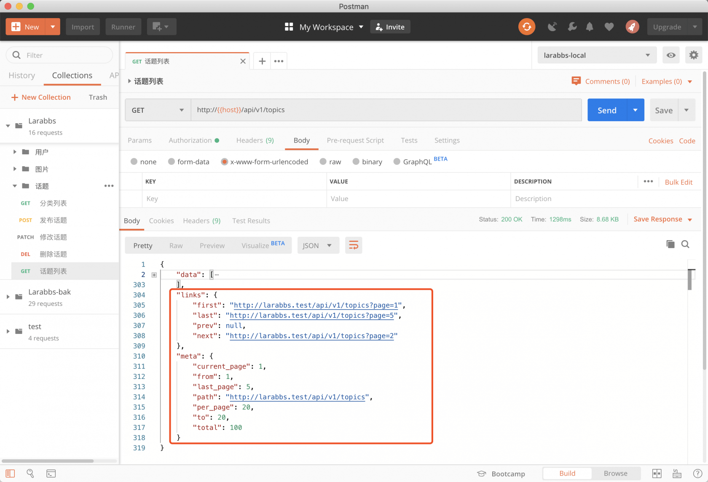

返回了话题列表，并且有分页数据。

## 显示发帖用户和分类数据

话题数据我们有了，但是发布话题的 `用户数据`，以及话题的 `分类数据` 还没有，那么

- 如何获取额外的资源数据？

- 资源数据该以什么样的结构返回？

其实 Resource 已经很好的解决了这两个问题。

首先修改 `TopicResource` 如下

app/Http/Resources/TopicResource.php

```
<?php

namespace App\Http\Resources;

use Illuminate\Http\Resources\Json\JsonResource;

class TopicResource extends JsonResource
{
public function toArray($request)
{
return [
'id' => $this->id,
'title' => $this->title,
'body' => $this->body,
'category_id' => (int)$this->category_id,
'user_id' => (int)$this->user_id,
'reply_count' => (int)$this->reply_count,
'view_count' => (int)$this->view_count,
'last_reply_user_id' => (int)$this->last_reply_user_id,
'order' => (int)$this->order,
'excerpt' => $this->excerpt,
'slug' => $this->slug,
'created_at' => (string) $this->created_at,
'updated_at' => (string) $this->updated_at,
'user' => new UserResource($this->whenLoaded('user')),
'category' => new CategoryResource($this->whenLoaded('category')),
];
}
}
```

修改一下 Controller

app/Http/Controllers/Api/TopicsController.php

```
.
.
.
public function index(Request $request, Topic $topic)
{
$query = $topic->query();

if ($categoryId = $request->category_id) {
$query->where('category_id', $categoryId);
}

$topics = $query
->with('user', 'category')
->withOrder($request->order)
->paginate();

return TopicResource::collection($topics);
}
.
.
.
```

Controller 中，请求话题数据的时候，我们使用 `with` 方法预加载了用户以及分类的数据，然后在 `TopicResource` 中通过 `whenLoaded` 判断是否已经预加载了 `user` 和 `category`，如果有，则使用对应的 Resource 处理并返回数据。

再来请求一下看看：

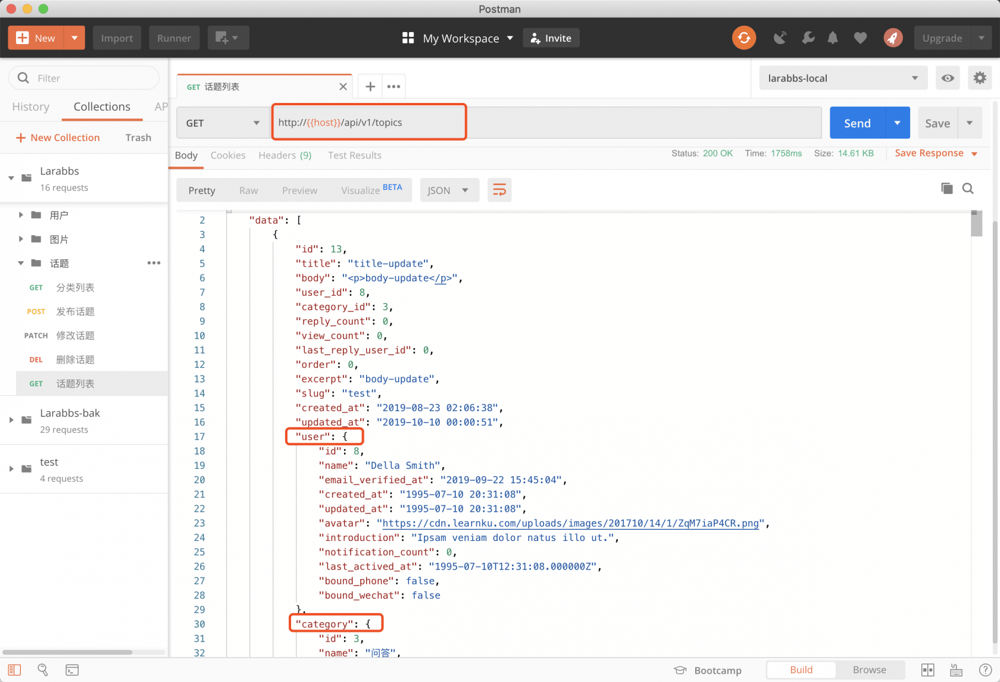

返回了正确的用户和分类信息，注意因为使用了 `UserResource` 处理，所以所有的用户数据都没有携带敏感信息。

## Include 机制

现在的话题列表接口会默认返回话题对应的用户数据以及分类数据，这样做不是太好，因为我们并不知道客户端是否需要这些数据，如果客户端只是显示一下所有话题的标题，但是接口却返回了所有相关的数据，不仅做了额外的查询，还增加了响应的数据。

所以最好的做法应该是客户端想要什么，我们就返回什么资源的数据，客户端应该提供参数，告诉接口是否需要相关的其他资源。

那么在不使用 DingoApi 这样的工具的时候，我们如何方便的引入 Include 机制呢？

首先需要安装一个扩展包，[spatie/laravel-query-builder](https://github.com/spatie/laravel-query-builder)

```
$ composer require spatie/laravel-query-builder
```

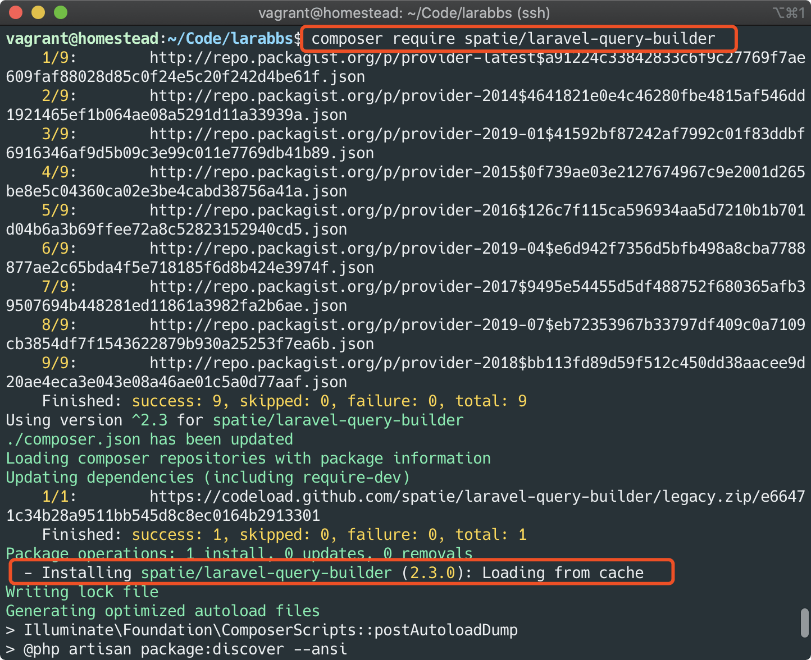

app/Http/Controllers/Api/TopicsController.php

```
.
.
.
use Spatie\QueryBuilder\QueryBuilder;
use Spatie\QueryBuilder\AllowedFilter;
.
.
.
public function index(Request $request, Topic $topic)
{
$topics = QueryBuilder::for(Topic::class)
->allowedIncludes('user', 'category')
->allowedFilters([
'title',
AllowedFilter::exact('category_id'),
AllowedFilter::scope('withOrder')->default('recentReplied'),
])
->paginate();

return TopicResource::collection($topics);
}
.
.
.
```

扩展包的使用你可以在参考一下[文档](https://docs.spatie.be/laravel-query-builder/v2/introduction/)。

这里有视频教程可以参考一下—— [064. API 动态查询参数—— spatie/laravel-query-builder](https://learnku.com/index.php/courses/laravel-package/2019/spatielaravel-query-builder/2509)

我们常用的主要有这么两个：

### 控制可用的 include 参数

`allowedIncludes` 方法传入可以被 include 的参数：

-
`/topics` ——话题列表默认值返回话题相关的数据；

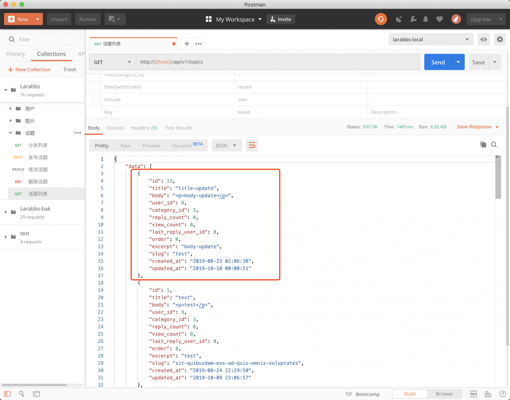

-
`/topics?include=user` —— 返回话题数据，以及发布者的数据；

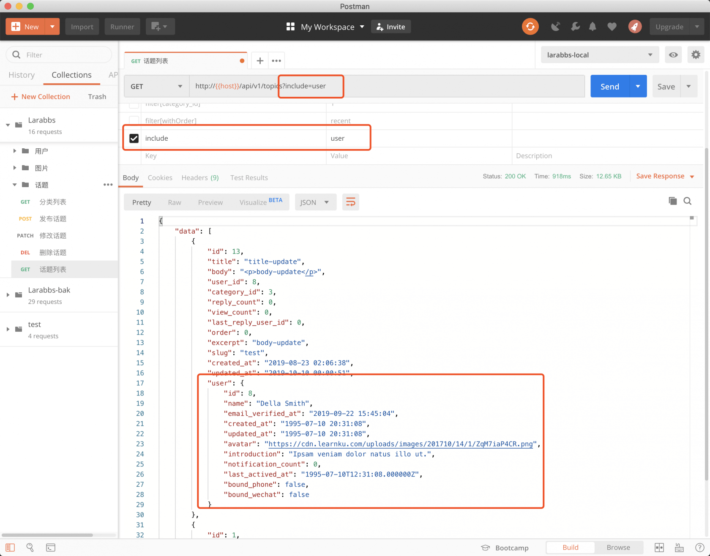

-
`/topics?include=user,category` ——返回话题数据、发布者的数据，以及所属的分类数据。

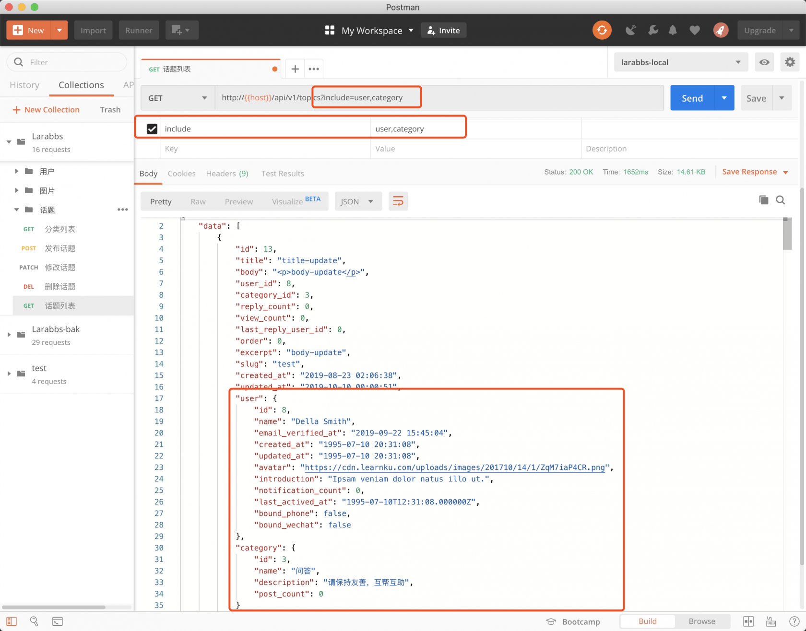

### 控制可用的搜索条件

`allowedFilters` 方法传入可以被搜索的条件，可以传入某个字段，例如我们这里传入了 `title`，这样会模糊搜索标题；如果某个字段是精确搜索需要进行指定，这里我们指定 `category_id` 是精确搜索的；还可以传入某个 `scope`，并且制定默认的参数，例如这里我们指定可以使用 `withOrder` 进行搜索，默认的值是 `recentReplied`。

使用 filter 参数可以进行搜索，该参数是个数组。

例如我们搜索标题，分类以及按 `recent` 排序。

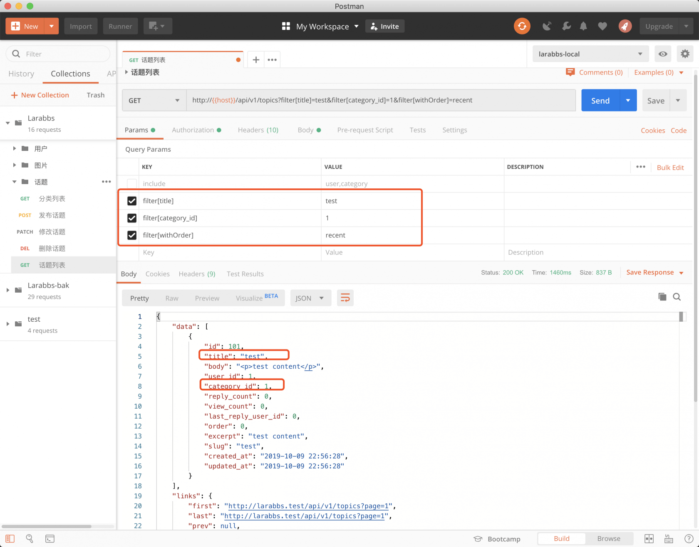

## 查询日志

你可能会发现现在的代码并没有通过 `with` 或者 `load` 预加载模型关系，那么会不会带来 `N+1` 问题呢。首先我们需要输出 sql 查询日志，[laravel-query-logger](https://github.com/overtrue/laravel-query-logger) 是一个查询日志组件，先来安装它

```
$ composer require overtrue/laravel-query-logger --dev
```

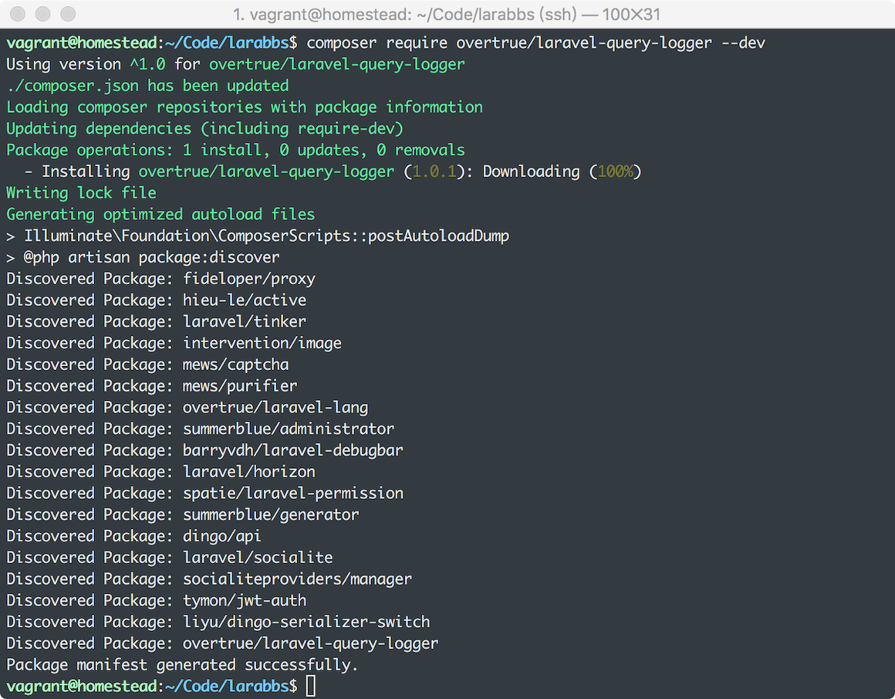

打开日志，再次调用接口 [larabbs.test/api/v1/topics?include=...](http://larabbs.test/api/v1/topics?include=user,category)

```
$ tail -f ./storage/logs/laravel.log
```

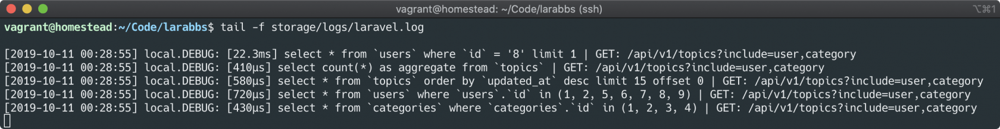

并没有产生 N+1 问题，扩展包已经帮助我们进行了预加载。

## 某个用户发布的话题列表

除了首页不同分类的话题列表，我们还可能查看某个用户发布的所有话题
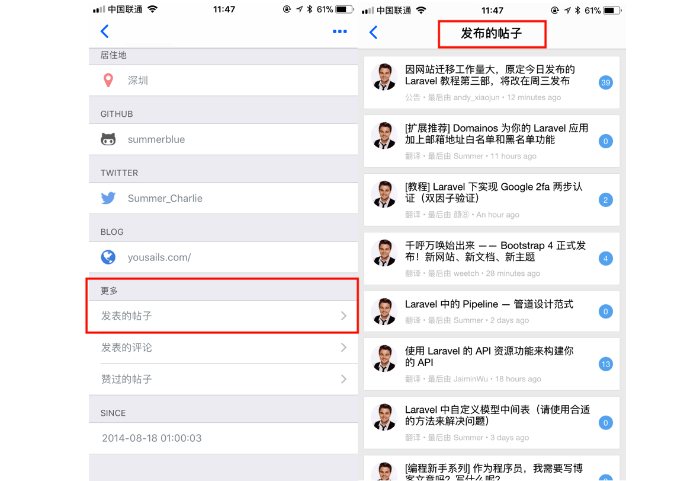

### 1. 添加路由

某个用户的发布的话题，同样是游客可访问的

routes/api.php

```
.
.
.
// 分类列表
Route::apiResource('categories', CategoriesController::class)
->only('index');
// 某个用户发布的话题
Route::get('users/{user}/topics', [TopicsController::class, 'userIndex'])
->name('users.topics.index');
.
.
.
```

### 2. 修改 Controller

按创建时间倒叙返回该用户所有的话题。

app/Http/Controllers/Api/TopicsController.php

```
.
.
.
use App\Models\User;
.
.
.
public function userIndex(Request $request, User $user)
{
$query = $user->topics()->getQuery();

$topics = QueryBuilder::for($query)
->allowedIncludes('user', 'category')
->allowedFilters([
'title',
AllowedFilter::exact('category_id'),
AllowedFilter::scope('withOrder')->default('recentReplied'),
])
->paginate();

return TopicResource::collection($topics);
}
.
.
.
```

同样可以使用 QueryBuilder 进行参数的限制，调试一下接口：

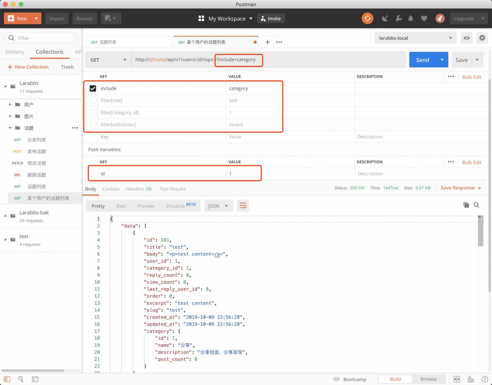

## 代码版本控制

```
$ git add -A
$ git commit -m '话题列表'
```
