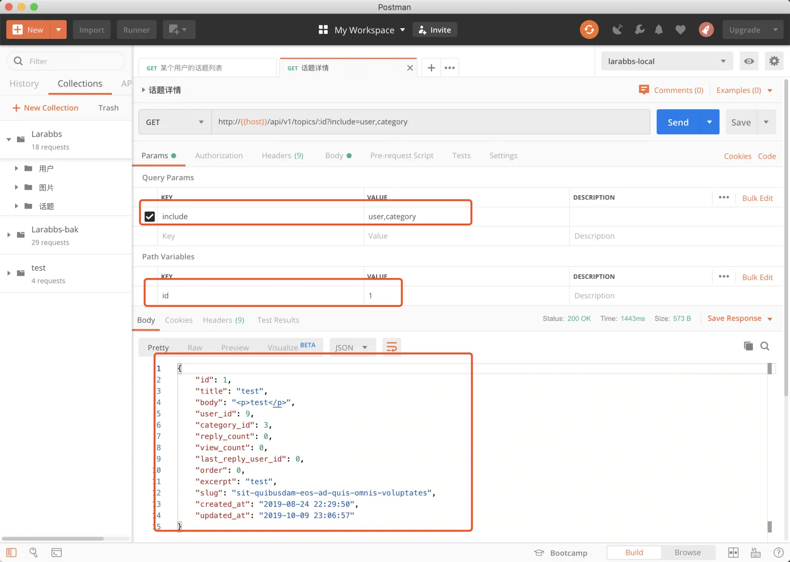

# 6.6. 话题详情

原文链接：https://learnku.com/courses/laravel-advance-training/9.x/topic-details/12617

## 话题详情

除了列表，我们还有可能获取单个话题的数据，下面来开发`话题详情`接口。

## 修改 controller

app/Http/Controllers/Api/TopicsController.php

```
.
.
.
public function show(Topic $topic)
{
return new TopicResource($topic);
}
.
.
.
```

PostMan 调用接口：



## 添加用户以及分类数据

可以看到因为默认的路由模型绑定，show 方法中直接获取了话题的模型，然后通过 `TopicResource` 返回了，并没有利用上节课扩展包中的 QueryBuilder，所以没法利用 `include` 参数。

也许你会直接调用  `$topic->load('user', 'category')`，但是我们想利用一下上节课介绍的扩展包，这样可以提供更多的功能。

这里就会有个问题，必须使用 `QueryBuilder` 查询数据才可以利用 `include` 参数，而这里的 `$topic` 已经通过路由模型绑定查询出来了，所以就有两种解决方法。

1. 不使用路由模型绑定；

2. 重写路由模型绑定的 `resolveRouteBinding` 方法。

本教程使用第一种方式。

### 1. 不使用路由模型绑定

app/Http/Controllers/Api/TopicsController.php

```
.
.
.
public function show($topicId)
{
$topic = QueryBuilder::for(Topic::class)
->allowedIncludes('user', 'category')
->findOrFail($topicId);

return new TopicResource($topic);
}

.
.
.
```

不使用路由模型绑定，直接传入 `$topicId` 参数，直接通过 QueryBuilder 查询 ID 即可。

### 2. 重写路由模型绑定

另一种方式是重写路由模型绑定的 `resolveRouteBinding` 方法，可以这么做参考这个 issue [github.com/spatie/laravel-query-bu...](https://github.com/spatie/laravel-query-builder/issues/325) 。

app/Models/Topic.php

```
.
.
.
use Spatie\QueryBuilder\QueryBuilder;
.
.
.
public function resolveRouteBinding($value)
{
return QueryBuilder::for(self::class)
->allowedIncludes('user', 'category')
->where($this->getRouteKeyName(), $value)
->first();
}
.
.
.
```

重写了模型中的 `resolveRouteBinding` 方法即可，使用 `QueryBuilder` 进行查询，同时设置可用的 `include` 参数。

为了代码的通用，可以将上述代码抽象成一个 Trait，这样方便其他模型使用，例如这样：

```bash
$ touch app/Models/Traits/QueryBuilderBindable.php
```

app/Models/Traits/QueryBuilderBindable.php

```
<?php

namespace App\Models\Traits;

Trait QueryBuilderBindable
{
public function resolveRouteBinding($value)
{
$queryClass = property_exists($this, 'queryClass')
? $this->queryClass
: '\\App\\Http\\Queries\\'.class_basename(self::class).'Query';

if (!class_exists($queryClass)) {
return parent::resolveRouteBinding($value);
}

return (new $queryClass($this))
->where($this->getRouteKeyName(), $value)
->first();
}
}
```

逻辑很简单，这个 Trait 重写了 `resolveRouteBinding` 方法，如果模型定义了 `queryClass` 属性，那么使用这个属性指定的 Query 类，如果没有指定，则查找 Queries 目录下面对应名称的 Query 类。

这样大部分情况下只需要直接引入这个 Trait 就可以了，如果想自定义类的位置，可以像下面这样指定属性：

```
protected $queryClass = \App\Http\Queries\xxx::class;
```

>

上述代码供大家参考，只是多提供一种思路，可以根据真实情况使用，如果重写了 `resolveRouteBinding` 方法，虽然当下场景会比较方便，但是所有使用路由模型绑定的地方都会使用  `QueryBuilder` 查询数据，需要合理使用。

## 代码优化

现在的代码中，有多个地方在使用 `QueryBuilder`，进行数据查询，并设置 `include` 等参数，其实这些都是重复的代码，我们应该想办法优化一下。

新建 `app/Http/Queries` 目录，我们在这个目录中存放每个模型的 QueryBuilder 设置。

```bash
$ mkdir  app/Http/Queries
$ touch app/Http/Queries/TopicQuery.php
```

接着为 Topic 创建一个 TopicQuery。

app/Http/Queries/TopicQuery.php

```
<?php

namespace App\Http\Queries;

use App\Models\Topic;
use Spatie\QueryBuilder\QueryBuilder;
use Spatie\QueryBuilder\AllowedFilter;

class TopicQuery extends QueryBuilder
{
    public function __construct()
    {
        parent::__construct(Topic::query());

        $this->allowedIncludes('user', 'category')
        ->allowedFilters([
                'title',
                AllowedFilter::exact('category_id'),
                AllowedFilter::scope('withOrder')->default('recentReplied'),
        ]);
    }
}
```

这样就抽象了一个 Topic 模型使用的 QueryBuilder，并做好了 include 和 filter 的设置。

app/Http/Controllers/Api/TopicsController.php

```
<?php

namespace App\Http\Controllers\Api;

use App\Models\User;
use App\Models\Topic;
use Illuminate\Http\Request;
use App\Http\Queries\TopicQuery;
use App\Http\Resources\TopicResource;
use App\Http\Requests\Api\TopicRequest;

class TopicsController extends Controller
{
    public function index(Request $request, TopicQuery $query)
    {
        $topics = $query->paginate();

        return TopicResource::collection($topics);
    }

    public function userIndex(Request $request, User $user, TopicQuery $query)
    {
        $topics = $query->where('user_id', $user->id)->paginate();

        return TopicResource::collection($topics);
    }

    public function show($topicId, TopicQuery $query)
    {
        $topic = $query->findOrFail($topicId);
        return new TopicResource($topic);
    }
```

这样代码就会变得更加简洁。

## 代码版本控制

```bash
$ git add -A
$ git commit -m '话题详情'
```
