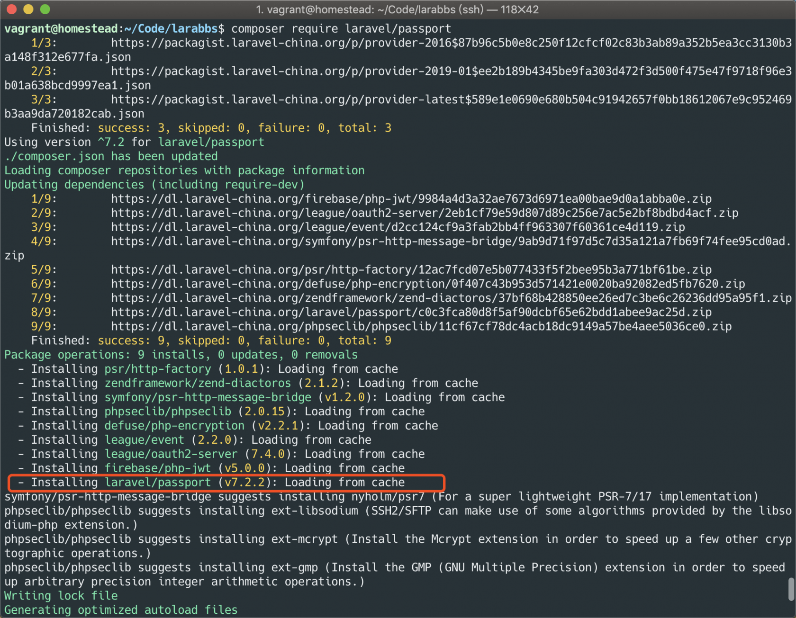
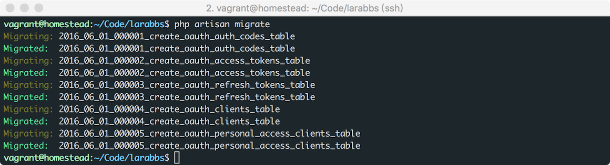
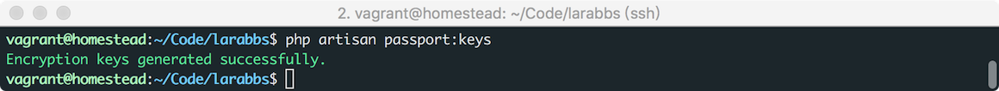
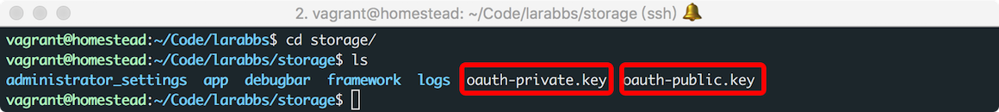
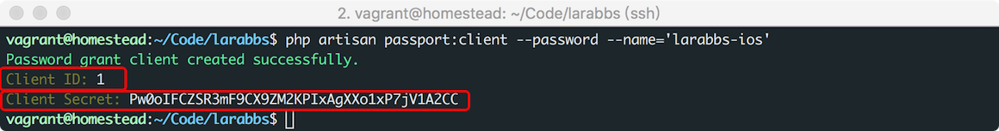
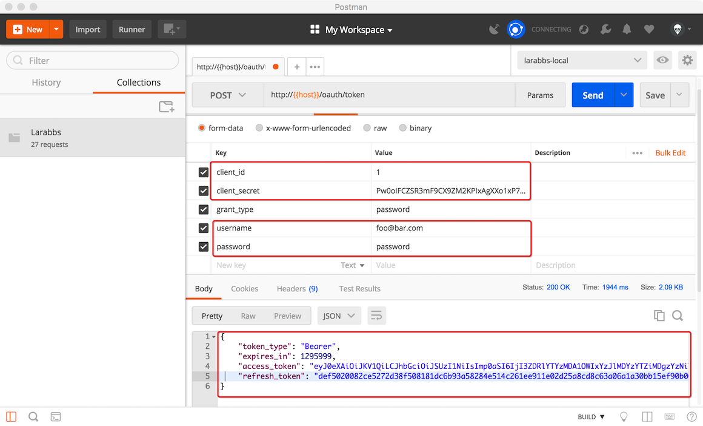
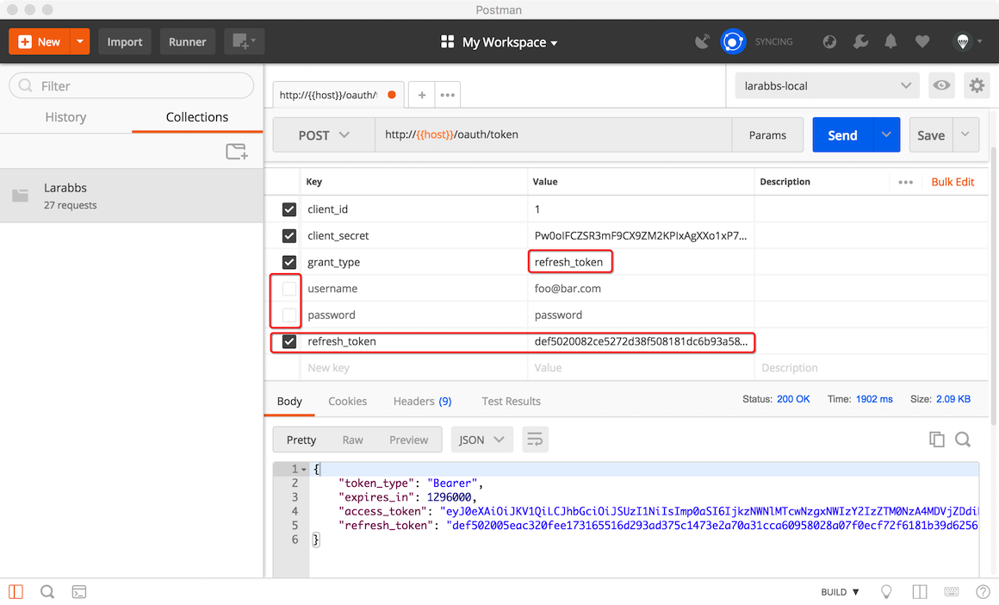
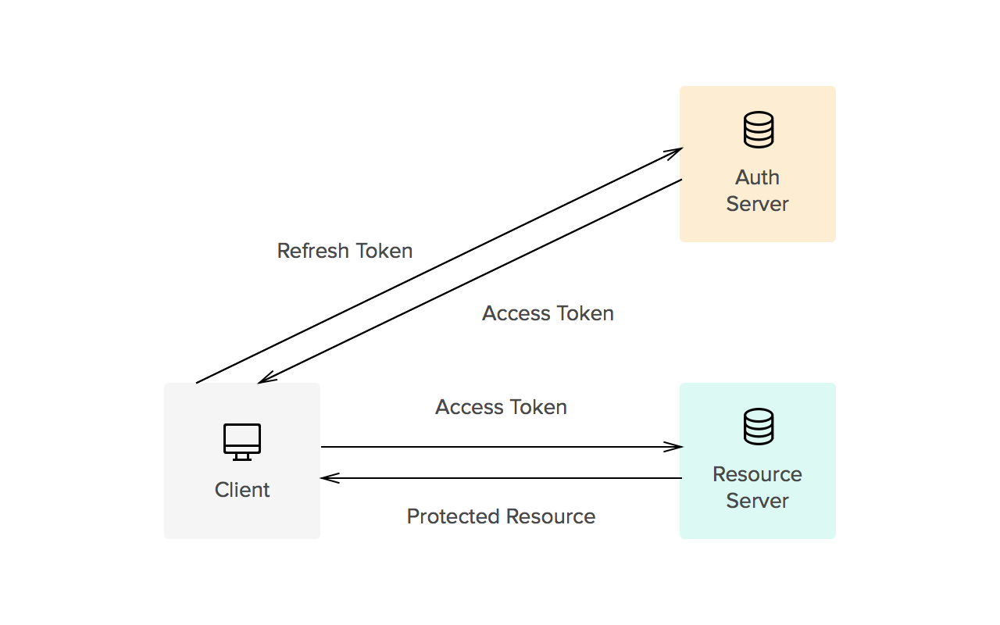

# 11.2. Passport 安装调试

原文链接：https://learnku.com/courses/laravel-advance-training/9.x/passport-installation-and-debugging/12641

## Passport 安装

### 1. 创建新分支

由于是将原有的认证方式 JWT，替换为 OAuth2，所以我们新建一个分支来进行代码开发

```
$ git checkout -b L03_9.x_passport
```

>

目前 php-open-source-saver/jwt-auth 和 Passport 的依赖包有些冲突，我们可以先删除  php-open-source-saver/jwt-auth 这个扩展包，[github.com/tymondesigns/jwt-auth/p...](https://github.com/tymondesigns/jwt-auth/pull/2073)

```
$ composer remove php-open-source-saver/jwt-auth
```

修改模型，删除 jwt-auth 相关代码
app/Models/User.php

```
<?php

namespace App\Models;

use Illuminate\Contracts\Auth\MustVerifyEmail;
use Illuminate\Database\Eloquent\Factories\HasFactory;
use Illuminate\Foundation\Auth\User as Authenticatable;
use Illuminate\Notifications\Notifiable;
use Laravel\Sanctum\HasApiTokens;
use Illuminate\Auth\MustVerifyEmail as MustVerifyEmailTrait;
use Illuminate\Support\Facades\Auth;
use Spatie\Permission\Traits\HasRoles;
use Illuminate\Support\Str;

class User extends Authenticatable implements MustVerifyEmail
{
use Traits\LastActivedAtHelper;
use Traits\ActiveUserHelper;
use HasRoles;
use HasApiTokens, HasFactory, MustVerifyEmailTrait;

use Notifiable {
notify as protected laravelNotify;
}
public function notify($instance)
{
// 如果要通知的人是当前用户，就不必通知了！
if ($this->id == Auth::id()) {
return;
}

// 只有数据库类型通知才需提醒，直接发送 Email 或者其他的都 Pass
if (method_exists($instance, 'toDatabase')) {
$this->increment('notification_count');
}

$this->laravelNotify($instance);
}

protected $fillable = [
'name',
'phone',
'email',
'password',
'introduction',
'avatar',
'weixin_openid',
'weixin_unionid'
];

protected $hidden = [
'password',
'remember_token',
'weixin_openid',
'weixin_unionid'
];

protected $casts = [
'email_verified_at' => 'datetime',
];

public function topics()
{
return $this->hasMany(Topic::class);
}

public function isAuthorOf($model)
{
return $this->id == $model->user_id;
}

public function replies()
{
return $this->hasMany(Reply::class);
}

public function markAsRead()
{
$this->notification_count = 0;
$this->save();
$this->unreadNotifications->markAsRead();
}

public function setPasswordAttribute($value)
{
// 如果值的长度等于 60，即认为是已经做过加密的情况
if (strlen($value) != 60) {

// 不等于 60，做密码加密处理
$value = bcrypt($value);
}

$this->attributes['password'] = $value;
}

public function setAvatarAttribute($path)
{
// 如果不是 `http` 子串开头，那就是从后台上传的，需要补全 URL
if ( ! Str::startsWith($path, 'http')) {

// 拼接完整的 URL
$path = config('app.url') . "/uploads/images/avatars/$path";
}

$this->attributes['avatar'] = $path;
}
}
```

>

需要明白 api 分支实现的是 JWT 的认证逻辑，passport 分支实现的是 Passport 的逻辑，根据你的实际情况使用。

### 2. Composer 安装

使用 Composer 安装 Passport ：

```
$ composer require laravel/passport
```



### 3. 生成数据表

Passport 扩展包里已经自动注册了迁移文件加载，执行 `migrate`，会自动运行扩展包里的迁移文件，由此来创建存储客户端和令牌的数据表：



### 4. 创建加密秘钥

接下来，运行 `php artisan passport:keys` 命令来创建生成安全访问令牌时所需的加密密钥：

```
$ php artisan passport:keys
```



执行成功后，会在 `storage` 目录中看到两个以 `oauth` 开头的秘钥文件：



### 5. 创建客户端

```
$ php artisan passport:client --password --name='larabbs-ios'
```

`passport:client` 命令可以创建一个客户端，由于我们使用的是密码模式，所以需要增加 `--password` 参数。同时还可以增加 `--name` 参数为客户端起个名字，我们这里起名为 `larabbs-ios`：



命令行中已经输出了创建的 `client_id` 和 `client_secret`，我们找个地方复制保存起来。

## Passport 调试

### 1. 注册路由

安装好了 Passport 我们来调试一下，`Passport::routes` 是 Passport 为我们提供了基础的路由，我们先注册一下路由。

app/Providers/AuthServiceProvider.php

```
.
.
.
use Laravel\Passport\Passport;
.
.
.
public function boot()
{
.
.
.
// Passport 的路由
Passport::routes();
// access_token 过期时间
Passport::tokensExpireIn(now()->addDays(15));
// refreshTokens 过期时间
Passport::refreshTokensExpireIn(now()->addDays(30));
.
.
.
}
.
.
.
```

我们注册了路由，同时通过 Passport 的 `tokensExpireIn` 和 `refreshTokensExpireIn` 定义了访问令牌的过期时间，否则访问令牌是永久有效的。这里我们定义 `access_token` 15 天内有效，`refresh_token` 30天内有效。

### 2.调整auth配置

config/auth.php

```
.
.
.
'guards' => [
'web' => [
'driver' => 'session',
'provider' => 'users',
],

'api' => [
'driver' => 'passport',
'provider' => 'users',
],
],
.
.
.
```

### 3. 获取访问令牌

密码模式我们通过 [larabbs.test/oauth/token](http://larabbs.test/oauth/token) 这个路由获取访问令牌。提交的参数如下

- grant_type —— 密码模式固定为 `password`；

- client_id —— 通过 `passport:client` 创建的客户端 `id`；

- client_secret ——  通过 `passport:client` 创建的客户端 `secret`；

- username —— 登录的用户名，数据库中任意用户邮箱；

- password —— 用户密码；

- scope —— 作用域，可填写 `*` 或者为空；



提交正确的 `client` 信息以及任意已存在用户的用户名和密码，可以正确的获取到访问令牌。

- token_type —— 令牌类型；

- expires_in—— 多长时间后过期；

- access_token —— 访问令牌；

- refresh_token —— 刷新令牌；

### 4. 刷新访问令牌

`刷新访问令牌` 接口与 `获取访问令牌` 接口一样，只是参数不同。

- grant_type —— 刷新令牌固定为 `refresh_token`；

- client_id —— 通过 `passport:client` 创建的客户端 `id`；

- client_secret ——  通过 `passport:client` 创建的客户端 `secret`；

- refresh_token —— 刷新令牌；

- scope —— 作用域，可填写 `*` 或者为空；



刷新令牌不用提交用户的用户名和密码，而是直接使用 `refresh_token` 换取新的访问令牌，注意修改 `grant_type` 为 `refresh_token`。

## 关于  Refresh Token



为什么要刷新 Access Token 呢？

- 一是因为 Access Token 是有过期时间的，到了过期时间这个 Access Token 就会失效，需要刷新；

- 二是因为一个 Access Token 会关联一定的用户权限，如果用户授权更改了，这个 Access Token 需要被刷新以关联新的权限。

为什么要专门用一个 Token 去更新 Access Token 呢？如果没有 Refresh Token，要获取一个新的 Access Token，就必须重新让用户输入登录用户名与密码，这肯定是不可取的。有了 refresh Token，客户端就可以直接拿着 Refresh Token 去更新 Access Token，继续访问需要的接口。

Refresh Token 也有过期时间但是时间相对较长。 Refresh Token 对存储的要求通常会非常严格，以确保它不会被泄漏；它们也可以被授权服务器列入黑名单。

## 代码版本控制

```
$ git add -A
$ git commit -m '安装 Passport'
```
