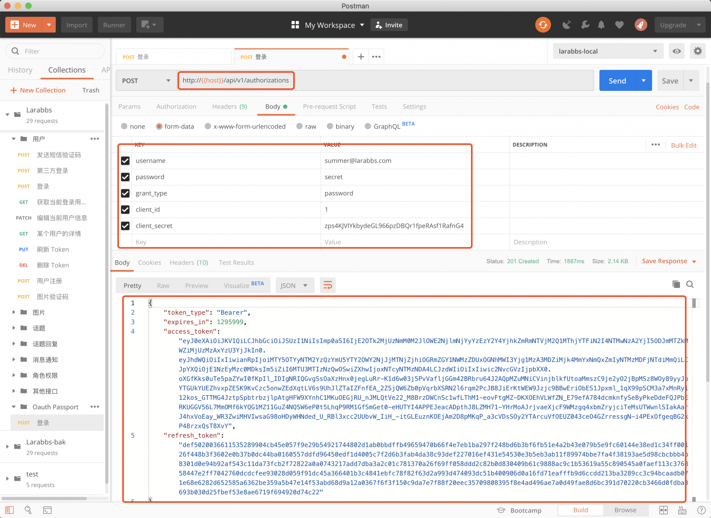
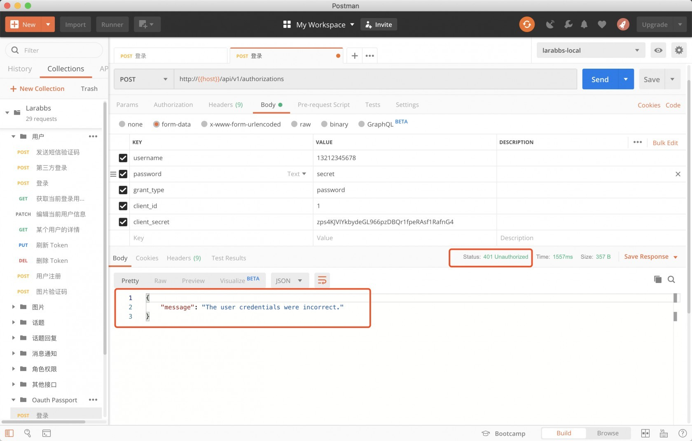
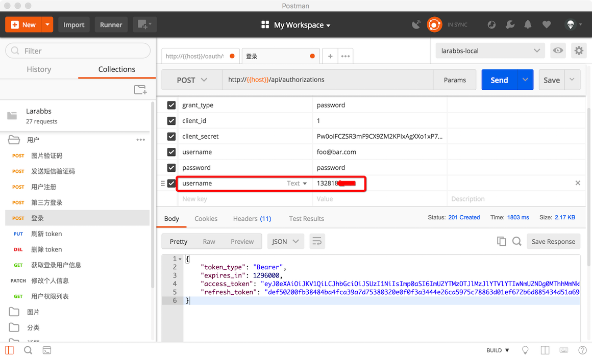
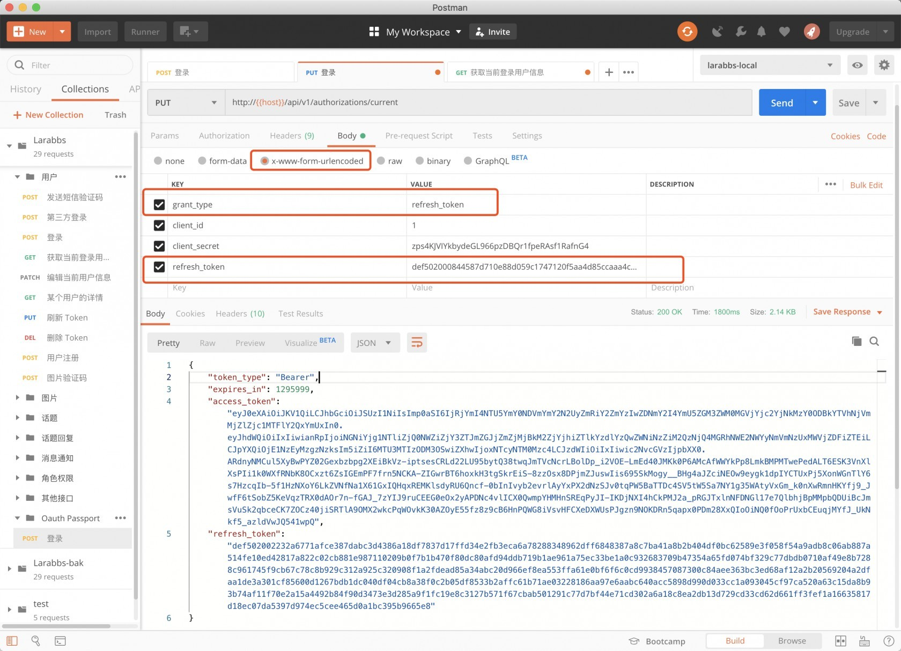
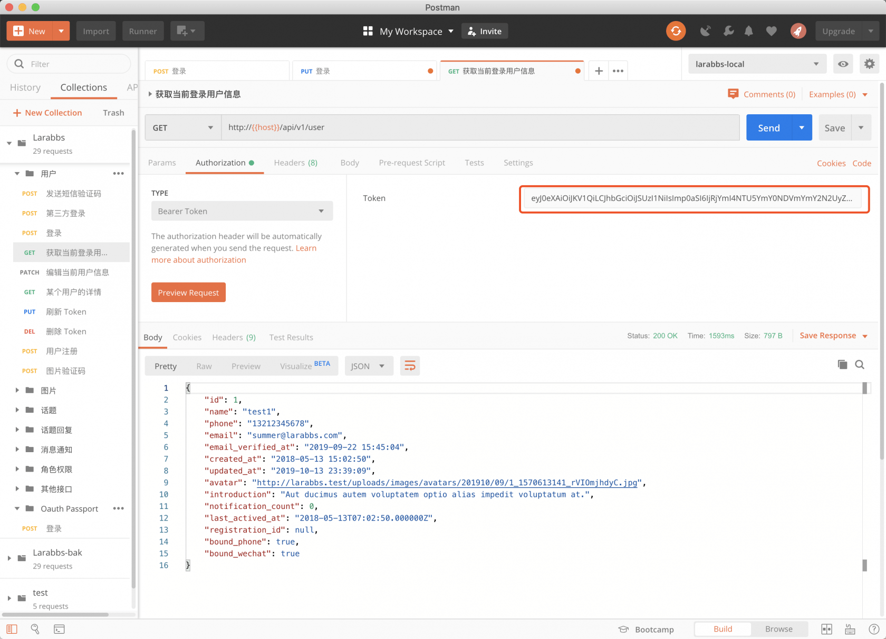
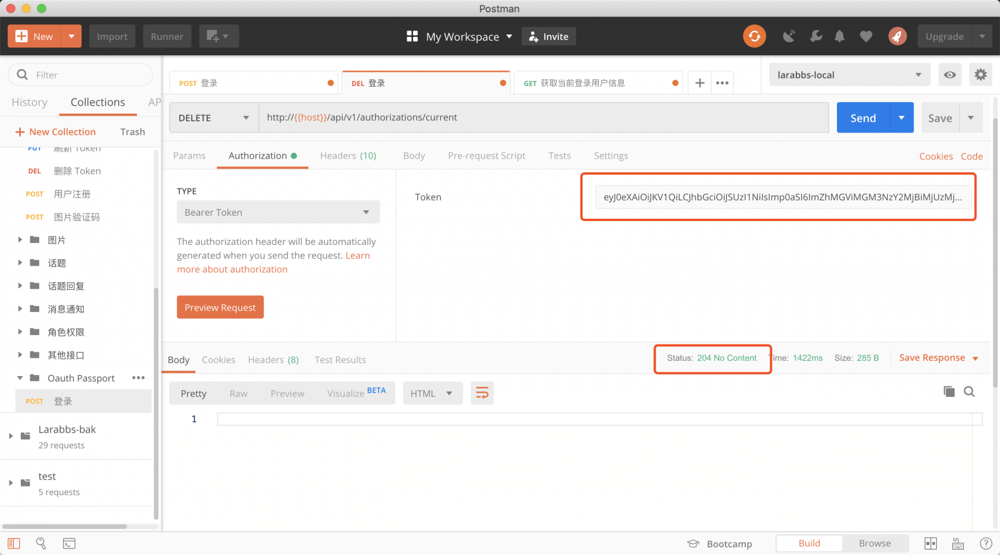
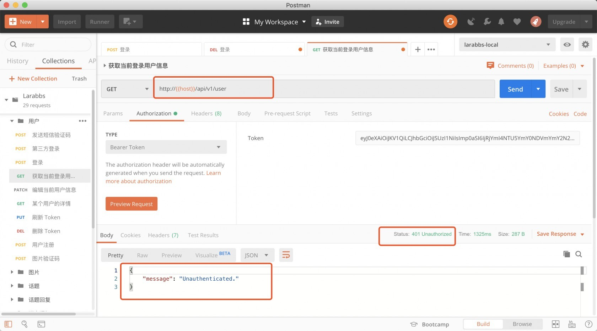

# 11.3. 使用 Passport 认证

原文链接：https://learnku.com/courses/laravel-advance-training/9.x/using-passport-authentication/12642

## 使用 Passport 认证

这一节我们将现有的接口实现，由之前 JWT 授权方式， 更替为 Passport 的 Oauth2 授权。

## 登录接口

### 调整接口

Passport 提供的默认路由为 [larabbs.test/oauth/token](http://larabbs.test/oauth/token) ，你可以直接使用，因为我们的现在接口统一都有 `/api` 的前缀，所以我们不使用 Passport 默认的路由，依然使用 `/api/v1/authorizations`。先来修改 AuthorizationsController ：

app/Http/Controllers/Api/AuthorizationsController.php

```
<?php

namespace App\Http\Controllers\Api;

use Illuminate\Http\Request;
use Illuminate\Auth\AuthenticationException;
use Psr\Http\Message\ServerRequestInterface;
use Laravel\Passport\Http\Controllers\AccessTokenController;

class AuthorizationsController extends AccessTokenController
{
public function store(ServerRequestInterface $request)
{
return $this->issueToken($request)->setStatusCode(201);
}
}
```

注意这里我们让  `AuthorizationsController` 继承了 `Laravel\Passport\Http\Controllers\AccessTokenController` 也就是 Passport 提供的 Controller。原本的 `oauth/token` 路由就是走到了这个 Controller 调用了 issueToken 方法。我们只是做了 一个 自定义的封装。

注意最后调用了 `setStatusCode` 设置我们需要的状态码 。

### 使用 PostMan 调试



得到了正确的令牌信息，注意现在使用的用户是邮箱，我们是支持手机和邮箱两种登录方式的，现在尝试一下使用手机登录：



最终结果报错了，因为默认情况下，Passport 会通过用户的邮箱查找用户，要支持手机登录，我们可以在用户模型定义了 `findForPassport` 方法，Passport 会先检测用户模型是否存在 `findForPassport` 方法，如果存在就通过 `findForPassport` 查找用户，而不是使用默认的邮箱。

### 支持手机登录

app/Models/User.php

```
.
.
.
public function findForPassport($username)
{
filter_var($username, FILTER_VALIDATE_EMAIL) ?
$credentials['email'] = $username :
$credentials['phone'] = $username;

return self::where($credentials)->first();
}
.
.
.
```

定义好 `findForPassport` 后，再次尝试使用手机登录：



登录成功。

## 刷新 Token

app/Http/Controllers/Api/AuthorizationsController.php

```
.
.
.
public function update(ServerRequestInterface $request)
{
return $this->issueToken($request);
}
.
.
.
```

刷新接口的代码同登录接口一致，只是最终返回的状态码是 200。

使用 PostMan 调试：



注意 PUT 提交参数需要使用 `x-www-form-urlencode`，刷新 Token 成功。

## 获取登录用户信息

得到了访问令牌，我们就能通过令牌获取个人用户信息了，不过在这之前我们需要修改一些配置。

将 `Laravel\Passport\HasApiTokens` Trait 添加到 `App\Models\User` 模型中，这个 Trait 会给你的模型提供一些辅助函数，用于检查已认证用户的令牌和使用范围。

>

注意需要注释掉默认的 use Laravel\Sanctum\HasApiTokens;

app/Models/User.php

```

.
.
.
//use Laravel\Sanctum\HasApiTokens;
use Laravel\Passport\HasApiTokens;
.
.
.
use HasApiTokens;
.
.
.
```

使用 PostMan 访问 `获取登录用户信息` 接口：



设置好 `access_token` , 可正确获取到用户信息。

## 删除 Token

app/Http/Controllers/Api/AuthorizationsController.php

```
.
.
.
public function destroy()
{
if (auth('api')->check()) {
auth('api')->user()->token()->revoke();
return response(null, 204);
} else {
throw new AuthenticationException('The token is invalid.');
}
}
.
.
.
```

使用 PostMan 调试：



使用已经删除的 `access_token` 再次访问 `获取登录用户信息` 接口：



结果为 401 授权错误，证明 `access_token` 已经失效。

## 代码版本控制

```
$ git add -A
$ git commit -m '使用 Passport'
```
