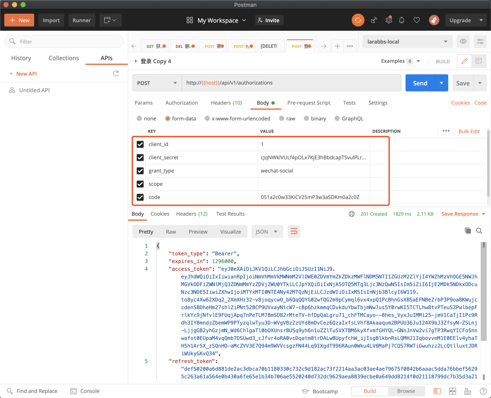

# 11.4. 处理第三方登录

原文链接：https://learnku.com/courses/laravel-advance-training/9.x/processing-third-party-logon/12643

## 处理第三方登录

回忆一下第四章 [第三方登录](https://learnku.com/courses/laravel-advance-training/5.5/796/process-explanation) 的内容，第三方登录的最后，在服务器端我们通过微信的 `access_token` 换取了微信的用户信息，最后生成我们自己的令牌信（JWT），发送给客户端。现在我们需要将最后生成令牌的方式由原来的 JWT 替换为 Passport。

## 个人访问令牌

Passport 为我们提供了一种直接某个用户生成令牌的方式——[个人访问令牌](https://learnku.com/docs/laravel/5.5/passport#personal-access-tokens)。

首先需要创建一个 `personal` 的客户端 `php artisan passport:client --personal`，然后我们就可以直接通过命令 `$token = $user->createToken('Token Name')->accessToken;` 创建一个访问令牌。

这种创建令牌的方式有两个问题

- 只能为用户创建 `access_token`，没有 `refresh_token`；

- 个人访问令牌是永久有效的，就算使用了 `tokensExpireIn` 和 `refreshTokensExpireIn` 方法也不会修改它的生命周期；

第三方登录应该同登录接口一样，有完整的令牌信息返回，包括 `refresh_token`，这样才能在客户端保持用户一直登录；永久有效的令牌显然是也是不安全的，所以通过这种方式创建的令牌显然不是我们想要的。接下来我们将寻找更加合理的解决方案。

## 创建自定义的 grant_type

为了方便的自定义 `grant_type`，我们需要安装一个扩展包 [kslimani/laravel-passport-grant](https://github.com/kslimani/laravel-passport-grant) 。

```
$ composer require kslimani/laravel-passport-grant
```

安装成功后，将配置文件发布出来：

```
$ php artisan vendor:publish --provider="Sk\Passport\GrantTypesServiceProvider" --tag="config"
```

安装扩展包的使用方法，创建一个 Provider。这里可以直接创建一个 WechatUserProvider  用来处理微信登录。

```
$ mkdir app/Passport
$ touch app/Passport/WechatUserProvider.php
```

修改一下这个 Provider 文件。

app/Passport/WechatUserProvider.php

```
<?php

namespace App\Passport;

use App\Models\User;
use Psr\Http\Message\ServerRequestInterface;
use Sk\Passport\UserProvider;
use Illuminate\Auth\AuthenticationException;

class WechatUserProvider extends UserProvider
{
public function validate(ServerRequestInterface $request)
{
$this->validateRequest($request, [
'code' => 'required_without:access_token|string',
'access_token' => 'required_without:code|string',
'openid'  => 'required_with:access_token|string',
]);
}

public function retrieve(ServerRequestInterface $request)
{
$inputs = $this->only($request, [
'code',
'access_token',
'openid',
]);

$driver = \Socialite::create('wechat');
try {
if ($code = $inputs['code']) {
$oauthUser = $driver->userFromCode($code);
} else {
$driver->withOpenid($inputs['openid']);

$oauthUser = $driver->userFromToken($inputs['access_token']);
}
} catch (\Exception $e) {
throw new AuthenticationException('参数错误，未获取用户信息');
}

if (!$oauthUser->getId()) {
throw new AuthenticationException('参数错误，未获取用户信息');
}

$unionid = $oauthUser->getRaw()['unionid'] ?? null;

if ($unionid) {
$user = User::where('weixin_unionid', $unionid)->first();
} else {
$user = User::where('weixin_openid', $oauthUser->getId())->first();
}

// 没有用户，默认创建一个用户
if (!$user) {
$user = User::create([
'name' => $oauthUser->getNickname(),
'avatar' => $oauthUser->getAvatar(),
'weixin_openid' => $oauthUser->getId(),
'weixin_unionid' => $unionid,
]);
}

return $user;
}
}
```

这里是需要实现两个方法：

- validate —— 返回需要验证的参数；

- retrieve —— 根据参数获取用户的逻辑。

注意一下 retrieve 方法，其实是将原来 Controller 里面关于用户处理的逻辑搬了过来，如果没有找到用户就创建一个。

接着调整一下配置，为自定义的 `grant_type` 取个名字：

config/passportgrant.php

```
<?php

return [
'grants' => [
'wechat-social' => 'App\Passport\WechatUserProvider',
],
]
```

这样就定义了一个 `wechat-social` 的 grant_type，原来 Controller 里面 `socialStore` 方法就不再需要了，直接使用 `api/v1/authorizations` 接口即可，只是 grant_type  需要传 `wechat-social`。

## 使用 PostMan 调试



通过微信开发者工具制作一个用户授权码，可以正确的获取完整的令牌信息。

## 代码版本控制

```
$ git add -A
$ git commit -m 'Passport 第三方登录'
```
