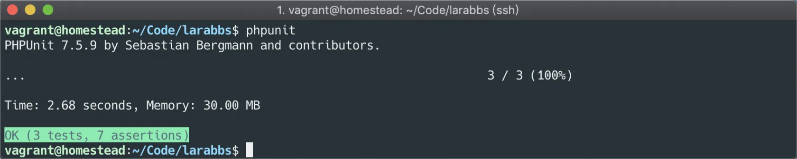
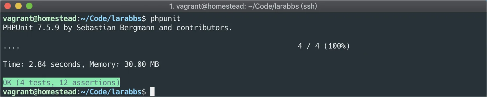

# 10.2. Laravel API 集成测试

原文链接：https://learnku.com/courses/laravel-advance-training/9.x/laravel-api-integration-test/12636

## API 集成测试

这一节我们通过几个例子来学习 API 集成测试。

## PHPUnit

PHPUnit 是一个轻量级的 PHP 测试框架，Laravel 默认就支持用 PHPUnit 来做测试，并为你的应用程序配置好了 phpunit.xml 文件，只需在命令行上运行 `phpunit` 就可以进行测试。

尝试在 larabbs 根目录执行 `phpunit`

```
$ phpunit
```


## 创建测试文件

首先需要创建一个测试文件：

```
$ php artisan make:test TopicApiTest
```

该命令会在 `tests/Feature` 目录中创建 `TopicApiTest.php` 文件，我们会发现 tests 目录中有 `Feature` 和 `Unit` 两个目录，如何区分这两个目录呢？

- Unit —— 单元测试是从程序员的角度编写的。它们用于确保类的特定方法执行一组特定任务。

- Feature —— 功能测试是从用户的角度编写的。它们确保系统按照用户期望的那样运行，包括几个对象的相互作用，甚至是一个完整的 HTTP 请求。

我们测试 API 属于功能测试，应该创建在 `Feature` 目录中。

## 测试发布话题

tests/Feature/TopicApiTest.php

```
<?php

namespace Tests\Feature;

use Tests\TestCase;
use App\Models\User;
use App\Models\Topic;
use Illuminate\Foundation\Testing\WithFaker;
use Illuminate\Foundation\Testing\RefreshDatabase;

class TopicApiTest extends TestCase
{
use RefreshDatabase;

protected $user;

protected function setUp(): void
{
parent::setUp();

$this->user = User::factory()->create();
}

public function testStoreTopic()
{
$data = ['category_id' => 1, 'body' => 'test body', 'title' => 'test title'];

$token = auth('api')->fromUser($this->user);
$response = $this->withHeaders(['Authorization' => 'Bearer '.$token])
->json('POST', '/api/v1/topics', $data);

$assertData = [
'category_id' => 1,
'user_id' => $this->user->id,
'title' => 'test title',
'body' => clean('test body', 'user_topic_body'),
];

$response->assertStatus(201)
->assertJsonFragment($assertData);
}
}
```

`setUp` 方法会在测试开始之前执行，我们先创建一个用户，测试会以该用户的身份进行测试。

`testStoreTopic` 就是一个测试用户，测试发布话题。使用 $this->json 可以方便的模拟各种 HTTP 请求：

- 第一个参数 —— 请求的方法，发布话题使用的是 POST 方法；

- 第二个参数 —— 请求地址，请求 `/api/v1/topics`；

- 第三个参数 —— 请求参数，传入 `category_id`，`body`，`title`，这三个必填参数；

- 第四个参数 —— 请求 Header，可以直接设置 `header`，也可以利用  `withHeaders` 方法达到同样的目的；

我们发现为用户生成 `Token` 以及设置 `Authorization` 部分的代码，不仅 `修改话题`，`删除话题` 会使用，以后编写的其他功能的测试用例一样会使用，所以我们进行一下封装。

增加一个 Trait：

```
$ mkdir tests/Traits
$ touch tests/Traits/ActingJWTUser.php
```

tests/Traits/ActingJWTUser.php

```
<?php

namespace Tests\Traits;

use App\Models\User;

trait ActingJWTUser
{
public function JWTActingAs(User $user)
{
$token = auth('api')->fromUser($user);
$this->withHeaders(['Authorization' => 'Bearer '.$token]);

return $this;
}
}
```

修改测试用例，使用该 Trait。

tests/Feature/TopicApiTest.php

```
<?php

use Tests\Traits\ActingJWTUser;
.
.
.
class TopicApiTest extends TestCase
{
use ActingJWTUser;
.
.
.
public function testStoreTopic()
{
$data = ['category_id' => 1, 'body' => 'test body', 'title' => 'test title'];

$response = $this->JWTActingAs($this->user)
->json('POST', '/api/v1/topics', $data);

$assertData = [
'category_id' => 1,
'user_id' => $this->user->id,
'title' => 'test title',
'body' => clean('test body', 'user_topic_body'),
];

$response->assertStatus(201)
->assertJsonFragment($assertData);
}
}
```

这样我们就能方便的使用 `JWTActingAs` 方法，登录一个用户。最后得到的响应 `$response`，通过 `assertStatus` 断言响应结果为 `201`，通过 `assertJsonFragment` 断言响应结果包含 `assertData` 数据。

执行测试：

```
$ phpunit
```



## 测试修改话题

tests/Feature/TopicApiTest.php

```
.
.
.
public function testUpdateTopic()
{
$topic = $this->makeTopic();

$editData = ['category_id' => 2, 'body' => 'edit body', 'title' => 'edit title'];

$response = $this->JWTActingAs($this->user)
->json('PATCH', '/api/v1/topics/'.$topic->id, $editData);

$assertData= [
'category_id' => 2,
'user_id' => $this->user->id,
'title' => 'edit title',
'body' => clean('edit body', 'user_topic_body'),
];

$response->assertStatus(200)
->assertJsonFragment($assertData);
}

protected function makeTopic()
{
return Topic::factory()->create([
'user_id' => $this->user->id,
'category_id' => 1,
]);
}
.
.
.
```

我们增加了 `testUpdateTopic` 测试用例，要修改话题，首先需要为用户创建一个话题，所以增加了 `makeTopic`，为当前测试的用户生成一个话题。代码与发布话题类似，准备好要修改的话题数据 `$editData`，调用 `修改话题` 接口，修改刚才创建的话题，最后断言响应状态码为 `200` 以及结果中包含 `$assertData`。

执行测试：

```
$ phpunit
```



## 测试查看话题

tests/Feature/TopicApiTest.php

```
.
.
.
public function testShowTopic()
{
$topic = $this->makeTopic();
$response = $this->json('GET', '/api/v1/topics/'.$topic->id);

$assertData= [
'category_id' => $topic->category_id,
'user_id' => $topic->user_id,
'title' => $topic->title,
'body' => $topic->body,
];

$response->assertStatus(200)
->assertJsonFragment($assertData);
}

public function testIndexTopic()
{
$response = $this->json('GET', '/api/v1/topics');

$response->assertStatus(200)
->assertJsonStructure(['data', 'meta']);
}
.
.
.
```

增加了两个测试用户 `testShowTopic` 和 `testIndexTopic`，分别测试 `话题详情` 和 `话题列表`。这两个接口不需要用户登录即可访问，所以不需要传入 Token。

`testShowTopic` 先创建一个话题，然后访问 `话题详情` 接口，断言响应状态码为 `200` 以及响应数据与刚才创建的话题数据一致。

`testIndexTopic` 直接访问 `话题列表` 接口，断言响应状态码为 `200`，断言响应数据结构中有 `data` 和 `meta`。

执行测试：

```
$ phpunit
```


## 测试删除话题

tests/Feature/TopicApiTest.php

```
.
.
.
public function testDeleteTopic()
{
$topic = $this->makeTopic();
$response = $this->JWTActingAs($this->user)
->json('DELETE', '/api/v1/topics/'.$topic->id);
$response->assertStatus(204);

$response = $this->json('GET', '/api/v1/topics/'.$topic->id);
$response->assertStatus(404);
}
.
.
.
```

首先通过 `makeTopic` 创建一个话题，然后通过 `DELETE` 方法调用 `删除话题` 接口，将话题删除，断言响应状态码为 `204`。

接着请求话题详情接口，断言响应状态码为 `404`，因为该话题已经被删除了，所以会得到 `404`。

执行测试：

```
$ phpunit
```


最终我们执行了 7 个测试用户，进行了 22 次断言，测试正确。

## 代码版本控制

```
$ git add -A
$ git commit -m '话题单元测试'
```
