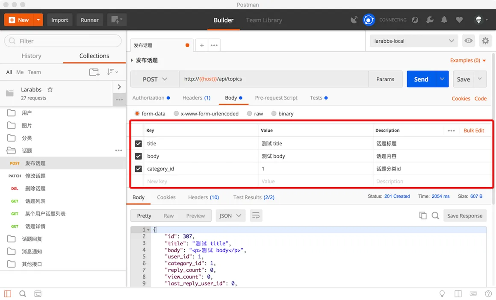
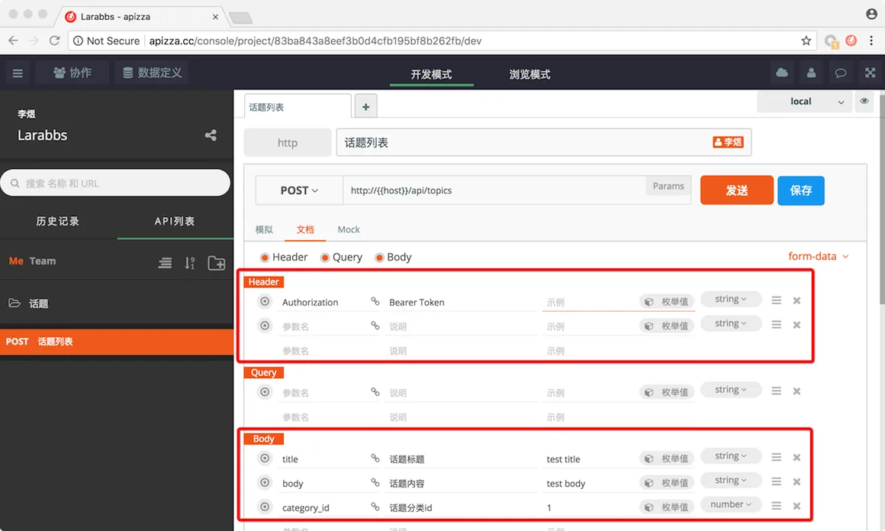
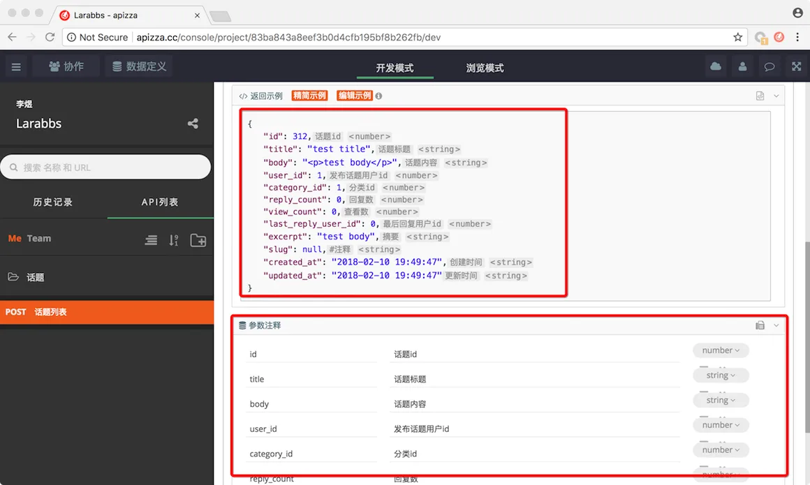
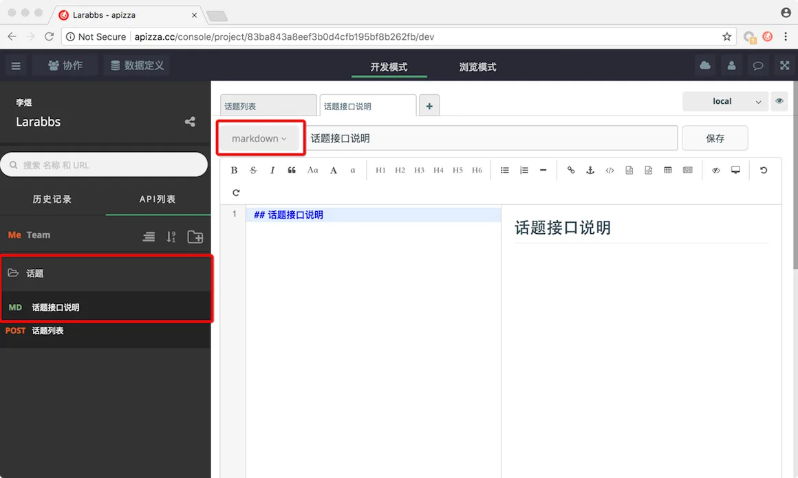
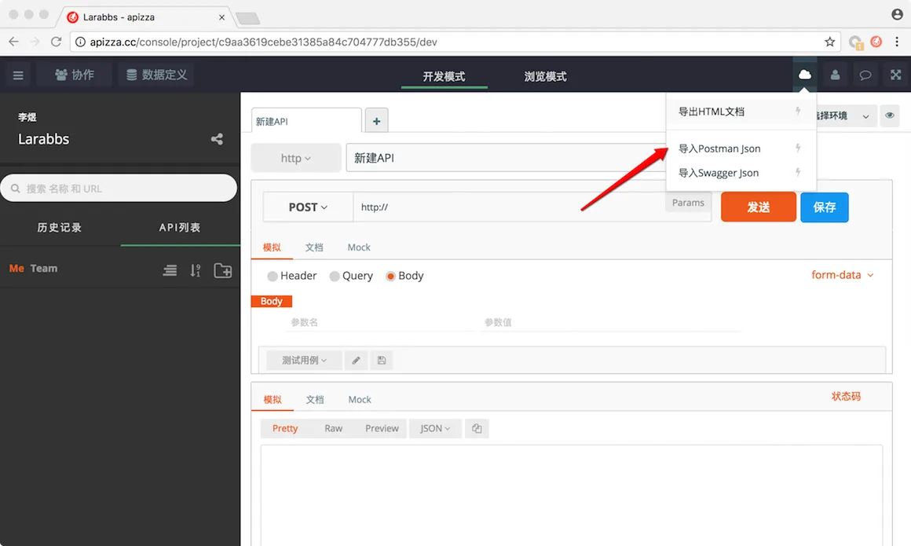
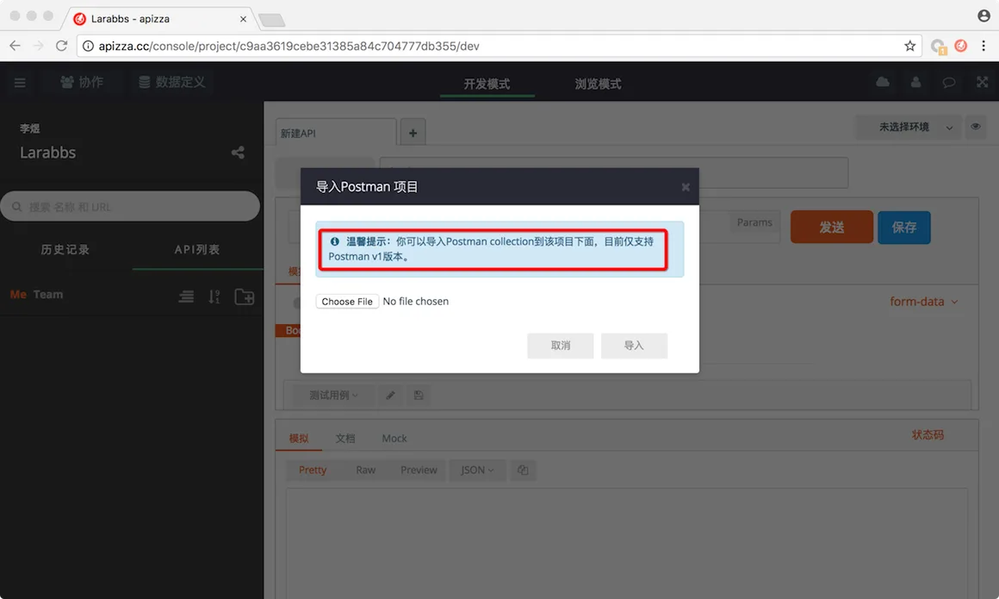
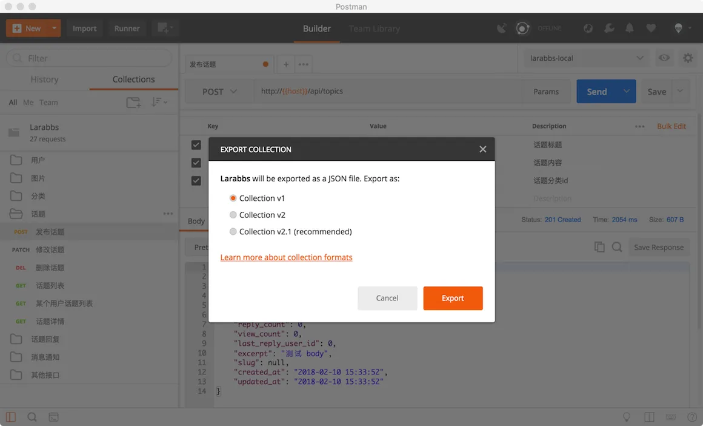
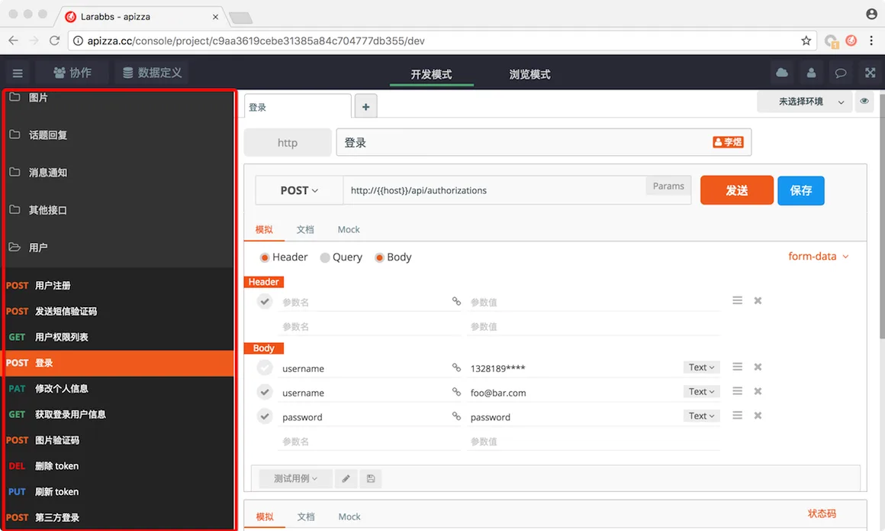
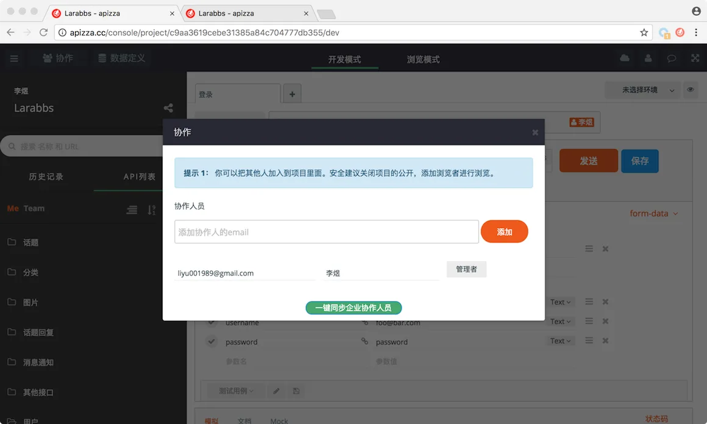
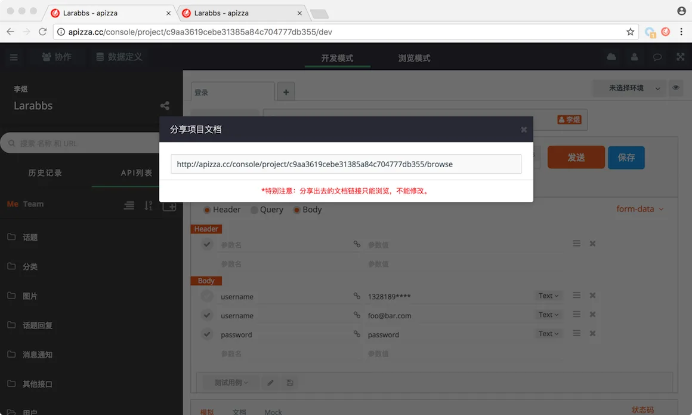

# 10.4. API 文档

原文链接：https://learnku.com/courses/laravel-advance-training/9.x/api-document/12638

## API 文档

完成了所有的 API 及测试，我们需要有个一份接口文档，方便他人使用，这一节我们来介绍一下快速生成 API 文档的方法。

## PostMan

PostMan 导出的 Collection 其实已经是一份基础的接口文档，可以进一步补充请求参数的描述信息。

当然也有很多缺点：

- 需要通过导入导出来分享文档；

- 没法对响应结果进行详细说明；

- 没有地方添加关于当个接口的进一步说明；

当然了付费用户可以享受更多方便的功能，我们在这里不做进一步讨论。

## Apizza 介绍

[Apizza](http://apizza.cc/) 是一款在线的 API 协作管理工具，界面及使用方式与 PostMan 基本类似，可以理解为一款在线版的 PostMan。

但是与 PostMan 相比，功能要更加的丰富，比如我们可以更加详细的定义请求参数和参数类型。

可以更加详细的描述响应数据。

支持 Markdown 格式的说明文件，我们可以为一组接口增加详细的调用说明。

另外 Apizza 还支持直接导入 PostMan 的 Collection 文件。

注意目前只支持 PostMan v1 版本的 Collection 文件。从 PostMan 导出一份 v1 版本的文件，导入 Apizza 中。

导出成功后即可看到文档已经同 PostMan 保持一致了。

当然还有团队协作以及文档分享功能。

## 总结

开发阶段我们一定会使用 PostMan 进行接口调试，将 PostMan 的 Collection 文件导入 Apizza，然后再与团队成员一起进一步的完善文档，最后分享给他人使用，是一件方便快速的事情。

虽然 [APIdoc](http://apidocjs.com/) 和 [swagger](https://swagger.io/) 都是十分优秀的文档工具，但是依然有一定的学习成本和维护成本。所以我们更加推荐 PostMan 与 Apizza 这样的在线工具结合使用，快速的完成 API 文档。
