# 4.2. 微信开发者账号申请

原文链接：https://learnku.com/courses/laravel-advance-training/9.x/wechat-developer-account-application/12603

## 开发者账户

我们拿最常见的微信登录来完成下面的课程，但是对于普通用户来说，微信不支持个人开发者申请微信登录，即便申请到了，也不方便的测试。不过没有关系，OAuth 2.0 的流程是固定的，我们最终需要处理的都是通过授权码，获取 `access_token`，从而得到用户数据，好在微信公众平台为我们提供了接口测试账号，我们可以利用这个测试账号，通过网页授权，模拟学习整个流程。

### 微信公众平台测试账号

申请公众平台测试账号十分方便，直接通过微信登录即可，[登录地址](https://mp.weixin.qq.com/debug/cgi-bin/sandbox?t=sandbox/login)

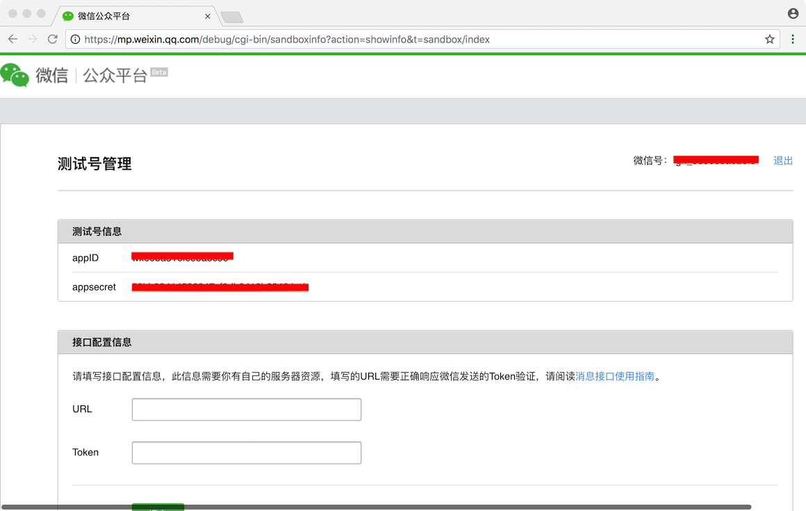

登录后我们可以看到 `appId` 和 `appsecret`。

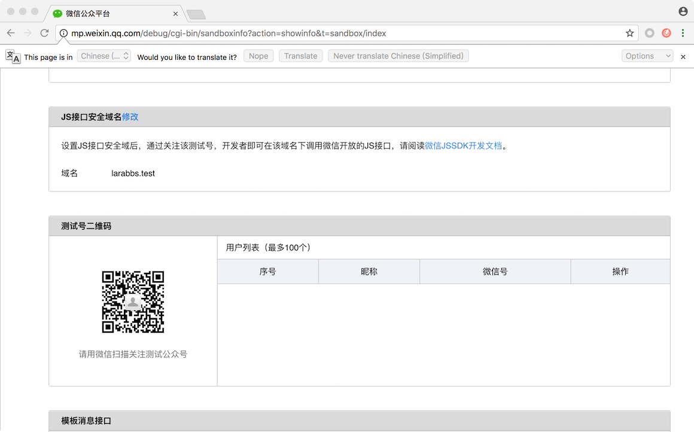

我们需要关注自己的测试公众号，只有关注了测试公众号的用户，才可以进行授权操作，微信扫描 `测试号二维码` 即可。

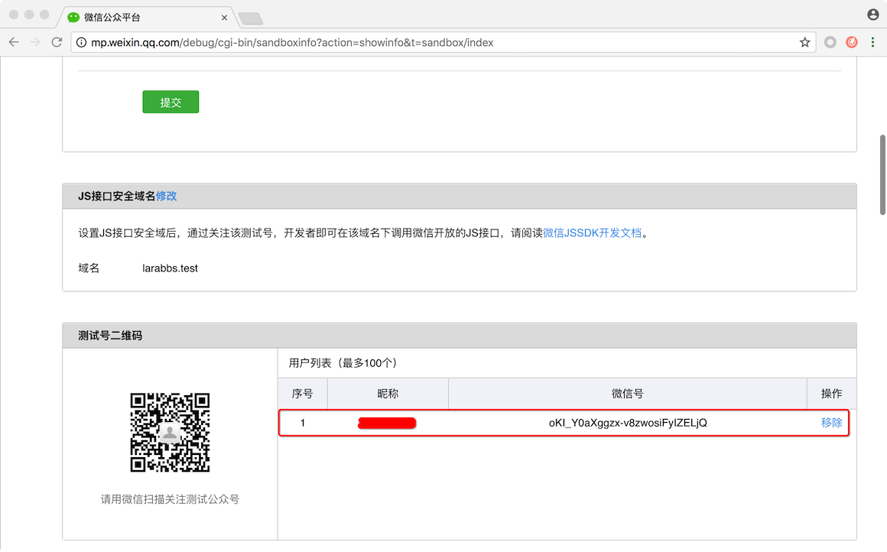

可以在右侧用户列表中看到已经关注的用户。

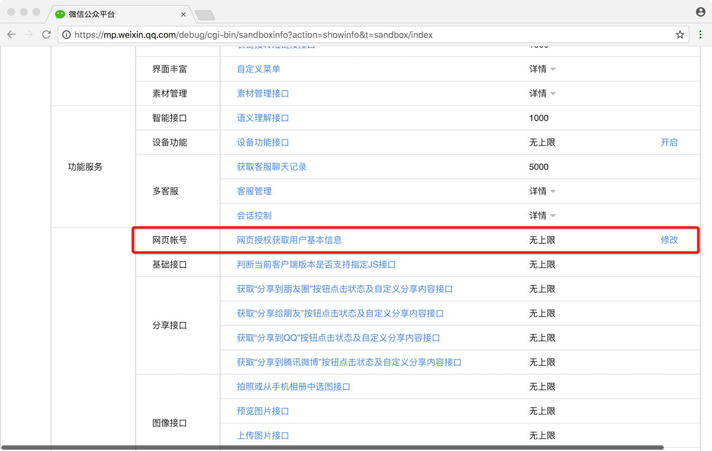

在下面的 `体验接口权限表` 中我们可以找到 `网页授权获取用户基本信息`，点击最后的修改按钮

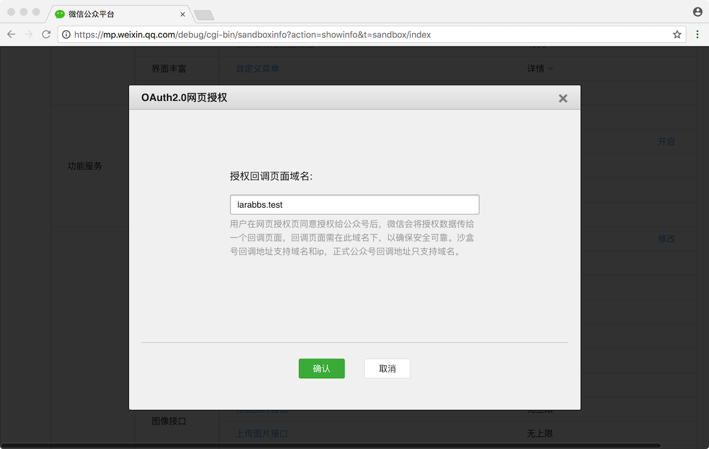

填入 `larabbs.test`，这个是 OAuth 流程中需要提前配置好的回调域名，回调地址必须在这个域名下。

### 测试 OAuth 流程

因为是公众平台测试账号，所以我们首先需要下载 [微信web开发者工具](https://mp.weixin.qq.com/wiki?t=resource/res_main&id=mp1455784140)，方便我们接下来的调试。
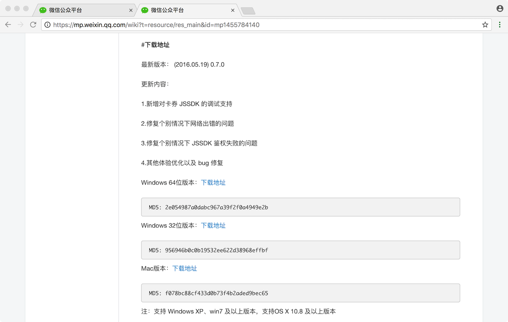

打开开发者工具，扫码登录，选择公众号项目
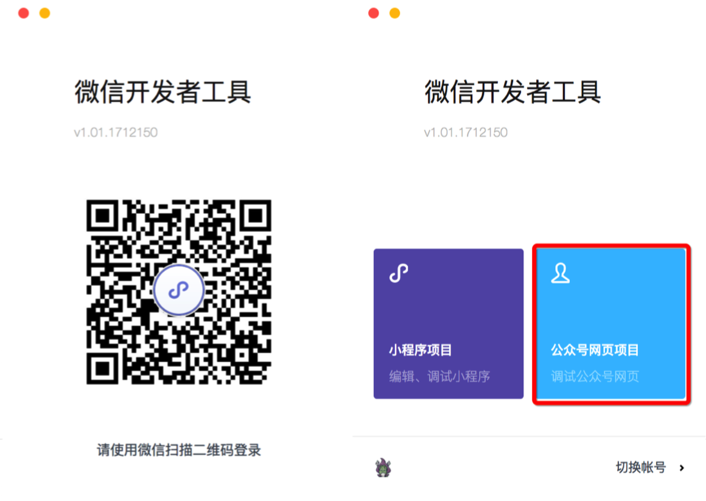

打开后我们看到如下界面
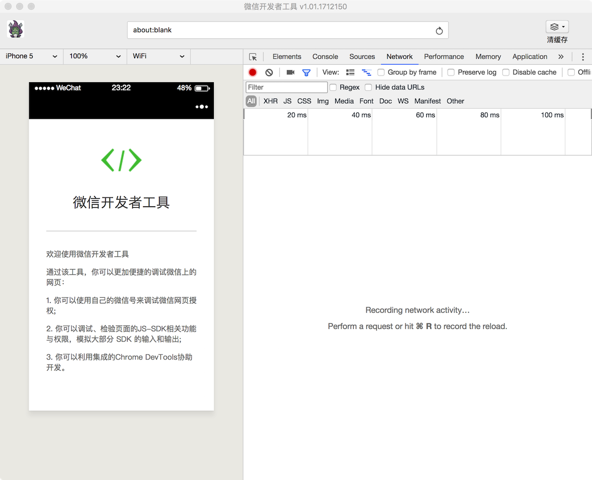

接下来，我们尝试一下 [微信网页授权](https://mp.weixin.qq.com/wiki?t=resource/res_main&id=mp1421140842) 的流程。下面这个链接为微信发起 OAuth 的跳转地址。

```
https://open.weixin.qq.com/connect/oauth2/authorize?appid=APPID&redirect_uri=REDIRECT_URI&response_type=code&scope=SCOPE&state=STATE#wechat_redirect
```

注意链接中有几个变量需要替换

- APPID  测试账号中的`appID`，填写自己账号的 `appID`

- REDIRECT_URI   用户同意授权后的回调地址，填写 `http://larabbs.test`

- SCOPE 应用授权作用域，填写 `snsapi_userinfo`

- STATE 随机参数，可以不填，我们保持 `STATE` 即可。

替换后我们得到的链接类似

```
https://open.weixin.qq.com/connect/oauth2/authorize?appid=wxe0ba316xxxxxxx&redirect_uri=http://larabbs.test&response_type=code&scope=snsapi_userinfo&state=STATE#wechat_redirect
```

在开发者工具中，访问该链接，可以看到微信授权页面
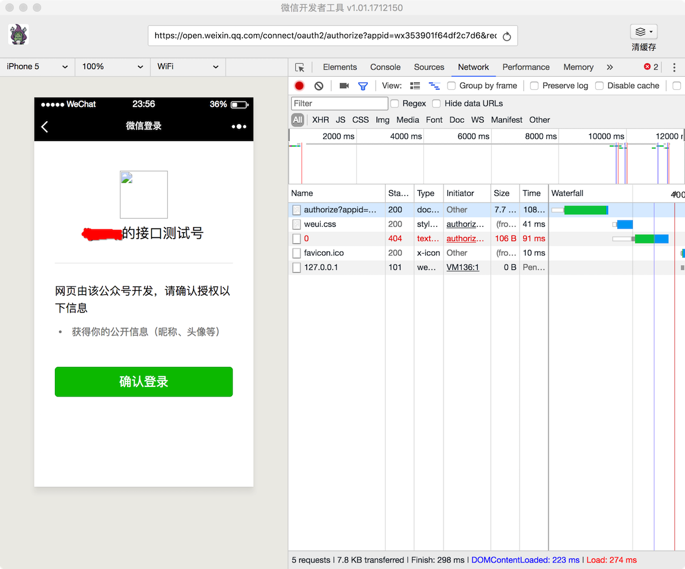

点击确认登录
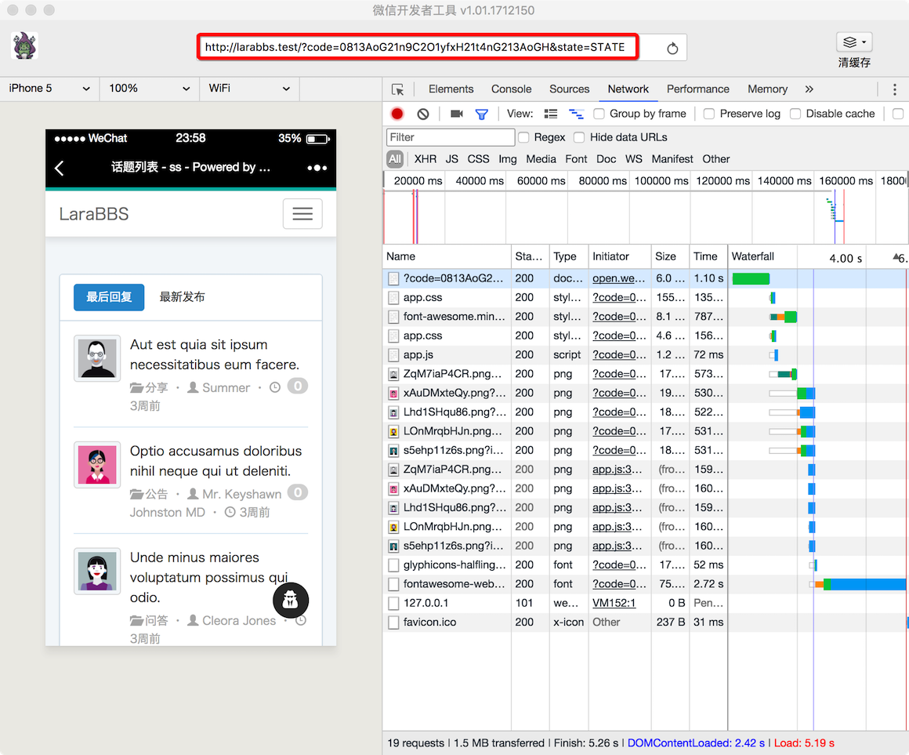

我们成功的跳转回了 `REDIRECT_URI`，注意url中可以看到code参数。好了我们已经完成了 OAuth 流程中获取授权码的步骤。

请求以下链接获取 access_token：

```
https://api.weixin.qq.com/sns/oauth2/access_token?appid=APPID&secret=SECRET&code=CODE&grant_type=authorization_code
```

需要替换的变量

- APPID  测试账号中的`appID`，填写自己账号的 `appID`

- SECRET  测试账号中的`secret`，填写自己账号的 `secret`

- code  上一步获取的 code

替换后的链接如下

```
https://api.weixin.qq.com/sns/oauth2/access_token?appid=wx353901f6xxxxx&secret=d4624c36b6795d1d99dxxxxxxxx&code=0813AoG21n9C2O1yfxH21t4nG213AoGH&grant_type=authorization_code
```

使用 PostMan 访问该链接，获取到了 `access_token`，注意微信同时返回了 `open_id`，微信`access_token` 和 `open_id` 一起请求用户信息。
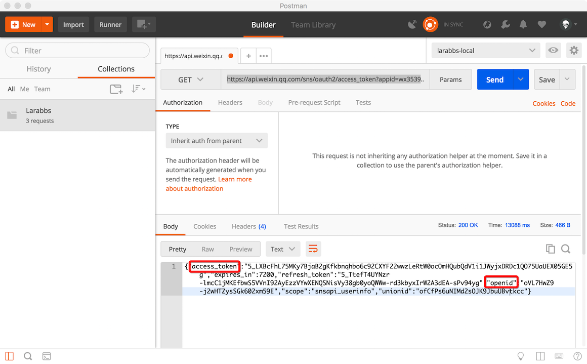

通过 `access_token`获取个人信息

```
https://api.weixin.qq.com/sns/userinfo?access_token=ACCESS_TOKEN&openid=OPENID&lang=zh_CN
```

替换链接中的 `ACCESS_TOKEN` 和 `OPENID`，使用 PostMan 访问
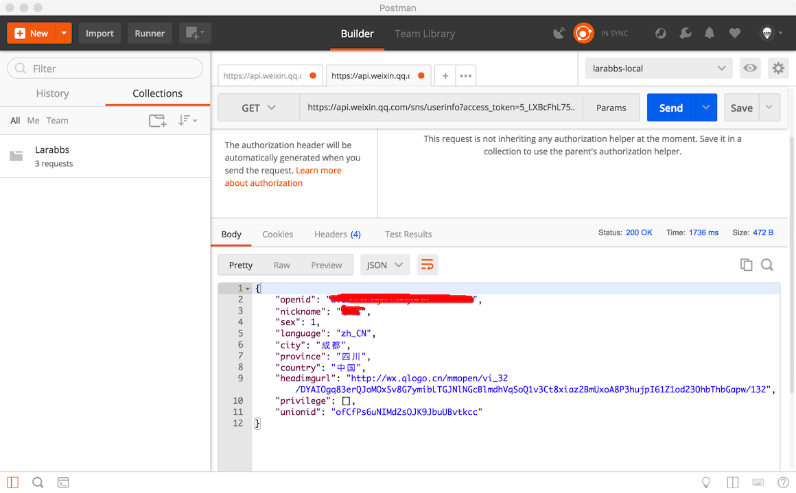

通过上面的测试流程，尝试将微信登录带入整个流程，相信大家对于 OAuth 流程有了更加深入的认识。
