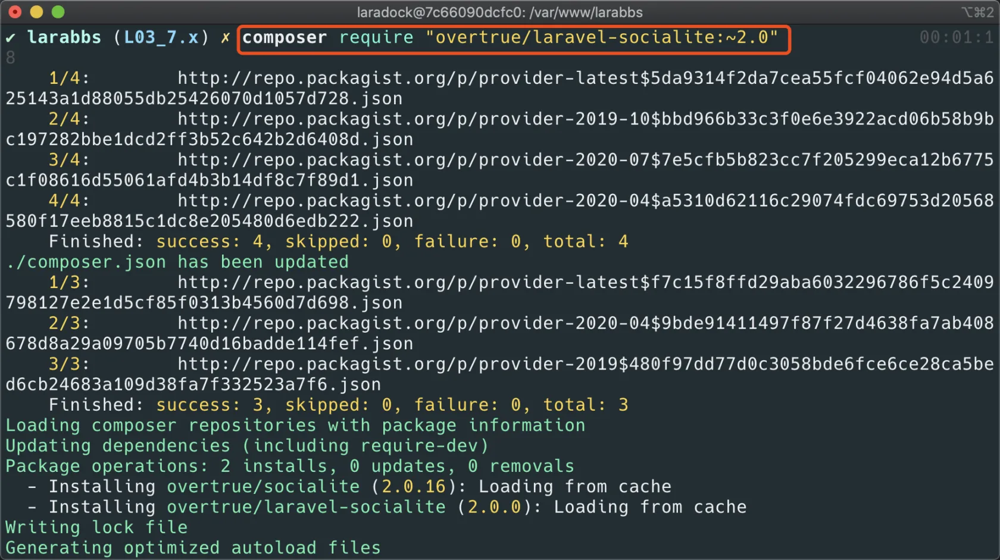
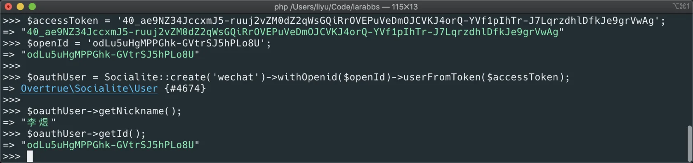
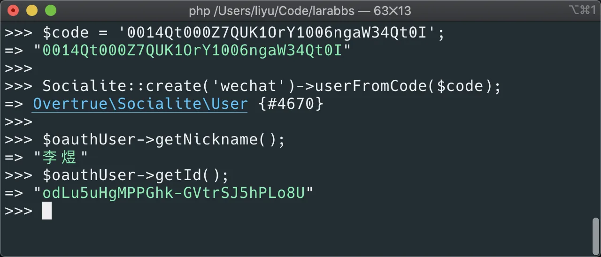

# 4.3. 微信登录

原文链接：https://learnku.com/courses/laravel-advance-training/9.x/wechat-registration/12604

## 安装 socialiteproviders

[socialiteproviders](https://socialiteproviders.github.io/) 为  Laravel Socialite 提供了更多的第三方登录方式，基本上你需要的，都能在这里找到。这个组件方便我们完成整个 OAuth 流程，不过对于我们开发接口来说，只用到了它部分的功能。

[laravel-socialite](https://github.com/overtrue/laravel-socialite)  是另一个第三方登录的扩展包，也非常的方便，另外因为很多人会使用到 [easy wechat](https://github.com/overtrue/wechat) 这个扩展包。所以本次课程使用 [laravel-socialite](https://github.com/overtrue/laravel-socialite)   来解决第三方登录的问题。

首先安装 [github.com/overtrue/laravel-social...](https://github.com/overtrue/laravel-socialite)

```bash
$ composer require "overtrue/laravel-socialite:~4.0"
```



可以省略 ServiceProvider 的设置。接着需要配置 `app_id` 及 `app_secret`，修改如下

config/services.php

```
.
.
.
'socialite' => [
'wechat' => [
'client_id' => env('WEIXIN_KEY'),
'client_secret' => env('WEIXIN_SECRET'),
'redirect' => env('WEIXIN_REDIRECT_URI'),
],
]

.
.
.
```

.env

```
.
.
.
# socialite weixin
WEIXIN_KEY=wx353901f6*****
WEIXIN_SECRET=d4624c36b6795d1d9******
```

注意将 `WEIXIN_KEY` 和 `WEIXIN_SECRET` 替换为你自己的 `appId` 和 `appsecret`

不要忘记修改 `.env.example` 。

```
.
.
.
# socialite weixin
WEIXIN_KEY=
WEIXIN_SECRET=
```

接下来我们就能开始使用了。

## 功能调试

还记得上一章我们提到，客户端可能有两种实现方式, 我们先分别了解一下这两种情况，服务器端该如何处理。

### 1). 客户端已经获取 access_token

因为客户端已经获取了 `access_token`，需要将 `access_token` 发给服务器，服务器通过 `access_token` 获取用户信息，如果成功的换取了用户信息则说明 `access_token` 正确，用户微信登录成功。

打开 tinker 开始调试

```bash
$ php artisan tinker
```

我们上一章已经讲解了如何通过 `微信开发者工具` 获取一个可用的 `access_token`，现在我们申请一个 `access_token`，然后在 tinker 中输入如下代码，将 `ACCESS_TOKEN` 和 `OPEN_ID` 替换为你自己的。

```bash
$accessToken = 'ACCESS_TOKEN';
$openId = 'OPEN_ID';

$oauthUser = Socialite::create('wechat')->withOpenid($openId)->userFromToken($accessToken);

$oauthUser->getNickname();
$oauthUser->getId();
```

因为微信的流程中换取用户信息的接口，需要我们同时提交 `access_token` 和 `openid`。

将以上代码贴到 Tinker 里执行：



请求成功，获取了用户信息

>

只有微信获取用户信息需要同时使用 `access_token` 及 `openid` ，如果你开发的是微博等其他的第三方登录，并不需要 `传入openid` 。

### 2). 客户端只获取授权码（code）

这种方式是推荐的安全做法，客户端不保存 `app_secret`，获取到授权码后就提交给服务器，服务器完成换取 `access_token` 及换取用户信息的流程。

打开 tinker

```bash
$ php artisan tinker
```

通过 `微信开发者工具` 获取一个 code，执行如下代码，将 CODE 替换成你自己的

```bash
$code = 'CODE';
$oauthUser = Socialite::create('wechat')->userFromCode($code);
$oauthUser->getNickname();
$oauthUser->getId();
```

将以上代码贴到 Tinker 里执行：



可以看到，我们通过授权码，成功获取了 `access_token` 和 `openid`，然后换取了用户信息。

>

出于安全的考虑，授权码只能使用一次！！！请不要重复使用同一个 Code 进行调试，如果你调试中报错了，可以打印一下 `$response`，`code been used, hints` 就说明 Code 已经使用过了。

## 第三方登录处理流程

最终服务器获取了用户在微信的用户信息，这一点很重要，无论使用上面哪种方式，都一定要保证用户数据是服务器自己通过 `access_token` 获取的，还有这样才能验证客户端提交数据（ code 或 access_token ）的真实性。获取到的用户数据如下

```
user: [
"openid" => "xxxxxxx",
"nickname" => "xxx",
"sex" => 1,
"language" => "zh_CN",
"city" => "成都",
"province" => "四川",
"country" => "中国",
"headimgurl" => "avatar",
"privilege" => [],
"unionid" => "xxxxxx",
]
```

现在两种情况

1. 用户第一次使用微信登录，根据微信的数据，在 Larabbs 中创建一个用户，返回该用户的登录凭证

2. 用户已经使用过微信登录，则找到数据库中对应的用户，返回该用户的登录凭证

那么如何来分辨用户是否已存在，就需要一个用户的唯一标识。任何一个第三方平台，返回的用户信息都会有一个唯一标识，`socialite` 已经为我们封装好了，直接使用 `$oauthUser->getId()` 即可获取，对于微信来说，这个唯一标识叫做 `openid`。不过微信还有一个 `unionid` 的概念，大家可以看一下 [这里](https://www.zhihu.com/question/21762191/answer/266774632) 的回答。

微信关于unionid的解释

>

如果开发者拥有多个移动应用、网站应用、和公众帐号（包括小程序），可通过 unionid 来区分用户的唯一性，因为只要是同一个微信开放平台帐号下的移动应用、网站应用和公众帐号（包括小程序），用户的 unionid 是唯一的。换句话说，同一用户，对同一个微信开放平台下的不同应用，unionid 是相同的。

所以我们的处理如下

- 根据用户的 openid/unionid 查找数据库中已存在的用户

- 用户存在，返回该用户的登录凭证

- 用户不存在，根据微信信息创建用户，返回该用户的登录凭证

## 提交代码

下一节我们完成代码的开发， 先提交一下代码

```bash
$ git add -A
$ git commit -m "微信登录"
```
