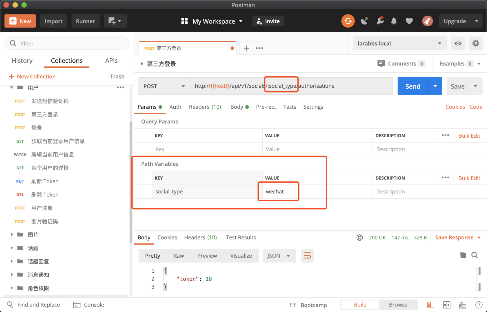
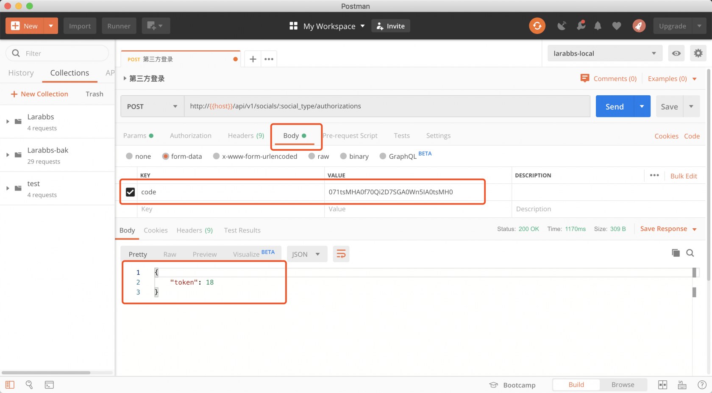
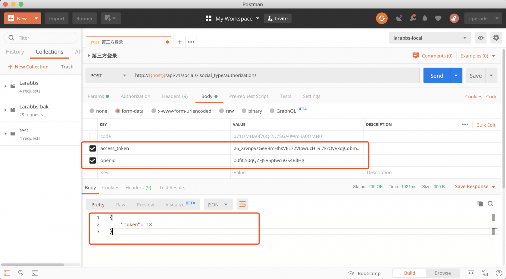
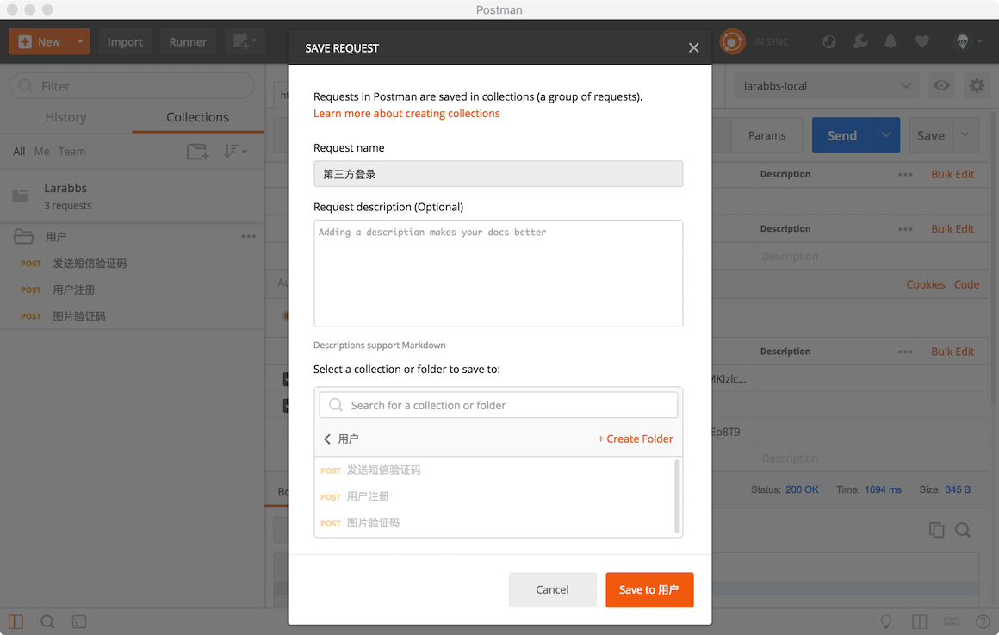

# 4.4. 微信登录功能开发

原文链接：https://learnku.com/courses/laravel-advance-training/9.x/wechat-token-authentication/12605

## 功能开发

### 调整用户表结构

首先需要为 users 表增加两个字段，`weixin_openid`，`weixin_unionid`， 用来记录微信用户的唯一标识。修改 `password` 字段为 nullable，因为第三方登录不需要密码。

```
$ php artisan make:migration add_weixin_openid_to_users_table
```

修改 migration 文件，注意替换文件名中的  `your_date`

databases/migrations/< your_date >_add_weixin_openid_to_users_table.php

```
<?php

use Illuminate\Support\Facades\Schema;
use Illuminate\Database\Schema\Blueprint;
use Illuminate\Database\Migrations\Migration;

class AddWeixinOpenidToUsersTable extends Migration
{
public function up()
{
Schema::table('users', function (Blueprint $table) {
$table->string('weixin_openid')->unique()->nullable()->after('password');
$table->string('weixin_unionid')->unique()->nullable()->after('weixin_openid');
$table->string('password')->nullable()->change();
});
}

public function down()
{
Schema::table('users', function (Blueprint $table) {
$table->dropColumn('weixin_openid');
$table->dropColumn('weixin_unionid');
$table->string('password')->nullable(false)->change();
});
}
}
```

执行迁移：

```
$ php artisan migrate
```

### 路由设计

对于登录，路由该如何设计，你可能会设计成如下这样

- api/login

- api/oauth/login

- api/signin

- api/tokens

GithubApi 给了我们很好的 [参考](https://developer.github.com/v3/oauth_authorizations)，`authorizations` 这个词很合适，意思是授权、授权证书，我们提交一些证明我们身份的信息，服务器颁发给我们一个授权证书，有了这个授权证书，就能调用其他需要身份验证的接口。

为了区分用户账号密码登录和第三方登录，我们可以设计为两个接口

- api/authorizations   —— 账号密码登录；

- api/socials/{social_type}/authorizations —— 第三方登录。

### 第三方登录逻辑

创建 controller 和 request

```
$ php artisan make:controller Api/AuthorizationsController
$ php artisan make:request Api/SocialAuthorizationRequest
```

修改代码如下

app/Http/Requests/Api/SocialAuthorizationRequest.php

```
<?php

namespace App\Http\Requests\Api;

class SocialAuthorizationRequest extends FormRequest
{
public function rules()
{
$rules = [
'code' => 'required_without:access_token|string',
'access_token' => 'required_without:code|string',
];

if ($this->social_type == 'wechat' && !$this->code) {
$rules['openid']  = 'required|string';
}

return $rules;
}
}
```

修改路由

routes/api.php

```
.
.
.
use App\Http\Controllers\Api\AuthorizationsController;
.
.
.
// 用户注册
Route::post('users', 'UsersController@store')
->name('users.store');
// 第三方登录
Route::post('socials/{social_type}/authorizations', [AuthorizationsController::class, 'socialStore'])
->where('social_type', 'wechat')
->name('socials.authorizations.store');
});
.
.
.
```

注意这里的参数，我们对 social_type 进行了限制，只会匹配 `wechat`，如果你增加了其他的第三方登录，可以在这里增加限制，例如支持微信及微博：`->where('social_type', 'wechat|weibo')` 。

修改用户模型

app/Models/User.php

```
.
.
.
protected $fillable = [
'name',
'phone',
'email',
'password',
'introduction',
'avatar',
'weixin_openid',
'weixin_unionid'
];
.
.
.
```

app/Http/Controllers/Api/AuthorizationsController.php

```
<?php

namespace App\Http\Controllers\Api;

use App\Models\User;
use Illuminate\Support\Arr;
use Illuminate\Http\Request;
use Illuminate\Auth\AuthenticationException;
use App\Http\Requests\Api\SocialAuthorizationRequest;

class AuthorizationsController extends Controller
{
public function socialStore($type, SocialAuthorizationRequest $request)
{
$driver = \Socialite::create($type);

try {
if ($code = $request->code) {
$oauthUser = $driver->userFromCode($code);
} else {
// 微信需要增加 openid
if ($type == 'wechat') {
$driver->withOpenid($request->openid);
}

$oauthUser = $driver->userFromToken($request->access_token);
}
} catch (\Exception $e) {
throw new AuthenticationException('参数错误，未获取用户信息');
}

if (!$oauthUser->getId()) {
throw new AuthenticationException('参数错误，未获取用户信息');
}

switch ($type) {
case 'wechat':
$unionid = $oauthUser->getRaw()['unionid'] ?? null;

if ($unionid) {
$user = User::where('weixin_unionid', $unionid)->first();
} else {
$user = User::where('weixin_openid', $oauthUser->getId())->first();
}

// 没有用户，默认创建一个用户
if (!$user) {
$user = User::create([
'name' => $oauthUser->getNickname(),
'avatar' => $oauthUser->getAvatar(),
'weixin_openid' => $oauthUser->getId(),
'weixin_unionid' => $unionid,
]);
}

break;
}

return response()->json(['token' => $user->id]);
}
}
```

>

只有在用户将公众号绑定到微信开放平台帐号后，才会出现 unionid 字段。[这里](https://mp.weixin.qq.com/wiki?t=resource/res_main&id=mp1421140839) 有相关说明。但是由于微信开放平台只有通过认证才能绑定公众号，代码做了兼容处理。

分析一下 controller 的逻辑

- 客户端要么提交授权码（code），要么提交 `access_token` 和 `openid`

- 无论哪种方式，服务器都会调用微信接口，获取授权用户数据，从而确认数据的有效性。这一步很重要，客户端提交的一切都是不可信任的，切记不能由客户端直接换取用户信息，提交 `openid` 或 `unionid` 以及用户数据到服务器，直接入库。

- 根据 openid 或 unionid 去数据库查询是否该用户已经存在，如果不存在，则创建用户

- 最后由服务器为该用户颁发授权凭证。

这里暂时返回用户 id 用于测试，下一节学习了 `jwt` 相关的内容后，我们会替换这部分代码。

使用 PostMan 调用该接口，首先使用授权码登录。



注意 PostMan 变量及参数的处理，URL 中以冒号开头的是变量，可以在 `Path Variables` 中对变量进行赋值。



这里使用授权码调用接口，成功的创建了用户。



使用相同用户的 `access_token` 及 `openid` 调用接口，因为用户已存在，所以并未创建新用户。

>

这里分别使用了两种方式进行登录的演示，但是真实情况下可能只会使用一种，而且我们推荐授权码的方式

保存接口，方便以后调试



提交代码

```
$ git add -A
$ git commit -m "微信登录"
```
