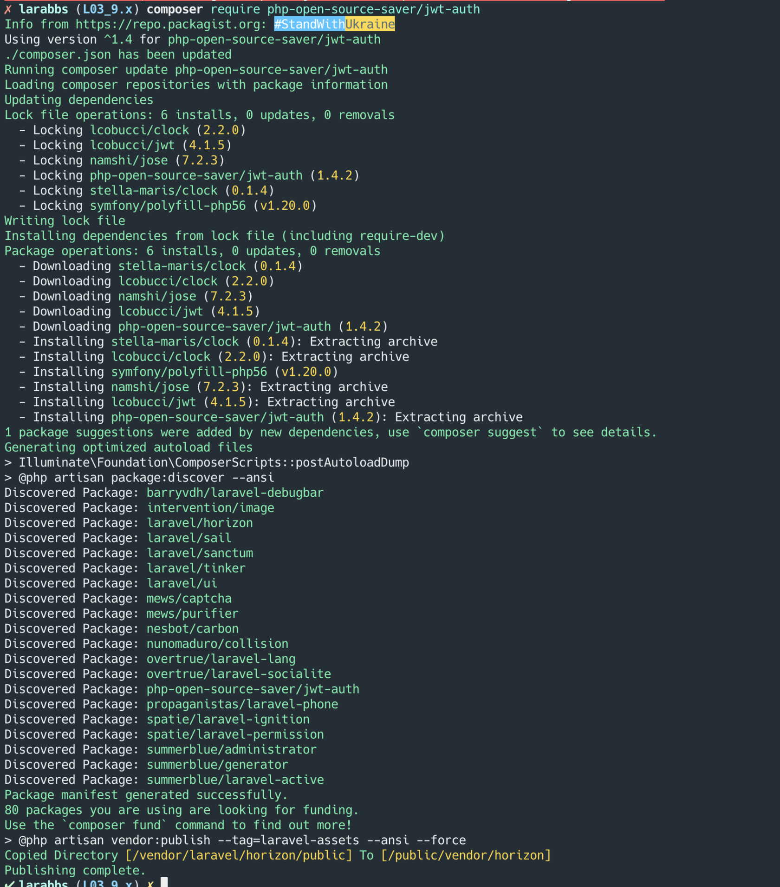
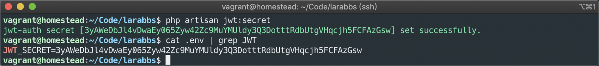
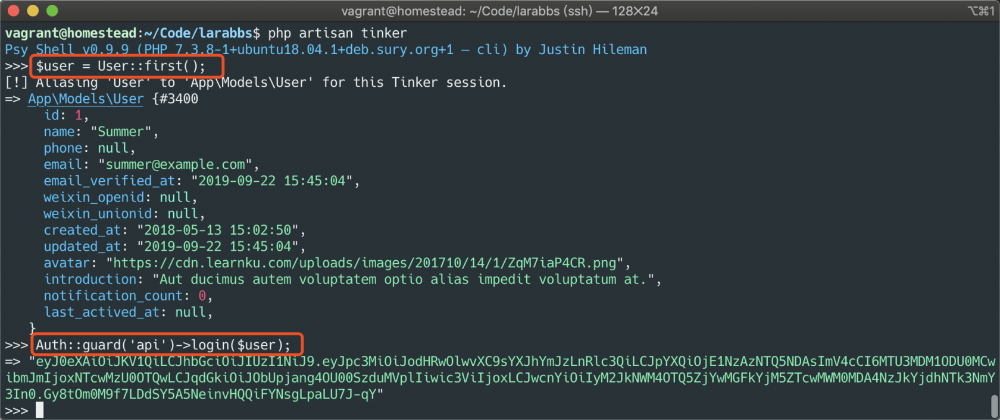
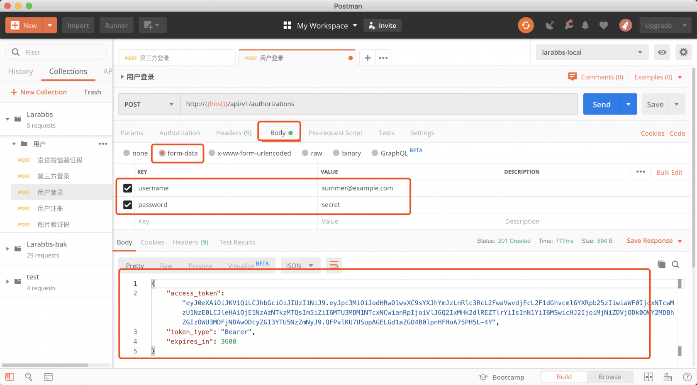
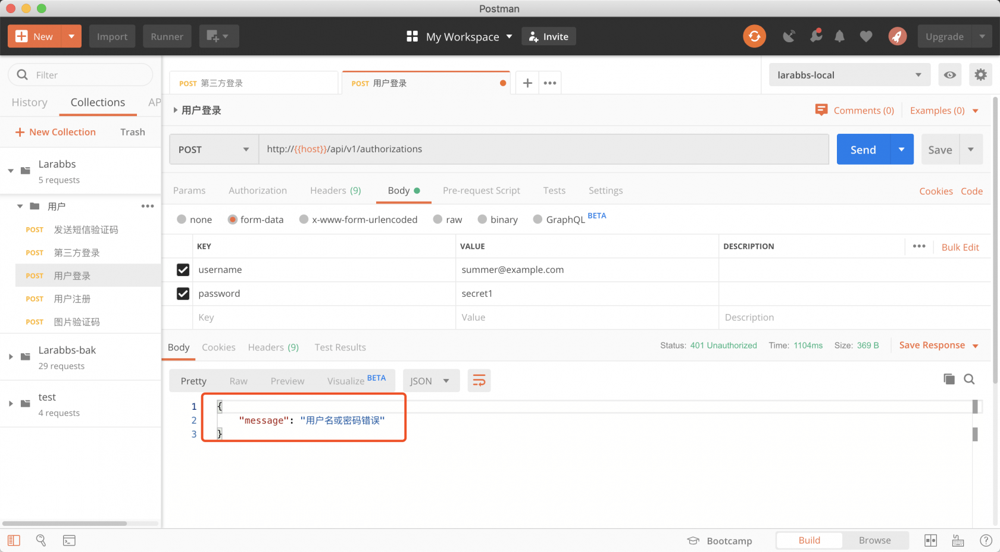
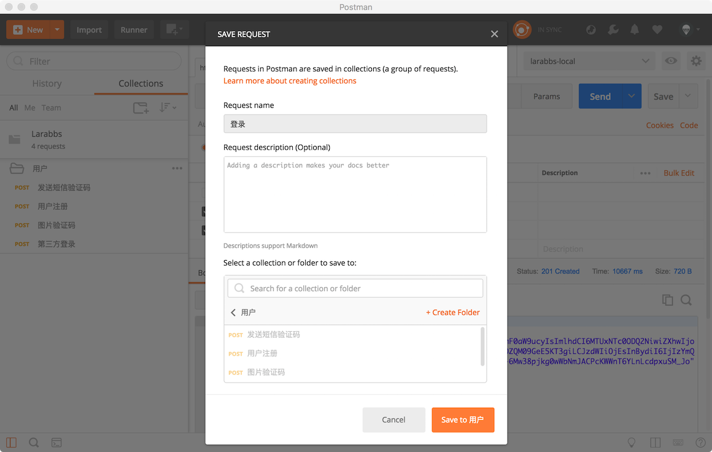
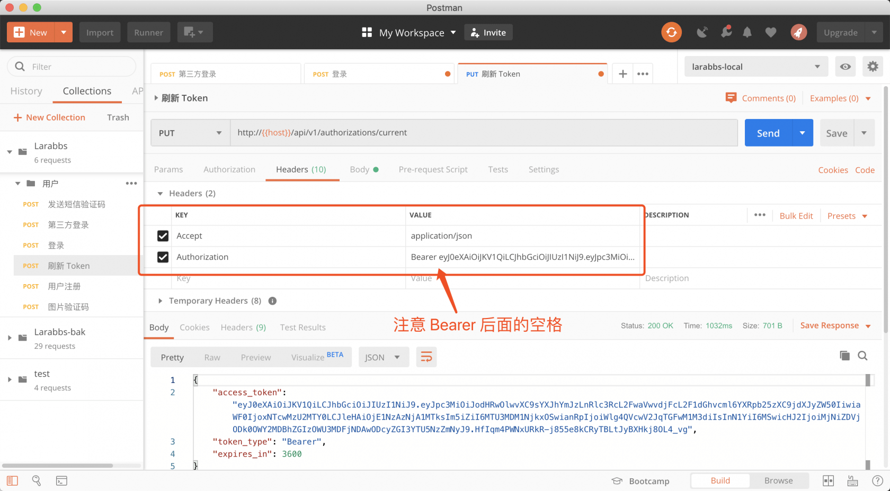
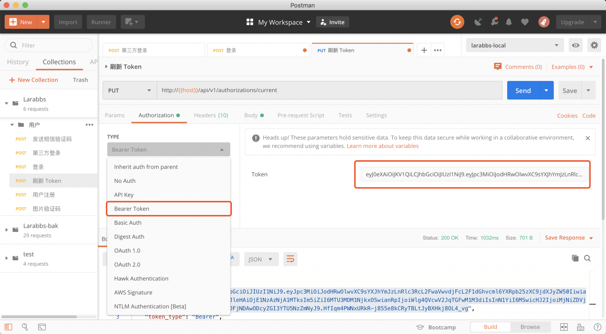
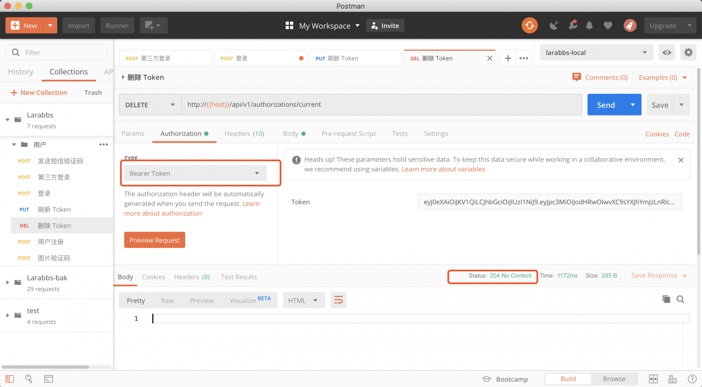

# 4.5. 登录 API 获取 JWT 令牌

原文链接：https://learnku.com/courses/laravel-advance-training/9.x/mobile-login-api/12606

## JWT

[JWT](https://jwt.io/) 是 JSON Web Token 的缩写，是一个非常轻巧的规范，这个规范允许我们使用 JWT 在用户和服务器之间传递安全可靠的信息。

JWT 由头部（header）、载荷（payload）与签名（signature）组成，一个 JWT 类似下面这样：

```
{
"typ":"JWT",
"alg":"HS256"
}
{
"iss":"http://larabbs.test",
"iat":1515733500,
"exp":1515737100,
"nbf":1515733500,
"jti":"c3U4VevxG2ZA1qhT",
"sub":1,
"prv":"23bd5c8949f600adb39e701c400872db7a5976f7"
}
signature
```

- 头部声明了加密算法；

- 载荷中有两个比较重要的数据，`exp` 是过期时间，`sub` 是 JWT 的主体，这里就是用户的 id；

- 最后的 signature 是由服务器进行的签名，保证了 token 不被篡改。

>

JWT 最后是通过 Base64 编码的，也就是说，它可以被翻译回原来的样子来的。所以不要在 JWT 中存放一些敏感信息。

用户 id，过期时间等数据都保存在 Token 中了，所以并不需要将 Token 保存在服务器中，客户端请求的时候在 Header 中携带 Token，服务器获取 Token后，进行 `base64_decode`  即可获取数据进行校验，由于已经有了签名，所以不用担心数据被篡改。

### Token 验证

有了 token 之后该如何验证 token 的有效性，并得到 token 对应的用户呢？其实原理很简单，Laravel 为我们准备好了 `auth` 这个中间件

- 获取客户端提交的 token

- 检测 token 中的签名 signature 是否正确

- 判断 `payload` 数据中的 `exp`，是否已经过期

- 根据 `payload` 数据中的 `sub`，取数据库中验证用户是否存在

- 上述检测不正确，则抛出相应异常

### 安装 jwt-auth

>

[jwt-auth](https://github.com/tymondesigns/jwt-auth) 已经停止维护了，可以考虑使用 [php-open-source-saver/jwt-auth](https://github.com/PHP-Open-Source-Saver/jwt-auth)。或者可以考虑使用 Laravel 的 Sanctum 。

首先来安装一下。

```
$ composer require php-open-source-saver/jwt-auth
```



安装完成后，我们需要设置一下 JWT 的 secret，这个 secret 很重要，用于最后的签名，更换这个secret 会导致之前生成的所有 token 无效。

```
$ php artisan jwt:secret
```



可以看到在 .env 文件中，增加了一行 `JWT_SECRET`。

修改 config/auth.php，将 `api guard` 的 `driver` 改为 `jwt`。

config/auth.php

```
.
.
.
'guards' => [
'web' => [
'driver' => 'session',
'provider' => 'users',
],

'api' => [
'driver' => 'jwt',
'provider' => 'users',
],
],
.
.
.
```

user 模型需要继承 `use PHPOpenSourceSaver\JWTAuth\Contracts\JWTSubject;` 接口，并实现接口的两个方法 `getJWTIdentifier()` 和 `getJWTCustomClaims()`。

app\Models\User.php

```
.
.
.
use PHPOpenSourceSaver\JWTAuth\Contracts\JWTSubject;

class User extends Authenticatable implements MustVerifyEmailContract, JWTSubject
.
.
.
public function getJWTIdentifier()
{
return $this->getKey();
}

public function getJWTCustomClaims()
{
return [];
}
}
```

`getJWTIdentifier` 返回了 User 的 id，`getJWTCustomClaims` 是我们需要额外在 JWT 载荷中增加的自定义内容，这里返回空数组。打开 tinker，执行如下代码，尝试生成一个 token。

```
$user = User::first();
Auth::guard('api')->login($user);
```



`jwt-auth` 有两个重要的参数，可以在 .env 中进行设置

- `JWT_TTL` 生成的 token 在多少分钟后过期，默认 60 分钟

- `JWT_REFRESH_TTL`   生成的 token，在多少分钟内，可以刷新获取一个新 token，默认 20160 分钟，14天。

这里需要理解一下 JWT 的过期和刷新机制，过期很好理解，超过了这个时间，token 就无效了。刷新时间一般比过期时间长，只要在这个刷新时间内，即使 token 过期了， 依然可以换取一个新的 token，以达到应用长期可用，不需要重新登录的目的。

### 用户登录

接着完成用户登录的代码，前面设计的路由为 `api/authorizations`。

routes/api.php

```
.
.
.
// 第三方登录
Route::post('socials/{social_type}/authorizations', [AuthorizationsController::class, 'socialStore'])
->where('social_type', 'wechat')
->name('socials.authorizations.store');

// 登录
Route::post('authorizations', [AuthorizationsController::class, 'store'])
->name('authorizations.store');

```

创建登录的 request

```
$ php artisan make:request Api/AuthorizationRequest
```

修改代码如下

app/Http/Requests/Api/AuthorizationRequest.php

```
<?php

namespace App\Http\Requests\Api;

class AuthorizationRequest extends FormRequest
{
public function rules()
{
return [
'username' => 'required|string',
'password' => 'required|alpha_dash|min:6',
];
}
}
```

app/Http/Controllers/Api/AuthorizationsController.php

```
.
.
.
use App\Http\Requests\Api\AuthorizationRequest;
.
.
.
public function store(AuthorizationRequest $request)
{
$username = $request->username;

filter_var($username, FILTER_VALIDATE_EMAIL) ?
$credentials['email'] = $username :
$credentials['phone'] = $username;

$credentials['password'] = $request->password;

if (!$token = \Auth::guard('api')->attempt($credentials)) {
throw new AuthenticationException('用户名或密码错误');
}

return response()->json([
'access_token' => $token,
'token_type' => 'Bearer',
'expires_in' => \Auth::guard('api')->factory()->getTTL() * 60
])->setStatusCode(201);
}
.
.
.
```

用户可以使用邮箱或者手机号登录，最后返回 token 信息及过期时间`expires_in`，单位是秒，这里返回的结构很像 OAuth 2.0，使用方法也与 OAuth 2.0 相似。

使用 PostMan 模拟请求，使用电话和邮箱均能正确获取 token。



密码错误会返回 401。



保存路由。



### 第三方登录修改

回忆一下上一节，第三方登录后，其实也应该同登录注册一样的信息，应当避免代码重复，我们可以简单封装一下。

app/Http/Controllers/Api/AuthorizationsController.php

```
.
.
.
protected function respondWithToken($token)
{
return response()->json([
'access_token' => $token,
'token_type' => 'Bearer',
'expires_in' => auth('api')->factory()->getTTL() * 60
]);
}
.
.
.
```

增加了 `respondWithToken` 方法，这样登录和第三方登录都能通过该方法返回。完整的 controller 代码如下

```
<?php

namespace App\Http\Controllers\Api;

use App\Models\User;
use Illuminate\Support\Arr;
use Illuminate\Http\Request;
use Illuminate\Auth\AuthenticationException;
use App\Http\Requests\Api\AuthorizationRequest;
use App\Http\Requests\Api\SocialAuthorizationRequest;

class AuthorizationsController extends Controller
{
public function store(AuthorizationRequest $request)
{
$username = $request->username;

filter_var($username, FILTER_VALIDATE_EMAIL) ?
$credentials['email'] = $username :
$credentials['phone'] = $username;

$credentials['password'] = $request->password;

if (!$token = \Auth::guard('api')->attempt($credentials)) {
throw new AuthenticationException('用户名或密码错误');
}

return $this->respondWithToken($token)->setStatusCode(201);
}

public function socialStore($type, SocialAuthorizationRequest $request)
{
$driver = \Socialite::create($type);

try {
if ($code = $request->code) {
$oauthUser = $driver->userFromCode($code);
} else {
$tokenData['access_token'] = $request->access_token;

// 微信需要增加 openid
if ($type == 'wechat') {
$driver->withOpenid($request->openid);
}

$oauthUser = $driver->userFromToken($request->access_token);
}
} catch (\Exception $e) {
throw new AuthenticationException('参数错误，未获取用户信息');
}

if (!$oauthUser->getId()) {
throw new AuthenticationException('参数错误，未获取用户信息');
}

switch ($type) {
case 'wechat':
$unionid = $oauthUser->getRaw()['unionid'] ?? null;

if ($unionid) {
$user = User::where('weixin_unionid', $unionid)->first();
} else {
$user = User::where('weixin_openid', $oauthUser->getId())->first();
}

// 没有用户，默认创建一个用户
if (!$user) {
$user = User::create([
'name' => $oauthUser->getNickname(),
'avatar' => $oauthUser->getAvatar(),
'weixin_openid' => $oauthUser->getId(),
'weixin_unionid' => $unionid,
]);
}

break;
}
$token = auth('api')->login($user);
return $this->respondWithToken($token)->setStatusCode(201);
}

protected function respondWithToken($token)
{
return response()->json([
'access_token' => $token,
'token_type' => 'Bearer',
'expires_in' => auth('api')->factory()->getTTL() * 60
]);
}
}
```

第三方登录获取 user 后，我们可以使用 login 方法为某一个用户模型生成 token。

### 刷新/删除 token

任何一个永久有效的 token 都是相当危险的，通过任意方式泄露了 token 之后，用户的相关信息都有可能被利用。所以为了安全考虑，任何一种令牌的机制，都会有过期时间，过期时间一般也不会太长。那么 token 过期以后，难道要用户重新登录吗？像 OAuth 2.0 有 `refresh_token` 可以用来刷新一个过期的 `access_token`，jwt-auth 同样也为我们提供了刷新的机制，只要在可刷新的时间范围内，即使 token 过期了，依然可以调用接口，换取一个新的 token。这对于 APP 长期保持用户登录状态是十分重要的。

删除和刷新 token 的路由我设计为：

- PUT /api/authorizations/current   ——  替换当前的授权凭证；

- DELETE /api/authorizations/current  ——  删除当前的授权凭证。

首先增加路由
routes/api.php

```
.
.
.
// 登录
Route::post('authorizations', 'AuthorizationsController@store')
->name('authorizations.store');
// 刷新token
Route::put('authorizations/current', [AuthorizationsController::class, 'update'])
->name('authorizations.update');
// 删除token
Route::delete('authorizations/current', [AuthorizationsController::class, 'destroy'])
->name('authorizations.destroy');

});
.
.
.
```

app/Http/Controllers/Api/AuthorizationsController.php

```
.
.
.
public function update()
{
$token = auth('api')->refresh();
return $this->respondWithToken($token);
}

public function destroy()
{
auth('api')->logout();
return response(null, 204);
}
.
.
.
```

两个方法我们都需要提交当前的 token，正确的提交方式是在增加 `Authorization` Header。

```
Authorization: Bearer {token}
```

注：如果使用php-open-source-saver/jwt-auth。需要在.env文件中增加如下命令，不然refresh和logout后，原令牌不会失效。

```
JWT_SHOW_BLACKLIST_EXCEPTION=true
```

调用刷新 token 接口，返回了刷新后的 token 信息。



不过 PostMan 有更加方便的方式



选择 `Authorization`， 选择其中的`Bearer Token`，直接填写 token即可。同样尝试调用删除 token 接口:



删除 token 的场景就是用户退出 APP，将当前的 token 禁用掉。注意删除使用的 HTTP 方法是 DELETE，返回的状态码是 204，因为对于删除这类的事件，只需要告诉客户端成功了，没什么需要返回的信息。

记得在 PostMan 保存刷新和删除的接口。

### 代码版本控制

```
$ git add -A
$ git commit -m "使用 JWT"
```
