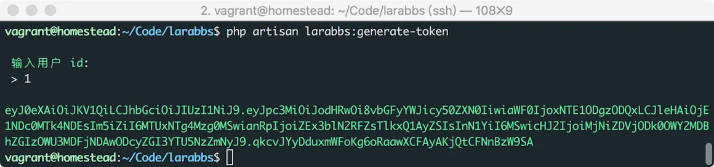
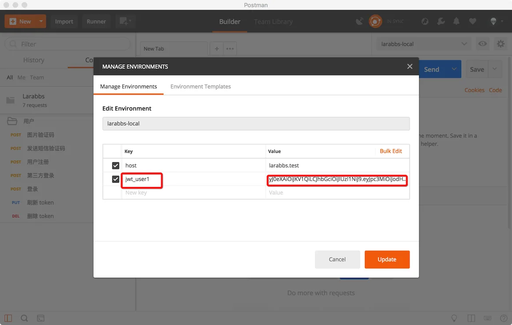
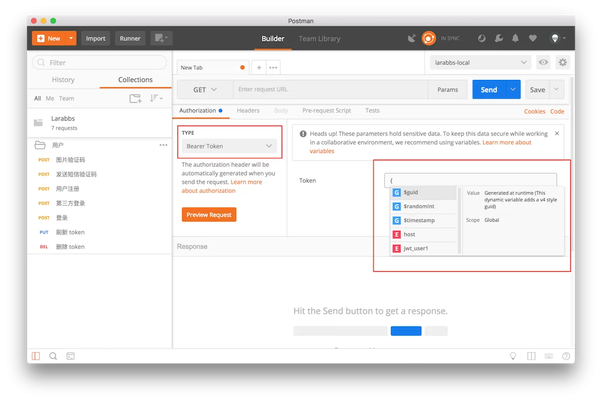
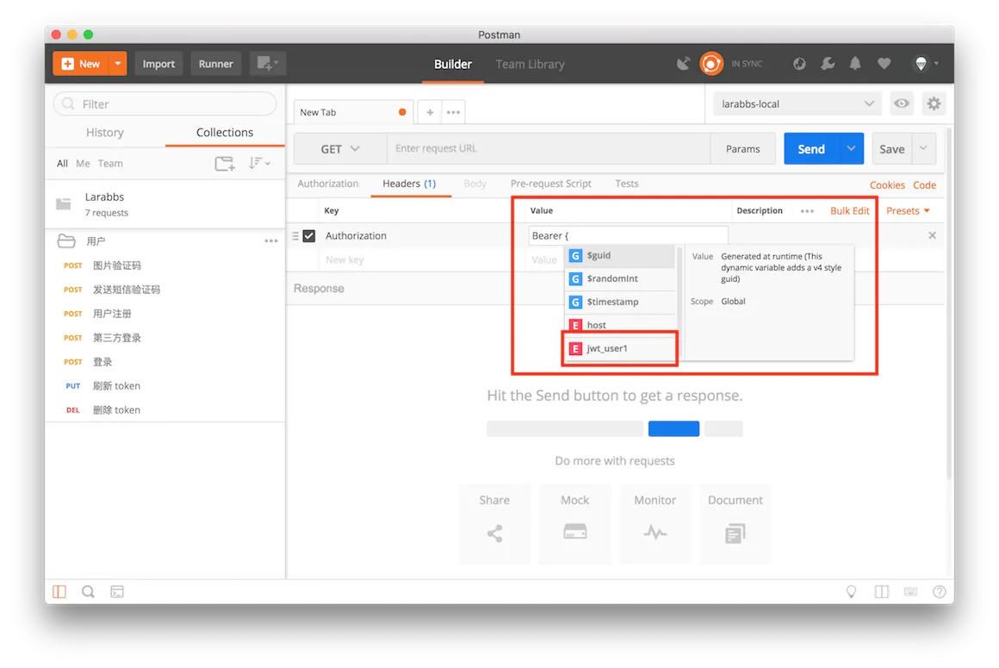

# 4.6. artisan 获取 token

原文链接：https://learnku.com/courses/laravel-advance-training/9.x/command-is-easy-to-get-jwt/12607

## 快速生成 JWT

我们现在可以通过登录，第三方登录，创建一个 `token` 了，需要用户身份认证的接口，都需要我们携带 `token` 进行访问。这时候就会有一个问题，`token` 是有过期时间的，我们每次要调试接口时都需要重新创建一个 `token`；尝试不同身份用户调用的时候，就需要重为不同的用户创建 `token`，能不能有个快捷的方式创建 `token` 供调试使用呢？这一节我们来解决这个问题。

## 1. 增加 command

下面我们增加一个Artisan 命令。

```bash
$ php artisan make:command GenerateToken
```

修改文件

app/Console/Commands/GenerateToken.php

```
<?php

namespace App\Console\Commands;

use App\Models\User;
use Illuminate\Console\Command;

class GenerateToken extends Command
{
    protected $signature = 'larabbs:generate-token';

    protected $description = '快速为用户生成 token';

    public function __construct()
    {
        parent::__construct();
    }

    public function handle()
    {
        $userId = $this->ask('输入用户 id');

        $user = User::find($userId);

        if (!$user) {
            return $this->error('用户不存在');
        }

        // 一年以后过期，单位分钟
        $ttl = 365*24*60;
        $this->info(auth('api')->setTTL($ttl)->login($user));
    }
}
```

输入用户id，查询id对应的用户，然后为该用户生成一个有效期为 1 年的 `token`。

尝试执行该 Artisan 命令

```bash
$ php artisan larabbs:generate-token
```



## 2. PostMan 增加变量

还记得 PostMan 可以增加变量吗，创建一个 `jwt_user1` 的变量，填入刚才创建的 `token`。



无论哪种方式设置 `Authorization` 都可以方便的使用token了。输入 `{` PostMan 会为我们列出可用的变量。




## 3. 提交代码

```bash
$ git add -A
$ git commit -m "快速生成 jwt"
```
