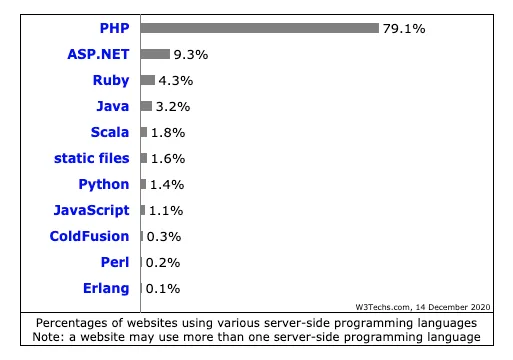
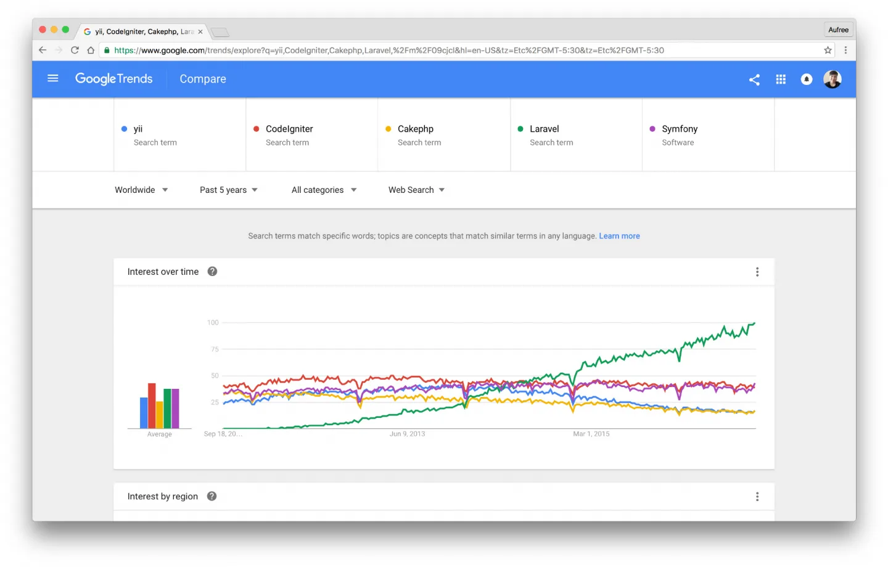

# 1.3. Laravel 与 PHP 免费

原文链接：https://learnku.com/courses/laravel-intermediate-training/9.x/laravel-and-php/12464

## 为什么是 PHP？

PHP 全称是 PHP: Hypertext Preprocessor，译为：『超文本预处理器』。是一门开源脚本语言，专为『动态 Web 开发』而生。

PHP 在服务器脚本语言市场占有率中遥遥领先于其他对手：

上图是由 [W3Techs](https://w3techs.com/technologies/overview/programming_language/all) 网站提供的 [服务器端脚本语言市场占有率](https://w3techs.com/technologies/overview/programming_language/all) 排名，数据样本是 [Alexa](http://www.alexa.com/) 世界排名 前一千万 的网站，其中 79.1% 使用 PHP 构建，此数据每日更新。可以看出 PHP 惊人的市场占有率。世界上大部分的商业网站在使用 PHP，可想而知这些企业对 PHP 的人才需求能有多巨大。

>

扩展阅读：[为什么 PHP 是最好的语言？现在是，将来也会是](https://zhuanlan.zhihu.com/p/26704744)

### 作为职业

如果你在选择职业，巨大的市场占有率有以下好处：

- 人才需求大 - 好找工作，可以看下 [社区招聘列表](https://learnku.com/laravel/c/jobs)；

- 学习的人多 - 资料多，[社区](https://learnku.com/laravel) 活跃；

- 解决方案多 - 开发中基本上遇不到什么技术难题。

### 架构选型

如果你是创业者或者技术负责人，在做技术架构选型，PHP 的巨大的市场占有率有以下好处：

- 招人好招 - 笔者喜爱 ROR（基于 Ruby 语言），但是在 PHP 有了 Laravel 后毫不犹豫就把公司的整个技术堆栈切到 PHP，最大原因就是 人好招，创业公司里，组建团队是个头痛的问题；

- 解决方案多 - PHP 有很多优质的开源软件，拿过来直接就能使用。另外，作为日常开发，也是非常方便。举个有趣的例子：很多第三方开发者服务 SDK 包优先考虑的就是先出个 PHP 的 SDK，原因就是：PHP 占有率高。

## 什么是 Laravel？

[Laravel](https://laravel.com/) 是 Taylor Otwell 开发的一款基于 PHP 语言的 Web 开源框架，采用了 MVC 的架构模式，在 2011 年 6 月正式发布了首个版本。

由于 Laravel 具备 Rails 敏捷开发等优秀特质，深度集成 PHP 强大的扩展包（Composer）生态与 PHP 开发者广大的受众群，让 Laravel 在发布之后的短短几年时间得到了极其迅猛的发展。我们通过 [Google Trends](https://www.google.com/trends/explore?date=2006-08-16%202016-09-16&q=yii,CodeIgniter,Cakephp,Laravel,%2Fm%2F09cjcl&hl=en-US&tz=Etc%2FGMT-5:30&tz=Etc%2FGMT-5:30) 提供的趋势图（图 1.1）可以看出，Laravel 框架在过去七年，其增长速度在各类 PHP 框架中都是有史以来最快的，这也从正面直接反映出了 Laravel 的强大，以及其未来非常可观的发展前景。

图 1.1 - Google 趋势（Laravel 为绿色）

>

扩展阅读：[数据说话 - 最火的 PHP 框架是哪个？](https://zhuanlan.zhihu.com/p/24673684)

## 为何 Laravel 如此受欢迎？

一个优秀的工程师在构建一个语言框架时，应该懂得如何去协调好框架和语言之间的关系，并借助前人的智慧来思考框架的合理性与可扩展性。Laravel 的作者 Taylor Otwell 无疑做到了这一点。

若你之前对 Web 开发有所了解，那么你可能会知道有个叫 Ruby on Rails（简称 Rails）的知名 Web 开发框架。Rails 是基于 Ruby 语言构建的一个 Web 开发框架，该框架有以下原则：

- 强调与注重敏捷开发；

- 约定高于配置（Convention over configuration）；

- DRY（Don’t repeat yourself）不要重复自己，提倡代码重用；

- 重视「编码愉悦性」。

自诞生之日起，Rails 便受到了技术社区的广泛关注与讨论。而 Laravel 正是由于结合了 Rails 框架的这几项优秀特质，才使得其在 PHP 社区中备受推崇。

## 国内 Laravel 生态圈在哪？

Laravel 在国内的生态圈发展也日趋成熟，你可以很轻松的在网上找到很多 Laravel 相关的中文学习资料、技术讨论社区：

- [Laravel China 社区](https://laravel-china.org/) - 国内最大的 PHP / Laravel 开发者社区，由 Summer 在 2014 年创建；

- [Laravel 中文文档](https://learnku.com/laravel/docs) - Laravel China 社区维护的中文文档，涵盖所有版本

- [Laravel 精品译文](https://learnku.com/laravel/c/translations) - 为 Laravel 开发者提供最新最热的技术资讯

- [Laravel CheatSheet](https://learnku.com/docs/laravel-cheatsheet/9.x) - Laravel 速查表

- [Composer 中文镜像](https://learnku.com/laravel/wikis/25522) - Packagist 中国全量镜像，让 Composer 速度如飞。

## Laravel 有着怎样的版本计划？

请见： [Wiki：Laravel 基本信息：有哪些版本？](https://learnku.com/laravel/wikis/25511)
