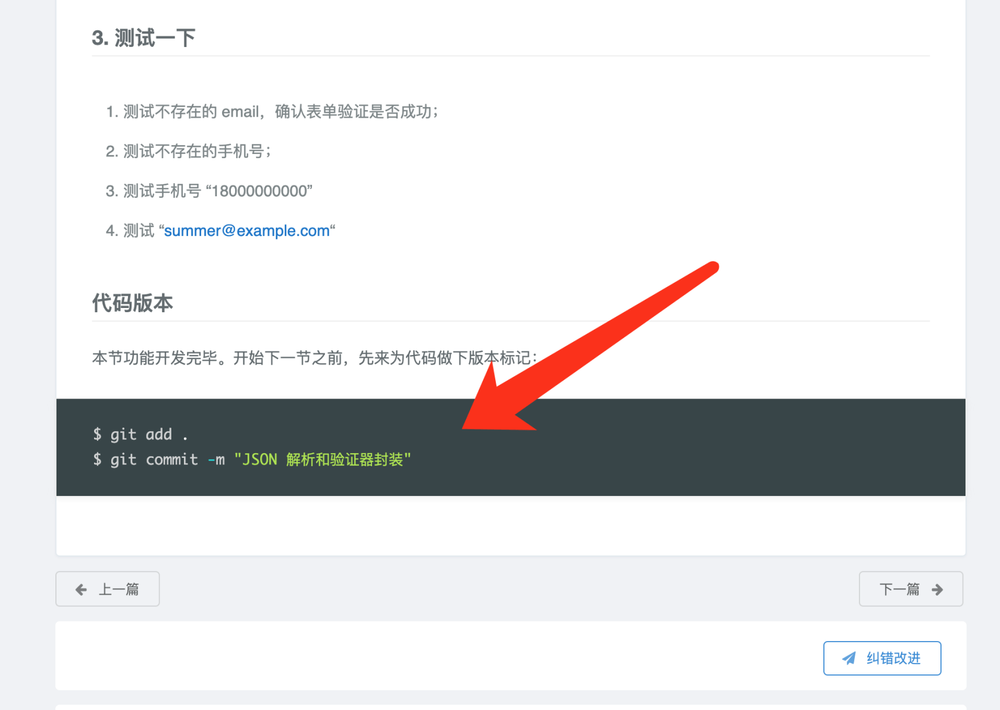
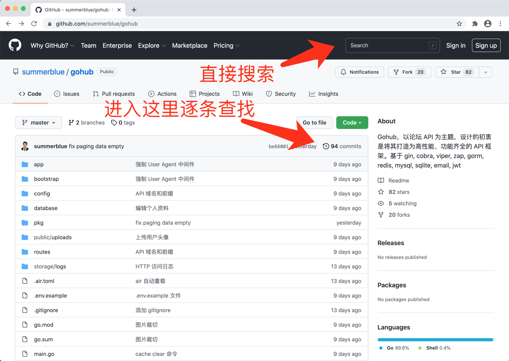
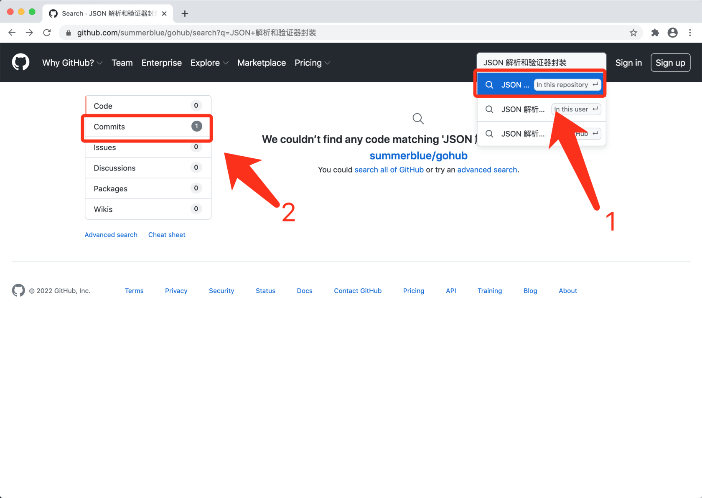
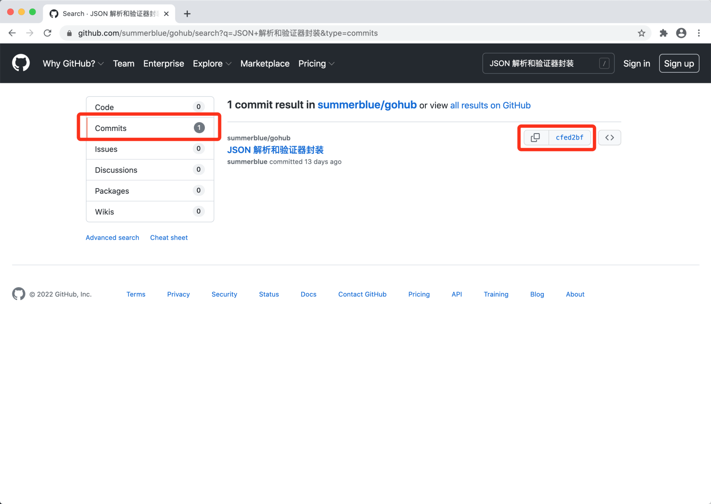

# 1.9. 利用源码来排错 免费

原文链接：https://learnku.com/courses/laravel-intermediate-training/9.x/use-the-source-code-to-troubleshoot/12544

## 说明

开发中遇到莫名的问题是好事。因为任何一名优秀的程序员都是从这些问题中成长起来的。

>

平静的大海无法造就优秀的水手。

然而新人在学习本课程时，遇到无法解决的问题时会很苦恼，尤其是卡住很长时间 —— 耽误了学习的流畅性，且会对课程的准确性产生质疑，最终放弃学习。

这里介绍一种方法，可帮助快速跳过问题，以确保学习的流畅性。

## 原理

本课程的每个小节，凡是涉及代码修改的，都会有对应的 git commit。

课程最终的源码 commit 消息，对应每篇文章底部的 代码版本 。

因此只需要将本教程的源码下载下来，并检出对应的 commit ，即可获取到同步当前学习进度的一份代码。

## 具体操作

### 1. 下载源码

先前往项目的 [代码仓库](https://learnku.com/courses/laravel-intermediate-training/9.x/source-code-of-this-book) 。

接下来确定要检出代码存放的目录，建议在项目的父目录，也就是项目根目录下使用：

```
$ cd ../
```

克隆源码，并命名为 `larabbs-online`

```
$ git clone https://github.com/summerblue/larabbs.git larabbs-online
```

进入刚刚 Clone 下来的源码目录：

```
$  cd larabbs-online
```

检出当前版本的源码：

```
$ git checkout L02_9.x
```

### 2. 定位 commit hash

Git 的每一次提交，都生成一个代码版本的标示（commit hash）。接下来我们来定位这个标示。

首先在遇到问题的文章底部 代码版本 里，找到提交信息（commit message），例如：



打开项目地址（下面截屏以 gohub 项目为例，其他项目操作起来），有两种方法，一种是进入 commit log ，一种是利用 GitHub 提供的顶部搜索：



建议使用第二种：



进入 Commits 搜索结果页面，如下图右边红框内就是我们要的 commit hash 了，复制这个哈希值：



>

注意 GitHub 搜索只能搜索到课程最新版本的 Commit，老版本请对 Commit log『逐条查找』。

### 3. 检出对应代码

检出哈希值对应的源码（将下面的 commit hash 替换成上一步复制的）：

```
$ git checkout cfedxxxxx
```

这时候 larabbs-online 里的代码，就与出问题章节的代码对应上了。

## 后续的操作

源码检出来以后，先安装代码依赖：

```
$ composer install
```

然后创建对应的 .env 文件。

根据你的环境，创建新的项目，直到可以访问。确保一切运行正常以后。

最后对比下自己那份有问题的代码，尝试着能否找到错误。

如果长时间无法定位问题，可以直接基于这份 larabbs-online ，可工作的源码来学习后面的课程。保持课程学习的连贯性优先级高一点。

原来有问题的代码不要删除，等课程做完一遍（或者多做几遍），找到感觉后，再来尝试解决他。
