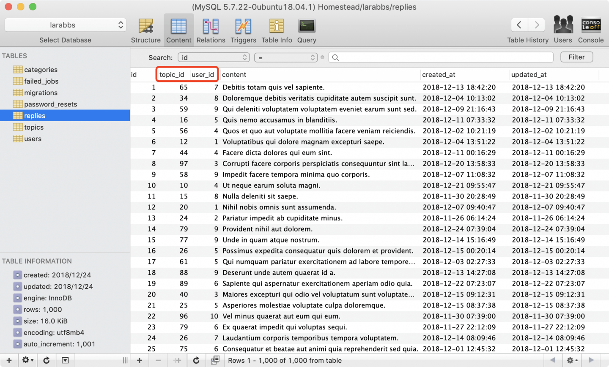

# 7.1. 回复数据

原文链接：https://learnku.com/courses/laravel-intermediate-training/9.x/reply-model/12518

## 回复列表

目前我们已经有话题发布功能，接下来我们一起开发话题回复功能，允许用户参与讨论某个话题。回复功能包括：

- 回复列表

- 发表回复

- 删除回复

- 消息通知

本章节，我们先开发『回复列表』功能。

## 代码生成

使用代码生成器快速构建骨架代码：

```
$ php artisan make:scaffold Reply --schema="topic_id:integer:unsigned:default(0):index,user_id:bigInteger:unsigned:default(0):index,content:text"
```

## 数据模型

修改下 Reply 模型的 `$fillable` 属性，我们只允许用户更改 `content` 字段。同时做下数据模型的关联，一条回复属于一个话题，一条回复属于一个作者所有：

app/Models/Reply.php

```
<?php

namespace App\Models;

use Illuminate\Database\Eloquent\Factories\HasFactory;

class Reply extends Model
{
use HasFactory;

protected $fillable = ['content'];

public function topic()
{
return $this->belongsTo(Topic::class);
}

public function user()
{
return $this->belongsTo(User::class);
}
}
```

接下来修改对应关联 Topic 和 User 模型，新增对 Reply 的所属关系。

一篇帖子下有多条回复，新增 `replies()` 方法：

app/Models/Topic.php

```
.
.
.
protected $fillable = [
...
];

public function replies()
{
return $this->hasMany(Reply::class);
}

.
.
.
}
```

一个用户可以拥有多条评论，新增 `replies()` 方法：

app/Models/User.php

```
<?php
.
.
.
public function replies()
{
return $this->hasMany(Reply::class);
}
}

```

## 假数据生成

接下来我们将要填充回复假数据，以便回复列表的开发。

### 1. 定制数据工厂

database/factories/ReplyFactory.php

```
<?php

namespace Database\Factories;

use App\Models\Reply;
use Illuminate\Database\Eloquent\Factories\Factory;

class ReplyFactory extends Factory
{
protected $model = Reply::class;

public function definition()
{
return [
'content' => $this->faker->sentence(),
'topic_id' => rand(1, 100),
'user_id' => rand(1, 10),
];
}
}
```

### 2. 数据填充逻辑

database/seeders/RepliesTableSeeder.php

```
<?php

namespace  Database\Seeders;

use Illuminate\Database\Seeder;
use App\Models\Reply;

class RepliesTableSeeder extends Seeder
{
public function run()
{
Reply::factory()->times(1000)->create();
}
}
```

### 3. 注册数据填充类

代码生成器已经为我们注册了数据填充类，不过顺序有错，我们需要修改下顺序，TopicsTableSeeder 应在 RepliesTableSeeder 之前执行：

database/seeders/DatabaseSeeder.php

```
<?php

namespace  Database\Seeders;

use Illuminate\Database\Seeder;

class DatabaseSeeder extends Seeder
{
public function run()
{
$this->call(UsersTableSeeder::class);
$this->call(TopicsTableSeeder::class);
$this->call(RepliesTableSeeder::class);
}
}
```

### 4. 开始填充数据

使用以下命令重新填充数据：

```
$ php artisan migrate:refresh --seed
```

你可能会注意到命令在执行到 TopicsTableSeeder 时，速度非常慢：

```
Rolling back: 2022_03_06_213747_create_replies_table
.
.
.
Seeding: Database\Seeders\UsersTableSeeder
Seeded:  Database\Seeders\UsersTableSeeder (33.90ms)
Seeding: Database\Seeders\TopicsTableSeeder
Seeded:  Database\Seeders\TopicsTableSeeder (189,134.49ms)
Seeding: Database\Seeders\RepliesTableSeeder
Seeded:  Database\Seeders\RepliesTableSeeder (732.69ms)
Database seeding completed successfully.
```

这是因为创建时触发了模型事件，也就是我们的 TopicObserver.php 里 `saved()` 方法，这里执行 TranslateSlug 类，会实时请求百度的翻译接口，造成很大的延迟。

Laravel 数据填充了提供一个跳过模型事件的 `WithoutModelEvents` trait，可以帮助我们解决此问题。将 TopicsTableSeeder.php 内容替换：

database/seeders/TopicsTableSeeder.php

```
<?php

namespace Database\Seeders;

use Illuminate\Database\Seeder;
use App\Models\Topic;
use Illuminate\Database\Console\Seeds\WithoutModelEvents;

class TopicsTableSeeder extends Seeder
{
use WithoutModelEvents;

public function run()
{
Topic::factory()->count(100)->create();
}
}
```

再次执行：

```
$ php artisan migrate:refresh --seed
```

速度快多了。

接下来打开数据库图形工具即可看到生成内容，且每个回复都有对应的话题 ID 和用户 ID：



下一章节我们要将这些数据显示出来。

## Git 版本控制

下面把代码纳入到版本管理：

```
$ git add -A
$ git commit -m "回复数据"
```
