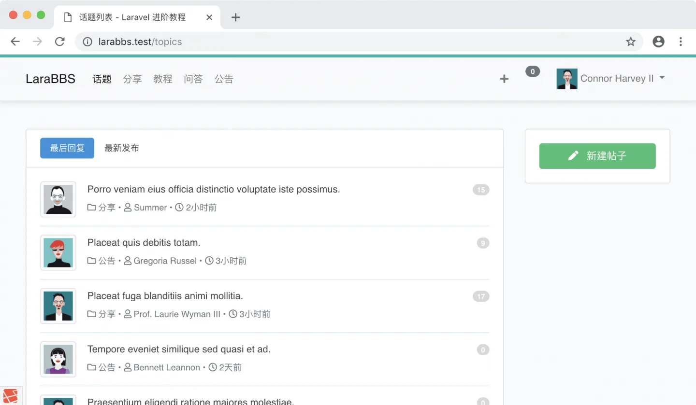
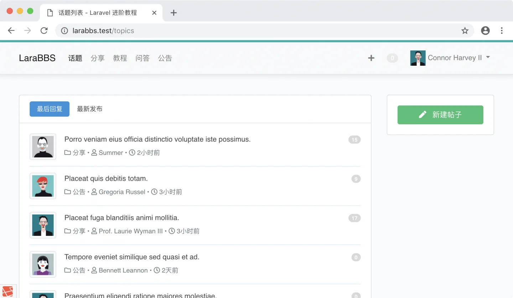
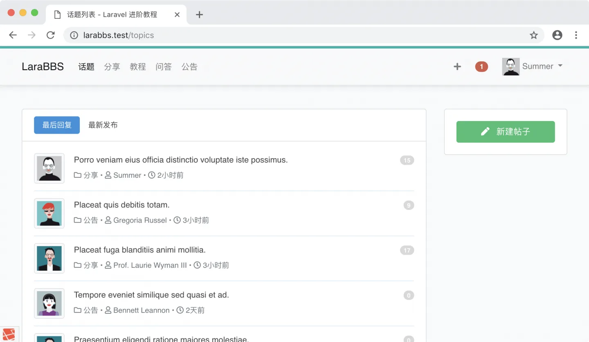
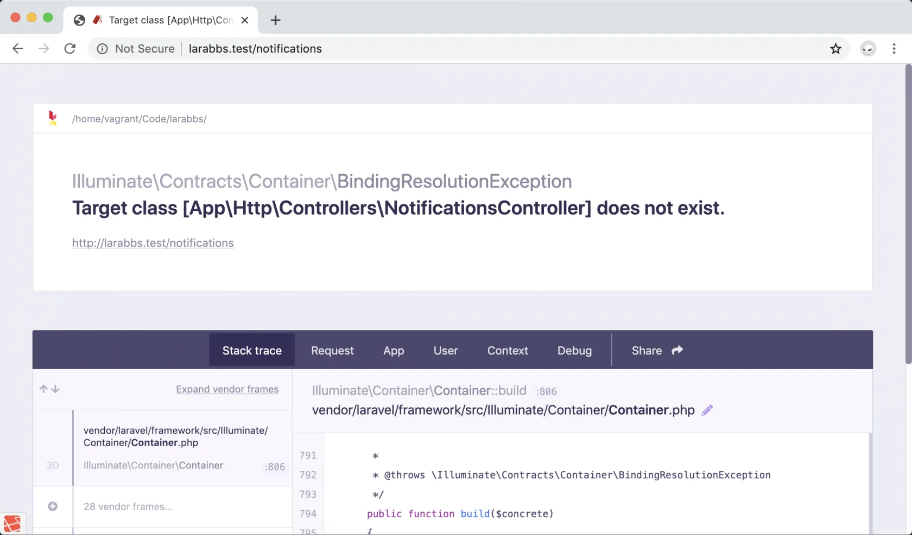
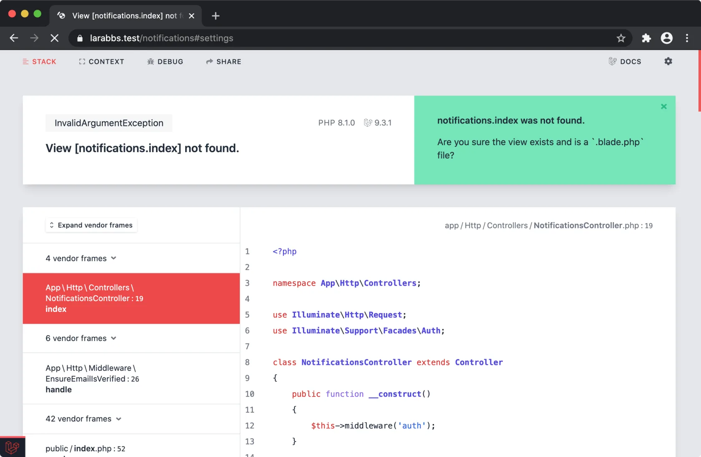
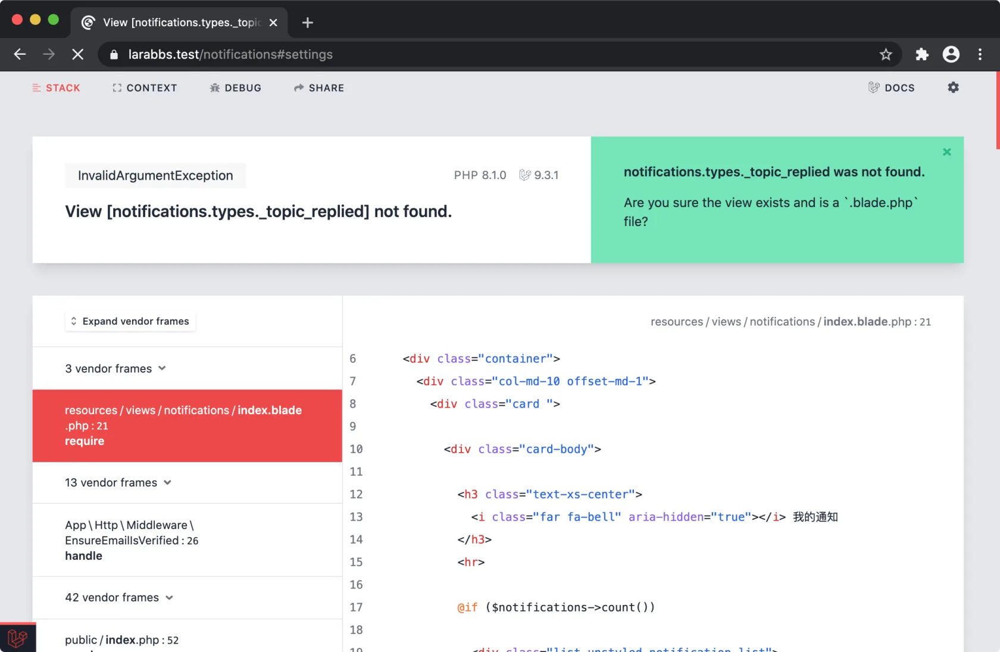
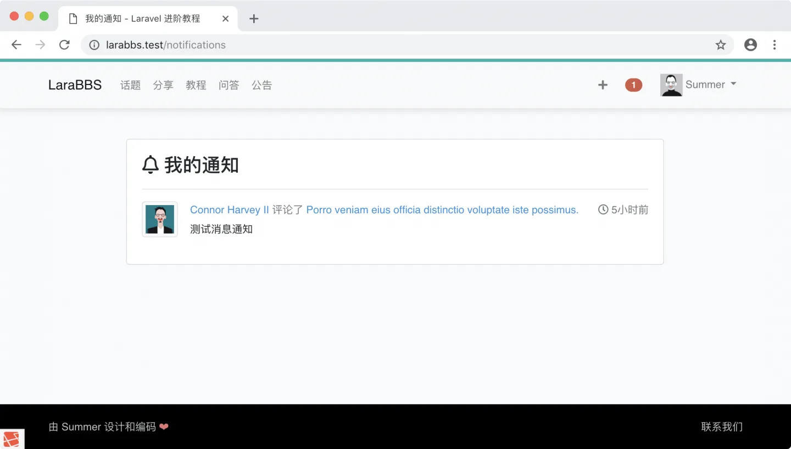
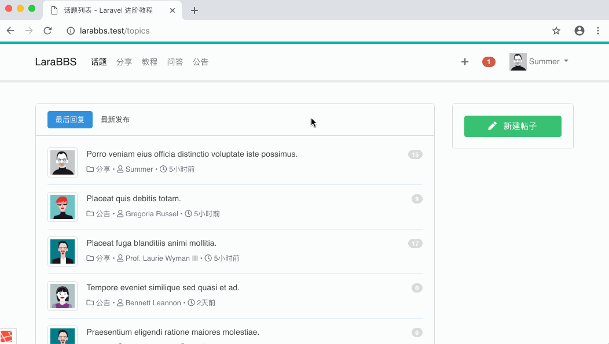

# 7.5. 通知列表

原文链接：https://learnku.com/courses/laravel-intermediate-training/9.x/notification-list/12522

## 通知列表

本节课我们将一起制作通知列表页面，完善我们的评论通知功能。

## 1. 新建路由器

首先我们需要新建路由入口：

routes/web.php

```
.
.
.

Route::resource('notifications', 'NotificationsController', ['only' => ['index']]);
```

## 2. 顶部导航栏入口

我们希望用户在访问网站时，能在很显眼的地方提醒他你有未读信息，接下来我们会利用上 `notification_count` 字段，新增下面的 `消息通知标记` 区块：

resources/views/layouts/_header.blade.php

```
.
.
.
<!-- Authentication Links -->
@guest
<li class="nav-item"><a class="nav-link" href="{{ route('login') }}">登录</a></li>
<li class="nav-item"><a class="nav-link" href="{{ route('register') }}">注册</a></li>
@else
<li class="nav-item">
<a class="nav-link mt-1 mr-3 font-weight-bold" href="{{ route('topics.create') }}">
<i class="fa fa-plus"></i>
</a>
</li>
<li class="nav-item notification-badge">
<a class="nav-link ms-3 me-3 badge bg-secondary rounded-pill badge-{{ Auth::user()->notification_count > 0 ? 'hint' : 'secondary' }} text-white" href="{{ route('notifications.index') }}">
{{ Auth::user()->notification_count }}
</a>
</li>
<li class="nav-item dropdown">
.
.
.
```

刷新页面即可看到消息提醒标示：



样式有点乱，我们稍加调整：

resources/sass/app.scss

```
.
.
.

/* 消息通知 */
.notification-badge {
.badge {
font-size: 12px;
margin-top: 14px;
}

.badge-secondary {
background-color: #EBE8E8!important;
}

.badge-hint {
background-color: #d15b47 !important;
}
}
```

>

注意： 需运行 `npm run watch-poll` 进行样式编译。

默认情况下样式很低调：



我们重新使用 Summer 用户登录，可看到显眼的红色标示，并且带有未读消息数量：



## 3. 控制器

如果你点击红色标示，会报错 —— 控制器文件并不存在：



接下来我们使用命令行生成控制器：

```bash
$ php artisan make:controller NotificationsController
```

修改控制器的代码如下：

app/Http/Controllers/NotificationsController.php

```
<?php

namespace App\Http\Controllers;

use Illuminate\Http\Request;
use Illuminate\Support\Facades\Auth;

class NotificationsController extends Controller
{
    public function __construct()
    {
        $this->middleware('auth');
    }

    public function index()
    {
        // 获取登录用户的所有通知
        $notifications = Auth::user()->notifications()->paginate(20);
        return view('notifications.index', compact('notifications'));
    }
}
```

控制器的构造方法 `__construct()` 里调用 Auth 中间件，要求必须登录以后才能访问控制器里的所有方法。

## 4. 通知列表视图

再次刷新页面，你会看到视图文件未找到的异常：



接下来新建此模板：

resources/views/notifications/index.blade.php

```
@extends('layouts.app')

@section('title', '我的通知')

@section('content')
<div class="container">
<div class="col-md-10 offset-md-1">
<div class="card ">

<div class="card-body">

<h3 class="text-xs-center">
<i class="far fa-bell" aria-hidden="true"></i> 我的通知
</h3>
<hr>

@if ($notifications->count())

<div class="list-unstyled notification-list">
@foreach ($notifications as $notification)
@include('notifications.types._' . Str::snake(class_basename($notification->type)))
@endforeach

{!! $notifications->render() !!}
</div>

@else
<div class="empty-block">没有消息通知！</div>
@endif

</div>
</div>
</div>
</div>
@stop
```

通知数据库表的 Type 字段保存的是通知类全称，如 ：App\Notifications\TopicReplied 。 `Str::snake(class_basename($notification->type))` 渲染以后会是 —— `topic_replied`。`class_basename()` 方法会取到 `TopicReplied`，Laravel 的辅助方法 `Str::snake()` 会字符串格式化为下划线命名。

刷新页面，会提示我们对应类型的模板文件不存在：



创建此文件：

resources/views/notifications/types/_topic_replied.blade.php

```
<li class="d-flex @if ( ! $loop->last) border-bottom @endif">
<div>
<a href="{{ route('users.show', $notification->data['user_id']) }}">
data['user_name'] }}" src="{{ $notification->data['user_avatar'] }}" style="width:48px;height:48px;" />
</a>
</div>

<div class="flex-grow-1 ms-2">
<div class="mt-0 mb-1 text-secondary">
<a class="text-decoration-none" href="{{ route('users.show', $notification->data['user_id']) }}">{{ $notification->data['user_name'] }}</a>
评论了
<a class="text-decoration-none" href="{{ $notification->data['topic_link'] }}">{{ $notification->data['topic_title'] }}</a>

{{-- 回复删除按钮 --}}
<span class="meta float-end" title="{{ $notification->created_at }}">
<i class="far fa-clock"></i>
{{ $notification->created_at->diffForHumans() }}
</span>
</div>
<div class="reply-content">
{!! $notification->data['reply_content'] !!}
</div>
</div>
</li>
```

我们可以通过 `$notification->data` 拿到在通知类 `toDatabase()` 里构建的数组。

刷新页面即可看到我们的消息通知列表：



## 5. 清除未读消息标示

下面我们来开发去除顶部未读消息标示的功能 —— 当用户访问通知列表时，将所有通知状态设定为已读，并清空未读消息数。

接下来在 User 模型中新增 `markAsRead()` 方法：

app/Models/User.php

```
<?php
.
.
.

public function markAsRead()
{
$this->notification_count = 0;
$this->save();
$this->unreadNotifications->markAsRead();
}
}
```

修改控制器的 `index()` 方法，新增清空未读提醒的状态：

app/Http/Controllers/NotificationsController.php

```
.
.
.
public function index()
{
// 获取登录用户的所有通知
$notifications = Auth::user()->notifications()->paginate(20);
// 标记为已读，未读数量清零
Auth::user()->markAsRead();
return view('notifications.index', compact('notifications'));
}
}
```

现在进入消息通知页面，未读消息标示将被清除：



## Git 版本控制

下面把代码纳入到版本管理：

```bash
$ git add -A
$ git commit -m "消息通知列表"
```
