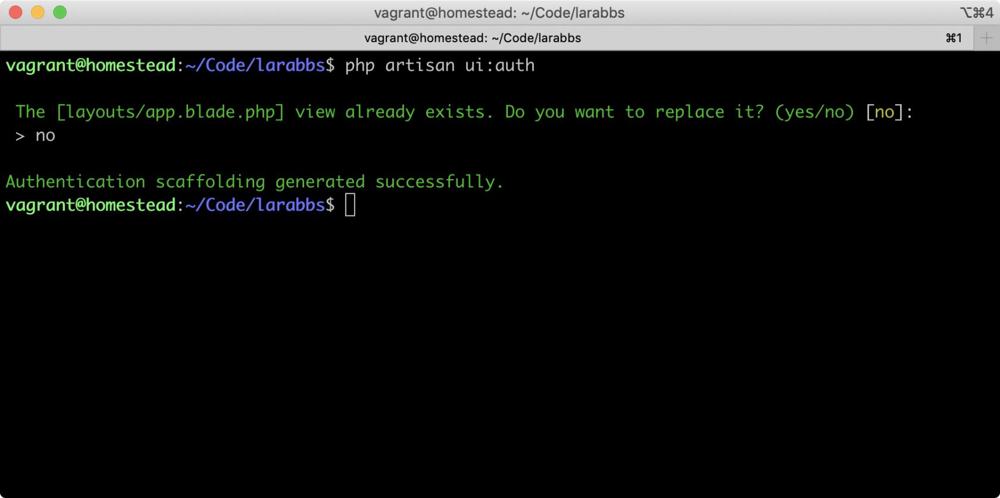
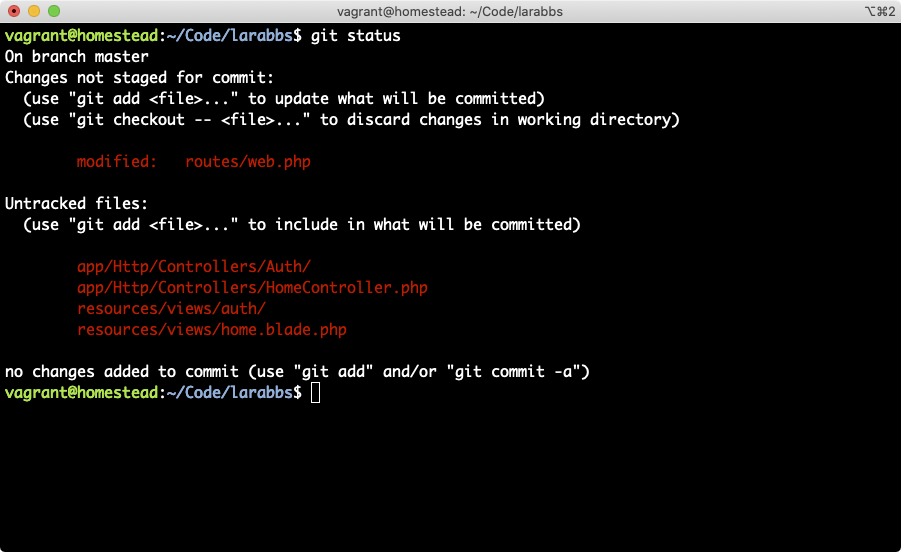
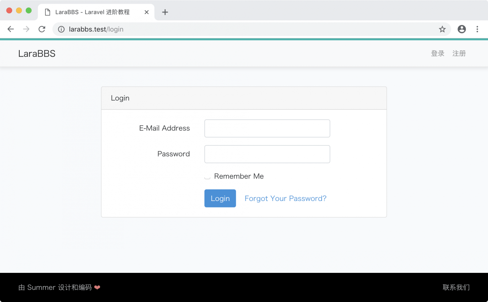

# 3.1. 用户认证脚手架

原文链接：https://learnku.com/courses/laravel-intermediate-training/9.x/registration-and-login/12480

## 用户认证脚手架

Laravel 自带了用户认证功能，我们将利用此功能来快速构建我们的用户中心。

首先执行认证脚手架命令，生成代码：

```
$ php artisan ui:auth
```

命令 `ui:auth` 会询问我们是否要覆盖 `app.blade.php`，因为我们在前面章节中已经自定义了『主要布局文件』—— `app.blade.php`，所以此处输入 `no`，如下：



使用：

```
$ git status
```

来查看文件更改的状态：



打开 `routes/web.php` 查看修改了哪些内容：

routes/web.php

```
<?php

use Illuminate\Support\Facades\Route;

Route::get('/', 'PagesController@root')->name('root');

Auth::routes();

Route::get('/home', [App\Http\Controllers\HomeController::class, 'index'])->name('home');
```

将其修改如下，统一调用风格：

routes/web.php

```
<?php

use Illuminate\Support\Facades\Route;
use Illuminate\Support\Facades\Auth;

Route::get('/', 'PagesController@root')->name('root');

Auth::routes();

Route::get('/home', 'HomeController@index')->name('home');
```

可以看到在我们的主页下，多了两个表达式，先看第一个：

```
Auth::routes();
```

此处是 Laravel 的用户认证路由，在 `vendor/laravel/ui/src/AuthRouteMethods.php` 中即可找到定义的地方，以上等同于：

```
// 用户身份验证相关的路由
Route::get('login', 'Auth\LoginController@showLoginForm')->name('login');
Route::post('login', 'Auth\LoginController@login');
Route::post('logout', 'Auth\LoginController@logout')->name('logout');

// 用户注册相关路由
Route::get('register', 'Auth\RegisterController@showRegistrationForm')->name('register');
Route::post('register', 'Auth\RegisterController@register');

// 密码重置相关路由
Route::get('password/reset', 'Auth\ForgotPasswordController@showLinkRequestForm')->name('password.request');
Route::post('password/email', 'Auth\ForgotPasswordController@sendResetLinkEmail')->name('password.email');
Route::get('password/reset/{token}', 'Auth\ResetPasswordController@showResetForm')->name('password.reset');
Route::post('password/reset', 'Auth\ResetPasswordController@reset')->name('password.update');

// 再次确认密码（重要操作前提示）
Route::get('password/confirm', 'Auth\ConfirmPasswordController@showConfirmForm')->name('password.confirm');
Route::post('password/confirm', 'Auth\ConfirmPasswordController@confirm');

// Email 认证相关路由
Route::get('email/verify', 'Auth\VerificationController@show')->name('verification.notice');
Route::get('email/verify/{id}/{hash}', 'Auth\VerificationController@verify')->name('verification.verify');
Route::post('email/resend', 'Auth\VerificationController@resend')->name('verification.resend');
```

为了更加直观，我们将在 `web.php` 中使用以上替换 `Auth::routes();`。

再来看下面这一行：

```
Route::get('/home', 'HomeController@index')->name('home');
```

我们已经有自己的主页了，不需要再次设置主页，直接删除即可。修改后的路由文件内容如下，请直接替换：

routes/web.php

```
<?php

use Illuminate\Support\Facades\Route;

Route::get('/', 'PagesController@root')->name('root');

// 用户身份验证相关的路由
Route::get('login', 'Auth\LoginController@showLoginForm')->name('login');
Route::post('login', 'Auth\LoginController@login');
Route::post('logout', 'Auth\LoginController@logout')->name('logout');

// 用户注册相关路由
Route::get('register', 'Auth\RegisterController@showRegistrationForm')->name('register');
Route::post('register', 'Auth\RegisterController@register');

// 密码重置相关路由
Route::get('password/reset', 'Auth\ForgotPasswordController@showLinkRequestForm')->name('password.request');
Route::post('password/email', 'Auth\ForgotPasswordController@sendResetLinkEmail')->name('password.email');
Route::get('password/reset/{token}', 'Auth\ResetPasswordController@showResetForm')->name('password.reset');
Route::post('password/reset', 'Auth\ResetPasswordController@reset')->name('password.update');

// 再次确认密码（重要操作前提示）
Route::get('password/confirm', 'Auth\ConfirmPasswordController@showConfirmForm')->name('password.confirm');
Route::post('password/confirm', 'Auth\ConfirmPasswordController@confirm');

// Email 认证相关路由
Route::get('email/verify', 'Auth\VerificationController@show')->name('verification.notice');
Route::get('email/verify/{id}/{hash}', 'Auth\VerificationController@verify')->name('verification.verify');
Route::post('email/resend', 'Auth\VerificationController@resend')->name('verification.resend');
```

## 生成的视图

`ui:auth` 命令为我们生成了 `resources/views/auth` 下几个文件：

| 视图名称
| 说明

| register.blade.php
| 注册页面视图

| login.blade.php
| 登录页面视图

| verify.blade.php
| 邮箱认证视图

| passwords/email.blade.php
| 提交邮箱发送邮件的视图

| passwords/reset.blade.php
| 重置密码的页面视图

| passwords/confirm.blade.php
| 重新输入密码的页面视图

## 移除无用页面

因为无需使用 `ui:auth` 生成的主页，请运行以下命令删除无用文件：

```
$ rm app/Http/Controllers/HomeController.php
$ rm resources/views/home.blade.php
```

## 顶部导航

顶部导航『注册』和『登录』入口之前用的是两个假链接，现在我们已经有业务逻辑，接下来将链接套进去，并加上登录后的效果：

resources/views/layouts/_header.blade.php

```
.
.
.

<!-- Right Side Of Navbar -->
<ul class="navbar-nav navbar-right">
<!-- Authentication Links -->
<li class="nav-item"><a class="nav-link" href="{{ route('login') }}">登录</a></li>
<li class="nav-item"><a class="nav-link" href="{{ route('register') }}">注册</a></li>
</ul>
</div>
</div>
</nav>
```

现在通过顶部导航访问登录页面，看看效果：



## Git 版本控制

至此注册登录功能已经完成，接下来把代码纳入到版本管理：

```
$ git add -A
$ git commit -m "生成用户认证代码"
```
