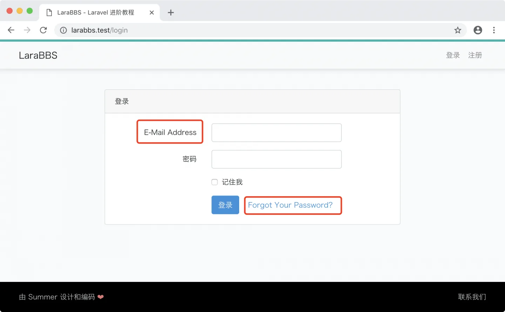
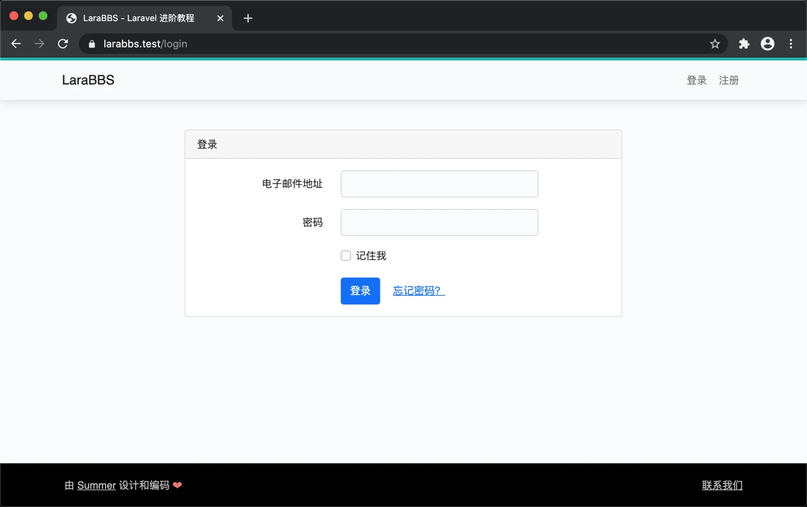
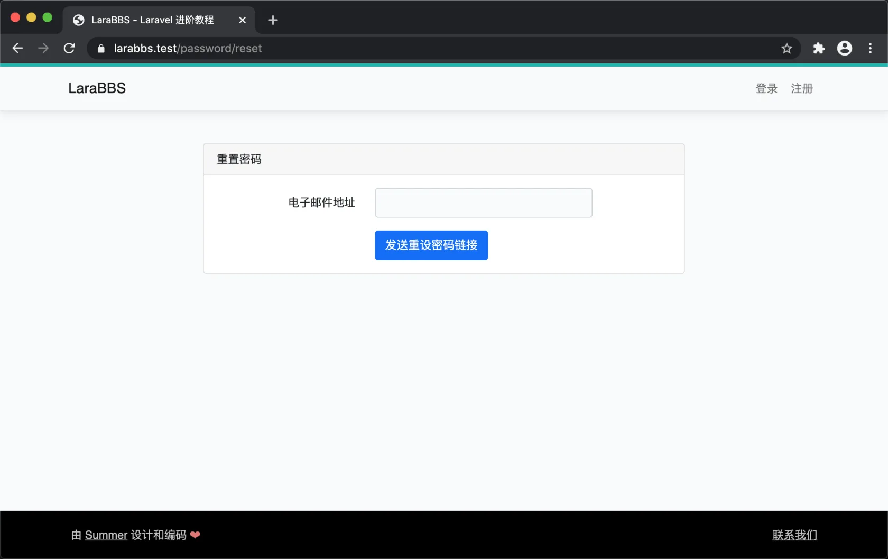

# 3.2. 本地化

原文链接：https://learnku.com/courses/laravel-intermediate-training/9.x/localization/12549

## 本地化

上一节我们的登录页面，表单是英文版本。

打开模板文件，此模板文件是我们刚刚使用 `ui:auth` 命令生成的：

>

resources/views/auth/login.blade.php

可以看到很多 `__()` 函数的调用：

```
<div class="card-header">{{ __('Login') }}</div>
```

```
<label for="password" class="col-md-4 col-form-label text-md-right">{{ __('Password') }}</label>
```

```
{{ __('Remember Me') }}
```

这是 Laravel 提供的本地化特性，使用 `__()` 函数来辅助实现。按照约定，本地化文件存储在 `resources/lang` 文件夹中，为 JSON 格式。在 `config/app.php` 文件中，我们设置了：

```
'locale' => 'zh_CN',
```

对应翻译文件就是 `lang/zh_CN.json` ，需新建此文件：

lang/zh_CN.json

```
{
"Login": "登录",
"Password": "密码",
"Remember Me": "记住我"
}
```

再次刷新登录页面，可以看到翻译的内容，同时红框里也是我们漏下的内容：



## 中文语言包

会有很多人会遇到翻译 Laravel 自带模板的问题，所以我们无需自己一个个去翻译，这种通用的问题找找扩展包来处理即可。

我们将使用 [Laravel Lang](https://github.com/overtrue/laravel-lang) 项目来实现，此项目支持了 52 个国家的语言，使用以下命令安装：

```
$ composer require "overtrue/laravel-lang:~6.0"
```

完成后刷新页面，完美翻译：



点击上图的忘记密码链接，进入忘记密码的视图，也可以看到成功显示中文：



[Laravel Lang](https://github.com/overtrue/laravel-lang) 同自定义语言包一样，都是根据  `config/app.php` 里 `locale` 的选项来选择语言的。

值得一提的是，如果你想修改扩展包提供的语言文件，可以使用以下命令发布语言文件到项目里：

```
$ php artisan lang:publish zh_CN
```

发布后的语言文件存放于 `lang/zh_CN` 文件夹。

## 代码版本

本节功能开发完毕。开始下一节之前，先来为代码做下版本标记：

```
$ git add .
$ git commit -m "本地化"
```
